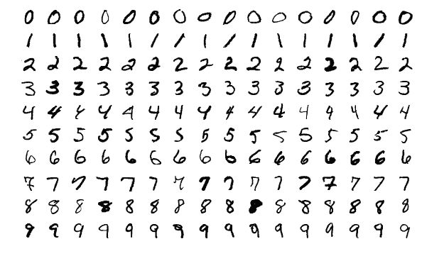

# MNIST 数据集

> 原文：[`docs.ultralytics.com/datasets/classify/mnist/`](https://docs.ultralytics.com/datasets/classify/mnist/)

[MNIST](http://yann.lecun.com/exdb/mnist/)（修改过的国家标准与技术研究所数据集）数据集是一个包含手写数字的大型数据库，通常用于训练各种图像处理系统和机器学习模型。它通过“重新混合”NIST 原始数据集中的样本而创建，并已成为评估图像分类算法性能的基准。

## 关键特点

+   MNIST 包含 60,000 张训练图像和 10,000 张测试图像的手写数字。

+   数据集包含尺寸为 28x28 像素的灰度图像。

+   图像被归一化以适应 28x28 像素的边界框，并进行了抗锯齿处理，引入了灰度级别。

+   MNIST 在机器学习领域特别是图像分类任务中被广泛用于训练和测试。

## 数据集结构

MNIST 数据集分为两个子集：

1.  **训练集**：这个子集包含用于训练机器学习模型的 60,000 张手写数字图像。

1.  **测试集**：这个子集包含用于测试和基准测试训练模型的 10,000 张图像。

## 扩展 MNIST（EMNIST）

扩展 MNIST（EMNIST）是 NIST 开发和发布的新数据集，旨在取代 MNIST。虽然 MNIST 仅包括手写数字的图像，但 EMNIST 包括 NIST 特殊数据库 19 中所有大写和小写字母以及数字的图像。EMNIST 的图像经过与 MNIST 相同的过程转换为相同的 28x28 像素格式。因此，与旧的、较小的 MNIST 数据集兼容的工具可能会不经修改地与 EMNIST 一起使用。

## 应用程序

MNIST 数据集在深度学习模型，如卷积神经网络（CNNs），支持向量机（SVMs）和各种其他机器学习算法的训练和评估中广泛使用。该数据集简单且结构良好，是机器学习和计算机视觉领域研究人员和从业者的重要资源。

## 用途

要在 MNIST 数据集上使用图像大小为 32x32 训练 CNN 模型 100 个 epochs，可以使用以下代码片段。有关可用参数的详细列表，请参阅模型训练页面。

训练示例

```py
from ultralytics import YOLO

# Load a model
model = YOLO("yolov8n-cls.pt")  # load a pretrained model (recommended for training)

# Train the model
results = model.train(data="mnist", epochs=100, imgsz=32) 
```

```py
# Start training from a pretrained *.pt model
yolo  classify  train  data=mnist  model=yolov8n-cls.pt  epochs=100  imgsz=28 
```

## 示例图像和注释

MNIST 数据集包含手写数字的灰度图像，为图像分类任务提供了一个结构良好的数据集。以下是数据集中的一些图像示例：



该示例展示了 MNIST 数据集中手写数字的多样性和复杂性，突显了多样化数据集对训练鲁棒图像分类模型的重要性。

## 引用和致谢

如果您在您的工作中使用 MNIST 数据集

研究或开发工作，请引用以下论文：

```py
@article{lecun2010mnist,
  title={MNIST handwritten digit database},
  author={LeCun, Yann and Cortes, Corinna and Burges, CJ},
  journal={ATT Labs [Online]. Available: http://yann.lecun.com/exdb/mnist},
  volume={2},
  year={2010}
} 
```

我们要感谢 Yann LeCun、Corinna Cortes 和 Christopher J.C. Burges 创建和维护 MNIST 数据集，作为机器学习和计算机视觉研究社区的宝贵资源。有关 MNIST 数据集及其创建者的更多信息，请访问[MNIST 数据集网站](http://yann.lecun.com/exdb/mnist/)。

## 常见问题解答

### MNIST 数据集是什么，以及它在机器学习中的重要性是什么？

[MNIST](http://yann.lecun.com/exdb/mnist/)数据集，或者修改过的国家标准技术研究所数据集，是一个广泛使用的手写数字集合，专为训练和测试图像分类系统而设计。它包含 60,000 张训练图像和 10,000 张测试图像，全部为灰度图像，大小为 28x28 像素。该数据集的重要性在于其作为评估图像分类算法的标准基准角色，帮助研究人员和工程师比较方法并追踪领域进展。

### 如何使用 Ultralytics YOLO 来训练 MNIST 数据集上的模型？

要在 MNIST 数据集上使用 Ultralytics YOLO 训练模型，您可以按照以下步骤进行：

训练示例

```py
from ultralytics import YOLO

# Load a model
model = YOLO("yolov8n-cls.pt")  # load a pretrained model (recommended for training)

# Train the model
results = model.train(data="mnist", epochs=100, imgsz=32) 
```

```py
# Start training from a pretrained *.pt model
yolo  classify  train  data=mnist  model=yolov8n-cls.pt  epochs=100  imgsz=28 
```

对于可用训练参数的详细列表，请参阅训练页面。

### MNIST 数据集和 EMNIST 数据集之间有什么区别？

MNIST 数据集仅包含手写数字，而扩展的 MNIST（EMNIST）数据集包括数字、大写和小写字母。EMNIST 作为 MNIST 的后继者开发，并使用相同的 28x28 像素图像格式，与设计用于原始 MNIST 数据集的工具和模型兼容。EMNIST 中更广泛的字符范围使其在更多种机器学习应用中变得有用。

### 我可以使用 Ultralytics HUB 来训练类似 MNIST 这样的自定义数据集吗？

是的，您可以使用 Ultralytics HUB 来训练类似 MNIST 这样的自定义数据集。Ultralytics HUB 提供了一个用户友好的界面，用于上传数据集、训练模型和管理项目，无需广泛的编码知识。有关如何入门的更多详细信息，请查看[Ultralytics HUB 快速入门](https://docs.ultralytics.com/hub/quickstart/)页面。
