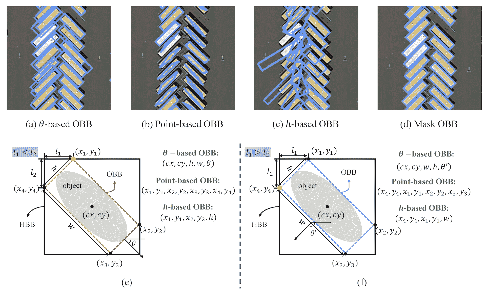

# 定向边界框（OBB）数据集概述

> 原文：[`docs.ultralytics.com/datasets/obb/`](https://docs.ultralytics.com/datasets/obb/)

使用定向边界框（OBB）训练精确的目标检测模型需要一个完整的数据集。本指南介绍了与 Ultralytics YOLO 模型兼容的各种 OBB 数据集格式，提供了关于它们的结构、应用和格式转换方法的见解。

## 支持的 OBB 数据集格式

### YOLO OBB 格式

YOLO OBB 格式通过其在 0 到 1 之间标准化的四个角点坐标指定边界框。它遵循以下格式：

```py
class_index  x1  y1  x2  y2  x3  y3  x4  y4 
```

在内部，YOLO 使用 `xywhr` 格式处理损失和输出，表示边界框的中心点（xy）、宽度、高度和旋转。



上述图像的 `*.txt` 标签文件示例，其中包含了类别 `0` 的 OBB 格式对象，可能如下所示：

```py
0  0.780811  0.743961  0.782371  0.74686  0.777691  0.752174  0.776131  0.749758 
```

## 使用方法

使用这些 OBB 格式训练模型：

示例

```py
from ultralytics import YOLO

# Create a new YOLOv8n-OBB model from scratch
model = YOLO("yolov8n-obb.yaml")

# Train the model on the DOTAv2 dataset
results = model.train(data="DOTAv1.yaml", epochs=100, imgsz=640) 
```

```py
# Train a new YOLOv8n-OBB model on the DOTAv2 dataset
yolo  obb  train  data=DOTAv1.yaml  model=yolov8n-obb.pt  epochs=100  imgsz=640 
```

## 支持的数据集

目前支持以下带有定向边界框的数据集：

+   DOTA-v2：DOTA（用于航空图像中目标检测的大规模数据集）第二版，重点是从航空视角进行检测，包含了 1.7 百万个实例和 11,268 张图像的定向边界框。

+   DOTA8：DOTA 数据集的小型 8 张图像子集，适合测试在 `ultralytics` 仓库中进行的 OBB 训练工作流程和持续集成（CI）检查。

### 合并您自己的 OBB 数据集

对于希望引入自己的定向边界框数据集的用户，请确保其与上述“YOLO OBB 格式”兼容。将您的注释转换为此所需格式，并在相应的 YAML 配置文件中详细说明路径、类别和类名。

## 转换标签格式

### DOTA 数据集格式转换为 YOLO OBB 格式

可以使用此脚本将标签从 DOTA 数据集格式转换为 YOLO OBB 格式：

示例

```py
from ultralytics.data.converter import convert_dota_to_yolo_obb

convert_dota_to_yolo_obb("path/to/DOTA") 
```

这种转换机制对于 DOTA 格式的数据集至关重要，确保与 Ultralytics YOLO OBB 格式的对齐。

验证数据集与模型的兼容性并遵循必要的格式约定至关重要。结构良好的数据集对于使用定向边界框训练高效的目标检测模型至关重要。

## 常见问题

### 定向边界框（OBB）是什么，它们在 Ultralytics YOLO 模型中如何使用？

定向边界框（OBB）是一种边界框注释类型，其中框可以旋转以更紧密地与要检测的对象对齐，而不仅仅是轴对齐。这在航空或卫星图像中特别有用，因为对象可能与图像轴不对齐。在 Ultralytics YOLO 模型中，OBB 通过其在 YOLO OBB 格式中的四个角点表示。这样做可以更准确地检测对象，因为边界框可以旋转以更好地适应对象。

### 如何将我现有的 DOTA 数据集标签转换为 YOLO OBB 格式，以便与 Ultralytics YOLOv8 使用？

您可以使用 Ultralytics 的 `convert_dota_to_yolo_obb` 函数将 DOTA 数据集标签转换为 YOLO OBB 格式。此转换确保与 Ultralytics YOLO 模型兼容，使您能够利用 OBB 功能来增强对象检测。以下是一个快速示例：

```py
from ultralytics.data.converter import convert_dota_to_yolo_obb

convert_dota_to_yolo_obb("path/to/DOTA") 
```

此脚本将重新格式化您的 DOTA 注释以符合 YOLO 兼容格式。

### 如何在我的数据集上使用定向边界框（OBB）训练 YOLOv8 模型？

使用 OBB 训练 YOLOv8 模型涉及确保您的数据集采用 YOLO OBB 格式，然后使用 Ultralytics API 训练模型。以下是 Python 和 CLI 的示例：

示例

```py
from ultralytics import YOLO

# Create a new YOLOv8n-OBB model from scratch
model = YOLO("yolov8n-obb.yaml")

# Train the model on the custom dataset
results = model.train(data="your_dataset.yaml", epochs=100, imgsz=640) 
```

```py
# Train a new YOLOv8n-OBB model on the custom dataset
yolo  obb  train  data=your_dataset.yaml  model=yolov8n-obb.yaml  epochs=100  imgsz=640 
```

这确保您的模型利用详细的 OBB 注释以提高检测精度。

### Ultralytics YOLO 模型当前支持哪些用于 OBB 训练的数据集？

目前，Ultralytics 支持以下数据集进行 OBB 训练：

+   DOTA-v2：该数据集包含 170 万个带有定向边界框的实例和 11,268 张图像，主要专注于航空物体检测。

+   DOTA8：DOTA 数据集的一个较小的子集，包含 8 张图像，用于测试和持续集成（CI）检查。

这些数据集专为 OBB 在航空和卫星图像分析等场景中提供显著优势而设计。

### 我可以使用带有定向边界框的自定义数据集进行 YOLOv8 训练吗？如果可以，如何操作？

是的，您可以使用带有定向边界框的自定义数据集进行 YOLOv8 训练。确保您的数据集注释已转换为 YOLO OBB 格式，这涉及通过四个角点定义边界框。然后，您可以创建一个 YAML 配置文件，指定数据集路径、类别和其他必要细节。有关创建和配置数据集的更多信息，请参阅支持的数据集部分。
