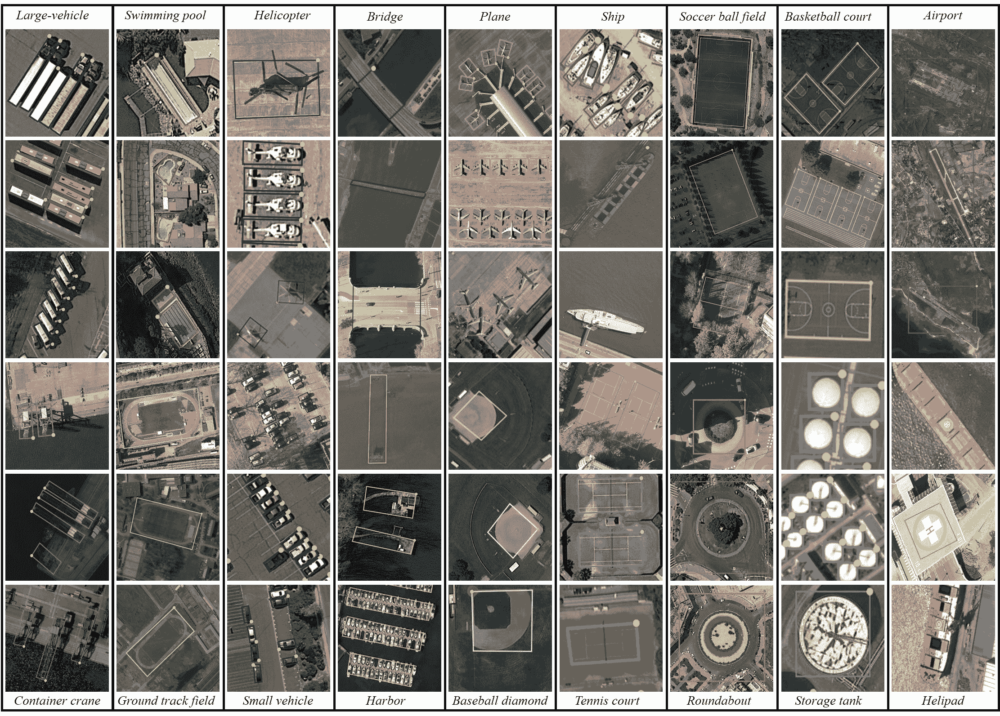

# 带 OBB 的 DOTA 数据集

> 原文：[`docs.ultralytics.com/datasets/obb/dota-v2/`](https://docs.ultralytics.com/datasets/obb/dota-v2/)

[DOTA](https://captain-whu.github.io/DOTA/index.html)是一个专门的数据集，强调空中图像中的目标检测。源自 DOTA 系列数据集，提供了带有定向边界框（OBB）的标注图像，捕捉了多样的空中场景。


## 主要特点

+   收集自各种传感器和平台，图像尺寸从 800 × 800 到 20,000 × 20,000 像素不等。

+   跨 18 个类别具有超过 170 万个定向边界框。

+   包括多尺度目标检测。

+   实例由专家使用任意（8 自由度）的四边形进行标注，捕捉不同尺度、方向和形状的对象。

## 数据集版本

### DOTA-v1.0

+   包含 15 个常见类别。

+   包括 2,806 张图像，包含 188,282 个实例。

+   分割比例：1/2 用于训练，1/6 用于验证，1/3 用于测试。

### DOTA-v1.5

+   包含与 DOTA-v1.0 相同的图像。

+   非常小的实例（小于 10 像素）也被标注了。

+   新类别的增加："集装箱起重机"。

+   总共有 403,318 个实例。

+   发布于 2019 年 DOAI 挑战赛上，专注于空中图像目标检测。

### DOTA-v2.0

+   收集自谷歌地球、GF-2 卫星和其他空中图像。

+   包含 18 个常见类别。

+   包括 11,268 张图像，具有令人惊叹的 1,793,658 个实例。

+   新引入的类别包括："机场" 和 "直升机停机坪"。

+   图像分割：

    +   训练集：1,830 张图像，包含 268,627 个实例。

    +   验证：593 张图像，包含 81,048 个实例。

    +   测试开发集：2,792 张图像，包含 353,346 个实例。

    +   测试挑战：6,053 张图像，包含 1,090,637 个实例。

## 数据集结构

DOTA 展示了专门针对 OBB 目标检测挑战的结构化布局：

+   **图像**：包括多样的地形和结构的高分辨率空中图像的大量收集。

+   **定向边界框**：以旋转矩形的形式进行标注，适合捕捉飞机、船只和建筑物等不同方向的对象。

## 应用

DOTA 作为专门针对空中图像分析的模型训练和评估的基准。通过 OBB 标注的加入，提供了一个独特的挑战，促进了专门针对空中图像的目标检测模型的发展。

## 数据集 YAML

通常，数据集包括一个 YAML（Yet Another Markup Language）文件，详细说明数据集的配置。对于 DOTA v1 和 DOTA v1.5，Ultralytics 提供了`DOTAv1.yaml`和`DOTAv1.5.yaml`文件。有关这些文件以及 DOTA v2 的更多详细信息，请参阅 DOTA 的官方存储库和文档。

DOTAv1.yaml

```py
`# Ultralytics YOLO 🚀, AGPL-3.0 license # DOTA 1.0 dataset https://captain-whu.github.io/DOTA/index.html for object detection in aerial images by Wuhan University # Documentation: https://docs.ultralytics.com/datasets/obb/dota-v2/ # Example usage: yolo train model=yolov8n-obb.pt data=DOTAv1.yaml # parent # ├── ultralytics # └── datasets #     └── dota1  ← downloads here (2GB)  # Train/val/test sets as 1) dir: path/to/imgs, 2) file: path/to/imgs.txt, or 3) list: [path/to/imgs1, path/to/imgs2, ..] path:  ../datasets/DOTAv1  # dataset root dir train:  images/train  # train images (relative to 'path') 1411 images val:  images/val  # val images (relative to 'path') 458 images test:  images/test  # test images (optional) 937 images  # Classes for DOTA 1.0 names:   0:  plane   1:  ship   2:  storage tank   3:  baseball diamond   4:  tennis court   5:  basketball court   6:  ground track field   7:  harbor   8:  bridge   9:  large vehicle   10:  small vehicle   11:  helicopter   12:  roundabout   13:  soccer ball field   14:  swimming pool  # Download script/URL (optional) download:  https://github.com/ultralytics/assets/releases/download/v0.0.0/DOTAv1.zip` 
```

## 拆分 DOTA 图像

为了训练 DOTA 数据集，我们将原始的高分辨率 DOTA 图像以多尺度方式拆分成 1024x1024 分辨率的图像。

图像分割

```py
`from ultralytics.data.split_dota import split_test, split_trainval  # split train and val set, with labels. split_trainval(     data_root="path/to/DOTAv1.0/",     save_dir="path/to/DOTAv1.0-split/",     rates=[0.5, 1.0, 1.5],  # multiscale     gap=500, ) # split test set, without labels. split_test(     data_root="path/to/DOTAv1.0/",     save_dir="path/to/DOTAv1.0-split/",     rates=[0.5, 1.0, 1.5],  # multiscale     gap=500, )` 
```

## 使用方法

要在 DOTA v1 数据集上训练模型，您可以使用以下代码片段。始终参考您模型的文档以获取可用参数的详尽列表。

警告

请注意，DOTAv1 数据集中的所有图像和相关注释可用于学术目的，但商业用途被禁止。非常感谢您理解和尊重数据集创建者的愿望！

Train 示例

```py
`from ultralytics import YOLO  # Create a new YOLOv8n-OBB model from scratch model = YOLO("yolov8n-obb.yaml")  # Train the model on the DOTAv2 dataset results = model.train(data="DOTAv1.yaml", epochs=100, imgsz=640)` 
```

```py
`# Train a new YOLOv8n-OBB model on the DOTAv2 dataset yolo  obb  train  data=DOTAv1.yaml  model=yolov8n-obb.pt  epochs=100  imgsz=640` 
```

## 样本数据和注释

浏览数据集可见其深度：



+   **DOTA 示例**：此快照突显了航空场景的复杂性和面向对象的边界框注释的重要性，捕捉了对象的自然方向。

数据集的丰富性提供了关于专属于航空影像的目标检测挑战的宝贵见解。

## 引用和致谢

对于那些在努力中利用 DOTA 的人，引用相关研究论文是非常重要的。

```py
`@article{9560031,   author={Ding, Jian and Xue, Nan and Xia, Gui-Song and Bai, Xiang and Yang, Wen and Yang, Michael and Belongie, Serge and Luo, Jiebo and Datcu, Mihai and Pelillo, Marcello and Zhang, Liangpei},   journal={IEEE Transactions on Pattern Analysis and Machine Intelligence},   title={Object Detection in Aerial Images: A Large-Scale Benchmark and Challenges},   year={2021},   volume={},   number={},   pages={1-1},   doi={10.1109/TPAMI.2021.3117983} }` 
```

特别感谢 DOTA 数据集背后的团队，他们在策划这个数据集方面做出了值得称赞的努力。要全面了解数据集及其细微差别，请访问[官方 DOTA 网站](https://captain-whu.github.io/DOTA/index.html)。

## 常见问题

### DOTA 数据集是什么，以及它在航空影像目标检测中的重要性是什么？

[DOTA 数据集](https://captain-whu.github.io/DOTA/index.html)是一个专注于航空影像目标检测的专业数据集。它采用了面向对象的边界框（OBB），提供了来自多样航空场景的注释图像。DOTA 在其 1.7M 注释和 18 个类别中展示了对象方向、尺度和形状的多样性，非常适合开发和评估专门用于航空影像分析的模型，例如用于监控、环境监测和灾害管理的模型。

### DOTA 数据集如何处理图像中的不同尺度和方向？

DOTA 使用面向对象的边界框（OBB）进行注释，这些由旋转矩形表示，无论其方向如何，都能准确地捕捉对象。数据集的多尺度图像范围从 800 × 800 到 20,000 × 20,000 像素，进一步允许有效检测小型和大型对象。

### 如何使用 DOTA 数据集训练模型？

要在 DOTA 数据集上训练模型，您可以使用以下示例与 Ultralytics YOLO：

Train 示例

```py
`from ultralytics import YOLO  # Create a new YOLOv8n-OBB model from scratch model = YOLO("yolov8n-obb.yaml")  # Train the model on the DOTAv1 dataset results = model.train(data="DOTAv1.yaml", epochs=100, imgsz=640)` 
```

```py
`# Train a new YOLOv8n-OBB model on the DOTAv1 dataset yolo  obb  train  data=DOTAv1.yaml  model=yolov8n-obb.pt  epochs=100  imgsz=640` 
```

关于如何拆分和预处理 DOTA 图像的详细信息，请参考拆分 DOTA 图像部分。

### DOTA-v1.0、DOTA-v1.5 和 DOTA-v2.0 之间有什么区别？

+   **DOTA-v1.0**：包括 15 个常见类别，在 2,806 张图像中有 188,282 个实例。数据集被分为训练、验证和测试集。

+   **DOTA-v1.5**：在 DOTA-v1.0 的基础上，通过标注非常小的实例（小于 10 像素），并添加了一个新的类别，“集装箱起重机”，总计 403,318 个实例。

+   **DOTA-v2.0**：通过 Google Earth 和 GF-2 卫星的标注进一步扩展，包括 11,268 张图像和 1,793,658 个实例。它包含了新的类别如“机场”和“直升机停机坪”。

欲进行详细比较和额外的具体信息，请查看数据集版本部分。

### 如何为训练准备高分辨率的 DOTA 图像？

DOTA 图像可能非常大，因此会将其分割为更小的分辨率以便于管理的训练。以下是一个 Python 代码片段用于分割图像：

示例

```py
`from ultralytics.data.split_dota import split_test, split_trainval  # split train and val set, with labels. split_trainval(     data_root="path/to/DOTAv1.0/",     save_dir="path/to/DOTAv1.0-split/",     rates=[0.5, 1.0, 1.5],  # multiscale     gap=500, ) # split test set, without labels. split_test(     data_root="path/to/DOTAv1.0/",     save_dir="path/to/DOTAv1.0-split/",     rates=[0.5, 1.0, 1.5],  # multiscale     gap=500, )` 
```

这一过程有助于提高训练效率和模型性能。欲获取详细说明，请访问分割 DOTA 图像部分。
