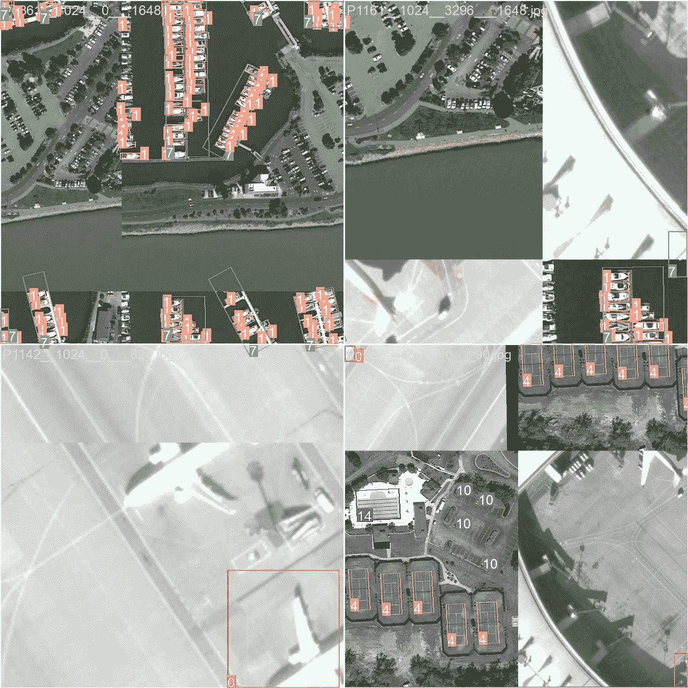

# DOTA8 数据集

> 原文：[`docs.ultralytics.com/datasets/obb/dota8/`](https://docs.ultralytics.com/datasets/obb/dota8/)

## 介绍

[Ultralytics](https://ultralytics.com) DOTA8 是一个小型但多功能的有向目标检测数据集，由 DOTAv1 集的前 8 张图像中的第一 8 张图像组成，用于训练 4 张和验证 4 张。该数据集非常适合测试和调试对象检测模型，或者尝试新的检测方法。有了 8 张图像，它足够小，可以轻松管理，但又足够多样，以测试训练管道中的错误并作为在训练更大数据集之前的合理性检查。

该数据集适用于 Ultralytics 的[HUB](https://hub.ultralytics.com)和[YOLOv8](https://github.com/ultralytics/ultralytics)。

## 数据集 YAML

一个 YAML（Yet Another Markup Language）文件用于定义数据集配置。它包含有关数据集路径、类别和其他相关信息的信息。在 DOTA8 数据集的情况下，`dota8.yaml`文件维护在[`github.com/ultralytics/ultralytics/blob/main/ultralytics/cfg/datasets/dota8.yaml`](https://github.com/ultralytics/ultralytics/blob/main/ultralytics/cfg/datasets/dota8.yaml)。

ultralytics/cfg/datasets/dota8.yaml

```py
`# Ultralytics YOLO 🚀, AGPL-3.0 license # DOTA8 dataset 8 images from split DOTAv1 dataset by Ultralytics # Documentation: https://docs.ultralytics.com/datasets/obb/dota8/ # Example usage: yolo train model=yolov8n-obb.pt data=dota8.yaml # parent # ├── ultralytics # └── datasets #     └── dota8  ← downloads here (1MB)  # Train/val/test sets as 1) dir: path/to/imgs, 2) file: path/to/imgs.txt, or 3) list: [path/to/imgs1, path/to/imgs2, ..] path:  ../datasets/dota8  # dataset root dir train:  images/train  # train images (relative to 'path') 4 images val:  images/val  # val images (relative to 'path') 4 images  # Classes for DOTA 1.0 names:   0:  plane   1:  ship   2:  storage tank   3:  baseball diamond   4:  tennis court   5:  basketball court   6:  ground track field   7:  harbor   8:  bridge   9:  large vehicle   10:  small vehicle   11:  helicopter   12:  roundabout   13:  soccer ball field   14:  swimming pool  # Download script/URL (optional) download:  https://github.com/ultralytics/assets/releases/download/v0.0.0/dota8.zip` 
```

## 使用方法

要在 DOTA8 数据集上使用 640 像素的图像大小训练 YOLOv8n-obb 模型 100 个 epochs，您可以使用以下代码片段。有关可用参数的详细列表，请参阅模型训练页面。

训练示例

```py
`from ultralytics import YOLO  # Load a model model = YOLO("yolov8n-obb.pt")  # load a pretrained model (recommended for training)  # Train the model results = model.train(data="dota8.yaml", epochs=100, imgsz=640)` 
```

```py
`# Start training from a pretrained *.pt model yolo  obb  train  data=dota8.yaml  model=yolov8n-obb.pt  epochs=100  imgsz=640` 
```

## 样本图像和注释

以下是 DOTA8 数据集中图像的一些示例及其相应的注释：



+   **拼接图像**：此图展示了由拼接数据集图像组成的训练批次。拼接是一种在训练过程中将多个图像合并成单个图像的技术，以增加每个训练批次中对象和场景的多样性。这有助于提高模型对不同对象大小、长宽比和上下文的泛化能力。

该示例展示了 DOTA8 数据集中图像的多样性和复杂性，以及在训练过程中使用拼接的好处。

## 引用和致谢

如果您在研究或开发工作中使用 DOTA 数据集，请引用以下论文：

```py
`@article{9560031,   author={Ding, Jian and Xue, Nan and Xia, Gui-Song and Bai, Xiang and Yang, Wen and Yang, Michael and Belongie, Serge and Luo, Jiebo and Datcu, Mihai and Pelillo, Marcello and Zhang, Liangpei},   journal={IEEE Transactions on Pattern Analysis and Machine Intelligence},   title={Object Detection in Aerial Images: A Large-Scale Benchmark and Challenges},   year={2021},   volume={},   number={},   pages={1-1},   doi={10.1109/TPAMI.2021.3117983} }` 
```

特别感谢 DOTA 数据集团队为策划此数据集所作的值得称赞的努力。要全面了解数据集及其细微差别，请访问[官方 DOTA 网站](https://captain-whu.github.io/DOTA/index.html)。

## 常见问题

### DOTA8 数据集是什么以及如何使用它？

DOTA8 数据集是一个小型、多用途的面向对象检测数据集，由 DOTAv1 拆分集中的前 8 个图像组成，其中 4 个用于训练，4 个用于验证。它非常适合测试和调试像 Ultralytics YOLOv8 这样的物体检测模型。由于其可管理的大小和多样性，它有助于识别管道错误并在部署更大数据集之前进行健全性检查。了解更多关于使用[Ultralytics YOLOv8 进行物体检测](https://github.com/ultralytics/ultralytics)的信息。

### 如何使用 DOTA8 数据集训练 YOLOv8 模型？

要在 DOTA8 数据集上训练一个 100 个 epochs、图像尺寸为 640 的 YOLOv8n-obb 模型，您可以使用以下代码片段。有关详细的参数选项，请参考模型训练页面。

训练示例

```py
`from ultralytics import YOLO  # Load a model model = YOLO("yolov8n-obb.pt")  # load a pretrained model (recommended for training)  # Train the model results = model.train(data="dota8.yaml", epochs=100, imgsz=640)` 
```

```py
`# Start training from a pretrained *.pt model yolo  obb  train  data=dota8.yaml  model=yolov8n-obb.pt  epochs=100  imgsz=640` 
```

### DOTA 数据集的关键特性是什么，我可以在哪里获取 YAML 文件？

DOTA 数据集以其大规模基准和在航空图像中物体检测中所提出的挑战而闻名。DOTA8 子集是一个较小、可管理的数据集，非常适合进行初步测试。您可以在这个[GitHub 链接](https://github.com/ultralytics/ultralytics/blob/main/ultralytics/cfg/datasets/dota8.yaml)上访问`dota8.yaml`文件，其中包含路径、类别和配置细节。

### 拼接如何增强使用 DOTA8 数据集进行模型训练？

在训练期间，拼接技术将多个图像组合成一个图像，增加了每个批次中对象和场景的多样性。这有助于模型更好地泛化到不同的对象大小、长宽比和场景中。通过由拼接的 DOTA8 数据集图像组成的训练批次，可以直观展示这一技术，有助于稳健的模型开发。在我们的训练页面上进一步了解更多关于拼接和训练技术的信息。

### 为什么我应该在物体检测任务中使用 Ultralytics YOLOv8？

Ultralytics YOLOv8 提供了最先进的实时物体检测能力，包括面向边界框（OBB）、实例分割和高度灵活的训练流程。它适用于各种应用，并提供了预训练模型以进行高效的微调。进一步了解优势和使用方法，请参阅[Ultralytics YOLOv8 文档](https://github.com/ultralytics/ultralytics)。
