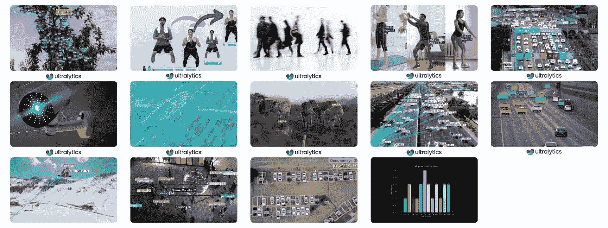

# Ultralytics 解决方案：利用 YOLOv8 解决现实世界的问题

> 原文：[`docs.ultralytics.com/solutions/`](https://docs.ultralytics.com/solutions/)

Ultralytics 解决方案提供 YOLO 模型的前沿应用，包括对象计数、模糊处理和安全系统，提高各行业的效率和准确性。探索 YOLOv8 在实际中的实施力量。

## 解决方案

这是我们精心策划的 Ultralytics 解决方案列表，可用于创建令人印象深刻的计算机视觉项目。

+   对象计数 🚀 新功能：学习使用 YOLOv8 进行实时对象计数。掌握在实时视频流中准确计数对象的技能。

+   对象裁剪 🚀 新功能：使用 YOLOv8 精确裁剪图像和视频中的对象，实现精准提取。

+   对象模糊处理 🚀 新功能：使用 YOLOv8 对象模糊处理，保护图像和视频的隐私。

+   运动监测 🚀 新功能：探索如何使用 YOLOv8 监测运动。学习实时跟踪和分析各种健身活动。

+   区域内的对象计数 🚀 新功能：使用 YOLOv8 在特定区域内计数对象，实现精准检测。

+   安全警报系统 🚀 新功能：使用 YOLOv8 创建安全警报系统，在检测到新对象时触发警报。根据特定需求定制系统。

+   热图 🚀 新功能：利用检测热图可视化矩阵内数据强度，为计算机视觉任务提供清晰的洞察。

+   实例分割与对象追踪 🚀 新功能：使用 YOLOv8 实现实例分割和对象追踪，精确获取对象边界并进行持续监控。

+   VisionEye 视觉对象映射 🚀 新功能：开发系统，模仿人眼对特定对象的聚焦，增强计算机辨别和优先处理细节的能力。

+   速度估算 🚀 新功能：利用 YOLOv8 和对象追踪技术估算对象的速度，对自动驾驶车辆和交通监测等应用至关重要。

+   距离计算 🚀 新功能：使用 YOLOv8 中的边界框质心计算对象之间的距离，对空间分析至关重要。

+   排队管理 🚀 新功能：使用 YOLOv8 实现高效的排队管理系统，减少等待时间，提高生产效率。

+   停车管理 🚀 新功能：使用 YOLOv8 在停车区域组织和引导车辆流，优化空间利用和用户体验。

+   分析 📊 新功能：进行全面的数据分析，发现模式并做出知情决策，利用 YOLOv8 进行描述性、预测性和指导性分析。

+   Streamlit 实时推理 🚀 新功能：通过用户友好的 Streamlit 界面直接在网页浏览器中利用 YOLOv8 进行实时对象检测。

## 为我们的解决方案做出贡献

我们欢迎社区贡献！如果您精通超派科技 YOLO 的某一方面，而我们的解决方案尚未涵盖，请分享您的专业知识。撰写指南是回馈社区并帮助我们使文档更加全面和用户友好的好方法。

要开始，请阅读我们的贡献指南，了解如何打开拉取请求（PR）的指导方针 🛠️。我们期待您的贡献！

让我们共同努力，使超派科技 YOLO 生态系统更加强大和多样化 🙏！

## 常见问题

### 如何使用超派科技 YOLO 进行实时物体计数？

超派科技 YOLOv8 可以通过其先进的物体检测能力进行实时物体计数。您可以按照我们的物体计数详细指南设置 YOLOv8 以进行实时视频流分析。只需安装 YOLOv8，加载模型，处理视频帧以动态计数物体。

### 使用超派科技 YOLO 的安全系统有哪些好处？

超派科技 YOLOv8 通过提供实时物体检测和警报机制来增强安全系统。通过使用 YOLOv8，您可以创建一个安全警报系统，当监控区域检测到新对象时触发警报。了解如何设置使用 YOLOv8 进行强大安全监控的安全警报系统。

### 超派科技 YOLO 如何改善排队管理系统？

超派科技 YOLOv8 可以通过准确计数和跟踪排队中的人员显著改善排队管理系统，从而帮助减少等待时间并优化服务效率。请按照我们的排队管理详细指南学习如何实现使用 YOLOv8 进行有效排队监控和分析。

### 超派科技的 YOLO 可以用于监控健身训练吗？

是的，超派科技 YOLOv8 可以通过跟踪和分析实时的健身例程有效地用于监控健身训练。这允许精确评估锻炼形式和表现。探索我们的健身监控指南，了解如何使用 YOLOv8 设置基于 AI 的健身监控系统。

### 超派科技 YOLO 如何帮助创建数据可视化的热图？

超派科技 YOLOv8 可以生成热图，可视化给定区域内的数据强度，突出显示高活动或感兴趣的区域。此功能在理解各种计算机视觉任务中的模式和趋势方面尤为有用。了解如何使用 YOLOv8 创建和使用热图进行全面的数据分析和可视化。
