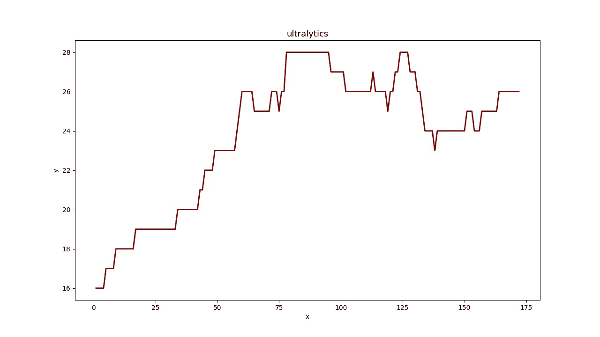
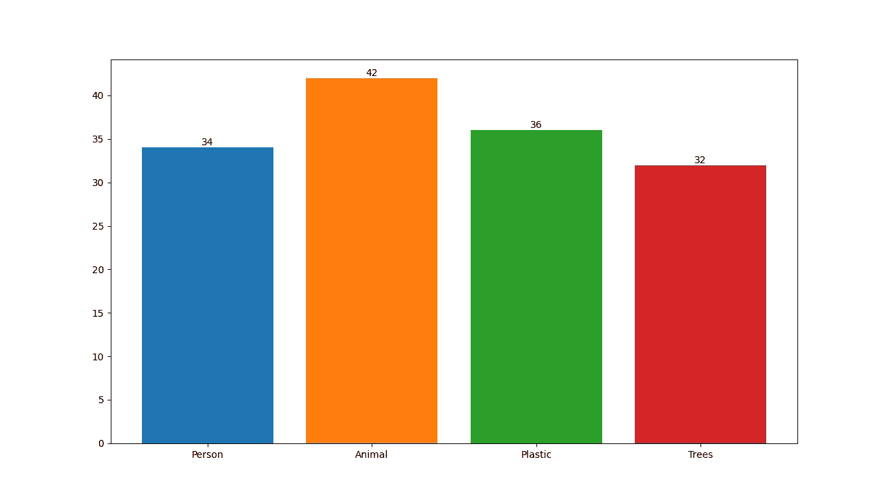
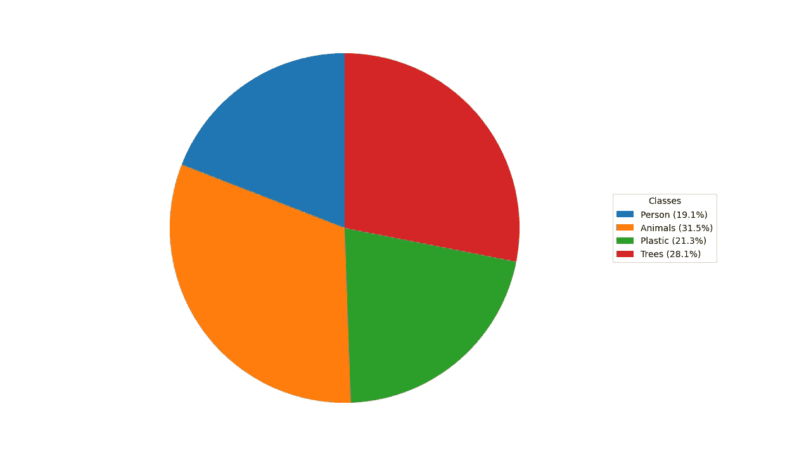

# Analytics using Ultralytics YOLOv8

> 原文：[`docs.ultralytics.com/guides/analytics/`](https://docs.ultralytics.com/guides/analytics/)

## Introduction

本指南全面介绍了三种基本数据可视化类型：线图、条形图和饼图。每个部分都包括使用 Python 创建这些可视化的逐步说明和代码片段。

### Visual Samples

| Line Graph | Bar Plot | Pie Chart |
| --- | --- | --- |
|  |  |  |

### Why Graphs are Important

+   线图适合追踪短期和长期的变化，并比较同一时期多个组的变化。

+   另一方面，条形图适合比较不同类别的数量，并展示类别与其数值之间的关系。

+   最后，饼图适合用于说明各类别之间的比例及展示整体中的各部分。

Analytics Examples

```py
import cv2

from ultralytics import YOLO, solutions

model = YOLO("yolov8s.pt")

cap = cv2.VideoCapture("Path/to/video/file.mp4")
assert cap.isOpened(), "Error reading video file"
w, h, fps = (int(cap.get(x)) for x in (cv2.CAP_PROP_FRAME_WIDTH, cv2.CAP_PROP_FRAME_HEIGHT, cv2.CAP_PROP_FPS))

out = cv2.VideoWriter("line_plot.avi", cv2.VideoWriter_fourcc(*"MJPG"), fps, (w, h))

analytics = solutions.Analytics(
    type="line",
    writer=out,
    im0_shape=(w, h),
    view_img=True,
)
total_counts = 0
frame_count = 0

while cap.isOpened():
    success, frame = cap.read()

    if success:
        frame_count += 1
        results = model.track(frame, persist=True, verbose=True)

        if results[0].boxes.id is not None:
            boxes = results[0].boxes.xyxy.cpu()
            for box in boxes:
                total_counts += 1

        analytics.update_line(frame_count, total_counts)

        total_counts = 0
        if cv2.waitKey(1) & 0xFF == ord("q"):
            break
    else:
        break

cap.release()
out.release()
cv2.destroyAllWindows() 
```

```py
import cv2

from ultralytics import YOLO, solutions

model = YOLO("yolov8s.pt")

cap = cv2.VideoCapture("Path/to/video/file.mp4")
assert cap.isOpened(), "Error reading video file"
w, h, fps = (int(cap.get(x)) for x in (cv2.CAP_PROP_FRAME_WIDTH, cv2.CAP_PROP_FRAME_HEIGHT, cv2.CAP_PROP_FPS))
out = cv2.VideoWriter("multiple_line_plot.avi", cv2.VideoWriter_fourcc(*"MJPG"), fps, (w, h))

analytics = solutions.Analytics(
    type="line",
    writer=out,
    im0_shape=(w, h),
    view_img=True,
    max_points=200,
)

frame_count = 0
data = {}
labels = []

while cap.isOpened():
    success, frame = cap.read()

    if success:
        frame_count += 1

        results = model.track(frame, persist=True)

        if results[0].boxes.id is not None:
            boxes = results[0].boxes.xyxy.cpu()
            track_ids = results[0].boxes.id.int().cpu().tolist()
            clss = results[0].boxes.cls.cpu().tolist()

            for box, track_id, cls in zip(boxes, track_ids, clss):
                # Store each class label
                if model.names[int(cls)] not in labels:
                    labels.append(model.names[int(cls)])

                # Store each class count
                if model.names[int(cls)] in data:
                    data[model.names[int(cls)]] += 1
                else:
                    data[model.names[int(cls)]] = 0

        # update lines every frame
        analytics.update_multiple_lines(data, labels, frame_count)
        data = {}  # clear the data list for next frame
    else:
        break

cap.release()
out.release()
cv2.destroyAllWindows() 
```

```py
import cv2

from ultralytics import YOLO, solutions

model = YOLO("yolov8s.pt")

cap = cv2.VideoCapture("Path/to/video/file.mp4")
assert cap.isOpened(), "Error reading video file"
w, h, fps = (int(cap.get(x)) for x in (cv2.CAP_PROP_FRAME_WIDTH, cv2.CAP_PROP_FRAME_HEIGHT, cv2.CAP_PROP_FPS))

out = cv2.VideoWriter("pie_chart.avi", cv2.VideoWriter_fourcc(*"MJPG"), fps, (w, h))

analytics = solutions.Analytics(
    type="pie",
    writer=out,
    im0_shape=(w, h),
    view_img=True,
)

clswise_count = {}

while cap.isOpened():
    success, frame = cap.read()
    if success:
        results = model.track(frame, persist=True, verbose=True)
        if results[0].boxes.id is not None:
            boxes = results[0].boxes.xyxy.cpu()
            clss = results[0].boxes.cls.cpu().tolist()
            for box, cls in zip(boxes, clss):
                if model.names[int(cls)] in clswise_count:
                    clswise_count[model.names[int(cls)]] += 1
                else:
                    clswise_count[model.names[int(cls)]] = 1

            analytics.update_pie(clswise_count)
            clswise_count = {}

        if cv2.waitKey(1) & 0xFF == ord("q"):
            break
    else:
        break

cap.release()
out.release()
cv2.destroyAllWindows() 
```

```py
import cv2

from ultralytics import YOLO, solutions

model = YOLO("yolov8s.pt")

cap = cv2.VideoCapture("Path/to/video/file.mp4")
assert cap.isOpened(), "Error reading video file"
w, h, fps = (int(cap.get(x)) for x in (cv2.CAP_PROP_FRAME_WIDTH, cv2.CAP_PROP_FRAME_HEIGHT, cv2.CAP_PROP_FPS))

out = cv2.VideoWriter("bar_plot.avi", cv2.VideoWriter_fourcc(*"MJPG"), fps, (w, h))

analytics = solutions.Analytics(
    type="bar",
    writer=out,
    im0_shape=(w, h),
    view_img=True,
)

clswise_count = {}

while cap.isOpened():
    success, frame = cap.read()
    if success:
        results = model.track(frame, persist=True, verbose=True)
        if results[0].boxes.id is not None:
            boxes = results[0].boxes.xyxy.cpu()
            clss = results[0].boxes.cls.cpu().tolist()
            for box, cls in zip(boxes, clss):
                if model.names[int(cls)] in clswise_count:
                    clswise_count[model.names[int(cls)]] += 1
                else:
                    clswise_count[model.names[int(cls)]] = 1

            analytics.update_bar(clswise_count)
            clswise_count = {}

        if cv2.waitKey(1) & 0xFF == ord("q"):
            break
    else:
        break

cap.release()
out.release()
cv2.destroyAllWindows() 
```

```py
import cv2

from ultralytics import YOLO, solutions

model = YOLO("yolov8s.pt")

cap = cv2.VideoCapture("path/to/video/file.mp4")
assert cap.isOpened(), "Error reading video file"
w, h, fps = (int(cap.get(x)) for x in (cv2.CAP_PROP_FRAME_WIDTH, cv2.CAP_PROP_FRAME_HEIGHT, cv2.CAP_PROP_FPS))

out = cv2.VideoWriter("area_plot.avi", cv2.VideoWriter_fourcc(*"MJPG"), fps, (w, h))

analytics = solutions.Analytics(
    type="area",
    writer=out,
    im0_shape=(w, h),
    view_img=True,
)

clswise_count = {}
frame_count = 0

while cap.isOpened():
    success, frame = cap.read()
    if success:
        frame_count += 1
        results = model.track(frame, persist=True, verbose=True)

        if results[0].boxes.id is not None:
            boxes = results[0].boxes.xyxy.cpu()
            clss = results[0].boxes.cls.cpu().tolist()

            for box, cls in zip(boxes, clss):
                if model.names[int(cls)] in clswise_count:
                    clswise_count[model.names[int(cls)]] += 1
                else:
                    clswise_count[model.names[int(cls)]] = 1

        analytics.update_area(frame_count, clswise_count)
        clswise_count = {}
        if cv2.waitKey(1) & 0xFF == ord("q"):
            break
    else:
        break

cap.release()
out.release()
cv2.destroyAllWindows() 
```

### Argument `Analytics`

这里有一个包含`Analytics`参数的表格：

| Name | Type | Default | Description |
| --- | --- | --- | --- |
| `type` | `str` | `None` | Type of data or object. |
| `im0_shape` | `tuple` | `None` | Shape of the initial image. |
| `writer` | `cv2.VideoWriter` | `None` | Object for writing video files. |
| `title` | `str` | `ultralytics` | Title for the visualization. |
| `x_label` | `str` | `x` | Label for the x-axis. |
| `y_label` | `str` | `y` | Label for the y-axis. |
| `bg_color` | `str` | `white` | Background color. |
| `fg_color` | `str` | `black` | Foreground color. |
| `line_color` | `str` | `yellow` | Color of the lines. |
| `line_width` | `int` | `2` | Width of the lines. |
| `fontsize` | `int` | `13` | Font size for text. |
| `view_img` | `bool` | `False` | Flag to display the image or video. |
| `save_img` | `bool` | `True` | Flag to save the image or video. |
| `max_points` | `int` | `50` | For multiple lines, total points drawn on frame, before deleting initial points. |
| `points_width` | `int` | `15` | Width of line points highlighter. |

### Arguments `model.track`

| Name | Type | Default | Description |
| --- | --- | --- | --- |
| `source` | `im0` | `None` | source directory for images or videos |
| `persist` | `bool` | `False` | persisting tracks between frames |
| `tracker` | `str` | `botsort.yaml` | Tracking method 'bytetrack' or 'botsort' |
| `conf` | `float` | `0.3` | Confidence Threshold |
| `iou` | `float` | `0.5` | IOU Threshold |
| `classes` | `list` | `None` | filter results by class, i.e. classes=0, or classes=[0,2,3] |
| `verbose` | `bool` | `True` | Display the object tracking results |

## Conclusion

理解何时以及如何使用不同类型的可视化对于有效的数据分析至关重要。折线图、条形图和饼图是可以帮助您更清晰和更有效地传达数据故事的基本工具。

## 常见问题解答

### 如何使用 Ultralytics YOLOv8 Analytics 创建折线图？

要使用 Ultralytics YOLOv8 Analytics 创建折线图，请按照以下步骤操作：

1.  加载 YOLOv8 模型并打开您的视频文件。

1.  使用类型设置为“线”的`Analytics`类进行初始化。

1.  迭代视频帧，更新包含每帧对象计数等相关数据的折线图。

1.  保存显示折线图的输出视频。

示例：

```py
import cv2

from ultralytics import YOLO, solutions

model = YOLO("yolov8s.pt")
cap = cv2.VideoCapture("Path/to/video/file.mp4")
out = cv2.VideoWriter("line_plot.avi", cv2.VideoWriter_fourcc(*"MJPG"), fps, (w, h))

analytics = solutions.Analytics(type="line", writer=out, im0_shape=(w, h), view_img=True)

while cap.isOpened():
    success, frame = cap.read()
    if success:
        results = model.track(frame, persist=True)
        total_counts = sum([1 for box in results[0].boxes.xyxy])
        analytics.update_line(frame_count, total_counts)
    if cv2.waitKey(1) & 0xFF == ord("q"):
        break

cap.release()
out.release()
cv2.destroyAllWindows() 
```

要进一步了解如何配置`Analytics`类，请访问使用 Ultralytics YOLOv8 📊部分。

### 使用 Ultralytics YOLOv8 创建条形图的好处是什么？

使用 Ultralytics YOLOv8 创建条形图具有多个优点：

1.  **实时数据可视化**：无缝集成对象检测结果到条形图中进行动态更新。

1.  **易用性**：简单的 API 和功能使得实现和可视化数据变得直接。

1.  **定制化**：根据您的特定需求自定义标题、标签、颜色等。

1.  **高效性**：高效处理大量数据，并在视频处理期间实时更新绘图。

使用以下示例生成条形图：

```py
import cv2

from ultralytics import YOLO, solutions

model = YOLO("yolov8s.pt")
cap = cv2.VideoCapture("Path/to/video/file.mp4")
out = cv2.VideoWriter("bar_plot.avi", cv2.VideoWriter_fourcc(*"MJPG"), fps, (w, h))

analytics = solutions.Analytics(type="bar", writer=out, im0_shape=(w, h), view_img=True)

while cap.isOpened():
    success, frame = cap.read()
    if success:
        results = model.track(frame, persist=True)
        clswise_count = {
            model.names[int(cls)]: boxes.size(0)
            for cls, boxes in zip(results[0].boxes.cls.tolist(), results[0].boxes.xyxy)
        }
        analytics.update_bar(clswise_count)
    if cv2.waitKey(1) & 0xFF == ord("q"):
        break

cap.release()
out.release()
cv2.destroyAllWindows() 
```

要了解更多，请访问指南中的条形图部分。

### 为什么我应该在我的数据可视化项目中使用 Ultralytics YOLOv8 来创建饼图？

Ultralytics YOLOv8 是创建饼图的优秀选择，因为：

1.  **与对象检测集成**：直接将对象检测结果集成到饼图中，以获得即时洞察。

1.  **用户友好的 API**：通过最少的代码简单设置和使用。

1.  **可定制性**：多种颜色、标签等的定制选项。

1.  **实时更新**：处理和实时可视化数据，非常适合视频分析项目。

这是一个快速示例：

```py
import cv2

from ultralytics import YOLO, solutions

model = YOLO("yolov8s.pt")
cap = cv2.VideoCapture("Path/to/video/file.mp4")
out = cv2.VideoWriter("pie_chart.avi", cv2.VideoWriter_fourcc(*"MJPG"), fps, (w, h))

analytics = solutions.Analytics(type="pie", writer=out, im0_shape=(w, h), view_img=True)

while cap.isOpened():
    success, frame = cap.read()
    if success:
        results = model.track(frame, persist=True)
        clswise_count = {
            model.names[int(cls)]: boxes.size(0)
            for cls, boxes in zip(results[0].boxes.cls.tolist(), results[0].boxes.xyxy)
        }
        analytics.update_pie(clswise_count)
    if cv2.waitKey(1) & 0xFF == ord("q"):
        break

cap.release()
out.release()
cv2.destroyAllWindows() 
```

要获取更多信息，请参考指南中的饼图部分。

### 可以使用 Ultralytics YOLOv8 来跟踪对象并动态更新可视化吗？

是的，Ultralytics YOLOv8 可以用于跟踪对象并动态更新可视化。它支持实时跟踪多个对象，并根据跟踪对象的数据更新各种可视化，如折线图、条形图和饼图。

用于跟踪和更新折线图的示例：

```py
import cv2

from ultralytics import YOLO, solutions

model = YOLO("yolov8s.pt")
cap = cv2.VideoCapture("Path/to/video/file.mp4")
out = cv2.VideoWriter("line_plot.avi", cv2.VideoWriter_fourcc(*"MJPG"), fps, (w, h))

analytics = solutions.Analytics(type="line", writer=out, im0_shape=(w, h), view_img=True)

while cap.isOpened():
    success, frame = cap.read()
    if success:
        results = model.track(frame, persist=True)
        total_counts = sum([1 for box in results[0].boxes.xyxy])
        analytics.update_line(frame_count, total_counts)
    if cv2.waitKey(1) & 0xFF == ord("q"):
        break

cap.release()
out.release()
cv2.destroyAllWindows() 
```

要了解完整功能，请参阅跟踪部分。

### Ultralytics YOLOv8 与其他对象检测解决方案（如 OpenCV 和 TensorFlow）有何不同之处？

Ultralytics YOLOv8 在多个方面与其他对象检测解决方案（如 OpenCV 和 TensorFlow）不同：

1.  **最先进的准确性**：YOLOv8 在对象检测、分割和分类任务中提供卓越的准确性。

1.  **易于使用**: 用户友好的 API，允许快速实现和集成，无需深奥的编程。

1.  **实时性能**: 优化以进行高速推理，适用于实时应用。

1.  **多样化应用**: 支持多种任务，包括多对象跟踪、自定义模型训练，并支持导出到 ONNX、TensorRT 和 CoreML 等不同格式。

1.  **全面的文档**: 广泛的[文档](https://docs.ultralytics.com/)和[博客资源](https://www.ultralytics.com/blog)，指导用户每一步。

若要详细比较和使用案例，请查看我们的[Ultralytics 博客](https://www.ultralytics.com/blog/ai-use-cases-transforming-your-future)。
