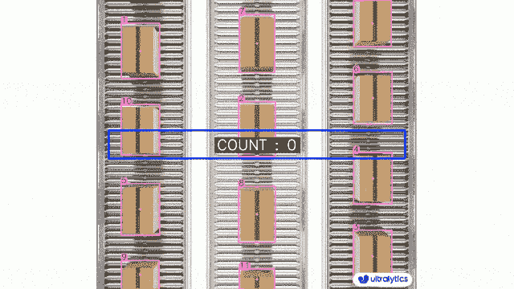
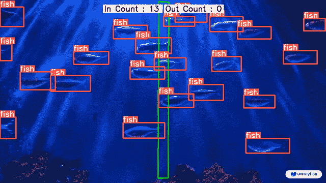

# 使用 Ultralytics YOLOv8 进行对象计数

> 原文：[`docs.ultralytics.com/guides/object-counting/`](https://docs.ultralytics.com/guides/object-counting/)

## 什么是对象计数？

使用[Ultralytics YOLOv8](https://github.com/ultralytics/ultralytics/)进行对象计数涉及对视频和摄像头流中特定对象的准确识别和计数。YOLOv8 在实时应用中表现出色，通过其先进的算法和深度学习能力为各种场景（如人群分析和监视）提供高效精确的对象计数。

|

[`www.youtube.com/embed/Ag2e-5_NpS0`](https://www.youtube.com/embed/Ag2e-5_NpS0)

**观看：** 使用 Ultralytics YOLOv8 进行对象计数 |

[`www.youtube.com/embed/Fj9TStNBVoY`](https://www.youtube.com/embed/Fj9TStNBVoY)

**观看：** 使用 Ultralytics YOLOv8 进行类别化对象计数 |

## 对象计数的优势？

+   **资源优化：** 通过精确计数和优化资源分配，对象计数有助于有效的资源管理，如库存管理中的应用。

+   **增强安全性：** 对象计数通过准确跟踪和计数实体，增强了安全和监控，有助于主动威胁检测。

+   **明智决策：** 对象计数为决策提供宝贵见解，在零售、交通管理及其他各领域中优化流程。

## 现实世界的应用

| 物流 | 水产养殖 |
| --- | --- |
|  |  |
| 使用 Ultralytics YOLOv8 进行传送带包裹计数 | 使用 Ultralytics YOLOv8 在海中进行鱼类计数 |

使用 YOLOv8 示例的对象计数

```py
import cv2

from ultralytics import YOLO, solutions

model = YOLO("yolov8n.pt")
cap = cv2.VideoCapture("path/to/video/file.mp4")
assert cap.isOpened(), "Error reading video file"
w, h, fps = (int(cap.get(x)) for x in (cv2.CAP_PROP_FRAME_WIDTH, cv2.CAP_PROP_FRAME_HEIGHT, cv2.CAP_PROP_FPS))

# Define region points
region_points = [(20, 400), (1080, 404), (1080, 360), (20, 360)]

# Video writer
video_writer = cv2.VideoWriter("object_counting_output.avi", cv2.VideoWriter_fourcc(*"mp4v"), fps, (w, h))

# Init Object Counter
counter = solutions.ObjectCounter(
    view_img=True,
    reg_pts=region_points,
    names=model.names,
    draw_tracks=True,
    line_thickness=2,
)

while cap.isOpened():
    success, im0 = cap.read()
    if not success:
        print("Video frame is empty or video processing has been successfully completed.")
        break
    tracks = model.track(im0, persist=True, show=False)

    im0 = counter.start_counting(im0, tracks)
    video_writer.write(im0)

cap.release()
video_writer.release()
cv2.destroyAllWindows() 
```

```py
import cv2

from ultralytics import YOLO, solutions

model = YOLO("yolov8n.pt")
cap = cv2.VideoCapture("path/to/video/file.mp4")
assert cap.isOpened(), "Error reading video file"
w, h, fps = (int(cap.get(x)) for x in (cv2.CAP_PROP_FRAME_WIDTH, cv2.CAP_PROP_FRAME_HEIGHT, cv2.CAP_PROP_FPS))

# Define region points as a polygon with 5 points
region_points = [(20, 400), (1080, 404), (1080, 360), (20, 360), (20, 400)]

# Video writer
video_writer = cv2.VideoWriter("object_counting_output.avi", cv2.VideoWriter_fourcc(*"mp4v"), fps, (w, h))

# Init Object Counter
counter = solutions.ObjectCounter(
    view_img=True,
    reg_pts=region_points,
    names=model.names,
    draw_tracks=True,
    line_thickness=2,
)

while cap.isOpened():
    success, im0 = cap.read()
    if not success:
        print("Video frame is empty or video processing has been successfully completed.")
        break
    tracks = model.track(im0, persist=True, show=False)

    im0 = counter.start_counting(im0, tracks)
    video_writer.write(im0)

cap.release()
video_writer.release()
cv2.destroyAllWindows() 
```

```py
import cv2

from ultralytics import YOLO, solutions

model = YOLO("yolov8n.pt")
cap = cv2.VideoCapture("path/to/video/file.mp4")
assert cap.isOpened(), "Error reading video file"
w, h, fps = (int(cap.get(x)) for x in (cv2.CAP_PROP_FRAME_WIDTH, cv2.CAP_PROP_FRAME_HEIGHT, cv2.CAP_PROP_FPS))

# Define line points
line_points = [(20, 400), (1080, 400)]

# Video writer
video_writer = cv2.VideoWriter("object_counting_output.avi", cv2.VideoWriter_fourcc(*"mp4v"), fps, (w, h))

# Init Object Counter
counter = solutions.ObjectCounter(
    view_img=True,
    reg_pts=line_points,
    names=model.names,
    draw_tracks=True,
    line_thickness=2,
)

while cap.isOpened():
    success, im0 = cap.read()
    if not success:
        print("Video frame is empty or video processing has been successfully completed.")
        break
    tracks = model.track(im0, persist=True, show=False)

    im0 = counter.start_counting(im0, tracks)
    video_writer.write(im0)

cap.release()
video_writer.release()
cv2.destroyAllWindows() 
```

```py
import cv2

from ultralytics import YOLO, solutions

model = YOLO("yolov8n.pt")
cap = cv2.VideoCapture("path/to/video/file.mp4")
assert cap.isOpened(), "Error reading video file"
w, h, fps = (int(cap.get(x)) for x in (cv2.CAP_PROP_FRAME_WIDTH, cv2.CAP_PROP_FRAME_HEIGHT, cv2.CAP_PROP_FPS))

line_points = [(20, 400), (1080, 400)]  # line or region points
classes_to_count = [0, 2]  # person and car classes for count

# Video writer
video_writer = cv2.VideoWriter("object_counting_output.avi", cv2.VideoWriter_fourcc(*"mp4v"), fps, (w, h))

# Init Object Counter
counter = solutions.ObjectCounter(
    view_img=True,
    reg_pts=line_points,
    names=model.names,
    draw_tracks=True,
    line_thickness=2,
)

while cap.isOpened():
    success, im0 = cap.read()
    if not success:
        print("Video frame is empty or video processing has been successfully completed.")
        break
    tracks = model.track(im0, persist=True, show=False, classes=classes_to_count)

    im0 = counter.start_counting(im0, tracks)
    video_writer.write(im0)

cap.release()
video_writer.release()
cv2.destroyAllWindows() 
```

<details class="tip" open="open"><summary>区域可移动</summary>

通过点击其边缘，您可以将区域移动到帧的任何位置</details>

### 参数`ObjectCounter`

下表列出了`ObjectCounter`的参数：

| 名称 | 类型 | 默认 | 描述 |
| --- | --- | --- | --- |
| `names` | `dict` | `None` | 类名字典。 |
| `reg_pts` | `list` | `[(20, 400), (1260, 400)]` | 定义计数区域的点列表。 |
| `count_reg_color` | `tuple` | `(255, 0, 255)` | 计数区域的 RGB 颜色。 |
| `count_txt_color` | `tuple` | `(0, 0, 0)` | 计数文本的 RGB 颜色。 |
| `count_bg_color` | `tuple` | `(255, 255, 255)` | 计数文本的背景颜色的 RGB 值。 |
| `line_thickness` | `int` | `2` | 边界框的线条厚度。 |
| `track_thickness` | `int` | `2` | 轨道线的厚度。 |
| `view_img` | `bool` | `False` | 控制是否显示视频流。 |
| `view_in_counts` | `bool` | `True` | 控制是否在视频流中显示计数。 |
| `view_out_counts` | `bool` | `True` | 控制是否在视频流中显示计数。 |
| `draw_tracks` | `bool` | `False` | 控制是否绘制对象轨迹的标志。 |
| `track_color` | `tuple` | `None` | 轨迹的 RGB 颜色。 |
| `region_thickness` | `int` | `5` | 对象计数区域的厚度。 |
| `line_dist_thresh` | `int` | `15` | 线计数器的欧几里得距离阈值。 |
| `cls_txtdisplay_gap` | `int` | `50` | 每个类别计数之间的显示间隙。 |

### 参数`model.track`

| 名称 | 类型 | 默认 | 描述 |
| --- | --- | --- | --- |
| `source` | `im0` | `None` | 图像或视频的源目录 |
| `persist` | `bool` | `False` | 在帧之间持久化跟踪结果 |
| `tracker` | `str` | `botsort.yaml` | 跟踪方法 'bytetrack' 或 'botsort' |
| `conf` | `float` | `0.3` | 置信度阈值 |
| `iou` | `float` | `0.5` | IOU 阈值 |
| `classes` | `list` | `None` | 按类别过滤结果，即 classes=0 或 classes=[0,2,3] |
| `verbose` | `bool` | `True` | 显示对象跟踪结果 |

## 常见问题解答

### 如何使用 Ultralytics YOLOv8 在视频中计数对象？

要使用 Ultralytics YOLOv8 在视频中计数对象，您可以按照以下步骤操作：

1.  导入必要的库（`cv2`，`ultralytics`）。

1.  加载预训练的 YOLOv8 模型。

1.  定义计数区域（例如多边形、线条等）。

1.  设置视频捕获并初始化对象计数器。

1.  处理每一帧以跟踪对象并在定义的区域内进行计数。

下面是在区域内进行计数的简单示例：

```py
import cv2

from ultralytics import YOLO, solutions

def count_objects_in_region(video_path, output_video_path, model_path):
  """Count objects in a specific region within a video."""
    model = YOLO(model_path)
    cap = cv2.VideoCapture(video_path)
    assert cap.isOpened(), "Error reading video file"
    w, h, fps = (int(cap.get(x)) for x in (cv2.CAP_PROP_FRAME_WIDTH, cv2.CAP_PROP_FRAME_HEIGHT, cv2.CAP_PROP_FPS))
    region_points = [(20, 400), (1080, 404), (1080, 360), (20, 360)]
    video_writer = cv2.VideoWriter(output_video_path, cv2.VideoWriter_fourcc(*"mp4v"), fps, (w, h))
    counter = solutions.ObjectCounter(
        view_img=True, reg_pts=region_points, names=model.names, draw_tracks=True, line_thickness=2
    )

    while cap.isOpened():
        success, im0 = cap.read()
        if not success:
            print("Video frame is empty or video processing has been successfully completed.")
            break
        tracks = model.track(im0, persist=True, show=False)
        im0 = counter.start_counting(im0, tracks)
        video_writer.write(im0)

    cap.release()
    video_writer.release()
    cv2.destroyAllWindows()

count_objects_in_region("path/to/video.mp4", "output_video.avi", "yolov8n.pt") 
```

在对象计数部分探索更多配置和选项。

### 使用 Ultralytics YOLOv8 进行对象计数的优势是什么？

使用 Ultralytics YOLOv8 进行对象计数提供了几个优势：

1.  **资源优化：** 它通过提供准确的计数帮助优化资源分配，有效管理资源，适用于库存管理等行业。

1.  **增强安全性：** 它通过准确跟踪和计数实体增强安全和监控，有助于主动威胁检测。

1.  **支持决策：** 它为决策提供宝贵的洞察力，优化零售、交通管理等领域的流程。

对于实际应用和代码示例，请访问对象计数部分的优势。

### 如何使用 Ultralytics YOLOv8 计数特定类别的对象？

要使用 Ultralytics YOLOv8 计数特定类别的对象，您需要在跟踪阶段指定感兴趣的类别。以下是一个 Python 示例：

```py
import cv2

from ultralytics import YOLO, solutions

def count_specific_classes(video_path, output_video_path, model_path, classes_to_count):
  """Count specific classes of objects in a video."""
    model = YOLO(model_path)
    cap = cv2.VideoCapture(video_path)
    assert cap.isOpened(), "Error reading video file"
    w, h, fps = (int(cap.get(x)) for x in (cv2.CAP_PROP_FRAME_WIDTH, cv2.CAP_PROP_FRAME_HEIGHT, cv2.CAP_PROP_FPS))
    line_points = [(20, 400), (1080, 400)]
    video_writer = cv2.VideoWriter(output_video_path, cv2.VideoWriter_fourcc(*"mp4v"), fps, (w, h))
    counter = solutions.ObjectCounter(
        view_img=True, reg_pts=line_points, names=model.names, draw_tracks=True, line_thickness=2
    )

    while cap.isOpened():
        success, im0 = cap.read()
        if not success:
            print("Video frame is empty or video processing has been successfully completed.")
            break
        tracks = model.track(im0, persist=True, show=False, classes=classes_to_count)
        im0 = counter.start_counting(im0, tracks)
        video_writer.write(im0)

    cap.release()
    video_writer.release()
    cv2.destroyAllWindows()

count_specific_classes("path/to/video.mp4", "output_specific_classes.avi", "yolov8n.pt", [0, 2]) 
```

在这个例子中，`classes_to_count=[0, 2]`，意味着它计数类别为`0`和`2`的对象（例如，人和车）。

### 为什么应该在实时应用中使用 YOLOv8 而不是其他对象检测模型？

Ultralytics YOLOv8 相对于其他对象检测模型（如 Faster R-CNN、SSD 和之前的 YOLO 版本）提供了几个优势：

1.  **速度与效率：** YOLOv8 提供实时处理能力，非常适合需要高速推理的应用，例如监控和自动驾驶。

1.  **准确性：** 它为目标检测和跟踪任务提供了最先进的准确性，减少了误报数量，提高了整体系统的可靠性。

1.  **集成便利性：** YOLOv8 能够与各种平台和设备（包括移动和边缘设备）无缝集成，这对现代 AI 应用至关重要。

1.  **灵活性：** 支持对象检测、分割和跟踪等各种任务，可配置的模型能够满足特定的用例需求。

查看 Ultralytics [YOLOv8 文档](https://docs.ultralytics.com/models/yolov8)以深入了解其功能和性能比较。

### 我可以将 YOLOv8 用于像人群分析和交通管理这样的高级应用吗？

是的，Ultralytics 的 YOLOv8 非常适合像人群分析和交通管理这样的高级应用，因为它具有实时检测能力、可扩展性和集成灵活性。其先进的功能允许在动态环境中进行高精度的对象跟踪、计数和分类。示例用例包括：

+   **人群分析：** 监控和管理大型聚会，确保安全和优化人群流动。

+   **交通管理：** 实时跟踪和计数车辆，分析交通模式，管理拥堵。

欲了解更多信息和实施细节，请参阅有关使用 YOLOv8 进行对象计数的实际应用指南。
