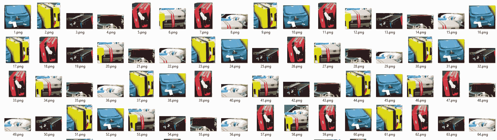

# 使用 Ultralytics YOLOv8 进行对象裁剪

> 原文：[`docs.ultralytics.com/guides/object-cropping/`](https://docs.ultralytics.com/guides/object-cropping/)

## 什么是对象裁剪？

使用[Ultralytics YOLOv8](https://github.com/ultralytics/ultralytics/)进行对象裁剪涉及从图像或视频中隔离和提取特定检测到的对象。 YOLOv8 模型的能力被用来准确识别和描绘对象，实现精确裁剪以供进一步分析或操作。

[`www.youtube.com/embed/ydGdibB5Mds`](https://www.youtube.com/embed/ydGdibB5Mds)

**注意:** 使用 Ultralytics YOLOv8 进行对象裁剪

## 对象裁剪的优势？

+   **重点分析**: YOLOv8 支持针对对象的目标裁剪，允许深入检查或处理场景中的个体项目。

+   **减少数据量**: 通过仅提取相关对象，对象裁剪有助于最小化数据大小，使其在存储、传输或后续计算任务中更为高效。

+   **增强精度**: YOLOv8 的目标检测精度确保裁剪后的对象保持它们的空间关系，保留视觉信息的完整性，以进行详细分析。

## 视觉

| 机场行李 |
| --- |
|  |
| 使用 Ultralytics YOLOv8 在机场行李传送带上裁剪手提箱 |

使用 YOLOv8 进行对象裁剪的示例

```py
import os

import cv2

from ultralytics import YOLO
from ultralytics.utils.plotting import Annotator, colors

model = YOLO("yolov8n.pt")
names = model.names

cap = cv2.VideoCapture("path/to/video/file.mp4")
assert cap.isOpened(), "Error reading video file"
w, h, fps = (int(cap.get(x)) for x in (cv2.CAP_PROP_FRAME_WIDTH, cv2.CAP_PROP_FRAME_HEIGHT, cv2.CAP_PROP_FPS))

crop_dir_name = "ultralytics_crop"
if not os.path.exists(crop_dir_name):
    os.mkdir(crop_dir_name)

# Video writer
video_writer = cv2.VideoWriter("object_cropping_output.avi", cv2.VideoWriter_fourcc(*"mp4v"), fps, (w, h))

idx = 0
while cap.isOpened():
    success, im0 = cap.read()
    if not success:
        print("Video frame is empty or video processing has been successfully completed.")
        break

    results = model.predict(im0, show=False)
    boxes = results[0].boxes.xyxy.cpu().tolist()
    clss = results[0].boxes.cls.cpu().tolist()
    annotator = Annotator(im0, line_width=2, example=names)

    if boxes is not None:
        for box, cls in zip(boxes, clss):
            idx += 1
            annotator.box_label(box, color=colors(int(cls), True), label=names[int(cls)])

            crop_obj = im0[int(box[1]) : int(box[3]), int(box[0]) : int(box[2])]

            cv2.imwrite(os.path.join(crop_dir_name, str(idx) + ".png"), crop_obj)

    cv2.imshow("ultralytics", im0)
    video_writer.write(im0)

    if cv2.waitKey(1) & 0xFF == ord("q"):
        break

cap.release()
video_writer.release()
cv2.destroyAllWindows() 
```

### 参数 `model.predict`

| 参数 | 类型 | 默认 | 描述 |
| --- | --- | --- | --- |
| `source` | `str` | `'ultralytics/assets'` | 指定推断的数据源。可以是图像路径、视频文件、目录、URL 或设备 ID 用于实时数据源。支持多种格式和来源，适用于不同类型的输入。 |
| `conf` | `float` | `0.25` | 设置检测的最小置信度阈值。置信度低于此阈值的检测对象将被忽略。调整此值有助于减少误报。 |
| `iou` | `float` | `0.7` | 非极大值抑制（NMS）的交并比（IoU）阈值。较低的值通过消除重叠框来减少检测，有助于减少重复检测。 |
| `imgsz` | `int 或 tuple` | `640` | 定义推断的图像大小。可以是单个整数 `640` 用于方形调整，或 (height, width) 元组。适当的大小可以提高检测的准确性和处理速度。 |
| `half` | `bool` | `False` | 启用半精度（FP16）推断，可在支持的 GPU 上加速模型推断，对准确性影响较小。 |
| `device` | `str` | `None` | 指定推断的设备（例如 `cpu`、`cuda:0` 或 `0`）。允许用户选择在 CPU、特定 GPU 或其他计算设备上执行模型。 |
| `max_det` | `int` | `300` | 每个图像允许的最大检测数。限制模型单次推理中可以检测到的对象总数，防止在密集场景中产生过多输出。 |
| `vid_stride` | `int` | `1` | 视频输入的帧跨度。允许在视频中跳过帧以加快处理速度，但会牺牲时间分辨率。值为 1 表示处理每一帧，更高的值会跳过帧。 |
| `stream_buffer` | `bool` | `False` | 确定处理视频流时是否应缓冲所有帧（`True`），还是模型应返回最新的帧（`False`）。对实时应用非常有用。 |
| `visualize` | `bool` | `False` | 在推理期间激活模型特征的可视化，提供对模型“看到”内容的洞察。用于调试和模型解释非常有用。 |
| `augment` | `bool` | `False` | 启用测试时增强（TTA）以进行预测，可能会提高检测的鲁棒性，但会降低推理速度。 |
| `agnostic_nms` | `bool` | `False` | 启用无类别非极大值抑制（NMS），合并不同类别之间重叠的框。在多类检测场景中，当类别重叠时非常有用。 |
| `classes` | `list[int]` | `None` | 将预测过滤到一组类别 ID。只返回属于指定类别的检测结果。在多类检测任务中专注于相关对象非常有用。 |
| `retina_masks` | `bool` | `False` | 如果模型可用，则使用高分辨率分割掩码。这可以增强分割任务中的掩码质量，提供更细致的细节。 |
| `embed` | `list[int]` | `None` | 指定要从中提取特征向量或嵌入的层。对于后续的聚类或相似性搜索等任务非常有用。 |

## 常见问题

### Ultralytics YOLOv8 中的对象裁剪是什么，它如何工作？

使用 [Ultralytics YOLOv8](https://github.com/ultralytics/ultralytics) 进行对象裁剪涉及根据 YOLOv8 的检测能力从图像或视频中隔离和提取特定对象。这一过程通过利用 YOLOv8 高精度地识别和相应地裁剪对象，允许进行专注分析、减少数据量并提升精度。详细教程请参阅对象裁剪示例。

### 为什么应该使用 Ultralytics YOLOv8 进行对象裁剪，而不是其他解决方案？

Ultralytics YOLOv8 以其精确性、速度和易用性脱颖而出。它允许详细和准确的对象检测和裁剪，对于需要高数据完整性的专注分析和应用至关重要。此外，YOLOv8 与 OpenVINO 和 TensorRT 等工具无缝集成，适用于需要实时能力和多样硬件优化的部署。在模型导出指南中探索其优势。

### 如何使用对象裁剪减少数据集的数据量？

使用 Ultralytics YOLOv8 仅裁剪图像或视频中相关的对象，可以显著减少数据大小，使其在存储和处理上更高效。该过程涉及训练模型以检测特定对象，然后使用结果仅裁剪并保存这些部分。有关利用 Ultralytics YOLOv8 功能的更多信息，请访问我们的快速入门指南。

### 可以使用 Ultralytics YOLOv8 进行实时视频分析和对象裁剪吗？

是的，Ultralytics YOLOv8 可以处理实时视频流，动态检测和裁剪对象。该模型的高速推理能力使其非常适合实时应用，例如监控、体育分析和自动检验系统。查看跟踪和预测模式，了解如何实现实时处理。

### 有效运行 YOLOv8 进行对象裁剪的硬件要求是什么？

Ultralytics YOLOv8 经过优化，适用于 CPU 和 GPU 环境，但为了实现最佳性能，尤其是实时或高负载推理，建议使用专用 GPU（例如 NVIDIA Tesla、RTX 系列）。对于在轻量设备上部署，请考虑在 iOS 上使用 CoreML 或在 Android 上使用 TFLite。有关支持的设备和格式的详细信息，请查看我们的模型部署选项。
