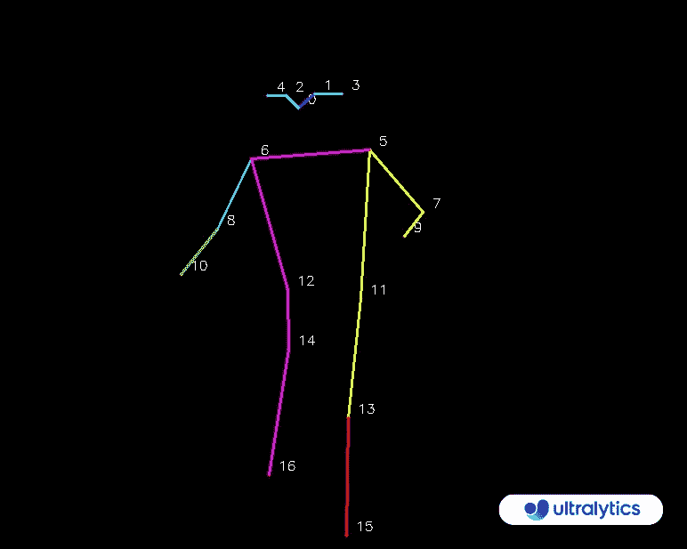

# 使用 Ultralytics YOLOv8 进行训练监控

> 原文：[`docs.ultralytics.com/guides/workouts-monitoring/`](https://docs.ultralytics.com/guides/workouts-monitoring/)

通过姿势估计监控训练，使用[Ultralytics YOLOv8](https://github.com/ultralytics/ultralytics/)准确跟踪关键身体标志和关节，实时提供运动形式反馈，跟踪训练路线并测量性能指标，优化用户和训练师的训练会话。

[`www.youtube.com/embed/LGGxqLZtvuw`](https://www.youtube.com/embed/LGGxqLZtvuw)

**Watch:** 使用 Ultralytics YOLOv8 进行训练监控 | 俯卧撑、引体向上、腹部训练

## 训练监控的优势？

+   **优化性能:** 根据监控数据调整训练，以获得更好的效果。

+   **目标达成:** 跟踪和调整健身目标，实现可量化的进展。

+   **个性化:** 根据个人数据定制训练计划，以提高效果。

+   **健康意识:** 提前发现指示健康问题或过度训练的模式。

+   **理性决策:** 基于数据的决策，调整日常训练并设定实际目标。

## 现实世界的应用

| 训练监控 | 训练监控 |
| --- | --- |
|  |  |
| 俯卧撑计数 | 引体向上计数 |

训练监控示例

```py
`import cv2  from ultralytics import YOLO, solutions  model = YOLO("yolov8n-pose.pt") cap = cv2.VideoCapture("path/to/video/file.mp4") assert cap.isOpened(), "Error reading video file" w, h, fps = (int(cap.get(x)) for x in (cv2.CAP_PROP_FRAME_WIDTH, cv2.CAP_PROP_FRAME_HEIGHT, cv2.CAP_PROP_FPS))  gym_object = solutions.AIGym(     line_thickness=2,     view_img=True,     pose_type="pushup",     kpts_to_check=[6, 8, 10], )  while cap.isOpened():     success, im0 = cap.read()     if not success:         print("Video frame is empty or video processing has been successfully completed.")         break     results = model.track(im0, verbose=False)  # Tracking recommended     # results = model.predict(im0)  # Prediction also supported     im0 = gym_object.start_counting(im0, results)  cv2.destroyAllWindows()` 
```

```py
`import cv2  from ultralytics import YOLO, solutions  model = YOLO("yolov8n-pose.pt") cap = cv2.VideoCapture("path/to/video/file.mp4") assert cap.isOpened(), "Error reading video file" w, h, fps = (int(cap.get(x)) for x in (cv2.CAP_PROP_FRAME_WIDTH, cv2.CAP_PROP_FRAME_HEIGHT, cv2.CAP_PROP_FPS))  video_writer = cv2.VideoWriter("workouts.avi", cv2.VideoWriter_fourcc(*"mp4v"), fps, (w, h))  gym_object = solutions.AIGym(     line_thickness=2,     view_img=True,     pose_type="pushup",     kpts_to_check=[6, 8, 10], )  while cap.isOpened():     success, im0 = cap.read()     if not success:         print("Video frame is empty or video processing has been successfully completed.")         break     results = model.track(im0, verbose=False)  # Tracking recommended     # results = model.predict(im0)  # Prediction also supported     im0 = gym_object.start_counting(im0, results)     video_writer.write(im0)  cv2.destroyAllWindows() video_writer.release()` 
```

<details class="tip" open="open"><summary>支持</summary>

支持"pushup"、"pullup"和"abworkout"</details>

### 关键点映射



### `AIGym`参数

| 名称 | 类型 | 默认 | 描述 |
| --- | --- | --- | --- |
| `kpts_to_check` | `list` | `None` | 三个关键点索引的列表，用于计算特定训练，后跟关键点映射 |
| `line_thickness` | `int` | `2` | 绘制线条的粗细。 |
| `view_img` | `bool` | `False` | 是否显示图像的标志。 |
| `pose_up_angle` | `float` | `145.0` | '上'姿势的角度阈值。 |
| `pose_down_angle` | `float` | `90.0` | '下'姿势的角度阈值。 |
| `pose_type` | `str` | `pullup` | 要检测的姿势类型（'pullup'，'pushup'，'abworkout'，'squat'）。 |

### `model.predict`参数

| 名称 | 类型 | 默认 | 描述 |
| --- | --- | --- | --- |
| `source` | `str` | `'ultralytics/assets'` | 图像或视频的源目录。 |
| `conf` | `float` | `0.25` | 检测的对象置信度阈值。 |
| `iou` | `float` | `0.7` | NMS（非极大值抑制）的交并比阈值。 |
| `imgsz` | `int or tuple` | `640` | 图像大小，可以是标量或(h, w)列表，例如(640, 480) |
| `half` | `bool` | `False` | 使用半精度（FP16）。 |
| `device` | `None or str` | `None` | 运行设备，例如 cuda 设备=0/1/2/3 或 device=cpu |
| `max_det` | `int` | `300` | 每张图像的最大检测数。 |
| `vid_stride` | `bool` | `False` | 视频帧率跨度 |
| `stream_buffer` | `bool` | `False` | 缓冲所有流帧（True）或返回最近的帧（False） |
| `visualize` | `bool` | `False` | 可视化模型特征 |
| `augment` | `bool` | `False` | 对预测源应用图像增强 |
| `agnostic_nms` | `bool` | `False` | 类别不可知的 NMS |
| `classes` | `list[int]` | `None` | 按类过滤结果，例如 classes=0，或 classes=[0,2,3] |
| `retina_masks` | `bool` | `False` | 使用高分辨率分割掩模 |
| `embed` | `list[int]` | `None` | 从给定层返回特征向量/嵌入 |

### 参数`model.track`

| 名称 | 类型 | 默认值 | 描述 |
| --- | --- | --- | --- |
| `source` | `im0` | `None` | 图像或视频的源目录 |
| `persist` | `bool` | `False` | 在帧之间持续跟踪轨迹 |
| `tracker` | `str` | `botsort.yaml` | 跟踪方法为'bytetrack'或'botsort' |
| `conf` | `float` | `0.3` | 置信阈值 |
| `iou` | `float` | `0.5` | IOU 阈值 |
| `classes` | `list` | `None` | 按类过滤结果，例如 classes=0，或 classes=[0,2,3] |
| `verbose` | `bool` | `True` | 显示对象跟踪结果 |

## 常见问题解答

### 如何使用 Ultralytics YOLOv8 监控我的锻炼？

要使用 Ultralytics YOLOv8 监控您的锻炼，您可以利用姿势估计能力实时跟踪和分析关键身体标志物和关节。这使您可以即时获得有关您的锻炼形式、计数重复次数和测量性能指标的反馈。您可以从提供的示例代码开始进行俯卧撑、引体向上或腹部训练，如下所示：

```py
`import cv2  from ultralytics import YOLO, solutions  model = YOLO("yolov8n-pose.pt") cap = cv2.VideoCapture("path/to/video/file.mp4") assert cap.isOpened(), "Error reading video file" w, h, fps = (int(cap.get(x)) for x in (cv2.CAP_PROP_FRAME_WIDTH, cv2.CAP_PROP_FRAME_HEIGHT, cv2.CAP_PROP_FPS))  gym_object = solutions.AIGym(     line_thickness=2,     view_img=True,     pose_type="pushup",     kpts_to_check=[6, 8, 10], )  while cap.isOpened():     success, im0 = cap.read()     if not success:         print("Video frame is empty or video processing has been successfully completed.")         break     results = model.track(im0, verbose=False)     im0 = gym_object.start_counting(im0, results)  cv2.destroyAllWindows()` 
```

欲了解更多定制和设置，请参阅文档中的 AIGym 部分。

### 使用 Ultralytics YOLOv8 进行锻炼监控的好处是什么？

使用 Ultralytics YOLOv8 监控锻炼带来了几个关键的好处：

+   **优化性能：** 通过根据监控数据调整训练，您可以获得更好的结果。

+   **目标实现：** 轻松跟踪并调整适合度目标，实现可衡量的进步。

+   **个性化：** 基于个人数据为您量身定制的锻炼计划，以实现最佳效果。

+   **健康意识：** 提前发现指示潜在健康问题或过度训练的模式。

+   **明智的决策：** 基于数据做出决策，调整日常训练并设定实际目标。

您可以观看一个[YouTube 视频演示](https://www.youtube.com/watch?v=LGGxqLZtvuw)来看到这些优点的实际效果。

### Ultralytics YOLOv8 在检测和跟踪锻炼方面的准确性如何？

由于其先进的姿势估计能力，Ultralytics YOLOv8 在检测和跟踪锻炼方面具有高度准确性。它能准确跟踪关键的身体标志和关节，提供关于锻炼形式和性能指标的实时反馈。该模型的预训练权重和强大的架构确保高精度和可靠性。有关实际示例，请查看文档中的实际应用部分，展示俯卧撑和引体向上的计数。

### 我可以使用 Ultralytics YOLOv8 进行自定义的锻炼例程吗？

是的，Ultralytics YOLOv8 可以适应自定义的锻炼例程。`AIGym`类支持不同的姿势类型，如“俯卧撑”、“引体向上”和“腹部锻炼”。您可以指定关键点和角度以检测特定的锻炼动作。以下是一个示例设置：

```py
`from ultralytics import solutions  gym_object = solutions.AIGym(     line_thickness=2,     view_img=True,     pose_type="squat",     kpts_to_check=[6, 8, 10], )` 
```

关于设置参数的详细信息，请参阅参数`AIGym`部分。这种灵活性使您能够监控各种锻炼并根据需要定制例程。

### 如何使用 Ultralytics YOLOv8 保存训练监控输出？

要保存训练监控输出，您可以修改代码以包含保存处理帧的视频写入器。以下是一个示例：

```py
`import cv2  from ultralytics import YOLO, solutions  model = YOLO("yolov8n-pose.pt") cap = cv2.VideoCapture("path/to/video/file.mp4") assert cap.isOpened(), "Error reading video file" w, h, fps = (int(cap.get(x)) for x in (cv2.CAP_PROP_FRAME_WIDTH, cv2.CAP_PROP_FRAME_HEIGHT, cv2.CAP_PROP_FPS))  video_writer = cv2.VideoWriter("workouts.avi", cv2.VideoWriter_fourcc(*"mp4v"), fps, (w, h))  gym_object = solutions.AIGym(     line_thickness=2,     view_img=True,     pose_type="pushup",     kpts_to_check=[6, 8, 10], )  while cap.isOpened():     success, im0 = cap.read()     if not success:         print("Video frame is empty or video processing has been successfully completed.")         break     results = model.track(im0, verbose=False)     im0 = gym_object.start_counting(im0, results)     video_writer.write(im0)  cv2.destroyAllWindows() video_writer.release()` 
```

这个设置将监控视频写入输出文件。有关详细信息，请参阅保存输出的训练监控部分。
