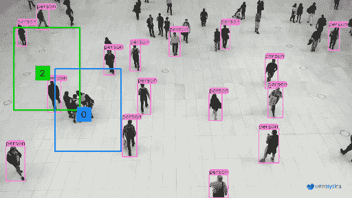
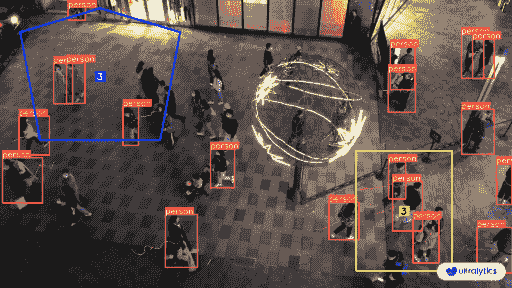

# 使用 Ultralytics YOLOv8 进行不同区域的对象计数 🚀

> 原文：[`docs.ultralytics.com/guides/region-counting/`](https://docs.ultralytics.com/guides/region-counting/)

## 什么是区域内对象计数？

使用[Ultralytics YOLOv8](https://github.com/ultralytics/ultralytics/)在区域内进行对象计数，通过先进的计算机视觉精确确定指定区域内的对象数量。这种方法对于优化流程、增强安全性以及提高各种应用程序的效率具有重要价值。

[`www.youtube.com/embed/okItf1iHlV8`](https://www.youtube.com/embed/okItf1iHlV8)

**观看：** Ultralytics YOLOv8 多个可移动区域中的对象计数

## 区域内对象计数的优势？

+   **精确度和准确性：** 高级计算机视觉中的区域内对象计数确保了精确和准确的计数，最大限度地减少了手动计数常见的误差。

+   **效率提升：** 自动化对象计数提高了操作效率，提供实时结果，并简化了不同应用程序中的流程。

+   **多功能和应用：** 区域内对象计数的多功能性使其适用于各种领域，从制造和监控到交通监测，为其广泛的实用性和效果做出贡献。

## 现实世界的应用

| 零售 | 市场街道 |
| --- | --- |
|  |  |
| 使用 Ultralytics YOLOv8 在不同区域进行人数计数 | 使用 Ultralytics YOLOv8 在不同区域进行群体计数 |

## 运行步骤

### 步骤 1：安装所需的库

首先克隆 Ultralytics 存储库，安装依赖项，并使用步骤 2 中提供的命令导航到本地目录。

```py
`# Clone Ultralytics repo git  clone  https://github.com/ultralytics/ultralytics  # Navigate to the local directory cd  ultralytics/examples/YOLOv8-Region-Counter` 
```

### 步骤 2：使用 Ultralytics YOLOv8 运行区域计数

执行以下基本命令进行推断。

<details class="tip" open="open"><summary>区域是可移动的</summary>

在视频播放期间，您可以通过单击并拖动左键来交互地移动视频中的区域。</details>

```py
`# Save results python  yolov8_region_counter.py  --source  "path/to/video.mp4"  --save-img  # Run model on CPU python  yolov8_region_counter.py  --source  "path/to/video.mp4"  --device  cpu  # Change model file python  yolov8_region_counter.py  --source  "path/to/video.mp4"  --weights  "path/to/model.pt"  # Detect specific classes (e.g., first and third classes) python  yolov8_region_counter.py  --source  "path/to/video.mp4"  --classes  0  2  # View results without saving python  yolov8_region_counter.py  --source  "path/to/video.mp4"  --view-img` 
```

### 可选参数

| 名称 | 类型 | 默认 | 描述 |
| --- | --- | --- | --- |
| `--source` | `str` | `None` | 视频文件路径，例如 Webcam 0 |
| `--line_thickness` | `int` | `2` | 边界框粗细 |
| `--save-img` | `bool` | `False` | 保存预测的视频/图像 |
| `--weights` | `str` | `yolov8n.pt` | 权重文件路径 |
| `--classes` | `list` | `None` | 检测特定类别，例如 --classes 0 2 |
| `--region-thickness` | `int` | `2` | 区域框粗细 |
| `--track-thickness` | `int` | `2` | 跟踪线条粗细 |

## 常见问题解答

### 什么是使用 Ultralytics YOLOv8 在指定区域进行对象计数？

使用[Ultralytics YOLOv8](https://github.com/ultralytics/ultralytics)进行指定区域内的物体计数涉及使用先进的计算机视觉技术检测和统计定义区域内物体的数量。这种精确的方法提高了制造业、监控和交通监测等各种应用的效率和准确性。

### 如何使用 Ultralytics YOLOv8 运行物体计数脚本？

按照以下步骤运行 Ultralytics YOLOv8 中的物体计数：

1.  克隆 Ultralytics 存储库并导航至目录：

    ```py
    `git  clone  https://github.com/ultralytics/ultralytics cd  ultralytics/examples/YOLOv8-Region-Counter` 
    ```

1.  执行区域计数脚本：

    ```py
    `python  yolov8_region_counter.py  --source  "path/to/video.mp4"  --save-img` 
    ```

欲了解更多选项，请访问运行区域计数部分。

### 为什么应该在区域内使用 Ultralytics YOLOv8 进行物体计数？

使用 Ultralytics YOLOv8 进行区域内物体计数具有多个优势：

+   **精确性和准确性：** 减少手动计数中常见的错误。

+   **效率提升：** 提供实时结果并简化流程。

+   **多功能性和应用：** 适用于各个领域，增强其实用性。

在优势部分探索更深层次的好处。

### 在视频播放过程中是否可以调整定义的区域？

是的，使用 Ultralytics YOLOv8，可以在视频播放过程中交互地移动区域。只需使用鼠标左键单击和拖动即可重新定位区域。此功能增强了动态环境的灵活性。在可移动区域的提示部分了解更多信息。

### 区域内物体计数的一些真实应用是什么？

使用 Ultralytics YOLOv8 进行物体计数可以应用于许多现实场景：

+   **零售：** 用于人流量分析的人员计数。

+   **市场街道：** 人群密度管理。

在实际应用部分探索更多示例。
