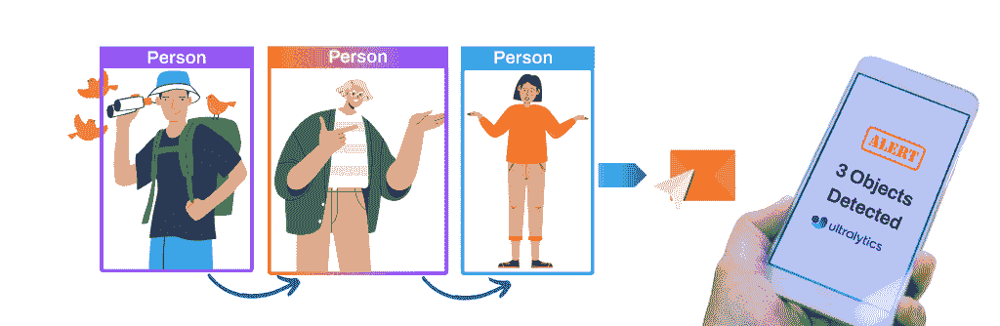
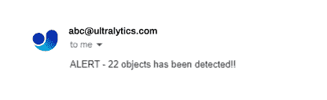

# 使用 Ultralytics YOLOv8 的安全警报系统项目

> 原文：[`docs.ultralytics.com/guides/security-alarm-system/`](https://docs.ultralytics.com/guides/security-alarm-system/)



使用 Ultralytics YOLOv8 的安全警报系统项目集成了先进的计算机视觉能力，以增强安全措施。Ultralytics 开发的 YOLOv8 提供实时对象检测，使系统能够及时识别和应对潜在的安全威胁。该项目提供了几个优势：

+   **实时检测：** YOLOv8 的效率使安全警报系统能够实时检测和响应安全事件，最大限度地减少响应时间。

+   **准确性：** YOLOv8 以其在对象检测中的准确性而闻名，减少误报，提高安全警报系统的可靠性。

+   **集成能力：** 该项目可以无缝集成到现有的安全基础设施中，提供一层升级的智能监控。

[`www.youtube.com/embed/_1CmwUzoxY4`](https://www.youtube.com/embed/_1CmwUzoxY4)

**观看：** 使用 Ultralytics YOLOv8 对象检测的安全警报系统项目

### 代码

#### 设置消息的参数

<details class="tip" open="open"><summary>注意</summary>

应用程序密码生成是必要的</details>

+   转到[应用程序密码生成器](https://myaccount.google.com/apppasswords)，指定一个如“安全项目”之类的应用程序名称，并获取一个 16 位密码。将此密码复制并按照指示粘贴到指定的密码字段中。

```py
`password = "" from_email = ""  # must match the email used to generate the password to_email = ""  # receiver email` 
```

#### 服务器创建和身份验证

```py
`import smtplib  server = smtplib.SMTP("smtp.gmail.com: 587") server.starttls() server.login(from_email, password)` 
```

#### 电子邮件发送功能

```py
`from email.mime.multipart import MIMEMultipart from email.mime.text import MIMEText   def send_email(to_email, from_email, object_detected=1):   """Sends an email notification indicating the number of objects detected; defaults to 1 object."""     message = MIMEMultipart()     message["From"] = from_email     message["To"] = to_email     message["Subject"] = "Security Alert"     # Add in the message body     message_body = f"ALERT - {object_detected} objects has been detected!!"      message.attach(MIMEText(message_body, "plain"))     server.sendmail(from_email, to_email, message.as_string())` 
```

#### 对象检测和警报发送器

```py
``from time import time  import cv2 import torch  from ultralytics import YOLO from ultralytics.utils.plotting import Annotator, colors   class ObjectDetection:     def __init__(self, capture_index):   """Initializes an ObjectDetection instance with a given camera index."""         self.capture_index = capture_index         self.email_sent = False          # model information         self.model = YOLO("yolov8n.pt")          # visual information         self.annotator = None         self.start_time = 0         self.end_time = 0          # device information         self.device = "cuda" if torch.cuda.is_available() else "cpu"      def predict(self, im0):   """Run prediction using a YOLO model for the input image `im0`."""         results = self.model(im0)         return results      def display_fps(self, im0):   """Displays the FPS on an image `im0` by calculating and overlaying as white text on a black rectangle."""         self.end_time = time()         fps = 1 / round(self.end_time - self.start_time, 2)         text = f"FPS: {int(fps)}"         text_size = cv2.getTextSize(text, cv2.FONT_HERSHEY_SIMPLEX, 1.0, 2)[0]         gap = 10         cv2.rectangle(             im0,             (20 - gap, 70 - text_size[1] - gap),             (20 + text_size[0] + gap, 70 + gap),             (255, 255, 255),             -1,         )         cv2.putText(im0, text, (20, 70), cv2.FONT_HERSHEY_SIMPLEX, 1.0, (0, 0, 0), 2)      def plot_bboxes(self, results, im0):   """Plots bounding boxes on an image given detection results; returns annotated image and class IDs."""         class_ids = []         self.annotator = Annotator(im0, 3, results[0].names)         boxes = results[0].boxes.xyxy.cpu()         clss = results[0].boxes.cls.cpu().tolist()         names = results[0].names         for box, cls in zip(boxes, clss):             class_ids.append(cls)             self.annotator.box_label(box, label=names[int(cls)], color=colors(int(cls), True))         return im0, class_ids      def __call__(self):   """Run object detection on video frames from a camera stream, plotting and showing the results."""         cap = cv2.VideoCapture(self.capture_index)         assert cap.isOpened()         cap.set(cv2.CAP_PROP_FRAME_WIDTH, 640)         cap.set(cv2.CAP_PROP_FRAME_HEIGHT, 480)         frame_count = 0         while True:             self.start_time = time()             ret, im0 = cap.read()             assert ret             results = self.predict(im0)             im0, class_ids = self.plot_bboxes(results, im0)              if len(class_ids) > 0:  # Only send email If not sent before                 if not self.email_sent:                     send_email(to_email, from_email, len(class_ids))                     self.email_sent = True             else:                 self.email_sent = False              self.display_fps(im0)             cv2.imshow("YOLOv8 Detection", im0)             frame_count += 1             if cv2.waitKey(5) & 0xFF == 27:                 break         cap.release()         cv2.destroyAllWindows()         server.quit()`` 
```

#### 调用对象检测类并运行推断

```py
`detector = ObjectDetection(capture_index=0) detector()` 
```

就是这样！当您执行该代码时，如果检测到任何对象，您将在电子邮件中收到单个通知。通知会立即发送，不会重复。但是，可以根据项目需求自由定制代码。

#### 收到的电子邮件示例



## 常见问题解答

### Ultralytics YOLOv8 如何提高安全警报系统的准确性？

Ultralytics YOLOv8 通过提供高精度、实时的对象检测来增强安全警报系统。其先进的算法显著降低误报率，确保系统只对真正的威胁做出响应。这种增强的可靠性可以无缝集成到现有的安全基础设施中，提升整体监控质量。

### 我能将 Ultralytics YOLOv8 与现有的安全基础设施集成吗？

是的，Ultralytics YOLOv8 可以与您现有的安全基础设施无缝集成。该系统支持多种模式，并提供定制的灵活性，使您能够通过先进的目标检测能力增强现有设置。有关在您的项目中集成 YOLOv8 的详细说明，请访问[集成部分](https://docs.ultralytics.com/integrations/)。

### 运行 Ultralytics YOLOv8 的存储要求是什么？

在标准配置下运行 Ultralytics YOLOv8 通常需要大约 5GB 的可用磁盘空间。这包括存储 YOLOv8 模型和任何额外依赖项的空间。对于基于云的解决方案，Ultralytics HUB 提供高效的项目管理和数据集处理，可以优化存储需求。了解更多关于 Pro Plan 的信息，以获取包括扩展存储在内的增强功能。

### Ultralytics YOLOv8 与其他目标检测模型如 Faster R-CNN 或 SSD 有什么不同？

Ultralytics YOLOv8 在实时检测能力和更高准确性方面优于 Faster R-CNN 或 SSD 等模型。其独特的架构使其能够在不妥协精度的情况下更快地处理图像，非常适合时间敏感的应用，如安全报警系统。有关目标检测模型的全面比较，您可以查看我们的[指南](https://docs.ultralytics.com/models)。

### 如何使用 Ultralytics YOLOv8 减少我安全系统中的误报频率？

为了减少误报，请确保您的 Ultralytics YOLOv8 模型经过充分训练，使用多样化且标注良好的数据集。微调超参数并定期用新数据更新模型可以显著提高检测准确性。有关详细的超参数调优技术，请参阅我们的超参数调优指南。
