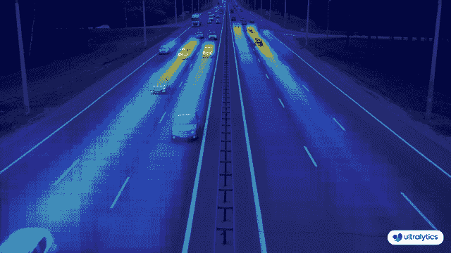
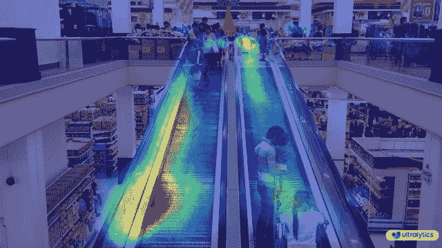

# 高级数据可视化：使用 Ultralytics YOLOv8 的热力图 🚀

> 原文：[`docs.ultralytics.com/guides/heatmaps/`](https://docs.ultralytics.com/guides/heatmaps/)

## 热力图简介

使用 [Ultralytics YOLOv8](https://github.com/ultralytics/ultralytics/) 生成的热力图将复杂数据转化为生动的、颜色编码的矩阵。这个视觉工具使用一系列颜色来表示不同的数据值，其中较暖的色调表示较高的强度，而较冷的色调则表示较低的值。热力图在可视化复杂的数据模式、相关性和异常方面表现出色，为各个领域的数据解读提供了一种易于接触和引人入胜的方法。

[`www.youtube.com/embed/4ezde5-nZZw`](https://www.youtube.com/embed/4ezde5-nZZw)

**观看：** 使用 Ultralytics YOLOv8 的热力图

## 为什么选择热力图进行数据分析？ 

+   **直观的数据分布可视化：** 热力图简化了数据集中和分布的理解，将复杂的数据集转换为易于理解的视觉格式。

+   **高效的模式检测：** 通过以热力图格式可视化数据，更容易发现趋势、聚类和异常值，从而促进更快的分析和洞察。

+   **增强的空间分析和决策制定：** 热力图在说明空间关系方面发挥着重要作用，帮助在商业智能、环境研究和城市规划等领域的决策过程中。

## 现实世界的应用

| 交通 | 零售 |
| --- | --- |
|  |  |
| Ultralytics YOLOv8 交通热力图 | Ultralytics YOLOv8 零售热力图 |

热力图配置

+   `heatmap_alpha`：确保该值在 (0.0 - 1.0) 范围内。

+   `decay_factor`：用于在物体不再出现在画面中时移除热力图，其值应在 (0.0 - 1.0) 范围内。

使用 Ultralytics YOLOv8 的热力图示例

```py
`import cv2  from ultralytics import YOLO, solutions  model = YOLO("yolov8n.pt") cap = cv2.VideoCapture("path/to/video/file.mp4") assert cap.isOpened(), "Error reading video file" w, h, fps = (int(cap.get(x)) for x in (cv2.CAP_PROP_FRAME_WIDTH, cv2.CAP_PROP_FRAME_HEIGHT, cv2.CAP_PROP_FPS))  # Video writer video_writer = cv2.VideoWriter("heatmap_output.avi", cv2.VideoWriter_fourcc(*"mp4v"), fps, (w, h))  # Init heatmap heatmap_obj = solutions.Heatmap(     colormap=cv2.COLORMAP_PARULA,     view_img=True,     shape="circle",     names=model.names, )  while cap.isOpened():     success, im0 = cap.read()     if not success:         print("Video frame is empty or video processing has been successfully completed.")         break     tracks = model.track(im0, persist=True, show=False)      im0 = heatmap_obj.generate_heatmap(im0, tracks)     video_writer.write(im0)  cap.release() video_writer.release() cv2.destroyAllWindows()` 
```

```py
`import cv2  from ultralytics import YOLO, solutions  model = YOLO("yolov8n.pt") cap = cv2.VideoCapture("path/to/video/file.mp4") assert cap.isOpened(), "Error reading video file" w, h, fps = (int(cap.get(x)) for x in (cv2.CAP_PROP_FRAME_WIDTH, cv2.CAP_PROP_FRAME_HEIGHT, cv2.CAP_PROP_FPS))  # Video writer video_writer = cv2.VideoWriter("heatmap_output.avi", cv2.VideoWriter_fourcc(*"mp4v"), fps, (w, h))  line_points = [(20, 400), (1080, 404)]  # line for object counting  # Init heatmap heatmap_obj = solutions.Heatmap(     colormap=cv2.COLORMAP_PARULA,     view_img=True,     shape="circle",     count_reg_pts=line_points,     names=model.names, )  while cap.isOpened():     success, im0 = cap.read()     if not success:         print("Video frame is empty or video processing has been successfully completed.")         break      tracks = model.track(im0, persist=True, show=False)     im0 = heatmap_obj.generate_heatmap(im0, tracks)     video_writer.write(im0)  cap.release() video_writer.release() cv2.destroyAllWindows()` 
```

```py
`import cv2  from ultralytics import YOLO, solutions  model = YOLO("yolov8n.pt") cap = cv2.VideoCapture("path/to/video/file.mp4") assert cap.isOpened(), "Error reading video file" w, h, fps = (int(cap.get(x)) for x in (cv2.CAP_PROP_FRAME_WIDTH, cv2.CAP_PROP_FRAME_HEIGHT, cv2.CAP_PROP_FPS))  # Video writer video_writer = cv2.VideoWriter("heatmap_output.avi", cv2.VideoWriter_fourcc(*"mp4v"), fps, (w, h))  # Define polygon points region_points = [(20, 400), (1080, 404), (1080, 360), (20, 360), (20, 400)]  # Init heatmap heatmap_obj = solutions.Heatmap(     colormap=cv2.COLORMAP_PARULA,     view_img=True,     shape="circle",     count_reg_pts=region_points,     names=model.names, )  while cap.isOpened():     success, im0 = cap.read()     if not success:         print("Video frame is empty or video processing has been successfully completed.")         break      tracks = model.track(im0, persist=True, show=False)     im0 = heatmap_obj.generate_heatmap(im0, tracks)     video_writer.write(im0)  cap.release() video_writer.release() cv2.destroyAllWindows()` 
```

```py
`import cv2  from ultralytics import YOLO, solutions  model = YOLO("yolov8n.pt") cap = cv2.VideoCapture("path/to/video/file.mp4") assert cap.isOpened(), "Error reading video file" w, h, fps = (int(cap.get(x)) for x in (cv2.CAP_PROP_FRAME_WIDTH, cv2.CAP_PROP_FRAME_HEIGHT, cv2.CAP_PROP_FPS))  # Video writer video_writer = cv2.VideoWriter("heatmap_output.avi", cv2.VideoWriter_fourcc(*"mp4v"), fps, (w, h))  # Define region points region_points = [(20, 400), (1080, 404), (1080, 360), (20, 360)]  # Init heatmap heatmap_obj = solutions.Heatmap(     colormap=cv2.COLORMAP_PARULA,     view_img=True,     shape="circle",     count_reg_pts=region_points,     names=model.names, )  while cap.isOpened():     success, im0 = cap.read()     if not success:         print("Video frame is empty or video processing has been successfully completed.")         break      tracks = model.track(im0, persist=True, show=False)     im0 = heatmap_obj.generate_heatmap(im0, tracks)     video_writer.write(im0)  cap.release() video_writer.release() cv2.destroyAllWindows()` 
```

```py
`import cv2  from ultralytics import YOLO, solutions  model = YOLO("yolov8s.pt")  # YOLOv8 custom/pretrained model  im0 = cv2.imread("path/to/image.png")  # path to image file h, w = im0.shape[:2]  # image height and width  # Heatmap Init heatmap_obj = solutions.Heatmap(     colormap=cv2.COLORMAP_PARULA,     view_img=True,     shape="circle",     names=model.names, )  results = model.track(im0, persist=True) im0 = heatmap_obj.generate_heatmap(im0, tracks=results) cv2.imwrite("ultralytics_output.png", im0)` 
```

```py
`import cv2  from ultralytics import YOLO, solutions  model = YOLO("yolov8n.pt") cap = cv2.VideoCapture("path/to/video/file.mp4") assert cap.isOpened(), "Error reading video file" w, h, fps = (int(cap.get(x)) for x in (cv2.CAP_PROP_FRAME_WIDTH, cv2.CAP_PROP_FRAME_HEIGHT, cv2.CAP_PROP_FPS))  # Video writer video_writer = cv2.VideoWriter("heatmap_output.avi", cv2.VideoWriter_fourcc(*"mp4v"), fps, (w, h))  classes_for_heatmap = [0, 2]  # classes for heatmap  # Init heatmap heatmap_obj = solutions.Heatmap(     colormap=cv2.COLORMAP_PARULA,     view_img=True,     shape="circle",     names=model.names, )  while cap.isOpened():     success, im0 = cap.read()     if not success:         print("Video frame is empty or video processing has been successfully completed.")         break     tracks = model.track(im0, persist=True, show=False, classes=classes_for_heatmap)      im0 = heatmap_obj.generate_heatmap(im0, tracks)     video_writer.write(im0)  cap.release() video_writer.release() cv2.destroyAllWindows()` 
```

### 参数 `Heatmap()`

| 名称 | 类型 | 默认值 | 描述 |
| --- | --- | --- | --- |
| `names` | `list` | `None` | 类别名称的字典。 |
| `imw` | `int` | `0` | 图像宽度。 |
| `imh` | `int` | `0` | 图像高度。 |
| `colormap` | `int` | `cv2.COLORMAP_JET` | 用于热力图的颜色映射。 |
| `heatmap_alpha` | `float` | `0.5` | 热力图叠加的 alpha 混合值。 |
| `view_img` | `bool` | `False` | 是否显示带有热力图叠加的图像。 |
| `view_in_counts` | `bool` | `True` | 是否显示进入该区域的物体计数。 |
| `view_out_counts` | `bool` | `True` | 是否显示离开该区域的物体计数。 |
| `count_reg_pts` | `list` 或 `None` | `None` | 定义计数区域的点（可以是线或多边形）。 |
| `count_txt_color` | `tuple` | `(0, 0, 0)` | 显示计数的文本颜色。 |
| `count_bg_color` | `tuple` | `(255, 255, 255)` | 显示计数的背景颜色。 |
| `count_reg_color` | `tuple` | `(255, 0, 255)` | 计数区域的颜色。 |
| `region_thickness` | `int` | `5` | 区域线条的厚度。 |
| `line_dist_thresh` | `int` | `15` | 基于线条的计数距离阈值。 |
| `line_thickness` | `int` | `2` | 绘制中使用的线条厚度。 |
| `decay_factor` | `float` | `0.99` | 用于减少热图强度随时间衰减的因子。 |
| `shape` | `str` | `"circle"` | 热图斑点的形状（'circle'或'rect'）。 |

### Arguments `model.track`

| 名称 | 类型 | 默认值 | 描述 |
| --- | --- | --- | --- |
| `source` | `im0` | `None` | 图像或视频的源目录 |
| `persist` | `bool` | `False` | 在帧间持续跟踪 |
| `tracker` | `str` | `botsort.yaml` | 追踪方法为'bytetrack'或'botsort' |
| `conf` | `float` | `0.3` | 置信度阈值 |
| `iou` | `float` | `0.5` | IOU 阈值 |
| `classes` | `list` | `None` | 按类别过滤结果，例如 classes=0 或 classes=[0,2,3] |

### 热图色彩地图

| 色彩地图名称 | 描述 |
| --- | --- |
| `cv::COLORMAP_AUTUMN` | Autumn 色彩地图 |
| `cv::COLORMAP_BONE` | Bone 色彩地图 |
| `cv::COLORMAP_JET` | Jet 色彩地图 |
| `cv::COLORMAP_WINTER` | Winter 色彩地图 |
| `cv::COLORMAP_RAINBOW` | Rainbow 色彩地图 |
| `cv::COLORMAP_OCEAN` | Ocean 色彩地图 |
| `cv::COLORMAP_SUMMER` | Summer 色彩地图 |
| `cv::COLORMAP_SPRING` | Spring 色彩地图 |
| `cv::COLORMAP_COOL` | Cool 色彩地图 |
| `cv::COLORMAP_HSV` | HSV（色相、饱和度、明度）色彩地图 |
| `cv::COLORMAP_PINK` | Pink 色彩地图 |
| `cv::COLORMAP_HOT` | Hot 色彩地图 |
| `cv::COLORMAP_PARULA` | Parula 色彩地图 |
| `cv::COLORMAP_MAGMA` | Magma 色彩地图 |
| `cv::COLORMAP_INFERNO` | 炼狱色彩地图 |
| `cv::COLORMAP_PLASMA` | Plasma 色彩地图 |
| `cv::COLORMAP_VIRIDIS` | Viridis 色彩地图 |
| `cv::COLORMAP_CIVIDIS` | Cividis 色彩地图 |
| `cv::COLORMAP_TWILIGHT` | Twilight 色彩地图 |
| `cv::COLORMAP_TWILIGHT_SHIFTED` | Shifted Twilight 色彩地图 |
| `cv::COLORMAP_TURBO` | Turbo 色彩地图 |
| `cv::COLORMAP_DEEPGREEN` | Deep Green 色彩地图 |

这些色彩地图通常用于不同颜色表示的数据可视化。

## FAQ

### Ultralytics YOLOv8 如何生成热图及其优点？

Ultralytics YOLOv8 通过将复杂数据转换为彩色矩阵生成热图，不同色调代表数据强度。热图能够更直观地展示数据分布、有效检测模式，并增强空间分析能力，有助于决策过程中的数据可视化。温暖的色调表示较高数值，而冷色调表示较低数值。详细信息和配置选项，请参考热图配置部分。

### 我可以同时使用 Ultralytics YOLOv8 进行对象追踪和生成热图吗？

是的，Ultralytics YOLOv8 支持对象跟踪和热图生成同时进行。这可以通过其与对象跟踪模型集成的`Heatmap`解决方案来实现。为此，你需要初始化热图对象并使用 YOLOv8 的跟踪功能。以下是一个简单的示例：

```py
`import cv2  from ultralytics import YOLO, solutions  model = YOLO("yolov8n.pt") cap = cv2.VideoCapture("path/to/video/file.mp4") heatmap_obj = solutions.Heatmap(colormap=cv2.COLORMAP_PARULA, view_img=True, shape="circle", names=model.names)  while cap.isOpened():     success, im0 = cap.read()     if not success:         break     tracks = model.track(im0, persist=True, show=False)     im0 = heatmap_obj.generate_heatmap(im0, tracks)     cv2.imshow("Heatmap", im0)     if cv2.waitKey(1) & 0xFF == ord("q"):         break  cap.release() cv2.destroyAllWindows()` 
```

有关进一步的指导，请查看跟踪模式页面。

### Ultralytics YOLOv8 热图与 OpenCV 或 Matplotlib 等其他数据可视化工具有什么不同？

Ultralytics YOLOv8 热图专为与其对象检测和跟踪模型集成而设计，提供实时数据分析的端到端解决方案。与 OpenCV 或 Matplotlib 等通用可视化工具不同，YOLOv8 热图经过优化以提高性能和自动处理，支持持久跟踪、衰减因子调整和实时视频叠加等功能。有关 YOLOv8 独特功能的更多信息，请访问[Ultralytics YOLOv8 介绍](https://www.ultralytics.com/blog/introducing-ultralytics-yolov8)。

### 如何使用 Ultralytics YOLOv8 仅在热图中可视化特定的对象类别？

你可以通过在 YOLO 模型的`track()`方法中指定所需的类别来可视化特定的对象类别。例如，如果你只想可视化汽车和人（假设它们的类别索引为 0 和 2），你可以相应地设置`classes`参数。

```py
`import cv2  from ultralytics import YOLO, solutions  model = YOLO("yolov8n.pt") cap = cv2.VideoCapture("path/to/video/file.mp4") heatmap_obj = solutions.Heatmap(colormap=cv2.COLORMAP_PARULA, view_img=True, shape="circle", names=model.names)  classes_for_heatmap = [0, 2]  # Classes to visualize while cap.isOpened():     success, im0 = cap.read()     if not success:         break     tracks = model.track(im0, persist=True, show=False, classes=classes_for_heatmap)     im0 = heatmap_obj.generate_heatmap(im0, tracks)     cv2.imshow("Heatmap", im0)     if cv2.waitKey(1) & 0xFF == ord("q"):         break  cap.release() cv2.destroyAllWindows()` 
```

### 为什么企业应该选择 Ultralytics YOLOv8 进行数据分析中的热图生成？

Ultralytics YOLOv8 提供先进的对象检测与实时热图生成的无缝集成，使其成为希望更有效地可视化数据的企业的理想选择。主要优势包括直观的数据分布可视化、高效的模式检测和增强的空间分析，以便更好地决策。此外，YOLOv8 的尖端功能，如持久跟踪、可定制的颜色映射和对各种导出格式的支持，使其在全面数据分析方面优于 TensorFlow 和 OpenCV 等其他工具。了解更多商业应用，请访问[Ultralytics 计划](https://www.ultralytics.com/plans)。
