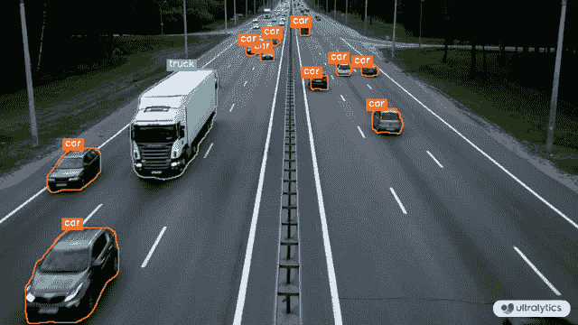
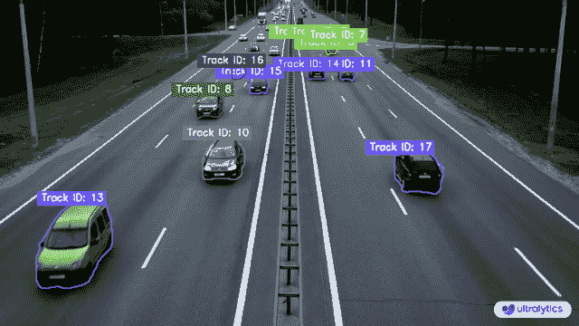

# 使用 Ultralytics YOLOv8 进行实例分割和跟踪 🚀

> 原文：[`docs.ultralytics.com/guides/instance-segmentation-and-tracking/`](https://docs.ultralytics.com/guides/instance-segmentation-and-tracking/)

## 什么是实例分割？

[Ultralytics YOLOv8](https://github.com/ultralytics/ultralytics/)的实例分割涉及识别和轮廓化图像中的个别对象，提供对空间分布的详细理解。与语义分割不同，它独特地标记并精确勾画每个对象，对于诸如物体检测和医学成像等任务至关重要。

Ultralytics 包中有两种可用的实例分割跟踪类型：

+   **具有类对象的实例分割：** 每个类对象分配一个独特的颜色，以便清晰地视觉分离。

+   **带有对象跟踪的实例分割：** 每个跟踪用不同的颜色表示，便于识别和跟踪。

[`www.youtube.com/embed/75G_S1Ngji8`](https://www.youtube.com/embed/75G_S1Ngji8)

**观看：** 使用 Ultralytics YOLOv8 进行对象跟踪的实例分割

## 样例

| 实例分割 | 实例分割 + 对象跟踪 |
| --- | --- |
|  |  |
| Ultralytics 实例分割 😍 | Ultralytics 带对象跟踪的实例分割 🔥 |

实例分割和跟踪

```py
`import cv2  from ultralytics import YOLO from ultralytics.utils.plotting import Annotator, colors  model = YOLO("yolov8n-seg.pt")  # segmentation model names = model.model.names cap = cv2.VideoCapture("path/to/video/file.mp4") w, h, fps = (int(cap.get(x)) for x in (cv2.CAP_PROP_FRAME_WIDTH, cv2.CAP_PROP_FRAME_HEIGHT, cv2.CAP_PROP_FPS))  out = cv2.VideoWriter("instance-segmentation.avi", cv2.VideoWriter_fourcc(*"MJPG"), fps, (w, h))  while True:     ret, im0 = cap.read()     if not ret:         print("Video frame is empty or video processing has been successfully completed.")         break      results = model.predict(im0)     annotator = Annotator(im0, line_width=2)      if results[0].masks is not None:         clss = results[0].boxes.cls.cpu().tolist()         masks = results[0].masks.xy         for mask, cls in zip(masks, clss):             color = colors(int(cls), True)             txt_color = annotator.get_txt_color(color)             annotator.seg_bbox(mask=mask, mask_color=color, label=names[int(cls)], txt_color=txt_color)      out.write(im0)     cv2.imshow("instance-segmentation", im0)      if cv2.waitKey(1) & 0xFF == ord("q"):         break  out.release() cap.release() cv2.destroyAllWindows()` 
```

```py
`from collections import defaultdict  import cv2  from ultralytics import YOLO from ultralytics.utils.plotting import Annotator, colors  track_history = defaultdict(lambda: [])  model = YOLO("yolov8n-seg.pt")  # segmentation model cap = cv2.VideoCapture("path/to/video/file.mp4") w, h, fps = (int(cap.get(x)) for x in (cv2.CAP_PROP_FRAME_WIDTH, cv2.CAP_PROP_FRAME_HEIGHT, cv2.CAP_PROP_FPS))  out = cv2.VideoWriter("instance-segmentation-object-tracking.avi", cv2.VideoWriter_fourcc(*"MJPG"), fps, (w, h))  while True:     ret, im0 = cap.read()     if not ret:         print("Video frame is empty or video processing has been successfully completed.")         break      annotator = Annotator(im0, line_width=2)      results = model.track(im0, persist=True)      if results[0].boxes.id is not None and results[0].masks is not None:         masks = results[0].masks.xy         track_ids = results[0].boxes.id.int().cpu().tolist()          for mask, track_id in zip(masks, track_ids):             color = colors(int(track_id), True)             txt_color = annotator.get_txt_color(color)             annotator.seg_bbox(mask=mask, mask_color=color, label=str(track_id), txt_color=txt_color)      out.write(im0)     cv2.imshow("instance-segmentation-object-tracking", im0)      if cv2.waitKey(1) & 0xFF == ord("q"):         break  out.release() cap.release() cv2.destroyAllWindows()` 
```

### `seg_bbox` 参数

| 名称 | 类型 | 默认 | 描述 |
| --- | --- | --- | --- |
| `mask` | `array` | `None` | 分割蒙版坐标 |
| `mask_color` | `RGB` | `(255, 0, 255)` | 每个分割框的蒙版颜色 |
| `label` | `str` | `None` | 用于分割对象的标签 |
| `txt_color` | `RGB` | `None` | 用于分割和跟踪对象的标签颜色 |

## 注意

如有任何疑问，请随时在[Ultralytics 问题区](https://github.com/ultralytics/ultralytics/issues/new/choose)或下面提到的讨论区发表您的问题。

## 常见问题

### 如何使用 Ultralytics YOLOv8 进行实例分割？

要使用 Ultralytics YOLOv8 进行实例分割，需使用 YOLOv8 的分割版本初始化模型，并通过其处理视频帧。以下是一个简化的代码示例：

示例

```py
`import cv2  from ultralytics import YOLO from ultralytics.utils.plotting import Annotator, colors  model = YOLO("yolov8n-seg.pt")  # segmentation model cap = cv2.VideoCapture("path/to/video/file.mp4") w, h, fps = (int(cap.get(x)) for x in (cv2.CAP_PROP_FRAME_WIDTH, cv2.CAP_PROP_FRAME_HEIGHT, cv2.CAP_PROP_FPS))  out = cv2.VideoWriter("instance-segmentation.avi", cv2.VideoWriter_fourcc(*"MJPG"), fps, (w, h))  while True:     ret, im0 = cap.read()     if not ret:         break      results = model.predict(im0)     annotator = Annotator(im0, line_width=2)      if results[0].masks is not None:         clss = results[0].boxes.cls.cpu().tolist()         masks = results[0].masks.xy         for mask, cls in zip(masks, clss):             annotator.seg_bbox(mask=mask, mask_color=colors(int(cls), True), det_label=model.model.names[int(cls)])      out.write(im0)     cv2.imshow("instance-segmentation", im0)     if cv2.waitKey(1) & 0xFF == ord("q"):         break  out.release() cap.release() cv2.destroyAllWindows()` 
```

了解更多关于实例分割的内容，请参阅 Ultralytics YOLOv8 指南。

### Ultralytics YOLOv8 中实例分割和对象跟踪有何区别？

实例分割识别并轮廓化图像中的个别对象，为每个对象分配唯一标签和蒙版。对象跟踪通过为视频帧中的对象分配一致的标签，实现对同一对象持续跟踪，进一步扩展了这一功能。了解更多关于 Ultralytics YOLOv8 文档中的区别。

### 为什么我应该使用 Ultralytics YOLOv8 进行实例分割和跟踪，而不是像 Mask R-CNN 或 Faster R-CNN 这样的其他模型？

Ultralytics YOLOv8 提供了与 Mask R-CNN 或 Faster R-CNN 等其他模型相比的实时性能、卓越的准确性和易用性。YOLOv8 与 Ultralytics HUB 无缝集成，使用户能够高效管理模型、数据集和训练流程。在[Ultralytics 博客](https://www.ultralytics.com/blog/introducing-ultralytics-yolov8)中了解更多关于 YOLOv8 的优势。

### 如何使用 Ultralytics YOLOv8 实现对象跟踪？

要实现对象跟踪，使用`model.track`方法，并确保每个对象的 ID 在各帧之间保持一致。以下是一个简单的示例：

示例

```py
`from collections import defaultdict  import cv2  from ultralytics import YOLO from ultralytics.utils.plotting import Annotator, colors  track_history = defaultdict(lambda: [])  model = YOLO("yolov8n-seg.pt")  # segmentation model cap = cv2.VideoCapture("path/to/video/file.mp4") w, h, fps = (int(cap.get(x)) for x in (cv2.CAP_PROP_FRAME_WIDTH, cv2.CAP_PROP_FRAME_HEIGHT, cv2.CAP_PROP_FPS))  out = cv2.VideoWriter("instance-segmentation-object-tracking.avi", cv2.VideoWriter_fourcc(*"MJPG"), fps, (w, h))  while True:     ret, im0 = cap.read()     if not ret:         break      annotator = Annotator(im0, line_width=2)     results = model.track(im0, persist=True)      if results[0].boxes.id is not None and results[0].masks is not None:         masks = results[0].masks.xy         track_ids = results[0].boxes.id.int().cpu().tolist()          for mask, track_id in zip(masks, track_ids):             annotator.seg_bbox(mask=mask, mask_color=colors(track_id, True), track_label=str(track_id))      out.write(im0)     cv2.imshow("instance-segmentation-object-tracking", im0)     if cv2.waitKey(1) & 0xFF == ord("q"):         break  out.release() cap.release() cv2.destroyAllWindows()` 
```

在实例分割和跟踪部分查找更多信息。

### Ultralytics 提供的数据集是否适用于训练 YOLOv8 模型进行实例分割和跟踪？

是的，Ultralytics 提供了多个适用于训练 YOLOv8 模型的数据集，包括分割和跟踪数据集。可以在[Ultralytics 数据集文档](https://docs.ultralytics.com/datasets/)中找到数据集示例、结构和使用说明。
