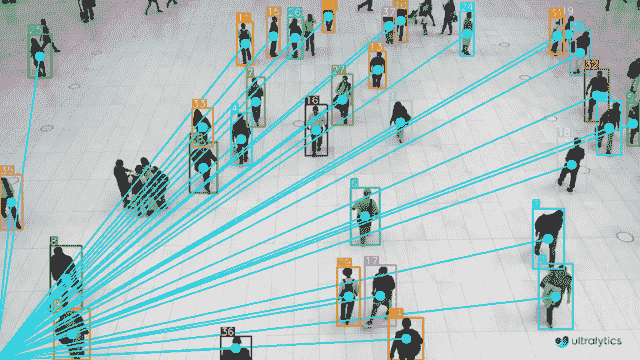
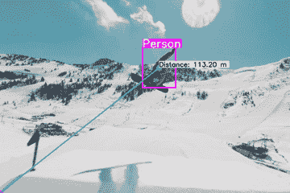

# 使用 Ultralytics YOLOv8 进行 VisionEye 视图对象映射 🚀

> 原文：[`docs.ultralytics.com/guides/vision-eye/`](https://docs.ultralytics.com/guides/vision-eye/)

## 什么是 VisionEye 对象映射？

[Ultralytics YOLOv8](https://github.com/ultralytics/ultralytics/) VisionEye 提供了计算机识别和定位物体的能力，模拟人眼观察的精确性。该功能使计算机能够像人眼一样分辨并集中注意特定对象的细节。

## 示例

| VisionEye 视图 | 带对象跟踪的 VisionEye 视图 | 带距离计算的 VisionEye 视图 |
| --- | --- | --- |
|  |  |  |
| 使用 Ultralytics YOLOv8 进行 VisionEye 视图对象映射 | 使用 Ultralytics YOLOv8 进行带对象跟踪的 VisionEye 视图对象映射 | 使用 Ultralytics YOLOv8 进行带距离计算的 VisionEye 视图 |

使用 YOLOv8 进行 VisionEye 对象映射

```py
import cv2

from ultralytics import YOLO
from ultralytics.utils.plotting import Annotator, colors

model = YOLO("yolov8n.pt")
names = model.model.names
cap = cv2.VideoCapture("path/to/video/file.mp4")
w, h, fps = (int(cap.get(x)) for x in (cv2.CAP_PROP_FRAME_WIDTH, cv2.CAP_PROP_FRAME_HEIGHT, cv2.CAP_PROP_FPS))

out = cv2.VideoWriter("visioneye-pinpoint.avi", cv2.VideoWriter_fourcc(*"MJPG"), fps, (w, h))

center_point = (-10, h)

while True:
    ret, im0 = cap.read()
    if not ret:
        print("Video frame is empty or video processing has been successfully completed.")
        break

    results = model.predict(im0)
    boxes = results[0].boxes.xyxy.cpu()
    clss = results[0].boxes.cls.cpu().tolist()

    annotator = Annotator(im0, line_width=2)

    for box, cls in zip(boxes, clss):
        annotator.box_label(box, label=names[int(cls)], color=colors(int(cls)))
        annotator.visioneye(box, center_point)

    out.write(im0)
    cv2.imshow("visioneye-pinpoint", im0)

    if cv2.waitKey(1) & 0xFF == ord("q"):
        break

out.release()
cap.release()
cv2.destroyAllWindows() 
```

```py
import cv2

from ultralytics import YOLO
from ultralytics.utils.plotting import Annotator, colors

model = YOLO("yolov8n.pt")
cap = cv2.VideoCapture("path/to/video/file.mp4")
w, h, fps = (int(cap.get(x)) for x in (cv2.CAP_PROP_FRAME_WIDTH, cv2.CAP_PROP_FRAME_HEIGHT, cv2.CAP_PROP_FPS))

out = cv2.VideoWriter("visioneye-pinpoint.avi", cv2.VideoWriter_fourcc(*"MJPG"), fps, (w, h))

center_point = (-10, h)

while True:
    ret, im0 = cap.read()
    if not ret:
        print("Video frame is empty or video processing has been successfully completed.")
        break

    annotator = Annotator(im0, line_width=2)

    results = model.track(im0, persist=True)
    boxes = results[0].boxes.xyxy.cpu()

    if results[0].boxes.id is not None:
        track_ids = results[0].boxes.id.int().cpu().tolist()

        for box, track_id in zip(boxes, track_ids):
            annotator.box_label(box, label=str(track_id), color=colors(int(track_id)))
            annotator.visioneye(box, center_point)

    out.write(im0)
    cv2.imshow("visioneye-pinpoint", im0)

    if cv2.waitKey(1) & 0xFF == ord("q"):
        break

out.release()
cap.release()
cv2.destroyAllWindows() 
```

```py
import math

import cv2

from ultralytics import YOLO
from ultralytics.utils.plotting import Annotator

model = YOLO("yolov8s.pt")
cap = cv2.VideoCapture("Path/to/video/file.mp4")

w, h, fps = (int(cap.get(x)) for x in (cv2.CAP_PROP_FRAME_WIDTH, cv2.CAP_PROP_FRAME_HEIGHT, cv2.CAP_PROP_FPS))

out = cv2.VideoWriter("visioneye-distance-calculation.avi", cv2.VideoWriter_fourcc(*"MJPG"), fps, (w, h))

center_point = (0, h)
pixel_per_meter = 10

txt_color, txt_background, bbox_clr = ((0, 0, 0), (255, 255, 255), (255, 0, 255))

while True:
    ret, im0 = cap.read()
    if not ret:
        print("Video frame is empty or video processing has been successfully completed.")
        break

    annotator = Annotator(im0, line_width=2)

    results = model.track(im0, persist=True)
    boxes = results[0].boxes.xyxy.cpu()

    if results[0].boxes.id is not None:
        track_ids = results[0].boxes.id.int().cpu().tolist()

        for box, track_id in zip(boxes, track_ids):
            annotator.box_label(box, label=str(track_id), color=bbox_clr)
            annotator.visioneye(box, center_point)

            x1, y1 = int((box[0] + box[2]) // 2), int((box[1] + box[3]) // 2)  # Bounding box centroid

            distance = (math.sqrt((x1 - center_point[0]) ** 2 + (y1 - center_point[1]) ** 2)) / pixel_per_meter

            text_size, _ = cv2.getTextSize(f"Distance: {distance:.2f} m", cv2.FONT_HERSHEY_SIMPLEX, 1.2, 3)
            cv2.rectangle(im0, (x1, y1 - text_size[1] - 10), (x1 + text_size[0] + 10, y1), txt_background, -1)
            cv2.putText(im0, f"Distance: {distance:.2f} m", (x1, y1 - 5), cv2.FONT_HERSHEY_SIMPLEX, 1.2, txt_color, 3)

    out.write(im0)
    cv2.imshow("visioneye-distance-calculation", im0)

    if cv2.waitKey(1) & 0xFF == ord("q"):
        break

out.release()
cap.release()
cv2.destroyAllWindows() 
```

### `visioneye` 参数

| 名称 | 类型 | 默认值 | 描述 |
| --- | --- | --- | --- |
| `color` | `tuple` | `(235, 219, 11)` | 线条和对象质心的颜色 |
| `pin_color` | `tuple` | `(255, 0, 255)` | VisionEye 的标记颜色 |

## 注意

如有任何疑问，请随时在 [Ultralytics 问题部分](https://github.com/ultralytics/ultralytics/issues/new/choose) 或下面提到的讨论部分发表您的问题。

## 常见问题解答

### 如何开始使用 Ultralytics YOLOv8 进行 VisionEye 对象映射？

要开始使用 Ultralytics YOLOv8 进行 VisionEye 对象映射，首先需要通过 pip 安装 Ultralytics YOLO 包。然后，可以使用文档中提供的示例代码设置 VisionEye 的对象检测。以下是一个简单的示例，帮助您入门：

```py
import cv2

from ultralytics import YOLO

model = YOLO("yolov8n.pt")
cap = cv2.VideoCapture("path/to/video/file.mp4")

while True:
    ret, frame = cap.read()
    if not ret:
        break

    results = model.predict(frame)
    for result in results:
        # Perform custom logic with result
        pass

    cv2.imshow("visioneye", frame)
    if cv2.waitKey(1) & 0xFF == ord("q"):
        break

cap.release()
cv2.destroyAllWindows() 
```

### 使用 Ultralytics YOLOv8 的 VisionEye 对象跟踪功能的关键特性是什么？

VisionEye 使用 Ultralytics YOLOv8 的对象跟踪功能允许用户在视频帧内跟踪物体的移动。关键功能包括：

1.  **实时对象跟踪**：跟踪物体移动的过程。

1.  **对象识别**：利用 YOLOv8 强大的检测算法。

1.  **距离计算**：计算对象和指定点之间的距离。

1.  **注释和可视化**：为被跟踪的对象提供视觉标记。

这里是演示使用 VisionEye 进行跟踪的简短代码片段：

```py
import cv2

from ultralytics import YOLO

model = YOLO("yolov8n.pt")
cap = cv2.VideoCapture("path/to/video/file.mp4")

while True:
    ret, frame = cap.read()
    if not ret:
        break

    results = model.track(frame, persist=True)
    for result in results:
        # Annotate and visualize tracking
        pass

    cv2.imshow("visioneye-tracking", frame)
    if cv2.waitKey(1) & 0xFF == ord("q"):
        break

cap.release()
cv2.destroyAllWindows() 
```

对于全面的指南，请访问 VisionEye 对象映射与对象跟踪。

### 如何使用 VisionEye 的 YOLOv8 模型计算距离？

VisionEye 和 Ultralytics YOLOv8 的距离计算涉及确定帧中检测到的对象与指定点的距离。它增强了空间分析能力，在自动驾驶和监控等应用中非常有用。

这里有一个简化的例子：

```py
import math

import cv2

from ultralytics import YOLO

model = YOLO("yolov8s.pt")
cap = cv2.VideoCapture("path/to/video/file.mp4")
center_point = (0, 480)  # Example center point
pixel_per_meter = 10

while True:
    ret, frame = cap.read()
    if not ret:
        break

    results = model.track(frame, persist=True)
    for result in results:
        # Calculate distance logic
        distances = [
            (math.sqrt((box[0] - center_point[0]) ** 2 + (box[1] - center_point[1]) ** 2)) / pixel_per_meter
            for box in results
        ]

    cv2.imshow("visioneye-distance", frame)
    if cv2.waitKey(1) & 0xFF == ord("q"):
        break

cap.release()
cv2.destroyAllWindows() 
```

详细指南，请参阅带有距离计算的 VisionEye。

### 我为什么要使用 Ultralytics YOLOv8 进行对象映射和跟踪？

Ultralytics YOLOv8 以其速度、准确性和易集成性而闻名，成为对象映射和跟踪的首选。主要优势包括：

1.  **最先进的性能**：在实时物体检测中提供高精度。

1.  **灵活性**：支持检测、跟踪和距离计算等各种任务。

1.  **社区与支持**：提供广泛的文档和活跃的 GitHub 社区，用于故障排除和增强。

1.  **易用性**：直观的 API 简化了复杂任务，可以快速部署和迭代。

有关应用和优势的更多信息，请访问[Ultralytics YOLOv8 文档](https://docs.ultralytics.com/models/yolov8/)。

### 如何将 VisionEye 与 Comet 或 ClearML 等其他机器学习工具集成？

Ultralytics YOLOv8 可以与 Comet 和 ClearML 等多种机器学习工具无缝集成，增强实验跟踪、协作和可复现性。请查阅[如何使用 YOLOv5 与 Comet](https://www.ultralytics.com/blog/how-to-use-yolov5-with-comet)和[将 YOLOv8 与 ClearML 集成](https://docs.ultralytics.com/integrations/clearml/)的详细指南以开始。

有关进一步探索和集成示例，请查看我们的[Ultralytics 集成指南](https://docs.ultralytics.com/integrations/)。
