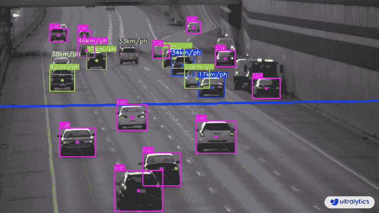
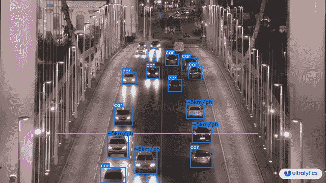

# 使用 Ultralytics YOLOv8 进行速度估算 🚀

> 原文：[`docs.ultralytics.com/guides/speed-estimation/`](https://docs.ultralytics.com/guides/speed-estimation/)

## 什么是速度估算？

[速度估算](https://www.ultralytics.com/blog/ultralytics-yolov8-for-speed-estimation-in-computer-vision-projects)是在特定背景下计算物体移动速率的过程，常用于计算机视觉应用中。使用[Ultralytics YOLOv8](https://github.com/ultralytics/ultralytics/)，您可以通过物体跟踪结合距离和时间数据计算物体速度，这对于交通和监视等任务至关重要。速度估算的准确性直接影响各种应用程序的效率和可靠性，是智能系统和实时决策过程中的关键组成部分。

[`www.youtube.com/embed/rCggzXRRSRo`](https://www.youtube.com/embed/rCggzXRRSRo)

**观看：** 使用 Ultralytics YOLOv8 进行速度估算

查看我们的博客

欲深入了解速度估算，请查看我们的博客文章：[Ultralytics YOLOv8 用于计算机视觉项目中的速度估算](https://www.ultralytics.com/blog/ultralytics-yolov8-for-speed-estimation-in-computer-vision-projects)

## 速度估算的优势？

+   **高效的交通控制：** 准确的速度估算有助于管理交通流量，增强道路安全，减少拥堵。

+   **精确的自主导航：** 在自动驾驶等自主系统中，可靠的速度估算确保车辆导航安全和准确。

+   **增强监视安全性：** 在监视分析中进行速度估算有助于识别异常行为或潜在威胁，提升安全措施的效果。

## 现实世界应用

| Transportation | Transportation |
| --- | --- |
|  |  |
| 使用 Ultralytics YOLOv8 在道路上进行速度估算 | 使用 Ultralytics YOLOv8 在桥上进行速度估算 |

使用 YOLOv8 进行速度估算示例

```py
import cv2

from ultralytics import YOLO, solutions

model = YOLO("yolov8n.pt")
names = model.model.names

cap = cv2.VideoCapture("path/to/video/file.mp4")
assert cap.isOpened(), "Error reading video file"
w, h, fps = (int(cap.get(x)) for x in (cv2.CAP_PROP_FRAME_WIDTH, cv2.CAP_PROP_FRAME_HEIGHT, cv2.CAP_PROP_FPS))

# Video writer
video_writer = cv2.VideoWriter("speed_estimation.avi", cv2.VideoWriter_fourcc(*"mp4v"), fps, (w, h))

line_pts = [(0, 360), (1280, 360)]

# Init speed-estimation obj
speed_obj = solutions.SpeedEstimator(
    reg_pts=line_pts,
    names=names,
    view_img=True,
)

while cap.isOpened():
    success, im0 = cap.read()
    if not success:
        print("Video frame is empty or video processing has been successfully completed.")
        break

    tracks = model.track(im0, persist=True, show=False)

    im0 = speed_obj.estimate_speed(im0, tracks)
    video_writer.write(im0)

cap.release()
video_writer.release()
cv2.destroyAllWindows() 
```

<details class="warning" open="open"><summary>速度是估算值</summary>

速度将是一个估算值，可能并不完全准确。此外，估算结果可能因 GPU 速度而异。</details>

### 参数 `SpeedEstimator`

| Name | Type | Default | Description |
| --- | --- | --- | --- |
| `names` | `dict` | `None` | 类名字典。 |
| `reg_pts` | `list` | `[(20, 400), (1260, 400)]` | 速度估算的区域点列表。 |
| `view_img` | `bool` | `False` | 是否显示带有注释的图像。 |
| `line_thickness` | `int` | `2` | 绘制框和轨道线的线条粗细。 |
| `region_thickness` | `int` | `5` | 区域线的线条粗细。 |
| `spdl_dist_thresh` | `int` | `10` | 速度计算的距离阈值。 |

### 参数 `model.track`

| 名称 | 类型 | 默认 | 描述 |
| --- | --- | --- | --- |
| `source` | `im0` | `None` | 图像或视频的源目录 |
| `persist` | `bool` | `False` | 在帧间持续跟踪轨迹 |
| `tracker` | `str` | `botsort.yaml` | 跟踪方法 'bytetrack' 或 'botsort' |
| `conf` | `float` | `0.3` | 置信度阈值 |
| `iou` | `float` | `0.5` | IOU 阈值 |
| `classes` | `list` | `None` | 根据类别筛选结果，例如 classes=0 或 classes=[0,2,3] |
| `verbose` | `bool` | `True` | 显示对象跟踪结果 |

## 常见问题

### 如何使用 Ultralytics YOLOv8 估算对象速度？

使用 Ultralytics YOLOv8 进行对象速度估算涉及结合物体检测和跟踪技术。首先，您需要使用 YOLOv8 模型在每个帧中检测对象。然后，跟踪这些对象跨帧以计算它们随时间的移动。最后，利用对象在帧间移动的距离和帧率来估算其速度。

**示例**：

```py
import cv2

from ultralytics import YOLO, solutions

model = YOLO("yolov8n.pt")
names = model.model.names

cap = cv2.VideoCapture("path/to/video/file.mp4")
w, h, fps = (int(cap.get(x)) for x in (cv2.CAP_PROP_FRAME_WIDTH, cv2.CAP_PROP_FRAME_HEIGHT, cv2.CAP_PROP_FPS))
video_writer = cv2.VideoWriter("speed_estimation.avi", cv2.VideoWriter_fourcc(*"mp4v"), fps, (w, h))

# Initialize SpeedEstimator
speed_obj = solutions.SpeedEstimator(
    reg_pts=[(0, 360), (1280, 360)],
    names=names,
    view_img=True,
)

while cap.isOpened():
    success, im0 = cap.read()
    if not success:
        break
    tracks = model.track(im0, persist=True, show=False)
    im0 = speed_obj.estimate_speed(im0, tracks)
    video_writer.write(im0)

cap.release()
video_writer.release()
cv2.destroyAllWindows() 
```

欲了解更多详细信息，请参阅我们的[官方博客文章](https://www.ultralytics.com/blog/ultralytics-yolov8-for-speed-estimation-in-computer-vision-projects)。

### 在交通管理中使用 Ultralytics YOLOv8 进行速度估算有哪些好处？

使用 Ultralytics YOLOv8 进行速度估算在交通管理中具有显著优势：

+   **增强安全性**：准确估算车辆速度，检测超速，提升道路安全。

+   **实时监控**：利用 YOLOv8 的实时对象检测能力有效监控交通流量和拥堵情况。

+   **可扩展性**：在各种硬件设置中部署模型，从边缘设备到服务器，确保大规模实施的灵活和可扩展解决方案。

欲了解更多应用程序，请参阅速度估算的优势。

### YOLOv8 是否可以与其他 AI 框架（如 TensorFlow 或 PyTorch）集成？

是的，YOLOv8 可以与 TensorFlow 和 PyTorch 等其他 AI 框架集成。Ultralytics 支持将 YOLOv8 模型导出为 ONNX、TensorRT 和 CoreML 等多种格式，确保与其他 ML 框架的平滑互操作性。

将 YOLOv8 模型导出为 ONNX 格式：

```py
yolo  export  --weights  yolov8n.pt  --include  onnx 
```

在我们的导出指南中了解更多关于导出模型的信息。

### 使用 Ultralytics YOLOv8 进行速度估算的准确性如何？

使用 Ultralytics YOLOv8 进行速度估算的准确性取决于多种因素，包括物体跟踪的质量、视频的分辨率和帧率以及环境变量。虽然速度估算器提供可靠的估算结果，但由于帧处理速度和物体遮挡的变化，可能不是 100%准确。

**注意**：在可能的情况下，始终考虑误差范围，并使用实际数据验证估算结果。

欲了解更多提高精度的提示，请查看 `SpeedEstimator` 部分的参数。

### 为什么选择 Ultralytics YOLOv8 而不是 TensorFlow Object Detection API 等其他物体检测模型？

Ultralytics YOLOv8 相比 TensorFlow 目标检测 API 等其他对象检测模型具有几个优势：

+   **实时性能**：YOLOv8 经过优化，可实现实时检测，提供高速和准确性。

+   **易用性**：设计有用户友好的界面，YOLOv8 简化了模型训练和部署。

+   **多功能性**：支持多种任务，包括对象检测、分割和姿态估计。

+   **社区与支持**：YOLOv8 得到活跃社区和详尽文档的支持，确保开发者拥有所需资源。

欲了解更多关于 YOLOv8 的优势，请查看我们详细的模型页面。
