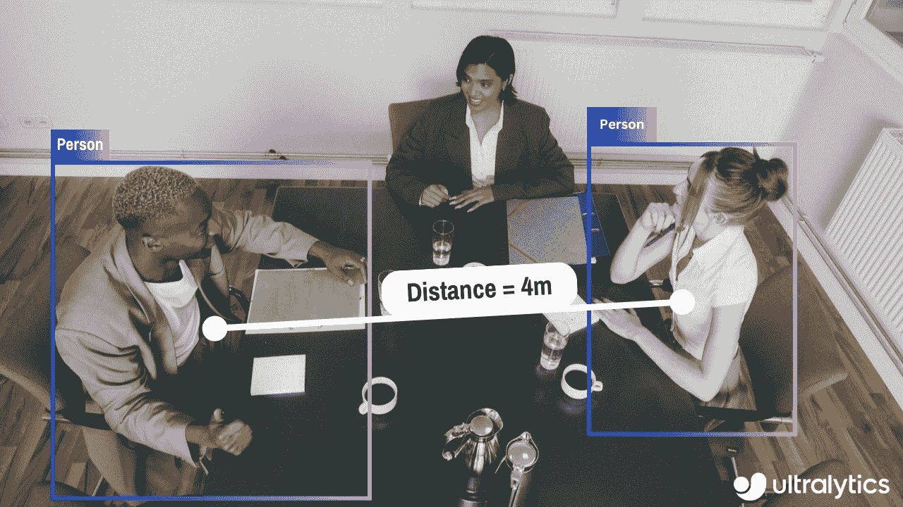

# 使用 Ultralytics YOLOv8 进行距离计算

> 原文：[`docs.ultralytics.com/guides/distance-calculation/`](https://docs.ultralytics.com/guides/distance-calculation/)

## 什么是距离计算？

在指定空间内测量两个对象之间的间距称为距离计算。在[Ultralytics YOLOv8](https://github.com/ultralytics/ultralytics)的情况下，使用边界框质心来计算用户突出显示的边界框的距离。

[`www.youtube.com/embed/LE8am1QoVn4`](https://www.youtube.com/embed/LE8am1QoVn4)

**观看：** 使用 Ultralytics YOLOv8 进行距离计算

## 视觉效果

| 使用 Ultralytics YOLOv8 进行距离计算 |
| --- |
|  |

## 优势的距离计算？

+   **定位精度：** 提升计算机视觉任务中的精确空间定位能力。

+   **大小估算：** 允许更好地理解物理大小。

+   **场景理解：** 为改善决策提供环境的三维理解。

<details class="tip" open="open"><summary>距离计算</summary>

+   单击任意两个边界框使用左鼠标单击进行距离计算</details>

使用 YOLOv8 示例的距离计算

```py
`import cv2  from ultralytics import YOLO, solutions  model = YOLO("yolov8n.pt") names = model.model.names  cap = cv2.VideoCapture("path/to/video/file.mp4") assert cap.isOpened(), "Error reading video file" w, h, fps = (int(cap.get(x)) for x in (cv2.CAP_PROP_FRAME_WIDTH, cv2.CAP_PROP_FRAME_HEIGHT, cv2.CAP_PROP_FPS))  # Video writer video_writer = cv2.VideoWriter("distance_calculation.avi", cv2.VideoWriter_fourcc(*"mp4v"), fps, (w, h))  # Init distance-calculation obj dist_obj = solutions.DistanceCalculation(names=names, view_img=True)  while cap.isOpened():     success, im0 = cap.read()     if not success:         print("Video frame is empty or video processing has been successfully completed.")         break      tracks = model.track(im0, persist=True, show=False)     im0 = dist_obj.start_process(im0, tracks)     video_writer.write(im0)  cap.release() video_writer.release() cv2.destroyAllWindows()` 
```

<details class="tip" open="open"><summary>注</summary>

+   鼠标右键点击将删除所有绘制的点

+   鼠标左键单击可以绘制点</details>

### 参数 `DistanceCalculation()`

| `Name` | `Type` | `Default` | Description |
| --- | --- | --- | --- |
| `names` | `dict` | `None` | 类名字典。 |
| `pixels_per_meter` | `int` | `10` | 像素到米的转换因子。 |
| `view_img` | `bool` | `False` | 是否显示视频流的标志位。 |
| `line_thickness` | `int` | `2` | 图像上绘制线条的厚度。 |
| `line_color` | `tuple` | `(255, 255, 0)` | 图像上绘制线条的颜色（BGR 格式）。 |
| `centroid_color` | `tuple` | `(255, 0, 255)` | 绘制的质心颜色（BGR 格式）。 |

### 参数 `model.track`

| Name | Type | Default | Description |
| --- | --- | --- | --- |
| `source` | `im0` | `None` | 图像或视频的源目录 |
| `persist` | `bool` | `False` | 在帧之间持续跟踪轨迹 |
| `tracker` | `str` | `botsort.yaml` | 跟踪方法 'bytetrack' 或 'botsort' |
| `conf` | `float` | `0.3` | 置信阈值 |
| `iou` | `float` | `0.5` | IOU 阈值 |
| `classes` | `list` | `None` | 按类别过滤结果，例如 classes=0 或 classes=[0,2,3] |
| `verbose` | `bool` | `True` | 显示对象跟踪结果 |

## 常见问题

### 我如何使用 Ultralytics YOLOv8 计算对象之间的距离？

要使用[Ultralytics YOLOv8](https://github.com/ultralytics/ultralytics)计算对象之间的距离，您需要识别检测对象的边界框质心。该过程涉及从 Ultralytics 的`solutions`模块初始化 DistanceCalculation 类，并使用模型的跟踪输出计算距离。您可以参考距离计算示例中的实现。

### 使用 Ultralytics YOLOv8 进行距离计算的优势是什么？

使用 Ultralytics YOLOv8 进行距离计算具有以下几个优点：

+   **定位精度：** 提供对象的准确空间定位。

+   **大小估计：** 帮助估计物理尺寸，有助于更好地理解背景信息。

+   **场景理解：** 增强 3D 场景理解，有助于改善自动驾驶和监控等应用中的决策制定。

### 我可以在实时视频流中使用 Ultralytics YOLOv8 进行距离计算吗？

是的，您可以在实时视频流中使用 Ultralytics YOLOv8 进行距离计算。该过程涉及使用 OpenCV 捕获视频帧，运行 YOLOv8 目标检测，并使用`DistanceCalculation`类计算连续帧中对象之间的距离。有关详细实现，请参阅视频流示例。

### 如何删除使用 Ultralytics YOLOv8 进行距离计算期间绘制的点？

若要删除使用 Ultralytics YOLOv8 进行距离计算期间绘制的点，您可以使用鼠标右键单击。此操作将清除您绘制的所有点。有关详细信息，请参阅距离计算示例下的注释部分。

### 初始化 Ultralytics YOLOv8 中 DistanceCalculation 类的关键参数是什么？

初始化 Ultralytics YOLOv8 中 DistanceCalculation 类的关键参数包括：

+   `names`: 将类索引映射到类名称的字典。

+   `pixels_per_meter`: 像素到米的转换因子。

+   `view_img`: 指示是否显示视频流的标志。

+   `line_thickness`: 图像上绘制线条的厚度。

+   `line_color`: 图像上绘制线条的颜色（BGR 格式）。

+   `centroid_color`: 质心的颜色（BGR 格式）。

要查看详尽列表和默认值，请参阅 DistanceCalculation 的参数。
