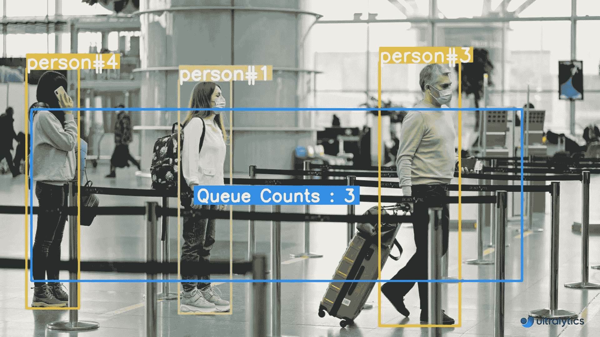
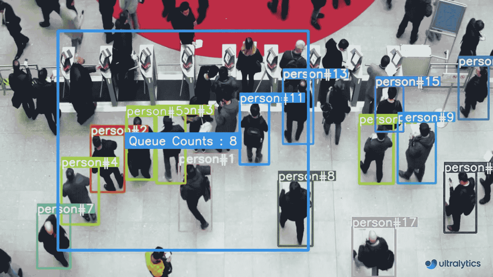

# 使用 Ultralytics YOLOv8 进行队列管理 🚀

> 原文：[`docs.ultralytics.com/guides/queue-management/`](https://docs.ultralytics.com/guides/queue-management/)

## 什么是队列管理？

使用 [Ultralytics YOLOv8](https://github.com/ultralytics/ultralytics/) 进行队列管理涉及组织和控制人群或车辆队列，以减少等待时间并提高效率。优化队列以提升客户满意度和系统性能，在零售、银行、机场和医疗设施等各种场所发挥作用。

[`www.youtube.com/embed/gX5kSRD56Gs`](https://www.youtube.com/embed/gX5kSRD56Gs)

**观看：** 如何使用 Ultralytics YOLOv8 实施队列管理 | 机场和地铁站

## **队列管理的优势？**

+   **减少等待时间：** 队列管理系统有效地组织排队，最大限度地减少顾客等待时间。这导致顾客满意度提高，因为顾客等待时间减少，有更多时间参与产品或服务。

+   **提高效率：** 实施队列管理允许企业更有效地分配资源。通过分析队列数据和优化员工部署，企业可以简化操作、降低成本，并提高整体生产效率。

## 实际应用场景

| 物流 | 零售 |
| --- | --- |
|  |  |
| 使用 Ultralytics YOLOv8 在机场售票柜台进行队列管理 | 使用 Ultralytics YOLOv8 在人群中进行队列监控 |

使用 YOLOv8 示例的队列管理

```py
import cv2

from ultralytics import YOLO, solutions

model = YOLO("yolov8n.pt")
cap = cv2.VideoCapture("path/to/video/file.mp4")

assert cap.isOpened(), "Error reading video file"
w, h, fps = (int(cap.get(x)) for x in (cv2.CAP_PROP_FRAME_WIDTH, cv2.CAP_PROP_FRAME_HEIGHT, cv2.CAP_PROP_FPS))

video_writer = cv2.VideoWriter("queue_management.avi", cv2.VideoWriter_fourcc(*"mp4v"), fps, (w, h))

queue_region = [(20, 400), (1080, 404), (1080, 360), (20, 360)]

queue = solutions.QueueManager(
    names=model.names,
    reg_pts=queue_region,
    line_thickness=3,
    fontsize=1.0,
    region_color=(255, 144, 31),
)

while cap.isOpened():
    success, im0 = cap.read()

    if success:
        tracks = model.track(im0, show=False, persist=True, verbose=False)
        out = queue.process_queue(im0, tracks)

        video_writer.write(im0)
        if cv2.waitKey(1) & 0xFF == ord("q"):
            break
        continue

    print("Video frame is empty or video processing has been successfully completed.")
    break

cap.release()
cv2.destroyAllWindows() 
```

```py
import cv2

from ultralytics import YOLO, solutions

model = YOLO("yolov8n.pt")
cap = cv2.VideoCapture("path/to/video/file.mp4")

assert cap.isOpened(), "Error reading video file"
w, h, fps = (int(cap.get(x)) for x in (cv2.CAP_PROP_FRAME_WIDTH, cv2.CAP_PROP_FRAME_HEIGHT, cv2.CAP_PROP_FPS))

video_writer = cv2.VideoWriter("queue_management.avi", cv2.VideoWriter_fourcc(*"mp4v"), fps, (w, h))

queue_region = [(20, 400), (1080, 404), (1080, 360), (20, 360)]

queue = solutions.QueueManager(
    names=model.names,
    reg_pts=queue_region,
    line_thickness=3,
    fontsize=1.0,
    region_color=(255, 144, 31),
)

while cap.isOpened():
    success, im0 = cap.read()

    if success:
        tracks = model.track(im0, show=False, persist=True, verbose=False, classes=0)  # Only person class
        out = queue.process_queue(im0, tracks)

        video_writer.write(im0)
        if cv2.waitKey(1) & 0xFF == ord("q"):
            break
        continue

    print("Video frame is empty or video processing has been successfully completed.")
    break

cap.release()
cv2.destroyAllWindows() 
```

### 参数 `QueueManager`

| Name | Type | Default | Description |
| --- | --- | --- | --- |
| `names` | `dict` | `model.names` | 将类别 ID 映射到类别名称的字典。 |
| `reg_pts` | `list of tuples` | `[(20, 400), (1260, 400)]` | 定义计数区域多边形的点。默认为预定义的矩形。 |
| `line_thickness` | `int` | `2` | 注释线的粗细。 |
| `track_thickness` | `int` | `2` | 轨迹线的粗细。 |
| `view_img` | `bool` | `False` | 是否显示图像帧。 |
| `region_color` | `tuple` | `(255, 0, 255)` | 计数区域线的颜色 (BGR)。 |
| `view_queue_counts` | `bool` | `True` | 是否显示队列计数。 |
| `draw_tracks` | `bool` | `False` | 是否绘制对象的轨迹。 |
| `count_txt_color` | `tuple` | `(255, 255, 255)` | 计数文本的颜色 (BGR)。 |
| `track_color` | `tuple` | `None` | 轨迹的颜色。如果为 `None`，将为不同的轨迹使用不同的颜色。 |
| `region_thickness` | `int` | `5` | 计数区域线的粗细。 |
| `fontsize` | `float` | `0.7` | 文本注释的字体大小。 |

### 参数 `model.track`

| Name | Type | Default | Description |
| --- | --- | --- | --- |
| `source` | `im0` | `None` | 图像或视频的源目录 |
| `persist` | `bool` | `False` | 在帧之间持久化跟踪结果。 |
| `tracker` | `str` | `botsort.yaml` | 跟踪方法 'bytetrack' 或 'botsort'。 |
| `conf` | `float` | `0.3` | 置信度阈值。 |
| `iou` | `float` | `0.5` | IOU（交并比）阈值。 |
| `classes` | `list` | `None` | 通过类别过滤结果，例如 classes=0 或 classes=[0,2,3]。 |
| `verbose` | `bool` | `True` | 显示对象跟踪结果。 |

## 常见问题解答

### 如何使用 Ultralytics YOLOv8 进行实时队列管理？

要使用 Ultralytics YOLOv8 进行实时队列管理，可以按照以下步骤进行：

1.  使用`YOLO("yolov8n.pt")`加载 YOLOv8 模型。

1.  使用`cv2.VideoCapture`捕获视频源。

1.  定义用于队列管理的感兴趣区域（ROI）。

1.  处理帧以检测对象并管理队列。

这是一个最小示例：

```py
import cv2

from ultralytics import YOLO, solutions

model = YOLO("yolov8n.pt")
cap = cv2.VideoCapture("path/to/video.mp4")
queue_region = [(20, 400), (1080, 404), (1080, 360), (20, 360)]

queue = solutions.QueueManager(
    names=model.names,
    reg_pts=queue_region,
    line_thickness=3,
    fontsize=1.0,
    region_color=(255, 144, 31),
)

while cap.isOpened():
    success, im0 = cap.read()
    if success:
        tracks = model.track(im0, show=False, persist=True, verbose=False)
        out = queue.process_queue(im0, tracks)
        cv2.imshow("Queue Management", im0)
        if cv2.waitKey(1) & 0xFF == ord("q"):
            break

cap.release()
cv2.destroyAllWindows() 
```

利用 Ultralytics[HUB](https://docs.ultralytics.com/hub/)可以通过提供用户友好的平台来简化部署和管理您的队列管理解决方案。

### 使用 Ultralytics YOLOv8 进行队列管理的关键优势是什么？

使用 Ultralytics YOLOv8 进行队列管理具有以下几个优点：

+   **大幅减少等待时间：** 有效组织队列，缩短客户等待时间，提升满意度。

+   **提升效率：** 分析队列数据以优化人员部署和运营，从而降低成本。

+   **实时警报：** 提供长队列的实时通知，便于快速干预。

+   **可扩展性：** 在零售、机场和医疗保健等不同环境中轻松扩展。

欲了解更多详情，请浏览我们的[队列管理](https://docs.ultralytics.com/reference/solutions/queue_management/)解决方案。

### 为什么我应该选择 Ultralytics YOLOv8 而不是像 TensorFlow 或 Detectron2 这样的竞争对手进行队列管理？

Ultralytics YOLOv8 在队列管理方面比 TensorFlow 和 Detectron2 具有多个优势：

+   **实时性能：** YOLOv8 以其实时检测能力而闻名，提供更快的处理速度。

+   **易于使用：** Ultralytics 提供了用户友好的体验，从训练到部署，通过[Ultralytics HUB](https://docs.ultralytics.com/hub/)。

+   **预训练模型：** 提供多种预训练模型，最小化设置时间。

+   **社区支持：** 完善的文档和活跃的社区支持使问题解决更加容易。

学习如何开始使用[Ultralytics YOLO](https://docs.ultralytics.com/quickstart/)。

### Ultralytics YOLOv8 能处理多种类型的队列吗，例如机场和零售业务中的队列？

是的，Ultralytics YOLOv8 可以管理包括机场和零售环境在内的各种类型的队列。通过配置 QueueManager 来适应不同的队列布局和密度。

机场示例：

```py
queue_region_airport = [(50, 600), (1200, 600), (1200, 550), (50, 550)]
queue_airport = solutions.QueueManager(
    names=model.names,
    reg_pts=queue_region_airport,
    line_thickness=3,
    fontsize=1.0,
    region_color=(0, 255, 0),
) 
```

欲了解更多关于不同应用的信息，请查阅我们的真实世界应用部分。

### Ultralytics YOLOv8 在队列管理中的一些实际应用是什么？

Ultralytics YOLOv8 在各种实际应用中用于排队管理：

+   **零售：** 监控收银队列，缩短等待时间，提升顾客满意度。

+   **机场：** 管理售票柜台和安检点的排队，以提升乘客体验流畅度。

+   **医疗：** 优化诊所和医院的患者流程。

+   **银行：** 通过高效管理排队优化客户服务。

查看我们的[博客，了解真实世界的排队管理](https://www.ultralytics.com/blog/revolutionizing-queue-management-with-ultralytics-yolov8-and-openvino)。
