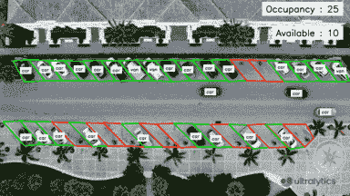
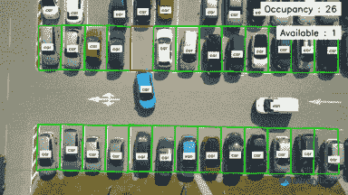
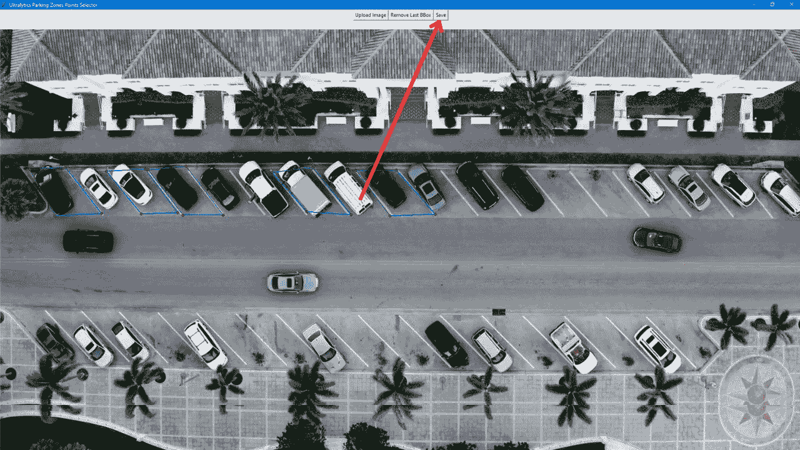

# 使用 Ultralytics YOLOv8 进行停车管理 🚀 

> 原文：[`docs.ultralytics.com/guides/parking-management/`](https://docs.ultralytics.com/guides/parking-management/) 

## 什么是停车管理系统？ 

使用 [Ultralytics YOLOv8](https://github.com/ultralytics/ultralytics/) 进行停车管理可通过组织空间和监控可用性来确保高效且安全的停车。YOLOv8 通过实时车辆检测和停车位占用情况的洞察，可以改善停车场管理。 

## 停车管理系统的优势？ 

+   **效率**: 停车场管理优化停车位的使用，并减少拥堵。 

+   **安全与保安**: 使用 YOLOv8 进行停车管理通过监控和安全措施提升了人员和车辆的安全性。 

+   **减少排放**: 使用 YOLOv8 进行停车管理可以控制交通流，最小化停车场的闲置时间和排放。 

## 现实世界应用 

| 停车管理系统 | 停车管理系统 |
| --- | --- |
|  |  |
| 使用 Ultralytics YOLOv8 进行停车管理的航拍视图 | 使用 Ultralytics YOLOv8 进行停车管理的俯视图 |

## 停车管理系统代码工作流程 

### 点的选择 

现在轻松选择点 

在停车管理系统中，选择停车点是一项关键且复杂的任务。Ultralytics 通过提供一个工具来定义停车场区域，后续可用于进一步处理，从而简化了这一过程。 

+   从视频或摄像头流中捕获一个帧，用于管理停车场的位置。 

+   使用提供的代码启动一个图形界面，在那里您可以选择一张图像，并通过鼠标点击开始轮廓化停车区域，以创建多边形。 

图像大小 

支持最大图像大小为 1920 * 1080 

Ultralytics YOLOv8 停车槽标注器 

```py
`from ultralytics import solutions  solutions.ParkingPtsSelection()` 
```

+   定义停车区域的多边形后，点击 `保存` 将数据存储为 JSON 文件到您的工作目录中。 

 

### Python 停车管理代码 

使用 YOLOv8 进行停车管理的示例 

```py
`import cv2  from ultralytics import solutions  # Path to json file, that created with above point selection app polygon_json_path = "bounding_boxes.json"  # Video capture cap = cv2.VideoCapture("Path/to/video/file.mp4") assert cap.isOpened(), "Error reading video file" w, h, fps = (int(cap.get(x)) for x in (cv2.CAP_PROP_FRAME_WIDTH, cv2.CAP_PROP_FRAME_HEIGHT, cv2.CAP_PROP_FPS))  # Video writer video_writer = cv2.VideoWriter("parking management.avi", cv2.VideoWriter_fourcc(*"mp4v"), fps, (w, h))  # Initialize parking management object management = solutions.ParkingManagement(model_path="yolov8n.pt")  while cap.isOpened():     ret, im0 = cap.read()     if not ret:         break      json_data = management.parking_regions_extraction(polygon_json_path)     results = management.model.track(im0, persist=True, show=False)      if results[0].boxes.id is not None:         boxes = results[0].boxes.xyxy.cpu().tolist()         clss = results[0].boxes.cls.cpu().tolist()         management.process_data(json_data, im0, boxes, clss)      management.display_frames(im0)     video_writer.write(im0)  cap.release() video_writer.release() cv2.destroyAllWindows()` 
```

### 可选参数 `ParkingManagement`

| 名称 | 类型 | 默认 | 描述 |
| --- | --- | --- | --- |
| `model_path` | `str` | `None` | YOLOv8 模型的路径。  |
| `txt_color` | `tuple` | `(0, 0, 0)` | 文本的 RGB 颜色元组。  |
| `bg_color` | `tuple` | `(255, 255, 255)` | 背景的 RGB 颜色元组。 |
| `occupied_region_color` | `tuple` | `(0, 255, 0)` | 已占用区域的 RGB 颜色元组。  |
| `available_region_color` | `tuple` | `(0, 0, 255)` | 可用区域的 RGB 颜色元组。 |
| `margin` | `int` | `10` | 文本显示的边距。 |

### 参数 `model.track`

| 名称 | 类型 | 默认 | 描述 |
| --- | --- | --- | --- |
| `source` | `im0` | `None` | 图像或视频的源目录。 |
| `persist` | `bool` | `False` | 在帧之间持续跟踪 |
| `tracker` | `str` | `botsort.yaml` | 跟踪方法'bytetrack'或'botsort' |
| `conf` | `float` | `0.3` | 置信阈值 |
| `iou` | `float` | `0.5` | IOU 阈值 |
| `classes` | `list` | `None` | 按类别过滤结果，例如 classes=0 或 classes=[0,2,3] |
| `verbose` | `bool` | `True` | 显示对象跟踪结果 |

## 常见问题

### Ultralytics YOLOv8 如何增强停车管理系统？

Ultralytics YOLOv8 通过提供**实时车辆检测**和监控，极大增强了停车管理系统。这导致停车位的优化使用，减少拥堵，并通过持续监控增强安全性。[停车管理系统](https://github.com/ultralytics/ultralytics)通过有效的交通流程，最小化停车场中的空转时间和排放，从而促进环境可持续性。有关详细信息，请参阅停车管理代码工作流程。

### 使用 Ultralytics YOLOv8 进行智能停车的好处是什么？

使用 Ultralytics YOLOv8 进行智能停车可以获得多个好处：

+   **效率**：优化停车位的使用并减少拥堵。

+   **安全与安全性**：增强监视并确保车辆和行人的安全。

+   **环境影响**：通过减少车辆空转时间来帮助减少排放。有关优势的更多细节可以在这里看到。

### 如何使用 Ultralytics YOLOv8 定义停车位？

使用 Ultralytics YOLOv8 定义停车位非常简单：

1.  从视频或摄像头流中捕获一帧。

1.  使用提供的代码启动 GUI，选择图像并绘制多边形以定义停车位。

1.  将标记的数据保存为 JSON 格式以便进一步处理。有关详细说明，请查看点选部分的选择。

### 我可以为特定的停车管理需求定制 YOLOv8 模型吗？

是的，Ultralytics YOLOv8 允许根据特定的停车管理需求进行定制。您可以调整参数，例如**占用和可用区域的颜色**，文本显示的边距等。利用`ParkingManagement`类的可选参数，您可以调整模型以满足特定的需求，确保最大的效率和效果。

### Ultralytics YOLOv8 在停车场管理中的一些真实应用是什么？

Ultralytics YOLOv8 在包括停车场管理在内的各种真实应用中被使用：

+   **停车位检测**：准确识别可用和占用空间。

+   **监视**：通过实时监控增强安全性。

+   **交通流管理**：通过高效的交通处理减少空转时间和拥堵。可以在真实应用中找到展示这些应用的图片。
