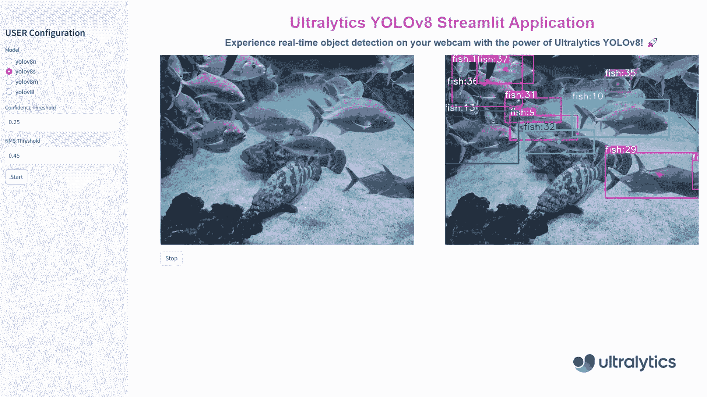
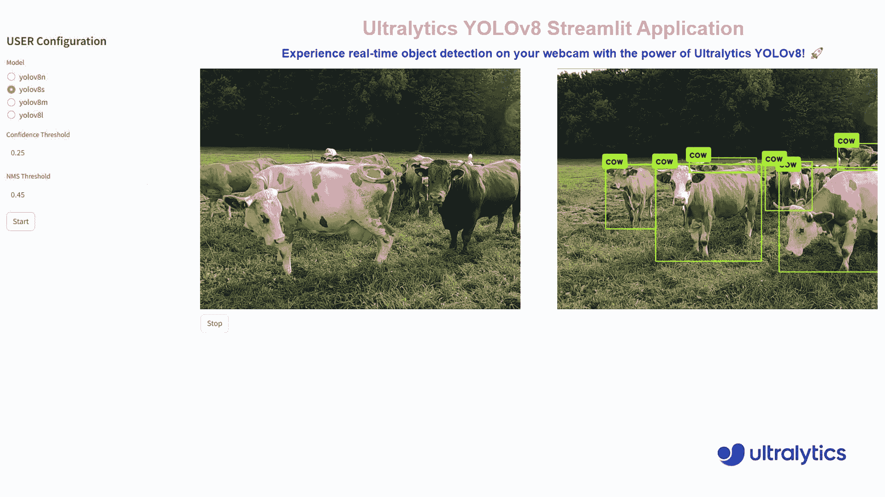

# 使用 Ultralytics YOLOv8 和 Streamlit 应用程序进行实时推理

> 原文：[`docs.ultralytics.com/guides/streamlit-live-inference/`](https://docs.ultralytics.com/guides/streamlit-live-inference/)

## 简介

Streamlit 简化了构建和部署交互式 Web 应用程序的过程。结合 Ultralytics YOLOv8，可以在浏览器中进行实时目标检测和分析。YOLOv8 的高准确性和速度确保了对实时视频流的无缝性性能，非常适合安全、零售等领域的应用。

| 水产养殖 | 动物饲养 |
| --- | --- |
|  |  |
| 使用 Ultralytics YOLOv8 进行鱼类检测 | 使用 Ultralytics YOLOv8 进行动物检测 |

## 实时推理的优势

+   **无缝实时目标检测**：Streamlit 结合 YOLOv8，可以直接从您的网络摄像头实时进行目标检测。这样可以进行即时分析和洞察，非常适合需要即时反馈的应用程序。

+   **用户友好的部署**：Streamlit 的交互界面使得应用程序的部署和使用变得简单，无需深厚的技术知识。用户只需点击一下即可开始实时推理，增强了可访问性和可用性。

+   **高效的资源利用**：YOLOv8 优化算法确保在最小计算资源的情况下进行高速处理。这种效率使得即使在标准硬件上，也能够实现平滑可靠的网络摄像头推理，使先进的计算机视觉技术更易于被更广泛的人群接受。

## Streamlit 应用程序代码

Ultralytics 安装

在开始构建应用程序之前，请确保已安装 Ultralytics Python 包。您可以使用命令 **pip install ultralytics** 进行安装。

Streamlit 应用程序

```py
`` from ultralytics import solutions  solutions.inference()  ### Make sure to run the file using command `streamlit run <file-name.py>` `` 
```

```py
`yolo  streamlit-predict` 
```

这将在您的默认网络浏览器中启动 Streamlit 应用程序。您将看到主标题、副标题和侧边栏配置选项。选择您期望的 YOLOv8 模型，设置置信度和 NMS 阈值，然后点击“开始”按钮开始实时目标检测。

您可以选择在 Python 中提供特定模型：

使用自定义模型的 Streamlit 应用程序

```py
`` from ultralytics import solutions  # Pass a model as an argument solutions.inference(model="path/to/model.pt")  ### Make sure to run the file using command `streamlit run <file-name.py>` `` 
```

## 结论

通过遵循本指南，您成功创建了一个使用 Streamlit 和 Ultralytics YOLOv8 进行实时目标检测的应用程序。该应用程序允许您通过网络摄像头体验 YOLOv8 在检测对象方面的强大功能，具有用户友好的界面，并可以随时停止视频流。

要进一步增强功能，您可以探索添加更多功能，如录制视频流、保存标注帧或与其他计算机视觉库集成。

## 与社区分享您的想法

与社区互动，了解更多信息，解决问题并分享您的项目：

### 获取帮助和支持的位置

+   **GitHub 问题**：访问[Ultralytics GitHub 存储库](https://github.com/ultralytics/ultralytics/issues)提出问题，报告错误和建议功能。

+   **Ultralytics Discord 服务器**：加入[Ultralytics Discord 服务器](https://ultralytics.com/discord/)与其他用户和开发者联系，获取支持，分享知识和头脑风暴。

### 官方文档

+   **Ultralytics YOLOv8 文档**：请参阅[官方 YOLOv8 文档](https://docs.ultralytics.com/)，获取关于各种计算机视觉任务和项目的全面指南和见解。

## 常见问题解答

### 如何使用 Streamlit 和 Ultralytics YOLOv8 设置实时物体检测应用程序？

使用 Streamlit 和 Ultralytics YOLOv8 设置实时物体检测应用程序非常简单。首先，确保您已安装 Ultralytics Python 包：

```py
`pip  install  ultralytics` 
```

然后，您可以创建一个基本的 Streamlit 应用程序来进行实时推理：

Streamlit 应用程序

```py
`` from ultralytics import solutions  solutions.inference()  ### Make sure to run the file using command `streamlit run <file-name.py>` `` 
```

```py
`yolo  streamlit-predict` 
```

获取有关实际设置的更多详细信息，请参阅文档的 Streamlit 应用代码部分。

### 使用 Ultralytics YOLOv8 结合 Streamlit 进行实时物体检测的主要优势是什么？

使用 Ultralytics YOLOv8 结合 Streamlit 进行实时物体检测具有多个优势：

+   **无缝实时检测**：直接从网络摄像头视频流进行高准确度的实时物体检测。

+   **用户友好界面**：Streamlit 直观的界面允许轻松使用和部署，无需广泛的技术知识。

+   **资源效率**：YOLOv8 的优化算法确保高速处理，最小化计算资源消耗。

在这里了解更多关于这些优势的信息。

### 如何在我的网络浏览器中部署 Streamlit 物体检测应用程序？

编码完毕后，将您的 Streamlit 应用程序与 Ultralytics YOLOv8 集成，可以通过运行来部署：

```py
`streamlit  run  <file-name.py>` 
```

此命令将在您的默认网络浏览器中启动应用程序，使您能够选择 YOLOv8 模型，设置置信度和 NMS 阈值，并通过简单点击开始实时物体检测。详细指南，请参阅 Streamlit 应用代码部分。

### 使用 Streamlit 和 Ultralytics YOLOv8 进行实时物体检测的一些用例是什么？

使用 Streamlit 和 Ultralytics YOLOv8 进行实时物体检测可应用于各个领域：

+   **安全性**：实时监控未经授权的访问。

+   **零售**：客户计数，货架管理等。

+   **野生动物和农业**：监测动物和作物状况。

获取更深入的用例和示例，请探索[Ultralytics 解决方案](https://docs.ultralytics.com/solutions)。

### Ultralytics YOLOv8 与 YOLOv5 和 RCNN 等其他物体检测模型相比有何优势？

Ultralytics YOLOv8 相比之前的模型如 YOLOv5 和 RCNN，提供了多项增强功能：

+   **更高的速度和准确性**：提升了实时应用的性能。

+   **易于使用**：简化的界面和部署。

+   **资源效率**：优化以提高速度，同时最小化计算需求。

如需全面比较，请查看[Ultralytics YOLOv8 文档](https://docs.ultralytics.com/models/yolov8)以及相关博客文章，讨论模型性能。
