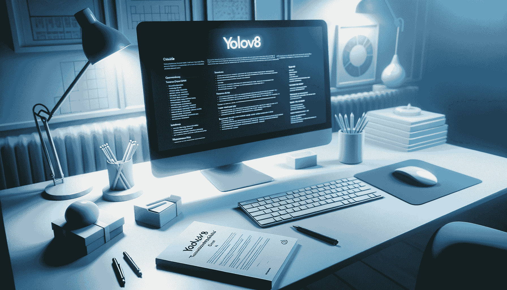

# 解决常见 YOLO 问题

> 原文：[`docs.ultralytics.com/guides/yolo-common-issues/`](https://docs.ultralytics.com/guides/yolo-common-issues/)



## 介绍

本指南旨在全面帮助解决在 Ultralytics 项目中使用 YOLOv8 时遇到的常见问题。通过正确的指导，您可以轻松地解决这些问题，确保项目按计划进行，避免不必要的延迟。

[`www.youtube.com/embed/TG9exsBlkDE`](https://www.youtube.com/embed/TG9exsBlkDE)

**观看：** Ultralytics YOLOv8 常见问题 | 安装错误，模型训练问题

## 常见问题

### 安装错误

安装错误可能由多种原因引起，例如不兼容的版本、缺少依赖项或不正确的环境设置。首先，确保您正在执行以下操作：

+   建议使用 Python 3.8 或更高版本。

+   确保您安装了正确版本的 PyTorch（1.8 或更高）。

+   考虑使用虚拟环境以避免冲突。

+   逐步按照官方安装指南操作。

另外，这里列出了一些用户遇到的常见安装问题及其解决方案：

+   导入错误或依赖问题 - 如果在导入 YOLOv8 时遇到错误，或者存在与依赖相关的问题，请考虑以下故障排除步骤：

    +   **全新安装**：有时，从全新安装开始可以解决意外问题。特别是在像 Ultralytics 这样的库中，更新可能会改变文件树结构或功能。

    +   **定期更新**：确保使用最新版本的库。旧版本可能与最新更新不兼容，可能导致冲突或问题。

    +   **检查依赖项**：验证所有必需的依赖项是否正确安装，并且版本兼容。

    +   **审查更改**：如果最初克隆或安装了旧版本，请注意重大更新可能会影响库的结构或功能。始终参考官方文档或变更日志了解任何重大更改。

    +   请记住，保持库和依赖项的更新对于平稳且无错误的体验至关重要。

+   在 GPU 上运行 YOLOv8 - 如果您在 GPU 上运行 YOLOv8 时遇到问题，请考虑以下故障排除步骤：

    +   **验证 CUDA 兼容性和安装**：确保您的 GPU 支持 CUDA，并且 CUDA 已正确安装。使用`nvidia-smi`命令检查您的 NVIDIA GPU 状态和 CUDA 版本。

    +   **检查 PyTorch 和 CUDA 集成**：确保 PyTorch 可以利用 CUDA，在 Python 终端中运行`import torch; print(torch.cuda.is_available())`。如果返回'True'，则 PyTorch 已设置为使用 CUDA。

    +   **环境激活**：确保您处于正确的环境中，其中安装了所有必要的软件包。

    +   **更新您的包**：过时的包可能与您的 GPU 不兼容。保持它们更新。

    +   **程序配置**：检查程序或代码是否指定了 GPU 使用情况。在 YOLOv8 中，这可能在设置或配置中。

### 模型训练问题

本节将讨论训练过程中常见的问题及其相应的解释和解决方案。

#### 配置设置验证

**问题**：不确定 `.yaml` 文件中的配置设置在模型训练过程中是否正确应用。

**解决方案**：在使用 `model.train()` 函数时应用 `.yaml` 文件中的配置设置。为确保这些设置正确应用，请按照以下步骤操作：

+   确认您的 `.yaml` 配置文件路径是否正确。

+   当调用 `model.train()` 时，请确保将 `.yaml` 文件的路径作为 `data` 参数传递，如下所示：

```py
model.train(data="/path/to/your/data.yaml", batch=4) 
```

#### 使用多个 GPU 加速训练

**问题**：单个 GPU 上的训练速度较慢，您希望通过多个 GPU 加速该过程。

**解决方案**：增加批量大小可以加速训练，但是必须考虑 GPU 内存容量。要使用多个 GPU 加速训练，请按照以下步骤操作：

+   确保您有多个 GPU 可用。

+   修改您的 `.yaml` 配置文件以指定要使用的 GPU 数量，例如，gpus: 4。

+   根据需要增加批量大小，以充分利用多个 GPU 而不超出内存限制。

+   修改您的训练命令以利用多个 GPU：

```py
# Adjust the batch size and other settings as needed to optimize training speed
model.train(data="/path/to/your/data.yaml", batch=32, multi_scale=True) 
```

#### 连续监控参数

**问题**：您想知道在训练过程中除了损失之外应该持续监控哪些参数。

**解决方案**：虽然损失是一个关键的监控指标，但跟踪其他模型性能优化指标同样重要。在训练过程中需要监控的一些关键指标包括：

+   精度

+   召回率

+   平均精度 (mAP)

您可以从训练日志中访问这些指标，或者使用像 TensorBoard 或 wandb 这样的工具进行可视化。根据这些指标实施早停机制可以帮助您获得更好的结果。

#### 跟踪训练进度的工具

**问题**：您正在寻找跟踪训练进度的工具建议。

**解决方案**：要跟踪和可视化训练进度，可以考虑使用以下工具：

+   [TensorBoard](https://www.tensorflow.org/tensorboard)：TensorBoard 是一个流行的选择，用于可视化训练指标，包括损失、准确度等。您可以将其与 YOLOv8 训练过程集成。

+   [Comet](https://bit.ly/yolov8-readme-comet)：Comet 提供了广泛的实验跟踪和比较工具包。它允许您跟踪指标、超参数，甚至模型权重。与 YOLO 模型的集成也很简单，为您提供完整的实验周期概览。

+   [Ultralytics HUB](https://hub.ultralytics.com)：Ultralytics HUB 提供了一个专门的环境，用于跟踪 YOLO 模型，为您提供一个一站式平台来管理指标、数据集，甚至与团队合作。由于其专注于 YOLO，它提供了更多定制的跟踪选项。

每种工具都有其独特的优势，因此在选择时可能需要考虑项目的特定需求。

#### 如何检查训练是否在 GPU 上进行

**问题**：训练日志中 'device' 的值为 'null'，您不确定训练是否在 GPU 上进行。

**解决方案**：在训练日志中，'device' 的值为 'null' 通常意味着训练过程设置为自动使用可用的 GPU，这是默认行为。要确保在特定 GPU 上进行训练，可以在您的 .yaml 配置文件中手动设置 'device' 值为 GPU 索引（例如，第一个 GPU 的 '0'）：

```py
device:  0 
```

这将显式地将训练过程分配到指定的 GPU。如果希望在 CPU 上训练，请将 'device' 设置为 'cpu'。

注意 'runs' 文件夹中的日志和指标，以有效监控训练进度。

#### 有效模型训练的关键考虑因素

如果您遇到与模型训练相关的问题，以下是一些需要牢记的事项。

**数据集格式和标签**

+   重要性：任何机器学习模型的基础在于其训练数据的质量和格式。

+   建议：确保您的自定义数据集及其关联的标签符合预期的格式。验证注释的准确性和高质量至关重要。不正确或次优的注释可能会使模型的学习过程出现偏差，导致不可预测的结果。

**模型收敛**

+   重要性：确保模型收敛意味着模型已充分从训练数据中学习。

+   建议：在从头开始训练模型时，确保模型达到令人满意的收敛水平至关重要。与微调现有模型相比，这可能需要更长的训练时间和更多的 epoch。

**学习率和批大小**

+   重要性：这些超参数在确定模型如何在训练过程中更新权重方面起着关键作用。

+   建议：定期评估所选的学习率和批大小是否适合您特定的数据集。与数据集特征不协调的参数可能会影响模型的性能。

**类分布**

+   重要性：数据集中类的分布可能影响模型的预测倾向。

+   建议：定期评估数据集中类的分布。如果存在类别不平衡，模型可能会对更普遍的类别产生偏见。这种偏见可能会在混淆矩阵中显现，其中模型可能主要预测多数类。

**与预训练权重进行交叉验证**

+   重要性：利用预训练权重可以为模型训练提供坚实的起点，特别是在数据有限的情况下。

+   建议：作为诊断步骤，考虑使用相同数据训练模型，但使用预训练权重进行初始化。如果此方法生成了良好形成的混淆矩阵，则可能表明“从头开始”模型可能需要进一步训练或调整。

### 与模型预测相关的问题

本节将解决模型预测过程中常见的问题。

#### 获取 YOLOv8 自定义模型的边界框预测

**问题**：在使用自定义 YOLOv8 模型运行预测时，关于边界框坐标格式和可视化存在挑战。

**解决方案**：

+   坐标格式：YOLOv8 提供绝对像素值的边界框坐标。要将其转换为相对坐标（范围从 0 到 1），需要通过图像尺寸进行除法。例如，假设您的图像尺寸为 640x640。然后您需要执行以下操作：

```py
# Convert absolute coordinates to relative coordinates
x1 = x1 / 640  # Divide x-coordinates by image width
x2 = x2 / 640
y1 = y1 / 640  # Divide y-coordinates by image height
y2 = y2 / 640 
```

+   文件名：要获取正在进行预测的图像的文件名，请直接从结果对象中访问图像文件路径。

#### YOLOv8 预测中的对象过滤

**问题**：在使用 Ultralytics 库运行 YOLOv8 时，如何筛选并仅显示特定对象的预测结果存在问题。

**解决方案**：要检测特定类别，请使用 classes 参数指定要包含在输出中的类别。例如，要仅检测汽车（假设 'cars' 的类别索引为 2）：

```py
yolo  task=detect  mode=segment  model=yolov8n-seg.pt  source='path/to/car.mp4'  show=True  classes=2 
```

#### 理解 YOLOv8 中的精度指标

**问题**：对于 YOLOv8 中框精度、掩膜精度和混淆矩阵精度之间的差异存在困惑。

**解决方案**：框精度衡量预测边界框与实际标准边界框之间的准确性，使用 IoU（交并比）作为度量标准。掩膜精度评估预测分割掩膜与标准掩膜在像素级对象分类上的一致性。混淆矩阵精度则侧重于跨所有类别的整体分类准确性，不考虑预测的几何准确性。需要注意的是，即使类别预测错误，边界框在几何上可能也是准确的（真正例），这导致框精度和混淆矩阵精度之间存在差异。这些度量标准评估模型性能的不同方面，反映了在各种任务中需要不同的评估指标。

#### 提取 YOLOv8 中的对象尺寸

**问题**：在检测到多个对象的情况下，特别是在 YOLOv8 中检测到的难以获取长度和高度。

**解决方案**：要获取边界框尺寸，请首先使用 Ultralytics 的 YOLOv8 模型在图像中预测对象。然后，从预测结果中提取边界框的宽度和高度信息。

```py
from ultralytics import YOLO

# Load a pre-trained YOLOv8 model
model = YOLO("yolov8n.pt")

# Specify the source image
source = "https://ultralytics.com/images/bus.jpg"

# Make predictions
results = model.predict(source, save=True, imgsz=320, conf=0.5)

# Extract bounding box dimensions
boxes = results[0].boxes.xywh.cpu()
for box in boxes:
    x, y, w, h = box
    print(f"Width of Box: {w}, Height of Box: {h}") 
```

### 部署挑战

#### GPU 部署问题

**问题：** 在多 GPU 环境中部署模型有时会导致意外行为，例如意外的内存使用、GPU 之间结果不一致等问题。

**解决方案：** 检查默认 GPU 初始化。一些框架（如 PyTorch）可能会在过渡到指定的 GPU 之前在默认 GPU 上初始化 CUDA 操作。为了避免意外的默认初始化，部署和预测时直接指定 GPU，并使用工具实时监控 GPU 利用率和内存使用情况以识别任何异常。此外，请确保您使用的是框架或库的最新版本。

#### 模型转换/导出问题

**问题：** 在将机器学习模型转换或导出到不同格式或平台的过程中，用户可能会遇到错误或意外行为。

**解决方案：**

+   兼容性检查：确保您使用的库和框架版本彼此兼容。版本不匹配可能导致转换过程中出现意外错误。

+   环境重置：如果您使用像 Jupyter 或 Colab 这样的交互式环境，在进行重要更改或安装后，请考虑重新启动环境。重新启动有时可以解决潜在的问题。

+   官方文档：始终参考您用于转换的工具或库的官方文档。它通常包含模型导出的具体指南和最佳实践。

+   社区支持：检查库或框架的官方代码库，查看其他用户报告的类似问题。维护者或社区可能已在讨论线程中提供了解决方案或解决方法。

+   定期更新：确保您使用的是工具或库的最新版本。开发人员经常发布更新，修复已知问题或改进功能。

+   逐步测试：在执行完整转换之前，请使用较小的模型或数据集测试流程，以尽早识别潜在问题。

## 社区和支持

与志同道合的社区互动可以显著增强您在使用 YOLOv8 方面的体验和成功。以下是您可能会发现有帮助的一些频道和资源。

### 获取帮助的论坛和频道

**GitHub 问题：** GitHub 上的 YOLOv8 代码库有一个[问题标签页](https://github.com/ultralytics/ultralytics/issues)，您可以在这里提问、报告错误和建议新功能。社区和维护者在此处活跃，这是解决特定问题的好地方。

**Ultralytics Discord 服务器：** Ultralytics 拥有一个[Discord 服务器](https://ultralytics.com/discord/)，您可以在这里与其他用户和开发人员交流。

### 官方文档和资源

**Ultralytics YOLOv8 文档：** 官方文档提供了 YOLOv8 的全面概述，以及安装、使用和故障排除指南。

这些资源应为您的 YOLOv8 项目的故障排除和改进提供坚实的基础，同时与 YOLOv8 社区中的其他人联系。

## 结论

故障排除是任何开发过程中不可或缺的部分，具备正确的知识可以显著减少解决问题所需的时间和精力。本指南旨在解决 Ultralytics 生态系统中 YOLOv8 模型用户常见的挑战。通过理解和解决这些常见问题，您可以确保项目进展更加顺利，并在计算机视觉任务中取得更好的结果。

记住，Ultralytics 社区是一个宝贵的资源。与其他开发者和专家互动可以提供额外的见解和解决方案，这些可能未在标准文档中涵盖。始终保持学习、实验和分享经验，以贡献于社区的集体知识。

祝您顺利排除故障！

## 常见问题解答

### 如何解决 YOLOv8 的安装错误？

安装错误通常是由兼容性问题或缺少依赖项引起的。确保您使用的是 Python 3.8 或更新版本，并已安装 PyTorch 1.8 或更新版本。建议使用虚拟环境以避免冲突。若需逐步安装指南，请参阅我们的官方安装指南。如果遇到导入错误，请尝试进行新的安装或更新库至最新版本。

### 为什么我的 YOLOv8 模型在单个 GPU 上训练速度较慢？

使用单个 GPU 进行训练可能由于批量大小过大或内存不足而导致速度较慢。为加快训练速度，请使用多个 GPU。确保系统有多个可用的 GPU，并调整您的 `.yaml` 配置文件以指定 GPU 数量，例如 `gpus: 4`。相应增加批量大小，以充分利用 GPU 而不超过内存限制。示例命令：

```py
model.train(data="/path/to/your/data.yaml", batch=32, multi_scale=True) 
```

### 如何确保我的 YOLOv8 模型在 GPU 上训练？

如果在训练日志中 'device' 值显示为 'null'，通常意味着训练进程设置为自动使用可用的 GPU。若需显式分配特定的 GPU，请在您的 `.yaml` 配置文件中设置 'device' 值。例如：

```py
device:  0 
```

将训练过程设置为第一个 GPU。请使用 `nvidia-smi` 命令确认您的 CUDA 设置。

### 如何监视和跟踪我的 YOLOv8 模型的训练进度？

通过像[TensorBoard](https://www.tensorflow.org/tensorboard)、[Comet](https://bit.ly/yolov8-readme-comet)和[Ultralytics HUB](https://hub.ultralytics.com)这样的工具，可以高效地跟踪和可视化训练进度。这些工具允许您记录和可视化诸如损失、精度、召回率和 mAP 等指标。基于这些指标实施早停策略也有助于实现更好的训练结果。

### YOLOv8 无法识别我的数据集格式时应该怎么办？

确保您的数据集和标签符合预期格式。验证注释准确且质量高。如果遇到任何问题，请参考[数据收集和标注](https://docs.ultralytics.com/guides/data-collection-and-annotation/)指南，了解最佳实践。如需更多特定数据集的指导，请查看文档中的[数据集](https://docs.ultralytics.com/datasets/)部分。
