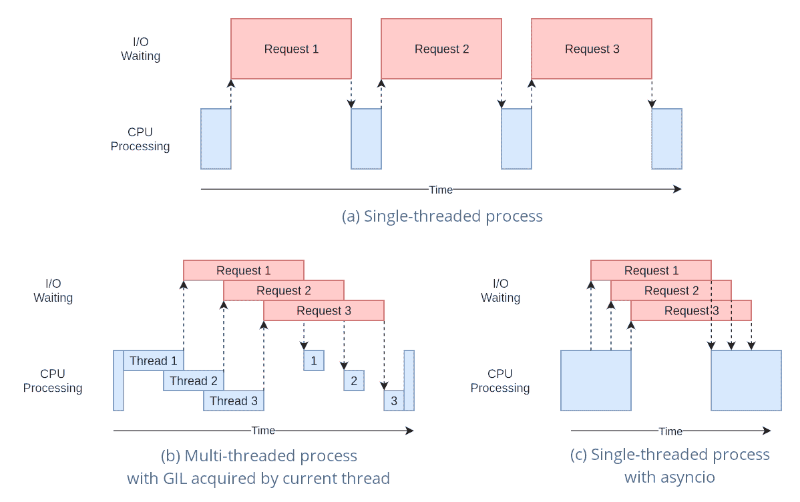

# 使用 YOLO 模型进行线程安全推理

> 原文：[`docs.ultralytics.com/guides/yolo-thread-safe-inference/`](https://docs.ultralytics.com/guides/yolo-thread-safe-inference/)

在多线程环境中运行 YOLO 模型需要仔细考虑以确保线程安全。Python 的`threading`模块允许您同时运行多个线程，但在使用这些线程跨越 YOLO 模型时，有重要的安全问题需要注意。本页将指导您创建线程安全的 YOLO 模型推理。

## 理解 Python 线程

Python 线程是一种并行形式，允许程序同时运行多个操作。然而，Python 的全局解释器锁（GIL）意味着只有一个线程可以同时执行 Python 字节码。



尽管听起来像是一个限制，线程仍然可以提供并发性，特别是对于 I/O 绑定操作或使用释放 GIL 的操作，例如 YOLO 底层的 C 库操作。

## 共享模型实例的危险

在您的线程外部实例化 YOLO 模型并在多个线程之间共享此实例可能会导致竞争条件，其中模型的内部状态由于并发访问而不一致地修改。当模型或其组件持有不设计为线程安全的状态时，这尤为严重。

### 非线程安全示例：单个模型实例

当在 Python 中使用线程时，重要的是要识别可能导致并发问题的模式。以下是应该避免的情况：在多个线程之间共享单个 YOLO 模型实例。

```py
`# Unsafe: Sharing a single model instance across threads from threading import Thread  from ultralytics import YOLO  # Instantiate the model outside the thread shared_model = YOLO("yolov8n.pt")   def predict(image_path):   """Predicts objects in an image using a preloaded YOLO model, take path string to image as argument."""     results = shared_model.predict(image_path)     # Process results   # Starting threads that share the same model instance Thread(target=predict, args=("image1.jpg",)).start() Thread(target=predict, args=("image2.jpg",)).start()` 
```

在上面的例子中，`shared_model`被多个线程使用，这可能导致不可预测的结果，因为`predict`可能会被多个线程同时执行。

### 非线程安全示例：多个模型实例

同样，这里是一个不安全的模式，涉及多个 YOLO 模型实例：

```py
`# Unsafe: Sharing multiple model instances across threads can still lead to issues from threading import Thread  from ultralytics import YOLO  # Instantiate multiple models outside the thread shared_model_1 = YOLO("yolov8n_1.pt") shared_model_2 = YOLO("yolov8n_2.pt")   def predict(model, image_path):   """Runs prediction on an image using a specified YOLO model, returning the results."""     results = model.predict(image_path)     # Process results   # Starting threads with individual model instances Thread(target=predict, args=(shared_model_1, "image1.jpg")).start() Thread(target=predict, args=(shared_model_2, "image2.jpg")).start()` 
```

即使有两个单独的模型实例，仍然存在并发问题的风险。如果`YOLO`的内部实现不是线程安全的，使用单独的实例可能无法防止竞争条件，特别是如果这些实例共享任何非线程本地的底层资源或状态。

## 线程安全推理

要执行线程安全推理，您应该在每个线程内部实例化一个单独的 YOLO 模型。这确保每个线程都有自己的隔离模型实例，消除竞争条件的风险。

### 线程安全示例

这是如何在每个线程内部实例化 YOLO 模型以进行安全并行推理的方法：

```py
`# Safe: Instantiating a single model inside each thread from threading import Thread  from ultralytics import YOLO   def thread_safe_predict(image_path):   """Predict on an image using a new YOLO model instance in a thread-safe manner; takes image path as input."""     local_model = YOLO("yolov8n.pt")     results = local_model.predict(image_path)     # Process results   # Starting threads that each have their own model instance Thread(target=thread_safe_predict, args=("image1.jpg",)).start() Thread(target=thread_safe_predict, args=("image2.jpg",)).start()` 
```

在这个例子中，每个线程创建自己的`YOLO`实例。这可以防止任何线程干扰另一个模型状态，从而确保每个线程安全地执行推理，而不会与其他线程发生意外交互。

## 结论

在使用 Python 的`threading`时，始终在将使用模型的线程内实例化模型，以确保线程安全。这种做法可以避免竞态条件，并确保推理任务可靠运行。

对于更高级的场景和进一步优化多线程推理性能，考虑使用基于进程的并行化`multiprocessing`或者利用任务队列和专用工作进程。

## 常见问题解答

### 如何在多线程 Python 环境中使用 YOLO 模型避免竞态条件？

为了在多线程 Python 环境中使用 Ultralytics YOLO 模型时避免竞态条件，应在每个线程内实例化一个独立的 YOLO 模型。这确保每个线程有其自己的隔离模型实例，避免对模型状态的并发修改。

示例：

```py
`from threading import Thread  from ultralytics import YOLO   def thread_safe_predict(image_path):   """Predict on an image in a thread-safe manner."""     local_model = YOLO("yolov8n.pt")     results = local_model.predict(image_path)     # Process results   Thread(target=thread_safe_predict, args=("image1.jpg",)).start() Thread(target=thread_safe_predict, args=("image2.jpg",)).start()` 
```

欲了解更多关于确保线程安全的信息，请访问“使用 YOLO 模型进行线程安全推理”的章节。

### 在 Python 中运行多线程 YOLO 模型推理的最佳实践是什么？

要安全地在 Python 中运行多线程 YOLO 模型推理，请遵循以下最佳实践：

1.  在每个线程内实例化 YOLO 模型，而不是在多个线程之间共享单个模型实例。

1.  使用 Python 的`multiprocessing`模块进行并行处理以避免与全局解释器锁（GIL）相关的问题。

1.  通过使用 YOLO 底层 C 库执行的操作释放 GIL。

线程安全模型实例化示例：

```py
`from threading import Thread  from ultralytics import YOLO   def thread_safe_predict(image_path):   """Runs inference in a thread-safe manner with a new YOLO model instance."""     model = YOLO("yolov8n.pt")     results = model.predict(image_path)     # Process results   # Initiate multiple threads Thread(target=thread_safe_predict, args=("image1.jpg",)).start() Thread(target=thread_safe_predict, args=("image2.jpg",)).start()` 
```

欲了解更多背景，请参阅“线程安全推理”部分。

### 为什么每个线程应该有自己的 YOLO 模型实例？

每个线程应该有自己的 YOLO 模型实例以避免竞态条件。当多个线程共享单个模型实例时，同时访问可能导致不可预测的行为和对模型内部状态的修改。通过使用独立实例，确保线程隔离，使得多线程任务可靠和安全。

欲了解详细指南，请查看“非线程安全示例：单一模型实例和线程安全示例”部分。

### Python 的全局解释器锁（GIL）如何影响 YOLO 模型推理？

Python 的全局解释器锁（GIL）每次只允许一个线程执行 Python 字节码，这可能限制 CPU 绑定的多线程任务的性能。然而，对于 I/O 绑定的操作或使用释放 GIL 的库（如 YOLO 的 C 库）的进程，仍然可以实现并发性。为了提高性能，考虑使用 Python 的`multiprocessing`模块进行基于进程的并行化。

想了解 Python 中线程的更多信息，请参阅“理解 Python 线程”部分。

### 在 YOLO 模型推理中，使用基于进程的并行化是否比使用线程更安全？

是的，使用 Python 的 `multiprocessing` 模块在并行运行 YOLO 模型推理时更安全且通常更高效。基于进程的并行处理创建了独立的内存空间，避免了全局解释器锁（GIL）并减少并发问题的风险。每个进程将独立运行其自己的 YOLO 模型实例。

关于使用 YOLO 模型的基于进程的并行处理的详细信息，请参阅线程安全推理页面。
