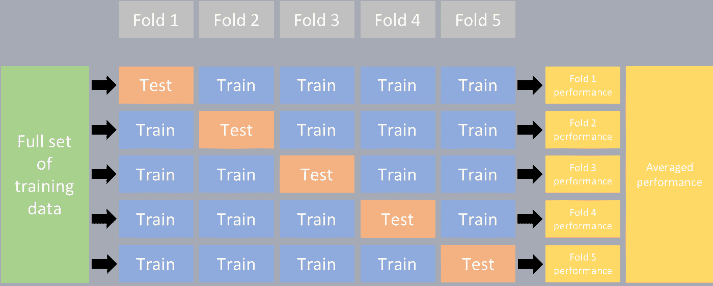

# 使用 Ultralytics 进行 K 折交叉验证

> 原文：[`docs.ultralytics.com/guides/kfold-cross-validation/`](https://docs.ultralytics.com/guides/kfold-cross-validation/)

## 介绍

这份全面的指南演示了在 Ultralytics 生态系统内实施物体检测数据集的 K 折交叉验证的过程。我们将利用 YOLO 检测格式和关键的 Python 库（如 sklearn、pandas 和 PyYaml）来指导您完成必要的设置，生成特征向量以及执行 K 折数据集拆分的过程。



无论您的项目涉及 Fruit Detection 数据集还是自定义数据源，本教程旨在帮助您理解并应用 K 折交叉验证来增强机器学习模型的可靠性和健壮性。虽然本教程中应用了`k=5`折，但请注意，最优折数可能因您的数据集和项目的特定情况而异。

言归正传，让我们开始吧！

## 设置

+   您的标注应采用 YOLO 检测格式。

+   本指南假定注释文件已在本地可用。

+   我们使用的是[Fruit Detection](https://www.kaggle.com/datasets/lakshaytyagi01/fruit-detection/code)数据集进行演示。

    +   该数据集共包含 8479 张图像。

    +   它包含 6 个类别标签，每个标签的总实例数如下所示。

| 类别标签 | 实例计数 |
| --- | --- |
| 苹果 | 7049 |
| 葡萄 | 7202 |
| 菠萝 | 1613 |
| 橙子 | 15549 |
| 香蕉 | 3536 |
| 西瓜 | 1976 |

+   必要的 Python 包括：

    +   `ultralytics`

    +   `sklearn`

    +   `pandas`

    +   `pyyaml`

+   本教程使用`k=5`折。但是，您应确定适合您特定数据集的最佳折数。

+   为项目初始化一个新的 Python 虚拟环境（`venv`）并激活它。使用`pip`（或您偏好的包管理器）安装：

    +   Ultralytics 库：`pip install -U ultralytics`。或者，您可以克隆官方[repo](https://github.com/ultralytics/ultralytics)。

    +   Scikit-learn、pandas 和 PyYAML：`pip install -U scikit-learn pandas pyyaml`。

+   确保您的标注采用 YOLO 检测格式。

    +   对于本教程，所有的标注文件都位于`Fruit-Detection/labels`目录中。

## 生成物体检测数据集的特征向量

1.  首先，创建一个名为`example.py`的新 Python 文件，进行以下步骤。

1.  继续检索数据集的所有标签文件。

    ```py
    from pathlib import Path

    dataset_path = Path("./Fruit-detection")  # replace with 'path/to/dataset' for your custom data
    labels = sorted(dataset_path.rglob("*labels/*.txt"))  # all data in 'labels' 
    ```

1.  现在，读取数据集的 YAML 文件内容，并提取类别标签的索引。

    ```py
    yaml_file = "path/to/data.yaml"  # your data YAML with data directories and names dictionary
    with open(yaml_file, "r", encoding="utf8") as y:
        classes = yaml.safe_load(y)["names"]
    cls_idx = sorted(classes.keys()) 
    ```

1.  初始化一个空的`pandas` DataFrame。

    ```py
    import pandas as pd

    indx = [l.stem for l in labels]  # uses base filename as ID (no extension)
    labels_df = pd.DataFrame([], columns=cls_idx, index=indx) 
    ```

1.  统计每个类别标签在标注文件中的实例数。

    ```py
    from collections import Counter

    for label in labels:
        lbl_counter = Counter()

        with open(label, "r") as lf:
            lines = lf.readlines()

        for l in lines:
            # classes for YOLO label uses integer at first position of each line
            lbl_counter[int(l.split(" ")[0])] += 1

        labels_df.loc[label.stem] = lbl_counter

    labels_df = labels_df.fillna(0.0)  # replace `nan` values with `0.0` 
    ```

1.  下面是填充的 DataFrame 的示例视图：

    ```py
     0    1    2    3    4    5
    '0000a16e4b057580_jpg.rf.00ab48988370f64f5ca8ea4...'  0.0  0.0  0.0  0.0  0.0  7.0
    '0000a16e4b057580_jpg.rf.7e6dce029fb67f01eb19aa7...'  0.0  0.0  0.0  0.0  0.0  7.0
    '0000a16e4b057580_jpg.rf.bc4d31cdcbe229dd022957a...'  0.0  0.0  0.0  0.0  0.0  7.0
    '00020ebf74c4881c_jpg.rf.508192a0a97aa6c4a3b6882...'  0.0  0.0  0.0  1.0  0.0  0.0
    '00020ebf74c4881c_jpg.rf.5af192a2254c8ecc4188a25...'  0.0  0.0  0.0  1.0  0.0  0.0
     ...                                                  ...  ...  ...  ...  ...  ...
    'ff4cd45896de38be_jpg.rf.c4b5e967ca10c7ced3b9e97...'  0.0  0.0  0.0  0.0  0.0  2.0
    'ff4cd45896de38be_jpg.rf.ea4c1d37d2884b3e3cbce08...'  0.0  0.0  0.0  0.0  0.0  2.0
    'ff5fd9c3c624b7dc_jpg.rf.bb519feaa36fc4bf630a033...'  1.0  0.0  0.0  0.0  0.0  0.0
    'ff5fd9c3c624b7dc_jpg.rf.f0751c9c3aa4519ea3c9d6a...'  1.0  0.0  0.0  0.0  0.0  0.0
    'fffe28b31f2a70d4_jpg.rf.7ea16bd637ba0711c53b540...'  0.0  6.0  0.0  0.0  0.0  0.0 
    ```

行索引标签文件，每个文件对应数据集中的一个图像，列对应类别标签索引。每行代表一个伪特征向量，其中包含数据集中每个类别标签的计数。这种数据结构使得可以将 K 折交叉验证应用于目标检测数据集。

## K 折数据集分割

1.  现在，我们将使用`sklearn.model_selection`中的`KFold`类来生成数据集的`k`个分割。

    +   重要：

        +   设置`shuffle=True`可确保在分割中类别的随机分布。

        +   通过设置`random_state=M`，其中`M`是选择的整数，可以获得可重复的结果。

    ```py
    from sklearn.model_selection import KFold

    ksplit = 5
    kf = KFold(n_splits=ksplit, shuffle=True, random_state=20)  # setting random_state for repeatable results

    kfolds = list(kf.split(labels_df)) 
    ```

1.  数据集现已分为`k`折，每折都有一个`train`和`val`索引列表。我们将构建一个数据框架来更清楚地显示这些结果。

    ```py
    folds = [f"split_{n}" for n in range(1, ksplit + 1)]
    folds_df = pd.DataFrame(index=indx, columns=folds)

    for idx, (train, val) in enumerate(kfolds, start=1):
        folds_df[f"split_{idx}"].loc[labels_df.iloc[train].index] = "train"
        folds_df[f"split_{idx}"].loc[labels_df.iloc[val].index] = "val" 
    ```

1.  现在，我们将计算每个折中`val`中类别标签与`train`中类别标签的分布比率。

    ```py
    fold_lbl_distrb = pd.DataFrame(index=folds, columns=cls_idx)

    for n, (train_indices, val_indices) in enumerate(kfolds, start=1):
        train_totals = labels_df.iloc[train_indices].sum()
        val_totals = labels_df.iloc[val_indices].sum()

        # To avoid division by zero, we add a small value (1E-7) to the denominator
        ratio = val_totals / (train_totals + 1e-7)
        fold_lbl_distrb.loc[f"split_{n}"] = ratio 
    ```

    理想情况是每个分割中所有类别的比例都相对均衡，并且跨类别也相似。然而，这将取决于您数据集的具体情况。

1.  接下来，我们为每个分割创建目录和数据集 YAML 文件。

    ```py
    import datetime

    supported_extensions = [".jpg", ".jpeg", ".png"]

    # Initialize an empty list to store image file paths
    images = []

    # Loop through supported extensions and gather image files
    for ext in supported_extensions:
        images.extend(sorted((dataset_path / "images").rglob(f"*{ext}")))

    # Create the necessary directories and dataset YAML files (unchanged)
    save_path = Path(dataset_path / f"{datetime.date.today().isoformat()}_{ksplit}-Fold_Cross-val")
    save_path.mkdir(parents=True, exist_ok=True)
    ds_yamls = []

    for split in folds_df.columns:
        # Create directories
        split_dir = save_path / split
        split_dir.mkdir(parents=True, exist_ok=True)
        (split_dir / "train" / "images").mkdir(parents=True, exist_ok=True)
        (split_dir / "train" / "labels").mkdir(parents=True, exist_ok=True)
        (split_dir / "val" / "images").mkdir(parents=True, exist_ok=True)
        (split_dir / "val" / "labels").mkdir(parents=True, exist_ok=True)

        # Create dataset YAML files
        dataset_yaml = split_dir / f"{split}_dataset.yaml"
        ds_yamls.append(dataset_yaml)

        with open(dataset_yaml, "w") as ds_y:
            yaml.safe_dump(
                {
                    "path": split_dir.as_posix(),
                    "train": "train",
                    "val": "val",
                    "names": classes,
                },
                ds_y,
            ) 
    ```

1.  最后，将图像和标签复制到相应的目录（'train'或'val'）中的每个分割。

    +   **注意：** 此部分代码所需的时间取决于数据集的大小和系统硬件。

    ```py
    import shutil

    for image, label in zip(images, labels):
        for split, k_split in folds_df.loc[image.stem].items():
            # Destination directory
            img_to_path = save_path / split / k_split / "images"
            lbl_to_path = save_path / split / k_split / "labels"

            # Copy image and label files to new directory (SamefileError if file already exists)
            shutil.copy(image, img_to_path / image.name)
            shutil.copy(label, lbl_to_path / label.name) 
    ```

## 保存记录（可选）

可选地，您可以将 K 折分割和标签分布数据框架的记录保存为 CSV 文件以供将来参考。

```py
folds_df.to_csv(save_path / "kfold_datasplit.csv")
fold_lbl_distrb.to_csv(save_path / "kfold_label_distribution.csv") 
```

## 使用 K 折数据分割训练 YOLO

1.  首先，加载 YOLO 模型。

    ```py
    from ultralytics import YOLO

    weights_path = "path/to/weights.pt"
    model = YOLO(weights_path, task="detect") 
    ```

1.  接下来，迭代数据集 YAML 文件以运行训练。结果将保存到由`project`和`name`参数指定的目录中。默认情况下，该目录为 'exp/runs#'，其中#是整数索引。

    ```py
    results = {}

    # Define your additional arguments here
    batch = 16
    project = "kfold_demo"
    epochs = 100

    for k in range(ksplit):
        dataset_yaml = ds_yamls[k]
        model.train(data=dataset_yaml, epochs=epochs, batch=batch, project=project)  # include any train arguments
        results[k] = model.metrics  # save output metrics for further analysis 
    ```

## 结论

在本指南中，我们探讨了如何使用 K 折交叉验证来训练 YOLO 目标检测模型的过程。我们学习了如何将数据集分割成 K 个分区，确保在不同分区之间有平衡的类分布。

我们还探讨了创建报告数据框架的过程，以可视化数据分割和标签分布，为我们提供了对训练和验证集结构的清晰洞察。

可选地，我们保存了我们的记录以供将来参考，在大型项目或解决模型性能问题时尤其有用。

最后，我们使用循环在每个分割中实现了实际的模型训练，保存了我们的训练结果以供进一步分析和比较。

K 折交叉验证技术是利用可用数据的一种强大方法，有助于确保模型在不同数据子集上的性能可靠和一致。这将导致更具泛化性和可靠性的模型，不太可能过度拟合特定数据模式。

请记住，虽然我们在本指南中使用了 YOLO，但这些步骤大部分是可以迁移到其他机器学习模型的。了解这些步骤可以帮助您有效地在自己的机器学习项目中应用交叉验证。祝编程愉快！

## 常见问题

### 什么是 K 折交叉验证，以及在目标检测中它为什么有用？

K 折交叉验证是一种技术，将数据集分为'k'个子集（折叠），以更可靠地评估模型性能。每个折叠都用作训练和验证数据。在目标检测的背景下，使用 K 折交叉验证有助于确保您的 Ultralytics YOLO 模型在不同数据拆分下的性能稳健且具有泛化能力，从而增强其可靠性。有关设置 Ultralytics YOLO 的 K 折交叉验证的详细说明，请参阅 K 折交叉验证与 Ultralytics。

### 如何使用 Ultralytics YOLO 实现 K 折交叉验证？

要使用 Ultralytics YOLO 实现 K 折交叉验证，需要按照以下步骤操作：

1.  验证注释是否符合 YOLO 检测格式。

1.  使用 Python 库，如`sklearn`、`pandas`和`pyyaml`。

1.  从你的数据集中创建特征向量。

1.  使用`sklearn.model_selection`中的`KFold`来分割你的数据集。

1.  在每个拆分上训练 YOLO 模型。

欲了解详细指南，请查看我们文档中的 K-Fold 数据集分割部分。

### 为什么应该使用 Ultralytics YOLO 进行目标检测？

Ultralytics YOLO 提供了高精度高效率的实时目标检测，支持多种计算机视觉任务，如检测、分割和分类。此外，它与 Ultralytics HUB 等工具无缝集成，用于无代码模型训练和部署。有关更多详细信息，请探索我们的[Ultralytics YOLO 页面](https://www.ultralytics.com/yolo)上的优点和功能。

### 如何确保我的注释符合 Ultralytics YOLO 的正确格式？

你的注释应该遵循 YOLO 检测格式。每个注释文件必须列出对象类别及其在图像中的边界框坐标。YOLO 格式确保了训练目标检测模型时数据处理的流畅性和标准化。有关正确注释格式的更多信息，请访问 YOLO 检测格式指南。

### 我可以在除了 Fruit Detection 以外的自定义数据集上使用 K 折交叉验证吗？

是的，只要注释符合 YOLO 检测格式，你可以在任何自定义数据集上使用 K 折交叉验证。用你自定义数据集的路径和类标签替换数据集路径和类标签。这种灵活性确保了任何目标检测项目都能通过 K 折交叉验证进行强大的模型评估。有关实际示例，请查看我们的生成特征向量部分。
