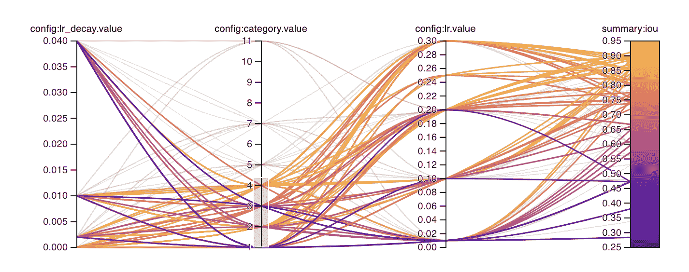
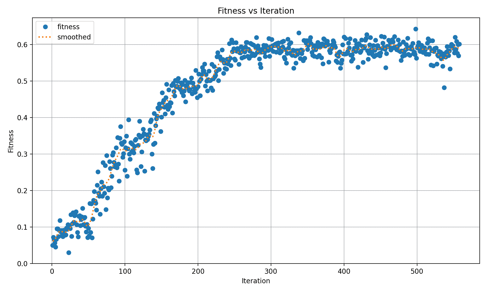
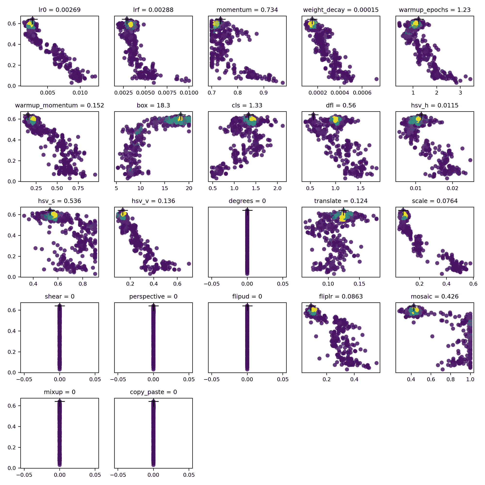

# Ultralytics YOLO 超参数调整指南

> 原文：[`docs.ultralytics.com/guides/hyperparameter-tuning/`](https://docs.ultralytics.com/guides/hyperparameter-tuning/)

## 介绍

超参数调整不仅仅是一次性设置，而是一个迭代过程，旨在优化机器学习模型的性能指标，如准确率、精确率和召回率。在 Ultralytics YOLO 的背景下，这些超参数可以从学习率到架构细节，如层数或激活函数类型。

### 什么是超参数？

超参数是算法的高级结构设置。它们在训练阶段之前设置，并在其间保持不变。以下是 Ultralytics YOLO 中一些常调整的超参数：

+   **学习率** `lr0`: 确定每次迭代中在损失函数中向最小值移动的步长大小。

+   **批处理大小** `batch`: 在前向传递中同时处理的图像数量。

+   **训练周期数** `epochs`: 一个周期是所有训练样本的完整前向和后向传递。

+   **架构细节**: 如通道数、层数、激活函数类型等。



关于 YOLOv8 中使用的所有增强超参数的完整列表，请参阅配置页面。

### 遗传进化和突变

Ultralytics YOLO 使用遗传算法来优化超参数。遗传算法受自然选择和遗传机制的启发。

+   **突变**: 在 Ultralytics YOLO 的背景下，突变通过对现有超参数应用小的随机更改，在超参数空间中进行局部搜索，生成新的评估候选者。

+   **交叉**: 虽然交叉是一种流行的遗传算法技术，但它目前在 Ultralytics YOLO 中不用于超参数调整。主要关注通过变异生成新的超参数集。

## 准备超参数调整

在开始调整过程之前，重要的是：

1.  **确定评估模型性能的指标**：这可能是 AP50、F1 分数或其他指标。

1.  **设定调整预算**：定义你愿意分配的计算资源量。超参数调整可能需要大量计算资源。

## 涉及步骤

### 初始化超参数

从一组合理的初始超参数开始。这可以是由 Ultralytics YOLO 默认设置的超参数，也可以是基于您的领域知识或先前实验的某些内容。

### 变异超参数

使用`_mutate`方法基于现有集合生成新的超参数集。

### 训练模型

使用变异后的超参数集进行训练。然后评估训练性能。

### 评估模型

使用 AP50、F1 分数或自定义指标等指标评估模型性能。

### 记录结果

记录性能指标及相应超参数对于将来参考非常重要。

### 重复

这个过程重复进行，直到达到设定的迭代次数或性能指标令人满意为止。

## 用法示例

这里是如何使用`model.tune()`方法利用`Tuner`类对 YOLOv8n 在 COCO8 上进行 30 个 epoch 的超参数调整，使用 AdamW 优化器，并跳过绘图、检查点和仅在最后一个 epoch 上进行验证以加快调整速度。

示例

```py
`from ultralytics import YOLO  # Initialize the YOLO model model = YOLO("yolov8n.pt")  # Tune hyperparameters on COCO8 for 30 epochs model.tune(data="coco8.yaml", epochs=30, iterations=300, optimizer="AdamW", plots=False, save=False, val=False)` 
```

## 结果

在成功完成超参数调整过程之后，您将获得几个文件和目录，这些文件和目录概括了调整结果。以下是每个的描述：

### 文件结构

下面是结果目录结构的示例。像`train1/`这样的训练目录包含单独的调整迭代，即使用一组超参数训练的一个模型。`tune/`目录包含所有单独模型训练的调整结果：

```py
`runs/ └── detect/     ├── train1/     ├── train2/     ├── ...     └── tune/         ├── best_hyperparameters.yaml         ├── best_fitness.png         ├── tune_results.csv         ├── tune_scatter_plots.png         └── weights/             ├── last.pt             └── best.pt` 
```

### 文件描述

#### best_hyperparameters.yaml

此 YAML 文件包含调整过程中找到的表现最佳的超参数。您可以使用此文件使用这些优化设置初始化未来的训练。

+   **格式**: YAML

+   **用法**: 超参数结果

+   **示例**:

    ```py
    `# 558/900 iterations complete ✅ (45536.81s) # Results saved to /usr/src/ultralytics/runs/detect/tune # Best fitness=0.64297 observed at iteration 498 # Best fitness metrics are {'metrics/precision(B)': 0.87247, 'metrics/recall(B)': 0.71387, 'metrics/mAP50(B)': 0.79106, 'metrics/mAP50-95(B)': 0.62651, 'val/box_loss': 2.79884, 'val/cls_loss': 2.72386, 'val/dfl_loss': 0.68503, 'fitness': 0.64297} # Best fitness model is /usr/src/ultralytics/runs/detect/train498 # Best fitness hyperparameters are printed below.  lr0:  0.00269 lrf:  0.00288 momentum:  0.73375 weight_decay:  0.00015 warmup_epochs:  1.22935 warmup_momentum:  0.1525 box:  18.27875 cls:  1.32899 dfl:  0.56016 hsv_h:  0.01148 hsv_s:  0.53554 hsv_v:  0.13636 degrees:  0.0 translate:  0.12431 scale:  0.07643 shear:  0.0 perspective:  0.0 flipud:  0.0 fliplr:  0.08631 mosaic:  0.42551 mixup:  0.0 copy_paste:  0.0` 
    ```

#### best_fitness.png

这是一个显示适应度（通常是像 AP50 这样的性能指标）随迭代次数变化的图表。它帮助您可视化遗传算法随时间的表现情况。

+   **格式**: PNG

+   **用法**: 性能可视化



#### tune_results.csv

CSV 文件包含调整过程中每次迭代的详细结果。文件中的每一行代表一次迭代，包括适应度分数、精确度、召回率以及所使用的超参数。

+   **格式**: CSV

+   **用法**: 追踪每次迭代的结果。

+   **示例**:

    ```py
     `fitness,lr0,lrf,momentum,weight_decay,warmup_epochs,warmup_momentum,box,cls,dfl,hsv_h,hsv_s,hsv_v,degrees,translate,scale,shear,perspective,flipud,fliplr,mosaic,mixup,copy_paste   0.05021,0.01,0.01,0.937,0.0005,3.0,0.8,7.5,0.5,1.5,0.015,0.7,0.4,0.0,0.1,0.5,0.0,0.0,0.0,0.5,1.0,0.0,0.0   0.07217,0.01003,0.00967,0.93897,0.00049,2.79757,0.81075,7.5,0.50746,1.44826,0.01503,0.72948,0.40658,0.0,0.0987,0.4922,0.0,0.0,0.0,0.49729,1.0,0.0,0.0   0.06584,0.01003,0.00855,0.91009,0.00073,3.42176,0.95,8.64301,0.54594,1.72261,0.01503,0.59179,0.40658,0.0,0.0987,0.46955,0.0,0.0,0.0,0.49729,0.80187,0.0,0.0` 
    ```

#### tune_scatter_plots.png

此文件包含从`tune_results.csv`生成的散点图，帮助您可视化不同超参数与性能指标之间的关系。请注意，初始化为 0 的超参数将不会被调整，例如下面的`degrees`和`shear`。

+   **格式**: PNG

+   **用法**: 探索性数据分析



#### weights/

此目录包含在超参数调整过程中最后和最佳迭代期间保存的 PyTorch 模型。

+   **`last.pt`**: `last.pt`是训练的最后一个 epoch 的权重。

+   **`best.pt`**: 达到最佳适应度分数的迭代的`best.pt`权重。

利用这些结果，您可以为未来的模型训练和分析做出更加明智的决策。随时参考这些工件，了解您的模型表现如何以及如何进一步改进它。

## 结论

Ultralytics YOLO 的超参数调优过程通过基于变异的遗传算法方法简化但功能强大。按照本指南中概述的步骤进行操作将帮助您系统地调整模型以实现更好的性能。

### 进一步阅读

1.  [维基百科中的超参数优化](https://en.wikipedia.org/wiki/Hyperparameter_optimization)

1.  YOLOv5 超参数演化指南

1.  使用 Ray Tune 和 YOLOv8 进行高效的超参数调优

想要深入了解的话，你可以查看`Tuner`类的源代码和相关文档。如果你有任何问题、功能请求或需要进一步帮助，请随时通过[GitHub](https://github.com/ultralytics/ultralytics/issues/new/choose)或[Discord](https://ultralytics.com/discord)联系我们。

## 常见问题

### 如何在 Ultralytics YOLO 的超参数调优过程中优化学习率？

要优化 Ultralytics YOLO 的学习率，请从设置初始学习率`lr0`参数开始。常见的初始值范围为`0.001`到`0.01`。在超参数调优过程中，此值将进行变异以找到最佳设置。您可以利用`model.tune()`方法来自动化此过程。例如：

示例

```py
`from ultralytics import YOLO  # Initialize the YOLO model model = YOLO("yolov8n.pt")  # Tune hyperparameters on COCO8 for 30 epochs model.tune(data="coco8.yaml", epochs=30, iterations=300, optimizer="AdamW", plots=False, save=False, val=False)` 
```

欲了解更多详情，请查看 Ultralytics YOLO 配置页面。

### 在 YOLOv8 中使用遗传算法进行超参数调优的好处是什么？

Ultralytics YOLOv8 中的遗传算法提供了一种探索超参数空间的强大方法，从而实现高度优化的模型性能。其主要优势包括：

+   **高效搜索**：像变异这样的遗传算法可以快速探索大量的超参数。

+   **避免局部最小值**：通过引入随机性，有助于避免局部最小值，确保更好的全局优化。

+   **性能指标**：它们根据 AP50 和 F1 分数等性能指标进行调整。

要了解遗传算法如何优化超参数，请查看超参数演化指南。

### Ultralytics YOLO 的超参数调优过程需要多长时间？

使用 Ultralytics YOLO 进行超参数调优所需的时间在很大程度上取决于多个因素，如数据集大小、模型架构复杂性、迭代次数以及可用的计算资源。例如，对像 COCO8 这样的数据集进行 30 个 epochs 的 YOLOv8n 调优可能需要几小时到几天不等，具体取决于硬件配置。

为了有效管理调整时间，事先定义一个明确的调整预算（内部部分链接）。这有助于平衡资源分配和优化目标。

### 在 YOLO 超参数调优过程中应该使用哪些指标来评估模型性能？

在进行 YOLO 超参数调优时评估模型性能时，可以使用几个关键指标：

+   **AP50**：在 IoU 阈值为 0.50 时的平均精度。

+   **F1 分数**：精确率和召回率的调和平均数。

+   **精确率和召回率**：这些指标表明模型在识别真正例与假正例以及假负例方面的准确性。

这些指标帮助您理解模型性能的不同方面。请参考 Ultralytics YOLO 性能指标指南，获取全面的概述。

### 我可以使用 Ultralytics HUB 来调整 YOLO 模型的超参数吗？

是的，您可以使用 Ultralytics HUB 来调整 YOLO 模型的超参数。该 HUB 提供了一个无代码平台，可以轻松上传数据集、训练模型并高效进行超参数调整。它实时跟踪和可视化调整进展和结果。

在 Ultralytics HUB 云训练文档中深入了解如何使用 Ultralytics HUB 进行超参数调整。
