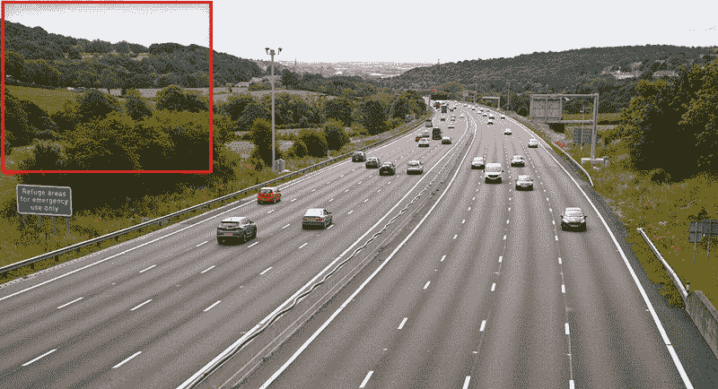
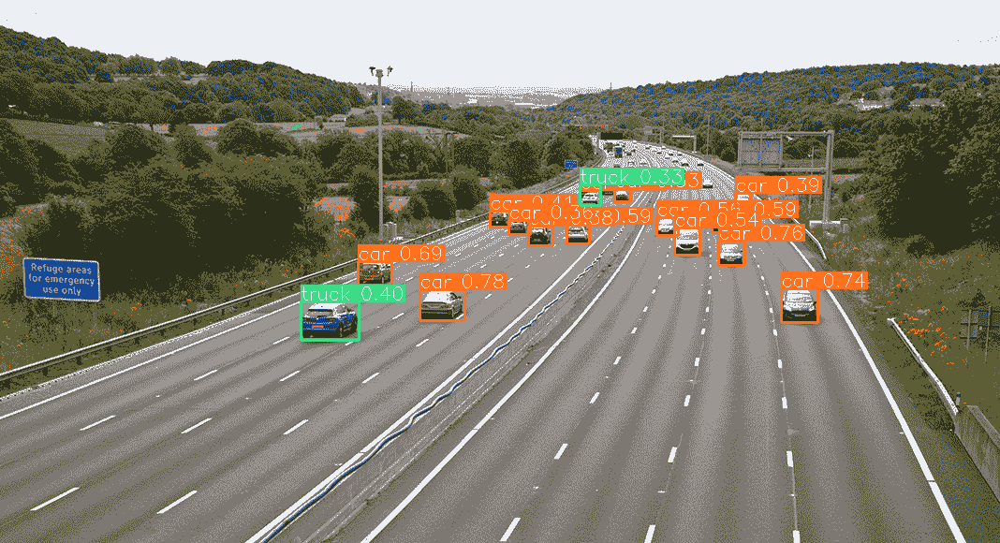
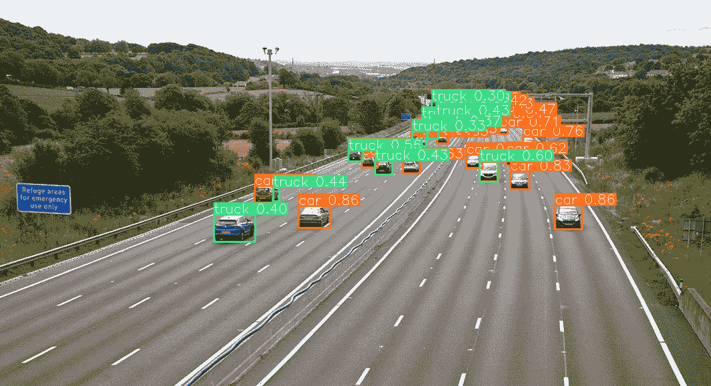

# Ultralytics 文档：如何在 SAHI 中使用 YOLOv8 进行切片推理

> 原文：[`docs.ultralytics.com/guides/sahi-tiled-inference/`](https://docs.ultralytics.com/guides/sahi-tiled-inference/)

欢迎来到 Ultralytics 文档，学习如何与 [SAHI](https://github.com/obss/sahi)（切片辅助超推理）一起使用 YOLOv8。本详尽指南旨在为您提供所有必要的知识，以便您将 SAHI 与 YOLOv8 结合使用。我们将深入探讨 SAHI 的定义、切片推理在大规模应用中的重要性，以及如何将这些功能与 YOLOv8 整合，从而提升目标检测性能。



## SAHI 简介

SAHI（切片辅助超推理）是一个创新的库，旨在优化大规模和高分辨率图像的目标检测算法。其核心功能在于将图像分割成可管理的切片，对每个切片进行目标检测，然后将结果拼合在一起。SAHI 兼容一系列目标检测模型，包括 YOLO 系列，从而在保证计算资源优化的同时提供灵活性。

[`www.youtube.com/embed/tq3FU_QczxE`](https://www.youtube.com/embed/tq3FU_QczxE)

**观看：** 使用 Ultralytics YOLOv8 进行 SAHI 推理（切片辅助超推理）

### SAHI 的关键特性

+   **无缝集成**：SAHI 与 YOLO 模型无缝集成，意味着您可以在不需要大量代码修改的情况下开始切片和检测。

+   **资源效率**：通过将大图像分解成较小的部分，SAHI 优化了内存使用，使您可以在资源有限的硬件上运行高质量的检测。

+   **高准确性**：SAHI 在拼合过程中采用智能算法合并重叠的检测框，从而保持检测的准确性。

## 什么是切片推理？

切片推理指的是将大尺寸或高分辨率图像细分为较小的段（切片），在这些切片上进行目标检测，然后重新组合这些切片，以重建原始图像上的对象位置。在计算资源有限或者处理极高分辨率图像可能导致内存问题的情况下，这种技术非常宝贵。

### 切片推理的优势

+   **减少计算负担**：较小的图像切片处理速度更快，内存消耗更少，使其能够在低端硬件上更加流畅运行。

+   **保持检测质量**：由于每个切片都是独立处理的，只要切片足够大以捕捉感兴趣的对象，就不会降低目标检测的质量。

+   **增强可扩展性**：该技术允许更轻松地在不同尺寸和分辨率的图像上进行目标检测，适用于从卫星图像到医学诊断等各种应用。

| YOLOv8 无 SAHI | YOLOv8 有 SAHI |
| --- | --- |
|  |  |

## 安装与准备

### 安装

要开始，请安装 SAHI 和 Ultralytics 的最新版本：

```py
`pip  install  -U  ultralytics  sahi` 
```

### 导入模块并下载资源

这是如何导入必要模块、下载 YOLOv8 模型和一些测试图像的方法：

```py
`from sahi.utils.file import download_from_url from sahi.utils.yolov8 import download_yolov8s_model  # Download YOLOv8 model yolov8_model_path = "models/yolov8s.pt" download_yolov8s_model(yolov8_model_path)  # Download test images download_from_url(     "https://raw.githubusercontent.com/obss/sahi/main/demo/demo_data/small-vehicles1.jpeg",     "demo_data/small-vehicles1.jpeg", ) download_from_url(     "https://raw.githubusercontent.com/obss/sahi/main/demo/demo_data/terrain2.png",     "demo_data/terrain2.png", )` 
```

## 使用 YOLOv8 进行标准推断

### 实例化模型

您可以像这样实例化 YOLOv8 模型进行目标检测：

```py
`from sahi import AutoDetectionModel  detection_model = AutoDetectionModel.from_pretrained(     model_type="yolov8",     model_path=yolov8_model_path,     confidence_threshold=0.3,     device="cpu",  # or 'cuda:0' )` 
```

### 执行标准预测

使用图像路径或 numpy 图像执行标准推断。

```py
`from sahi.predict import get_prediction  # With an image path result = get_prediction("demo_data/small-vehicles1.jpeg", detection_model)  # With a numpy image result = get_prediction(read_image("demo_data/small-vehicles1.jpeg"), detection_model)` 
```

### 可视化结果

导出并可视化预测的边界框和掩模：

```py
`result.export_visuals(export_dir="demo_data/") Image("demo_data/prediction_visual.png")` 
```

## 使用 YOLOv8 进行切片推断

指定切片尺寸和重叠比率执行切片推断：

```py
`from sahi.predict import get_sliced_prediction  result = get_sliced_prediction(     "demo_data/small-vehicles1.jpeg",     detection_model,     slice_height=256,     slice_width=256,     overlap_height_ratio=0.2,     overlap_width_ratio=0.2, )` 
```

## 处理预测结果

SAHI 提供 `PredictionResult` 对象，可转换为各种注释格式：

```py
`# Access the object prediction list object_prediction_list = result.object_prediction_list  # Convert to COCO annotation, COCO prediction, imantics, and fiftyone formats result.to_coco_annotations()[:3] result.to_coco_predictions(image_id=1)[:3] result.to_imantics_annotations()[:3] result.to_fiftyone_detections()[:3]` 
```

## 批量预测

对目录中的图像进行批量预测：

```py
`from sahi.predict import predict  predict(     model_type="yolov8",     model_path="path/to/yolov8n.pt",     model_device="cpu",  # or 'cuda:0'     model_confidence_threshold=0.4,     source="path/to/dir",     slice_height=256,     slice_width=256,     overlap_height_ratio=0.2,     overlap_width_ratio=0.2, )` 
```

就这样！现在您已准备好使用 YOLOv8 和 SAHI 进行标准和切片推断了。

## 引用与致谢

如果您在研究或开发工作中使用 SAHI，请引用原始的 SAHI 论文并致谢作者：

```py
`@article{akyon2022sahi,   title={Slicing Aided Hyper Inference and Fine-tuning for Small Object Detection},   author={Akyon, Fatih Cagatay and Altinuc, Sinan Onur and Temizel, Alptekin},   journal={2022 IEEE International Conference on Image Processing (ICIP)},   doi={10.1109/ICIP46576.2022.9897990},   pages={966-970},   year={2022} }` 
```

我们衷心感谢 SAHI 研究组为计算机视觉社区创建和维护这一宝贵资源。有关 SAHI 及其作者的更多信息，请访问 [SAHI GitHub 仓库](https://github.com/obss/sahi)。

## 常见问题解答

### 如何集成 YOLOv8 和 SAHI 以在目标检测中进行切片推断？

将 Ultralytics YOLOv8 与 SAHI 集成（切片辅助超推断）用于在高分辨率图像上优化切片推断，通过将图像分割成可管理的切片来改善内存使用和确保高检测精度。要开始使用，您需要安装 ultralytics 和 sahi 库：

```py
`pip  install  -U  ultralytics  sahi` 
```

然后，下载 YOLOv8 模型和测试图像：

```py
`from sahi.utils.file import download_from_url from sahi.utils.yolov8 import download_yolov8s_model  # Download YOLOv8 model yolov8_model_path = "models/yolov8s.pt" download_yolov8s_model(yolov8_model_path)  # Download test images download_from_url(     "https://raw.githubusercontent.com/obss/sahi/main/demo/demo_data/small-vehicles1.jpeg",     "demo_data/small-vehicles1.jpeg", )` 
```

欲了解更详细的说明，请参阅我们的切片推断指南。

### 我为什么要在大图像上使用 YOLOv8 和 SAHI 进行目标检测？

使用 SAHI 和 Ultralytics YOLOv8 在大图像上进行目标检测提供了几个好处：

+   **减少计算负担**：更小的切片处理速度更快，消耗更少内存，使得在资源有限的硬件上运行高质量检测成为可能。

+   **保持检测精度**：SAHI 使用智能算法合并重叠框，保持检测质量。

+   **增强可扩展性**：通过在不同图像尺寸和分辨率上扩展目标检测任务，SAHI 成为各种应用的理想选择，如卫星图像分析和医学诊断。

在我们的文档中了解更多关于切片推理的好处。

### 当使用 YOLOv8 和 SAHI 时，我可以可视化预测结果吗？

是的，当使用 YOLOv8 和 SAHI 时，您可以可视化预测结果。以下是导出和可视化结果的方法：

```py
`result.export_visuals(export_dir="demo_data/") from IPython.display import Image  Image("demo_data/prediction_visual.png")` 
```

此命令将预测结果保存到指定目录，并且您可以加载图像在您的笔记本或应用程序中查看它。查看标准推理部分以获取详细指南。

### SAHI 提供了哪些功能来改进 YOLOv8 的目标检测？

SAHI（切片辅助超推理）提供了几个功能，可以补充 Ultralytics YOLOv8 进行目标检测：

+   **无缝集成**：SAHI 轻松集成到 YOLO 模型中，只需进行最少的代码调整。

+   **资源效率**：它将大图像分割成较小的切片，优化内存使用和速度。

+   **高准确性**：通过在拼接过程中有效合并重叠的检测框，SAHI 保持高检测准确性。

深入了解，请阅读关于 SAHI 的关键特性。

### 如何处理使用 YOLOv8 和 SAHI 的大规模推理项目？

要处理使用 YOLOv8 和 SAHI 的大规模推理项目，请遵循以下最佳实践：

1.  **安装所需的库**：确保您拥有最新版本的 ultralytics 和 sahi。

1.  **配置切片推理**：确定适合您特定项目的最佳切片尺寸和重叠比率。

1.  **运行批量预测**：利用 SAHI 的能力对图像目录进行批量预测，从而提高效率。

批量预测示例：

```py
`from sahi.predict import predict  predict(     model_type="yolov8",     model_path="path/to/yolov8n.pt",     model_device="cpu",  # or 'cuda:0'     model_confidence_threshold=0.4,     source="path/to/dir",     slice_height=256,     slice_width=256,     overlap_height_ratio=0.2,     overlap_width_ratio=0.2, )` 
```

要获取更详细的步骤，请访问我们的批量预测部分。
