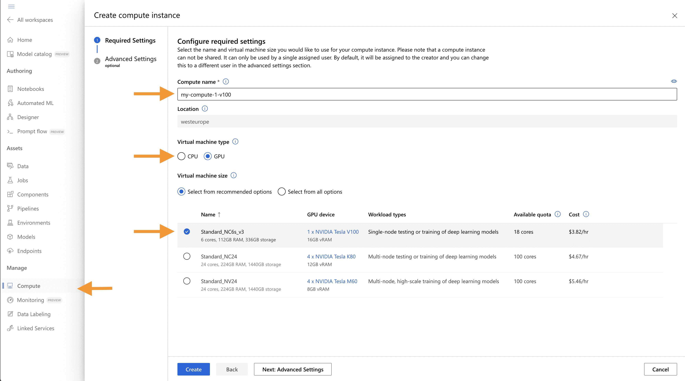
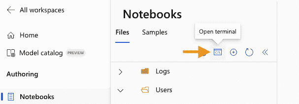

# YOLOv8 🚀 在 AzureML 上

> 原文：[`docs.ultralytics.com/guides/azureml-quickstart/`](https://docs.ultralytics.com/guides/azureml-quickstart/)

## 什么是 Azure？

[Azure](https://azure.microsoft.com/) 是微软的云计算平台，旨在帮助组织将其工作负载从本地数据中心转移到云上。凭借包括计算、数据库、分析、机器学习和网络在内的全方位云服务，用户可以根据需要选择这些服务来开发和扩展新应用程序或运行现有应用程序。

## 什么是 Azure 机器学习（AzureML）？

Azure 机器学习，通常称为 AzureML，是一种完全托管的云服务，使数据科学家和开发人员能够有效地将预测性分析嵌入其应用程序中，帮助组织利用大规模数据集，并将云的所有优势带入机器学习中。AzureML 提供了各种服务和功能，旨在使机器学习易于访问、易于使用且易于扩展。它提供了自动化机器学习、拖放式模型训练以及强大的 Python SDK，使开发人员能够充分利用其机器学习模型。

## AzureML 如何使 YOLO 用户受益？

对于 YOLO（You Only Look Once）的用户，AzureML 提供了一个强大、可扩展和高效的平台，用于训练和部署机器学习模型。无论您是想运行快速原型还是扩展以处理更广泛的数据，AzureML 灵活且用户友好的环境提供了各种工具和服务来满足您的需求。您可以利用 AzureML 来：

+   轻松管理大型数据集和计算资源以进行训练。

+   利用内置工具进行数据预处理、特征选择和模型训练。

+   通过支持 MLOps（机器学习运营）的能力更有效地进行协作，包括但不限于对模型和数据的监视、审计和版本控制。

在接下来的几节中，您将找到一个快速入门指南，详细介绍如何在 AzureML 上运行 YOLOv8 目标检测模型，无论是从计算终端还是笔记本电脑。

## 先决条件

在开始之前，请确保您可以访问 AzureML 工作区。如果没有，请按照 Azure 的官方文档创建一个新的 [AzureML 工作区](https://learn.microsoft.com/azure/machine-learning/concept-workspace?view=azureml-api-2)。这个工作区作为管理所有 AzureML 资源的集中地。

## 创建计算实例

从您的 AzureML 工作区中，选择 Compute > Compute instances > New，选择具有所需资源的实例。



## 从终端快速入门

启动您的计算机并打开终端：



### 创建虚拟环境

创建您的 conda 虚拟环境并在其中安装 pip：

```py
conda  create  --name  yolov8env  -y
conda  activate  yolov8env
conda  install  pip  -y 
```

安装所需的依赖项：

```py
cd  ultralytics
pip  install  -r  requirements.txt
pip  install  ultralytics
pip  install  onnx>=1.12.0 
```

### 执行 YOLOv8 任务

预测：

```py
yolo  predict  model=yolov8n.pt  source='https://ultralytics.com/images/bus.jpg' 
```

使用初始学习率为 0.01 训练一个检测模型，进行 10 个 epochs：

```py
yolo  train  data=coco8.yaml  model=yolov8n.pt  epochs=10  lr0=0.01 
```

您可以在这里找到更多使用 Ultralytics CLI 的指令。

## 从笔记本快速入门

### 创建一个新的 IPython 内核

打开计算终端。


从计算终端开始，您需要创建一个新的 ipykernel，该内核将由您的笔记本用于管理依赖项：

```py
conda  create  --name  yolov8env  -y
conda  activate  yolov8env
conda  install  pip  -y
conda  install  ipykernel  -y
python  -m  ipykernel  install  --user  --name  yolov8env  --display-name  "yolov8env" 
```

关闭您的终端并创建一个新的笔记本。从您的笔记本中，您可以选择新的内核。

然后，您可以打开一个笔记本单元格并安装所需的依赖项：

```py
%%bash
source  activate  yolov8env
cd  ultralytics
pip  install  -r  requirements.txt
pip  install  ultralytics
pip  install  onnx>=1.12.0 
```

请注意，我们需要对所有 %%bash 单元格使用 `source activate yolov8env`，以确保 %%bash 单元格使用我们想要的环境。

使用 Ultralytics CLI 运行一些预测：

```py
%%bash
source  activate  yolov8env
yolo  predict  model=yolov8n.pt  source='https://ultralytics.com/images/bus.jpg' 
```

或者使用 Ultralytics Python 接口，例如训练模型：

```py
from ultralytics import YOLO

# Load a model
model = YOLO("yolov8n.pt")  # load an official YOLOv8n model

# Use the model
model.train(data="coco8.yaml", epochs=3)  # train the model
metrics = model.val()  # evaluate model performance on the validation set
results = model("https://ultralytics.com/images/bus.jpg")  # predict on an image
path = model.export(format="onnx")  # export the model to ONNX format 
```

您可以使用 Ultralytics CLI 或 Python 接口来运行 YOLOv8 任务，如上面终端部分所述。

通过按照这些步骤操作，您应该能够快速在 AzureML 上运行 YOLOv8 进行快速试验。对于更高级的用途，您可以参考本指南开头链接的完整 AzureML 文档。

## 探索更多 AzureML 功能

本指南旨在为您介绍如何在 AzureML 上快速运行 YOLOv8。但它仅揭示了 AzureML 可以提供的一小部分。要深入了解并释放 AzureML 在您的机器学习项目中的全部潜力，请考虑探索本指南开头链接的相关资源。

+   [创建数据资产](https://learn.microsoft.com/azure/machine-learning/how-to-create-data-assets): 学习如何在 AzureML 环境中有效地设置和管理数据资产。

+   [启动 AzureML 作业](https://learn.microsoft.com/azure/machine-learning/how-to-train-model): 全面了解如何在 AzureML 上启动您的机器学习训练作业。

+   [注册模型](https://learn.microsoft.com/azure/machine-learning/how-to-manage-models): 熟悉模型管理实践，包括注册、版本控制和部署。

+   [使用 AzureML Python SDK 训练 YOLOv8](https://medium.com/@ouphi/how-to-train-the-yolov8-model-with-azure-machine-learning-python-sdk-8268696be8ba): 探索使用 AzureML Python SDK 训练 YOLOv8 模型的逐步指南。

+   [使用 AzureML CLI 训练 YOLOv8](https://medium.com/@ouphi/how-to-train-the-yolov8-model-with-azureml-and-the-az-cli-73d3c870ba8e): 发现如何利用命令行界面简化在 AzureML 上训练和管理 YOLOv8 模型。

## 常见问题解答

### 如何在 AzureML 上运行 YOLOv8 进行模型训练？

在 AzureML 上运行 YOLOv8 进行模型训练涉及几个步骤：

1.  **创建计算实例**: 从您的 AzureML 工作区导航到计算 > 计算实例 > 新建，并选择所需的实例。

1.  **设置环境**: 启动您的计算实例，打开终端，并创建一个 conda 环境：

    ```py
    conda  create  --name  yolov8env  -y
    conda  activate  yolov8env
    conda  install  pip  -y
    pip  install  ultralytics  onnx>=1.12.0 
    ```

1.  **运行 YOLOv8 任务**：使用 Ultralytics CLI 训练您的模型：

    ```py
    yolo  train  data=coco8.yaml  model=yolov8n.pt  epochs=10  lr0=0.01 
    ```

欲了解更多详细信息，请参阅使用 Ultralytics CLI 的说明。

### 使用 AzureML 进行 YOLOv8 训练的好处是什么？

AzureML 提供了一个强大而高效的生态系统，用于训练 YOLOv8 模型：

+   **可扩展性**：随着数据和模型复杂性的增长，轻松扩展您的计算资源。

+   **MLOps 集成**：利用版本控制、监控和审计等功能来优化 ML 运营。

+   **协作**：在团队内共享和管理资源，增强协作工作流程。

这些优势使得 AzureML 成为从快速原型到大规模部署项目的理想平台。欲获取更多提示，请查看 [AzureML Jobs](https://learn.microsoft.com/azure/machine-learning/how-to-train-model)。

### 在 AzureML 上运行 YOLOv8 时如何排除常见问题？

在 AzureML 上排除 YOLOv8 的常见问题可能涉及以下步骤：

+   **依赖问题**：确保所有必需的包已安装。请参考 `requirements.txt` 文件的依赖关系。

+   **环境设置**：在运行命令之前，请确认您的 conda 环境已正确激活。

+   **资源分配**：确保您的计算实例具有足够的资源来处理训练工作负载。

欲获得更多指导，请查看我们的 [YOLO 常见问题](https://docs.ultralytics.com/guides/yolo-common-issues/) 文档。

### 我可以在 AzureML 上同时使用 Ultralytics CLI 和 Python 接口吗？

是的，AzureML 允许您无缝使用 Ultralytics CLI 和 Python 接口：

+   **CLI**：适用于快速任务和直接从终端运行标准脚本。

    ```py
    yolo  predict  model=yolov8n.pt  source='https://ultralytics.com/images/bus.jpg' 
    ```

+   **Python 接口**：用于需要自定义编码和在笔记本内部集成的更复杂任务。

    ```py
    from ultralytics import YOLO

    model = YOLO("yolov8n.pt")
    model.train(data="coco8.yaml", epochs=3) 
    ```

请参阅这里和这里以获取更详细的快速入门指南。

### 使用 Ultralytics YOLOv8 而非其他目标检测模型的优势是什么？

Ultralytics YOLOv8 提供了与竞争对手的几种目标检测模型相比的几个独特优势：

+   **速度**：相比 Faster R-CNN 和 SSD 等模型，推理和训练时间更快。

+   **准确性**：在检测任务中具有高准确性，具备无锚设计和增强的增强策略等特性。

+   **易用性**：直观的 API 和 CLI，便于快速设置，使其既适用于初学者又适用于专家。

要了解更多关于 YOLOv8 的功能，请访问 [Ultralytics YOLO](https://www.ultralytics.com/yolo) 页面以获取详细的见解。
