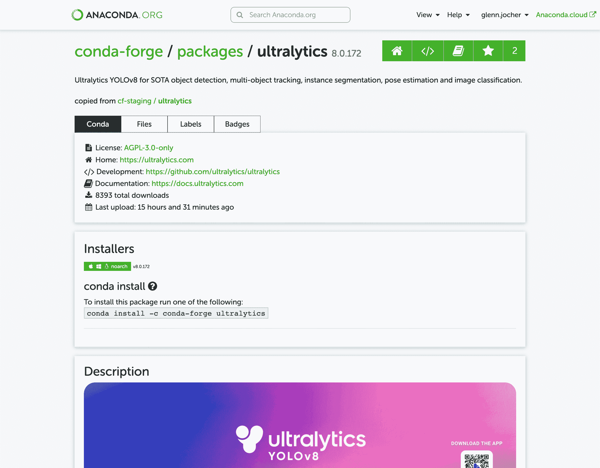

# Ultralytics 快速入门指南

> 原文：[`docs.ultralytics.com/guides/conda-quickstart/`](https://docs.ultralytics.com/guides/conda-quickstart/)



本指南全面介绍了为 Ultralytics 项目设置 Conda 环境的方法。Conda 是一个开源的软件包和环境管理系统，提供了安装软件包和依赖项的优秀替代方法，特别适合数据科学和机器学习。要了解更多详情，请访问 [Anaconda](https://anaconda.org/conda-forge/ultralytics) 上的 Ultralytics Conda 包，并查看 [GitHub](https://github.com/conda-forge/ultralytics-feedstock/) 上的 Ultralytics feedstock 仓库以获取软件包更新。

   

## 您将学到什么

+   设置 Conda 环境

+   通过 Conda 安装 Ultralytics

+   在您的环境中初始化 Ultralytics

+   使用 Ultralytics Docker 镜像与 Conda

* * *

## 先决条件

+   您的系统上应安装 Anaconda 或 Miniconda。如果没有，请从 [Anaconda](https://www.anaconda.com/) 或 [Miniconda](https://docs.conda.io/projects/miniconda/en/latest/) 下载并安装。

* * *

## 设置 Conda 环境

首先，让我们创建一个新的 Conda 环境。打开终端并运行以下命令：

```py
conda  create  --name  ultralytics-env  python=3.8  -y 
```

激活新环境：

```py
conda  activate  ultralytics-env 
```

* * *

## 安装 Ultralytics

您可以从 conda-forge 频道安装 Ultralytics 软件包。执行以下命令：

```py
conda  install  -c  conda-forge  ultralytics 
```

### CUDA 环境注意事项

如果您在支持 CUDA 的环境中工作，建议一起安装 `ultralytics`、`pytorch` 和 `pytorch-cuda` 以解决任何冲突：

```py
conda  install  -c  pytorch  -c  nvidia  -c  conda-forge  pytorch  torchvision  pytorch-cuda=11.8  ultralytics 
```

* * *

## 使用 Ultralytics

安装了 Ultralytics 后，您现在可以开始使用其强大的功能进行对象检测、实例分割等。例如，要预测一张图像，您可以运行：

```py
from ultralytics import YOLO

model = YOLO("yolov8n.pt")  # initialize model
results = model("path/to/image.jpg")  # perform inference
results[0].show()  # display results for the first image 
```

* * *

## Ultralytics Conda Docker 镜像

如果您喜欢使用 Docker，Ultralytics 提供了包含 Conda 环境的 Docker 镜像。您可以从 [DockerHub](https://hub.docker.com/r/ultralytics/ultralytics) 拉取这些镜像。

拉取最新的 Ultralytics 镜像：

```py
# Set image name as a variable
t=ultralytics/ultralytics:latest-conda

# Pull the latest Ultralytics image from Docker Hub
sudo  docker  pull  $t 
```

运行镜像：

```py
# Run the Ultralytics image in a container with GPU support
sudo  docker  run  -it  --ipc=host  --gpus  all  $t  # all GPUs
sudo  docker  run  -it  --ipc=host  --gpus  '"device=2,3"'  $t  # specify GPUs 
```

## 使用 Libmamba 加速安装

如果您希望加快 Conda 中的[软件包安装速度](https://www.anaconda.com/blog/a-faster-conda-for-a-growing-community)，可以选择使用 `libmamba`，这是一个快速、跨平台和依赖感知的软件包管理器，作为 Conda 默认求解器的替代品。

### 如何启用 Libmamba

要将 `libmamba` 作为 Conda 的求解器启用，您可以执行以下步骤：

1.  首先，安装`conda-libmamba-solver`包。如果您的 Conda 版本为 4.11 或更高，则可以跳过此步骤，因为`libmamba`已默认包含。

    ```py
    conda  install  conda-libmamba-solver 
    ```

1.  接下来，配置 Conda 使用`libmamba`作为求解器：

    ```py
    conda  config  --set  solver  libmamba 
    ```

就是这样！现在您的 Conda 安装将使用`libmamba`作为求解器，这应该会使包安装过程更快。

* * *

恭喜！您已成功设置了 Conda 环境，安装了 Ultralytics 包，并且现在可以探索其丰富的功能。请随时深入了解 Ultralytics 文档，以获取更高级的教程和示例。

## 常见问题解答

### 为 Ultralytics 项目设置 Conda 环境的过程是什么？

为 Ultralytics 项目设置 Conda 环境非常简单，并确保平稳的包管理。首先，使用以下命令创建一个新的 Conda 环境：

```py
conda  create  --name  ultralytics-env  python=3.8  -y 
```

然后，使用以下命令激活新环境：

```py
conda  activate  ultralytics-env 
```

最后，从 conda-forge 渠道安装 Ultralytics：

```py
conda  install  -c  conda-forge  ultralytics 
```

### 为什么在 Ultralytics 项目中管理依赖项时应该使用 Conda 而不是 pip？

Conda 是一个强大的包和环境管理系统，相比于 pip 有几个优点。它高效地管理依赖关系，并确保所有必要的库是兼容的。Conda 的隔离环境可以防止包之间的冲突，在数据科学和机器学习项目中至关重要。此外，Conda 支持二进制包分发，加快安装过程。

### 我可以在支持 CUDA 的环境中使用 Ultralytics YOLO 以获得更快的性能吗？

是的，您可以通过使用支持 CUDA 的环境来增强性能。确保同时安装`ultralytics`，`pytorch`和`pytorch-cuda`以避免冲突：

```py
conda  install  -c  pytorch  -c  nvidia  -c  conda-forge  pytorch  torchvision  pytorch-cuda=11.8  ultralytics 
```

此设置使 GPU 加速成为可能，对于深度学习模型训练和推断等密集任务至关重要。更多信息，请访问 Ultralytics 安装指南。

### 使用 Ultralytics Docker 镜像与 Conda 环境的好处是什么？

使用 Ultralytics Docker 镜像可以确保一个一致和可重现的环境，消除了“在我的机器上可以运行”的问题。这些镜像包括预配置的 Conda 环境，简化了设置过程。您可以使用以下命令拉取并运行最新的 Ultralytics Docker 镜像：

```py
sudo  docker  pull  ultralytics/ultralytics:latest-conda
sudo  docker  run  -it  --ipc=host  --gpus  all  ultralytics/ultralytics:latest-conda 
```

这种方法非常适合在生产中部署应用程序或运行复杂的工作流程而无需手动配置。了解更多关于 Ultralytics Conda Docker 镜像的信息。

### 如何加快在我的 Ultralytics 环境中安装 Conda 包的速度？

您可以通过使用`libmamba`，Conda 的快速依赖求解器来加速包安装过程。首先，安装`conda-libmamba-solver`包：

```py
conda  install  conda-libmamba-solver 
```

然后配置 Conda 使用`libmamba`作为求解器：

```py
conda  config  --set  solver  libmamba 
```

这种设置提供了更快和更高效的包管理。有关优化您的环境的更多提示，请阅读关于 libmamba 安装的内容。
