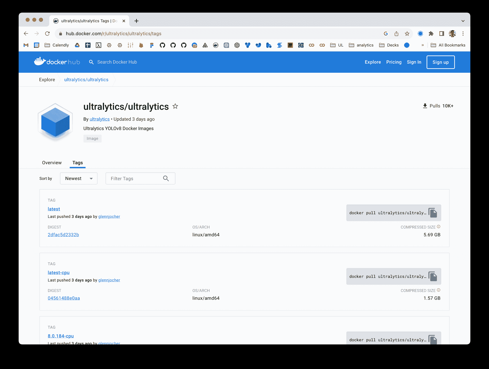

# Ultralytics 的 Docker 快速入门指南

> 原文：[`docs.ultralytics.com/guides/docker-quickstart/`](https://docs.ultralytics.com/guides/docker-quickstart/)



本指南旨在全面介绍为您的 Ultralytics 项目设置 Docker 环境。[Docker](https://docker.com/) 是一个用于开发、交付和运行容器化应用程序的平台。它特别有助于确保软件在部署的任何地方始终运行相同。有关更多详细信息，请访问[Docker Hub 上的 Ultralytics Docker 仓库](https://hub.docker.com/r/ultralytics/ultralytics)。

 

## 您将学到什么

+   使用带 NVIDIA 支持的 Docker 设置

+   安装 Ultralytics Docker 映像

+   在支持 CPU 或 GPU 的 Docker 容器中运行 Ultralytics

+   使用显示服务器在 Docker 中显示 Ultralytics 检测结果

+   将本地目录挂载到容器中

* * *

## 先决条件

+   确保您的系统已安装 Docker。如果没有，请从[Docker 的网站](https://www.docker.com/products/docker-desktop)下载并安装它。

+   确保您的系统具有 NVIDIA GPU 并安装了 NVIDIA 驱动程序。

* * *

## 使用带 NVIDIA 支持的 Docker 设置

首先通过运行以下命令验证 NVIDIA 驱动程序是否正确安装：

```py
`nvidia-smi` 
```

### 安装 NVIDIA Docker 运行时

现在，让我们安装 NVIDIA Docker 运行时，以在 Docker 容器中启用 GPU 支持：

```py
`# Add NVIDIA package repositories curl  -s  -L  https://nvidia.github.io/nvidia-docker/gpgkey  |  sudo  apt-key  add  - distribution=$(lsb_release  -cs) curl  -s  -L  https://nvidia.github.io/nvidia-docker/$distribution/nvidia-docker.list  |  sudo  tee  /etc/apt/sources.list.d/nvidia-docker.list  # Install NVIDIA Docker runtime sudo  apt-get  update sudo  apt-get  install  -y  nvidia-docker2  # Restart Docker service to apply changes sudo  systemctl  restart  docker` 
```

### 使用 Docker 验证 NVIDIA 运行时

运行 `docker info | grep -i runtime` 来确保 `nvidia` 出现在运行时列表中：

```py
`docker  info  |  grep  -i  runtime` 
```

* * *

## 安装 Ultralytics Docker 映像

Ultralytics 提供了多个针对各种平台和用例优化的 Docker 映像：

+   **Dockerfile:** GPU 映像，用于训练。

+   **Dockerfile-arm64:** 适用于 ARM64 架构，适合树莓派等设备。

+   **Dockerfile-cpu:** 仅用于推断和非 GPU 环境。

+   **Dockerfile-jetson:** 专为 NVIDIA Jetson 设备优化。

+   **Dockerfile-python:** 适用于轻量级应用程序的最小 Python 环境。

+   **Dockerfile-conda:** 包括[Miniconda3](https://docs.conda.io/projects/miniconda/en/latest/)和通过 Conda 安装的 Ultralytics 包。

要拉取最新的映像：

```py
`# Set image name as a variable t=ultralytics/ultralytics:latest  # Pull the latest Ultralytics image from Docker Hub sudo  docker  pull  $t` 
```

* * *

## 在 Docker 容器中运行 Ultralytics

下面是如何执行 Ultralytics Docker 容器的方法：

### 仅使用 CPU

```py
`# Run with all GPUs sudo  docker  run  -it  --ipc=host  $t` 
```

### 使用 GPU

```py
`# Run with all GPUs sudo  docker  run  -it  --ipc=host  --gpus  all  $t  # Run specifying which GPUs to use sudo  docker  run  -it  --ipc=host  --gpus  '"device=2,3"'  $t` 
```

`-it`标志分配一个伪 TTY 并保持 stdin 打开，允许您与容器交互。`--ipc=host`标志启用共享主机的 IPC 命名空间，对于进程间共享内存是必需的。`--gpus`标志允许容器访问主机的 GPU。

## 在 Docker 容器中运行 Ultralytics

下面是如何执行 Ultralytics Docker 容器的方法：

### 仅使用 CPU

```py
`# Run with all GPUs sudo  docker  run  -it  --ipc=host  $t` 
```

### 使用 GPU

```py
`# Run with all GPUs sudo  docker  run  -it  --ipc=host  --gpus  all  $t  # Run specifying which GPUs to use sudo  docker  run  -it  --ipc=host  --gpus  '"device=2,3"'  $t` 
```

`-it` 标志分配一个伪 TTY 并保持 stdin 打开，允许你与容器交互。`--ipc=host` 标志启用主机 IPC 命名空间的共享，这对于进程之间的内存共享至关重要。`--gpus` 标志允许容器访问主机的 GPU。

### 文件可访问性说明

要在容器内处理本地计算机上的文件，你可以使用 Docker 卷：

```py
`# Mount a local directory into the container sudo  docker  run  -it  --ipc=host  --gpus  all  -v  /path/on/host:/path/in/container  $t` 
```

将 `/path/on/host` 替换为你本地计算机上的目录路径，将 `/path/in/container` 替换为 Docker 容器内的所需路径。

## 在 Docker 容器中运行图形用户界面（GUI）应用程序

高度实验性 - 用户承担所有风险

以下说明是实验性的。与 Docker 容器共享 X11 套接字存在潜在的安全风险。因此，建议仅在受控环境中测试此解决方案。有关如何使用 `xhost` 的更多信息，请参考这些资源^([(1)](http://users.stat.umn.edu/~geyer/secure.html)[(2)](https://linux.die.net/man/1/xhost))。

Docker 主要用于将后台应用程序和 CLI 程序容器化，但它也可以运行图形程序。在 Linux 世界中，有两个主要的图形服务器处理图形显示：[X11](https://www.x.org/wiki/)（也称为 X 窗口系统）和 [Wayland](https://wayland.freedesktop.org/)。在开始之前，确定你当前使用的图形服务器是至关重要的。运行此命令以找出：

```py
`env  |  grep  -E  -i  'x11|xorg|wayland'` 
```

X11 或 Wayland 显示服务器的设置和配置超出了本指南的范围。如果上述命令没有返回任何内容，那么你需要先确保你的系统上有一个可用的服务器，然后再继续。

### 在 Docker 容器中运行带 GUI 的 Docker 容器

示例

<details class="info"><summary>使用 GPU</summary>

```py
``If you're using GPUs, you can add the `--gpus all` flag to the command.`` 
```</details>

如果你使用的是 X11，你可以运行以下命令以允许 Docker 容器访问 X11 套接字：

```py
`xhost  +local:docker  &&  docker  run  -e  DISPLAY=$DISPLAY  \ -v  /tmp/.X11-unix:/tmp/.X11-unix  \ -v  ~/.Xauthority:/root/.Xauthority  \ -it  --ipc=host  $t` 
```

此命令将 `DISPLAY` 环境变量设置为主机的显示，挂载 X11 套接字，并将 `.Xauthority` 文件映射到容器。`xhost +local:docker` 命令允许 Docker 容器访问 X11 服务器。

对于 Wayland，使用以下命令：

```py
`xhost  +local:docker  &&  docker  run  -e  DISPLAY=$DISPLAY  \ -v  $XDG_RUNTIME_DIR/$WAYLAND_DISPLAY:/tmp/$WAYLAND_DISPLAY  \ --net=host  -it  --ipc=host  $t` 
```

此命令将 `DISPLAY` 环境变量设置为主机的显示，挂载 Wayland 套接字，并允许 Docker 容器访问 Wayland 服务器。

### 使用带 GUI 的 Docker

现在你可以在 Docker 容器内显示图形应用程序。例如，你可以运行以下 CLI 命令来可视化 YOLOv8 模型的预测：

```py
`yolo  predict  model=yolov8n.pt  show=True` 
```

<details class="info"><summary>测试</summary>

要验证 Docker 组是否可以访问 X11 服务器的简单方法是运行包含 GUI 程序如[`xclock`](https://www.x.org/archive/X11R6.8.1/doc/xclock.1.html)或[`xeyes`](https://www.x.org/releases/X11R7.5/doc/man/man1/xeyes.1.html)的容器。或者，您也可以在 Ultralytics Docker 容器中安装这些程序，以测试您的 GNU-Linux 显示服务器对 X11 服务器的访问权限。如果遇到任何问题，请考虑设置环境变量`-e QT_DEBUG_PLUGINS=1`。设置此环境变量会启用调试信息输出，有助于故障排除过程。</details>

### 完成 Docker GUI 后

撤销访问

在两种情况下，完成后不要忘记从 Docker 组中撤销访问权限。

```py
`xhost  -local:docker` 
```

<details class="question"><summary>想直接在终端中查看图像结果吗？</summary>

请参阅以下指南以在终端中查看图像结果</details>

* * *

恭喜！您现在已经设置好了使用 Ultralytics 与 Docker，并准备利用其强大功能。如需备用安装方法，请随时查阅 Ultralytics 快速入门文档。

## 常见问题

### 如何设置 Ultralytics 与 Docker？

要在 Docker 中设置 Ultralytics，请确保系统已安装 Docker。如果您有 NVIDIA GPU，请安装 NVIDIA Docker 运行时以启用 GPU 支持。然后，使用以下命令从 Docker Hub 拉取最新的 Ultralytics Docker 镜像：

```py
`sudo  docker  pull  ultralytics/ultralytics:latest` 
```

有关详细步骤，请参阅我们的 Docker 快速入门指南。

### 使用 Ultralytics Docker 镜像用于机器学习项目有哪些好处？

使用 Ultralytics Docker 镜像可确保跨不同机器的一致环境，复制相同的软件和依赖关系。这对于团队协作、在各种硬件上运行模型和保持可重现性特别有用。对于基于 GPU 的训练，Ultralytics 提供了优化的 Docker 镜像，如用于一般 GPU 使用的 `Dockerfile` 和用于 NVIDIA Jetson 设备的 `Dockerfile-jetson`。请访问[Ultralytics Docker Hub](https://hub.docker.com/r/ultralytics/ultralytics)了解更多详情。

### 如何在带 GPU 支持的 Docker 容器中运行 Ultralytics YOLO？

首先确保安装和配置 NVIDIA Docker 运行时。然后，使用以下命令以 GPU 支持运行 Ultralytics YOLO：

```py
`sudo  docker  run  -it  --ipc=host  --gpus  all  ultralytics/ultralytics:latest` 
```

此命令设置具有 GPU 访问权限的 Docker 容器。有关更多详细信息，请参阅 Docker 快速入门指南。

### 如何在 Docker 容器中使用显示服务器可视化 YOLO 预测结果？

要在 Docker 容器中使用 GUI 可视化 YOLO 预测结果，您需要允许 Docker 访问您的显示服务器。对于运行 X11 的系统，命令如下：

```py
`xhost  +local:docker  &&  docker  run  -e  DISPLAY=$DISPLAY  \ -v  /tmp/.X11-unix:/tmp/.X11-unix  \ -v  ~/.Xauthority:/root/.Xauthority  \ -it  --ipc=host  ultralytics/ultralytics:latest` 
```

对于运行 Wayland 的系统，请使用：

```py
`xhost  +local:docker  &&  docker  run  -e  DISPLAY=$DISPLAY  \ -v  $XDG_RUNTIME_DIR/$WAYLAND_DISPLAY:/tmp/$WAYLAND_DISPLAY  \ --net=host  -it  --ipc=host  ultralytics/ultralytics:latest` 
```

更多信息请参阅在 Docker 容器中运行图形用户界面（GUI）应用程序部分。

### 我可以将本地目录挂载到 Ultralytics Docker 容器中吗？

是的，你可以使用 `-v` 标志将本地目录挂载到 Ultralytics Docker 容器中：

```py
`sudo  docker  run  -it  --ipc=host  --gpus  all  -v  /path/on/host:/path/in/container  ultralytics/ultralytics:latest` 
```

将 `/path/on/host` 替换为本地机器上的目录，将 `/path/in/container` 替换为容器内的所需路径。这样设置可以让你在容器内处理本地文件。有关挂载本地目录的更多信息，请参阅相关章节。
