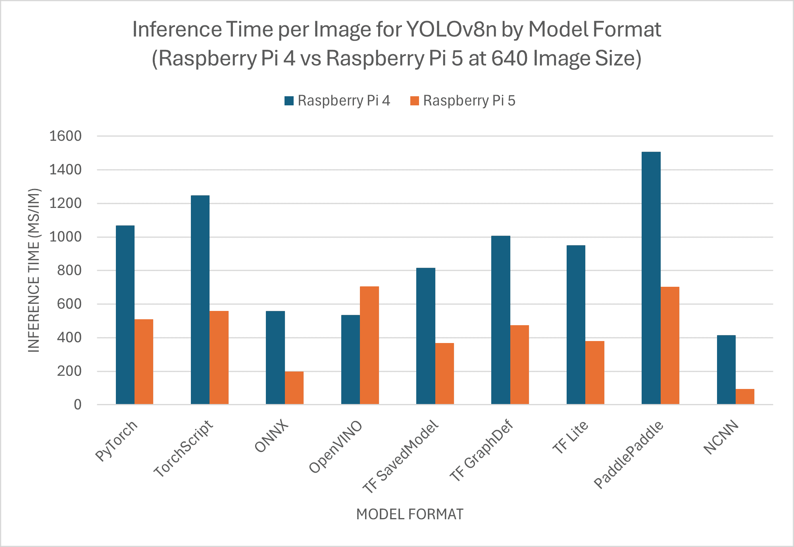
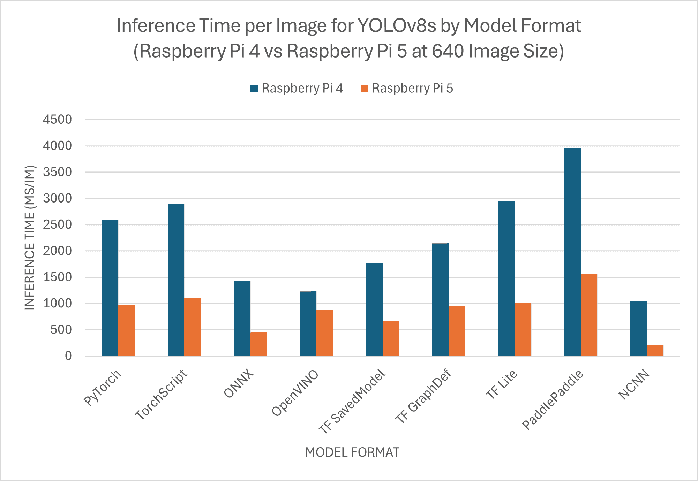

# 快速入门指南：树莓派与 Ultralytics YOLOv8

> 原文：[`docs.ultralytics.com/guides/raspberry-pi/`](https://docs.ultralytics.com/guides/raspberry-pi/)

这份全面的指南提供了在[树莓派](https://www.raspberrypi.com)设备上部署 Ultralytics YOLOv8 的详细步骤。此外，它展示了性能基准，以展示 YOLOv8 在这些小型而强大的设备上的能力。

[`www.youtube.com/embed/yul4gq_LrOI`](https://www.youtube.com/embed/yul4gq_LrOI)

**Watch:** 树莓派 5 的更新和改进。

Note

本指南已在运行最新的[树莓派 OS Bookworm (Debian 12)](https://www.raspberrypi.com/software/operating-systems/)的树莓派 4 和树莓派 5 上进行了测试。只要安装了相同的树莓派 OS Bookworm，预计可以在旧版树莓派设备（如树莓派 3）上使用此指南。

## 什么是树莓派？

树莓派是一款小巧、价格实惠的单板计算机。它已经在从业余家庭自动化到工业应用的广泛项目和应用中变得流行起来。树莓派板可以运行多种操作系统，并且提供 GPIO（通用输入/输出）引脚，便于与传感器、执行器和其他硬件组件进行集成。它们有不同的型号和规格，但它们都共享相同的基本设计理念：低成本、紧凑和多功能。

## 树莓派系列比较

|  | 树莓派 3 | 树莓派 4 | 树莓派 5 |
| --- | --- | --- | --- |
| CPU | Broadcom BCM2837, Cortex-A53 64Bit SoC | Broadcom BCM2711, Cortex-A72 64Bit SoC | Broadcom BCM2712, Cortex-A76 64Bit SoC |
| CPU 最大频率 | 1.4GHz | 1.8GHz | 2.4GHz |
| GPU | Videocore IV | Videocore VI | VideoCore VII |
| GPU 最大频率 | 400Mhz | 500Mhz | 800Mhz |
| 内存 | 1GB LPDDR2 SDRAM | 1GB, 2GB, 4GB, 8GB LPDDR4-3200 SDRAM | 4GB, 8GB LPDDR4X-4267 SDRAM |
| PCIe | N/A | N/A | 1xPCIe 2.0 接口 |
| 最大功耗 | 2.5A@5V | 3A@5V | 5A@5V (PD enabled) |

## 什么是树莓派操作系统？

[树莓派操作系统](https://www.raspberrypi.com/software)（之前称为 Raspbian）是一款基于 Debian GNU/Linux 发行版的类 Unix 操作系统，专为由树莓派基金会分发的紧凑型单板计算机家族而优化。树莓派操作系统使用 ARM CPU，并采用修改版的 LXDE 桌面环境和 Openbox 堆叠窗口管理器。树莓派操作系统正在积极开发中，重点是尽可能提高尽可能多的 Debian 软件包在树莓派上的稳定性和性能。

## 将树莓派操作系统刷入树莓派

在获得树莓派后的第一件事是用树莓派 OS 刷一张 micro-SD 卡，插入设备并引导至操作系统。详细遵循由树莓派提供的[开始使用文档](https://www.raspberrypi.com/documentation/computers/getting-started.html)准备设备首次使用。

## 设置 Ultralytics

有两种在树莓派上设置 Ultralytics 包以构建下一个计算机视觉项目的方法。您可以选择使用其中任何一种。

+   使用 Docker 开始

+   开始时不使用 Docker

### 使用 Docker 开始

在树莓派上使用预构建的 docker 镜像是快速开始 Ultralytics YOLOv8 的最快方法。

执行以下命令以拉取 Docker 容器并在树莓派上运行。这基于包含 Debian 12（Bookworm）的[arm64v8/debian](https://hub.docker.com/r/arm64v8/debian) docker 镜像，处于 Python3 环境中。

```py
t=ultralytics/ultralytics:latest-arm64  &&  sudo  docker  pull  $t  &&  sudo  docker  run  -it  --ipc=host  $t 
```

在完成此操作后，请跳至使用树莓派上的 NCNN 部分。

### 开始时不使用 Docker

#### 安装 Ultralytics 包

在这里，我们将在树莓派上安装 Ultralytics 包及其可选依赖项，以便我们可以将 PyTorch 模型导出为其他不同的格式。

1.  更新包列表，安装 pip 并升级到最新版本

    ```py
    sudo  apt  update
    sudo  apt  install  python3-pip  -y
    pip  install  -U  pip 
    ```

1.  使用可选依赖项安装`ultralytics` pip 包

    ```py
    pip  install  ultralytics[export] 
    ```

1.  重新启动设备

    ```py
    sudo  reboot 
    ```

## 在树莓派上使用 NCNN

在所有 Ultralytics 支持的模型导出格式中，[NCNN](https://docs.ultralytics.com/integrations/ncnn)在与树莓派设备一起工作时提供了最佳推理性能，因为 NCNN 在移动/嵌入式平台（如 ARM 架构）上进行了高度优化。因此，我们建议在树莓派上使用 NCNN。

## 将模型转换为 NCNN 并运行推理

将 PyTorch 格式中的 YOLOv8n 模型转换为 NCNN，以便使用导出模型进行推理。

示例

```py
from ultralytics import YOLO

# Load a YOLOv8n PyTorch model
model = YOLO("yolov8n.pt")

# Export the model to NCNN format
model.export(format="ncnn")  # creates 'yolov8n_ncnn_model'

# Load the exported NCNN model
ncnn_model = YOLO("yolov8n_ncnn_model")

# Run inference
results = ncnn_model("https://ultralytics.com/images/bus.jpg") 
```

```py
# Export a YOLOv8n PyTorch model to NCNN format
yolo  export  model=yolov8n.pt  format=ncnn  # creates 'yolov8n_ncnn_model'

# Run inference with the exported model
yolo  predict  model='yolov8n_ncnn_model'  source='https://ultralytics.com/images/bus.jpg' 
```

提示

要了解有关支持的导出选项的更多详细信息，请访问[Ultralytics 文档页关于部署选项](https://docs.ultralytics.com/guides/model-deployment-options)。

## 树莓派 5 与树莓派 4 YOLOv8 性能基准测试

Ultralytics 团队在九种不同的模型格式上运行了 YOLOv8 基准测试，测量速度和准确性：PyTorch，TorchScript，ONNX，OpenVINO，TF SavedModel，TF GraphDef，TF Lite，PaddlePaddle，NCNN。基准测试在树莓派 5 和树莓派 4 上以 FP32 精度进行，使用默认输入图像尺寸为 640。

注意

我们仅包含 YOLOv8n 和 YOLOv8s 模型的基准测试，因为其他模型尺寸过大，在树莓派上运行性能不佳。

### 比较图表

性能



### 详细比较表

下表显示了两种不同模型（YOLOv8n、YOLOv8s）在九种不同格式（PyTorch、TorchScript、ONNX、OpenVINO、TF SavedModel、TF GraphDef、TF Lite、PaddlePaddle、NCNN）上在树莓派 4 和树莓派 5 上的基准测试结果，给出了每种组合的状态、大小、mAP50-95(B)指标和推理时间。

性能

| 格式 | 状态 | 磁盘大小（MB） | mAP50-95(B) | 推理时间（ms/im） |
| --- | --- | --- | --- | --- |
| PyTorch | ✅ | 6.2 | 0.6381 | 508.61 |
| TorchScript | ✅ | 12.4 | 0.6092 | 558.38 |
| ONNX | ✅ | 12.2 | 0.6092 | 198.69 |
| OpenVINO | ✅ | 12.3 | 0.6092 | 704.70 |
| TF SavedModel | ✅ | 30.6 | 0.6092 | 367.64 |
| TF GraphDef | ✅ | 12.3 | 0.6092 | 473.22 |
| TF Lite | ✅ | 12.3 | 0.6092 | 380.67 |
| PaddlePaddle | ✅ | 24.4 | 0.6092 | 703.51 |
| NCNN | ✅ | 12.2 | 0.6034 | 94.28 |
| 格式 | 状态 | 磁盘大小（MB） | mAP50-95(B) | 推理时间（ms/im） |
| --- | --- | --- | --- | --- |
| PyTorch | ✅ | 21.5 | 0.6967 | 969.49 |
| TorchScript | ✅ | 43.0 | 0.7136 | 1110.04 |
| ONNX | ✅ | 42.8 | 0.7136 | 451.37 |
| OpenVINO | ✅ | 42.9 | 0.7136 | 873.51 |
| TF SavedModel | ✅ | 107.0 | 0.7136 | 658.15 |
| TF GraphDef | ✅ | 42.8 | 0.7136 | 946.01 |
| TF Lite | ✅ | 42.8 | 0.7136 | 1013.27 |
| PaddlePaddle | ✅ | 85.5 | 0.7136 | 1560.23 |
| NCNN | ✅ | 42.7 | 0.7204 | 211.26 |
| 格式 | 状态 | 磁盘大小（MB） | mAP50-95(B) | 推理时间（ms/im） |
| --- | --- | --- | --- | --- |
| PyTorch | ✅ | 6.2 | 0.6381 | 1068.42 |
| TorchScript | ✅ | 12.4 | 0.6092 | 1248.01 |
| ONNX | ✅ | 12.2 | 0.6092 | 560.04 |
| OpenVINO | ✅ | 12.3 | 0.6092 | 534.93 |
| TF SavedModel | ✅ | 30.6 | 0.6092 | 816.50 |
| TF GraphDef | ✅ | 12.3 | 0.6092 | 1007.57 |
| TF Lite | ✅ | 12.3 | 0.6092 | 950.29 |
| PaddlePaddle | ✅ | 24.4 | 0.6092 | 1507.75 |
| NCNN | ✅ | 12.2 | 0.6092 | 414.73 |
| 格式 | 状态 | 磁盘大小（MB） | mAP50-95(B) | 推理时间（ms/im） |
| --- | --- | --- | --- | --- |
| PyTorch | ✅ | 21.5 | 0.6967 | 2589.58 |
| TorchScript | ✅ | 43.0 | 0.7136 | 2901.33 |
| ONNX | ✅ | 42.8 | 0.7136 | 1436.33 |
| OpenVINO | ✅ | 42.9 | 0.7136 | 1225.19 |
| TF SavedModel | ✅ | 107.0 | 0.7136 | 1770.95 |
| TF GraphDef | ✅ | 42.8 | 0.7136 | 2146.66 |
| TF Lite | ✅ | 42.8 | 0.7136 | 2945.03 |
| PaddlePaddle | ✅ | 85.5 | 0.7136 | 3962.62 |
| NCNN | ✅ | 42.7 | 0.7136 | 1042.39 |

## 复现我们的结果

要在所有导出格式上复现上述 Ultralytics 基准测试结果，请运行此代码：

示例

```py
from ultralytics import YOLO

# Load a YOLOv8n PyTorch model
model = YOLO("yolov8n.pt")

# Benchmark YOLOv8n speed and accuracy on the COCO8 dataset for all all export formats
results = model.benchmarks(data="coco8.yaml", imgsz=640) 
```

```py
# Benchmark YOLOv8n speed and accuracy on the COCO8 dataset for all all export formats
yolo  benchmark  model=yolov8n.pt  data=coco8.yaml  imgsz=640 
```

请注意，基准测试结果可能会根据系统的确切硬件和软件配置以及系统在进行基准测试时的当前工作负载而有所不同。要获得最可靠的结果，请使用一个包含大量图像的数据集，即`data='coco8.yaml' (4 val images)`，或者`data='coco.yaml'`（5000 val images）。

## 使用树莓派摄像头

在进行计算机视觉项目时使用树莓派，抓取实时视频流进行推理非常重要。树莓派上的 MIPI CSI 连接器允许连接官方树莓派摄像头模块。在本指南中，我们使用了 [Raspberry Pi Camera Module 3](https://www.raspberrypi.com/products/camera-module-3) 抓取视频流，并使用 YOLOv8 模型进行推理。

提示

查看关于 [树莓派提供的不同摄像头模块](https://www.raspberrypi.com/documentation/accessories/camera.html) 以及 [如何开始使用树莓派摄像头模块的信息](https://www.raspberrypi.com/documentation/computers/camera_software.html#introducing-the-raspberry-pi-cameras) 的文档。

注意

树莓派 5 使用比树莓派 4 更小的 CSI 连接器（15 引脚 vs 22 引脚），因此您需要一根 [15 引脚到 22 引脚适配器电缆](https://www.raspberrypi.com/products/camera-cable) 来连接树莓派摄像头。

### 测试摄像头

在连接摄像头到树莓派后执行以下命令。您应该能看到来自摄像头的实时视频流，持续约 5 秒钟。

```py
rpicam-hello 
```

提示

查看官方树莓派文档中关于 [`rpicam-hello` 的使用说明](https://www.raspberrypi.com/documentation/computers/camera_software.html#rpicam-hello)。

### 使用摄像头进行推理

有两种使用树莓派摄像头进行 YOLOv8 模型推理的方法。

使用方法

我们可以使用预装在树莓派 OS 上的 `picamera2` 来访问摄像头并推理 YOLOv8 模型。

示例

```py
import cv2
from picamera2 import Picamera2

from ultralytics import YOLO

# Initialize the Picamera2
picam2 = Picamera2()
picam2.preview_configuration.main.size = (1280, 720)
picam2.preview_configuration.main.format = "RGB888"
picam2.preview_configuration.align()
picam2.configure("preview")
picam2.start()

# Load the YOLOv8 model
model = YOLO("yolov8n.pt")

while True:
    # Capture frame-by-frame
    frame = picam2.capture_array()

    # Run YOLOv8 inference on the frame
    results = model(frame)

    # Visualize the results on the frame
    annotated_frame = results[0].plot()

    # Display the resulting frame
    cv2.imshow("Camera", annotated_frame)

    # Break the loop if 'q' is pressed
    if cv2.waitKey(1) == ord("q"):
        break

# Release resources and close windows
cv2.destroyAllWindows() 
```

我们需要通过连接的摄像头与 `rpicam-vid` 建立一个 TCP 流，以便在后续推理时将此流 URL 作为输入。执行以下命令来启动 TCP 流。

```py
rpicam-vid  -n  -t  0  --inline  --listen  -o  tcp://127.0.0.1:8888 
```

查看官方树莓派文档中关于 [`rpicam-vid` 的使用说明](https://www.raspberrypi.com/documentation/computers/camera_software.html#rpicam-vid)。

示例

```py
from ultralytics import YOLO

# Load a YOLOv8n PyTorch model
model = YOLO("yolov8n.pt")

# Run inference
results = model("tcp://127.0.0.1:8888") 
```

```py
yolo  predict  model=yolov8n.pt  source="tcp://127.0.0.1:8888" 
```

提示

查看我们的文档关于 [推理来源](https://docs.ultralytics.com/modes/predict/#inference-sources)，如果您想更改图像/视频输入类型。

## 在使用树莓派时的最佳实践

有几项最佳实践需要遵循，以在运行 YOLOv8 的树莓派上实现最大性能。

1.  使用 SSD

    在持续使用树莓派进行 24x7 使用时，建议使用 SSD 作为系统，因为 SD 卡无法承受连续写入并可能损坏。现在，通过树莓派 5 上的内置 PCIe 连接器，您可以使用适配器如 [NVMe Base for Raspberry Pi 5](https://shop.pimoroni.com/products/nvme-base) 连接 SSD。

1.  无 GUI 刷写

    在刷写树莓派 OS 时，您可以选择不安装桌面环境（树莓派 OS Lite），这样可以节省设备上的一些 RAM，为计算机视觉处理留下更多空间。

## 下一步

恭喜您成功在树莓派上设置 YOLO！如需进一步学习和支持，请访问 Ultralytics YOLOv8 文档和[Kashmir World Foundation](https://www.kashmirworldfoundation.org/)。

## 致谢与引用

本指南最初由 Daan Eeltink 为 Kashmir World Foundation 创建，这是一个致力于利用 YOLO 保护濒危物种的组织。我们承认他们在物体检测技术领域的开创性工作和教育重点。

欲了解更多关于 Kashmir World Foundation 活动的信息，请访问他们的[网站](https://www.kashmirworldfoundation.org/)。

## 常见问题解答

### 如何在树莓派上不使用 Docker 设置 Ultralytics YOLOv8？

要在树莓派上设置 Ultralytics YOLOv8 而不使用 Docker，请按照以下步骤操作：

1.  更新软件包列表并安装`pip`：

    ```py
    sudo  apt  update
    sudo  apt  install  python3-pip  -y
    pip  install  -U  pip 
    ```

1.  使用可选依赖项安装 Ultralytics 包：

    ```py
    pip  install  ultralytics[export] 
    ```

1.  重新启动设备以应用更改：

    ```py
    sudo  reboot 
    ```

有关详细说明，请参阅无 Docker 启动部分。

### 为什么我应该在树莓派上使用 Ultralytics YOLOv8 的 NCNN 格式进行 AI 任务？

Ultralytics YOLOv8 的 NCNN 格式经过高度优化，非常适合移动和嵌入式平台，非常适合在树莓派设备上运行 AI 任务。NCNN 通过利用 ARM 架构提供更快速和更高效的处理，最大化推断性能，比其他格式更优。有关支持的导出选项的详细信息，请访问 Ultralytics 部署选项文档页面。

### 如何将 YOLOv8 模型转换为 NCNN 格式以在树莓派上使用？

您可以使用 Python 或 CLI 命令将 PyTorch YOLOv8 模型转换为 NCNN 格式：

示例

```py
from ultralytics import YOLO

# Load a YOLOv8n PyTorch model
model = YOLO("yolov8n.pt")

# Export the model to NCNN format
model.export(format="ncnn")  # creates 'yolov8n_ncnn_model'

# Load the exported NCNN model
ncnn_model = YOLO("yolov8n_ncnn_model")

# Run inference
results = ncnn_model("https://ultralytics.com/images/bus.jpg") 
```

```py
# Export a YOLOv8n PyTorch model to NCNN format
yolo  export  model=yolov8n.pt  format=ncnn  # creates 'yolov8n_ncnn_model'

# Run inference with the exported model
yolo  predict  model='yolov8n_ncnn_model'  source='https://ultralytics.com/images/bus.jpg' 
```

更多详情，请参阅在树莓派上使用 NCNN 部分。

### 树莓派 4 和树莓派 5 在运行 YOLOv8 时的硬件差异是什么？

关键差异包括：

+   **CPU**：树莓派 4 使用 Broadcom BCM2711，Cortex-A72 64 位 SoC，而树莓派 5 使用 Broadcom BCM2712，Cortex-A76 64 位 SoC。

+   **最大 CPU 频率**：树莓派 4 的最大频率为 1.8GHz，而树莓派 5 可达到 2.4GHz。

+   **内存**：树莓派 4 提供高达 8GB 的 LPDDR4-3200 SDRAM，而树莓派 5 采用 LPDDR4X-4267 SDRAM，有 4GB 和 8GB 两种变体。

这些增强措施使 YOLOv8 模型在树莓派 5 上的性能基准比树莓派 4 更好。有关更多详细信息，请参阅树莓派系列比较表。

### 如何设置树莓派摄像头模块以与 Ultralytics YOLOv8 配合使用？

设置树莓派摄像头进行 YOLOv8 推断有两种方法：

1.  **使用`picamera2`**：

    ```py
    import cv2
    from picamera2 import Picamera2

    from ultralytics import YOLO

    picam2 = Picamera2()
    picam2.preview_configuration.main.size = (1280, 720)
    picam2.preview_configuration.main.format = "RGB888"
    picam2.preview_configuration.align()
    picam2.configure("preview")
    picam2.start()

    model = YOLO("yolov8n.pt")

    while True:
        frame = picam2.capture_array()
        results = model(frame)
        annotated_frame = results[0].plot()
        cv2.imshow("Camera", annotated_frame)

        if cv2.waitKey(1) == ord("q"):
            break

    cv2.destroyAllWindows() 
    ```

1.  **使用 TCP 流**：

    ```py
    rpicam-vid  -n  -t  0  --inline  --listen  -o  tcp://127.0.0.1:8888 
    ```

    ```py
    from ultralytics import YOLO

    model = YOLO("yolov8n.pt")
    results = model("tcp://127.0.0.1:8888") 
    ```

有关详细设置说明，请访问使用摄像头推断部分。
