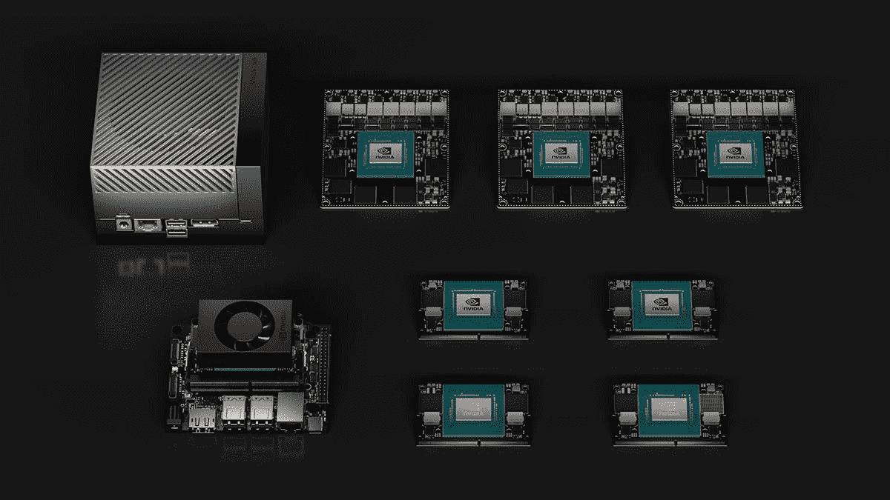
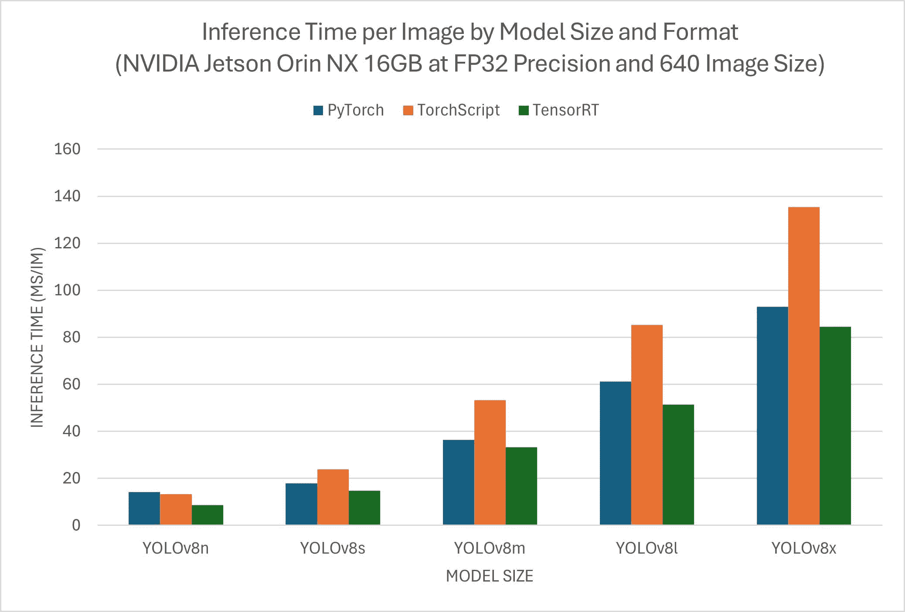
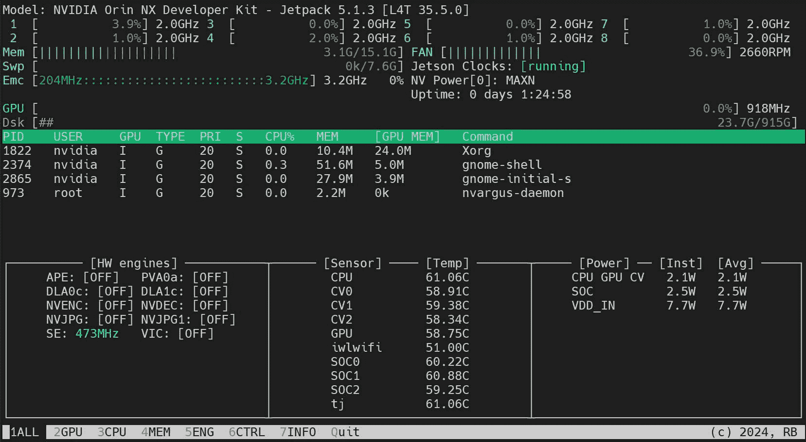

# 快速入门指南：NVIDIA Jetson 与 Ultralytics YOLOv8

> 原文：[`docs.ultralytics.com/guides/nvidia-jetson/`](https://docs.ultralytics.com/guides/nvidia-jetson/)

本详细指南提供了在[NVIDIA Jetson](https://www.nvidia.com/en-us/autonomous-machines/embedded-systems/)设备上部署 Ultralytics YOLOv8 的详细步骤。此外，它展示了性能基准，以展示 YOLOv8 在这些小巧且强大的设备上的能力。

[`www.youtube.com/embed/mUybgOlSxxA`](https://www.youtube.com/embed/mUybgOlSxxA)

**注意：** 如何设置 NVIDIA Jetson 与 Ultralytics YOLOv8



注意

此指南已在基于 NVIDIA Jetson Orin NX 16GB 的[Seeed Studio reComputer J4012](https://www.seeedstudio.com/reComputer-J4012-p-5586.html)（运行最新稳定的 JetPack 版本[JP6.0](https://developer.nvidia.com/embedded/jetpack-sdk-60)）、基于 NVIDIA Jetson Nano 4GB 的[Seeed Studio reComputer J1020 v2](https://www.seeedstudio.com/reComputer-J1020-v2-p-5498.html)（运行 JetPack 版本[JP4.6.1](https://developer.nvidia.com/embedded/jetpack-sdk-461)）上经过测试。预计可以在包括最新和传统硬件在内的所有 NVIDIA Jetson 硬件系列上运行。

## 什么是 NVIDIA Jetson？

NVIDIA Jetson 是一系列嵌入式计算板，旨在将加速 AI（人工智能）计算引入边缘设备。这些小巧而强大的设备围绕 NVIDIA 的 GPU 架构构建，并能够在设备上直接运行复杂的 AI 算法和深度学习模型，无需依赖云计算资源。Jetson 板常用于机器人技术、自动驾驶车辆、工业自动化及其他需要在本地进行低延迟和高效率 AI 推理的应用。此外，这些板基于 ARM64 架构，与传统的 GPU 计算设备相比，功耗更低。

## NVIDIA Jetson 系列比较

[Jetson Orin](https://www.nvidia.com/en-us/autonomous-machines/embedded-systems/jetson-orin/)是基于 NVIDIA Ampere 架构的 NVIDIA Jetson 系列的最新版本，与前几代相比，显著提升了 AI 性能。下表比较了生态系统中几款 Jetson 设备。

|  | Jetson AGX Orin 64GB | Jetson Orin NX 16GB | Jetson Orin Nano 8GB | Jetson AGX Xavier | Jetson Xavier NX | Jetson Nano |
| --- | --- | --- | --- | --- | --- | --- |
| AI Performance | 275 TOPS | 100 TOPS | 40 TOPs | 32 TOPS | 21 TOPS | 472 GFLOPS |
| GPU | 2048 核 NVIDIA 安培架构 GPU，带有 64 个张量核心 | 1024 核 NVIDIA 安培架构 GPU，带有 32 个张量核心 | 1024 核 NVIDIA 安培架构 GPU，带有 32 个张量核心 | 512 核 NVIDIA 伏特架构 GPU，带有 64 个张量核心 | 384 核 NVIDIA 伏特架构 GPU，带有 48 个张量核心 | 128 核 NVIDIA 麦克斯韦架构 GPU |
| GPU 最大频率 | 1.3 GHz | 918 MHz | 625 MHz | 1377 MHz | 1100 MHz | 921MHz |
| CPU | 12 核 NVIDIA Arm® Cortex A78AE v8.2 64 位 CPU，3MB L2 + 6MB L3 | 8 核 NVIDIA Arm® Cortex A78AE v8.2 64 位 CPU，2MB L2 + 4MB L3 | 6 核 Arm® Cortex®-A78AE v8.2 64 位 CPU，1.5MB L2 + 4MB L3 | 8 核 NVIDIA Carmel Arm®v8.2 64 位 CPU，8MB L2 + 4MB L3 | 6 核 NVIDIA Carmel Arm®v8.2 64 位 CPU，6MB L2 + 4MB L3 | 四核 Arm® Cortex®-A57 MPCore 处理器 |
| CPU 最大频率 | 2.2 GHz | 2.0 GHz | 1.5 GHz | 2.2 GHz | 1.9 GHz | 1.43GHz |
| 内存 | 64GB 256 位 LPDDR5，204.8GB/s | 16GB 128 位 LPDDR5，102.4GB/s | 8GB 128 位 LPDDR5，68 GB/s | 32GB 256 位 LPDDR4x，136.5GB/s | 8GB 128 位 LPDDR4x，59.7GB/s | 4GB 64 位 LPDDR4，25.6GB/s" |

欲查看更详细的比较表，请访问[官方 NVIDIA Jetson 页面的技术规格部分](https://developer.nvidia.com/embedded/jetson-modules)。

## NVIDIA JetPack 是什么？

[NVIDIA JetPack SDK](https://developer.nvidia.com/embedded/jetpack)，为 Jetson 模块提供动力的最全面解决方案，为构建端到端加速 AI 应用提供完整的开发环境，并缩短上市时间。JetPack 包括 Jetson Linux 与引导加载程序、Linux 内核、Ubuntu 桌面环境，以及一整套用于加速 GPU 计算、多媒体、图形和计算机视觉的库。它还包括样本、文档和主机计算机及开发套件的开发工具，并支持更高级别的 SDK，如用于流媒体视频分析的 DeepStream、用于机器人技术的 Isaac 和用于对话 AI 的 Riva。

## 将 JetPack 刷写到 NVIDIA Jetson

获得 NVIDIA Jetson 设备后的第一步是将 NVIDIA JetPack 刷写到设备上。有多种不同的刷写 NVIDIA Jetson 设备的方法。

1.  如果您拥有官方的 NVIDIA 开发套件，如 Jetson Orin Nano 开发套件，可以[下载映像并准备一张 JetPack 启动设备的 SD 卡](https://developer.nvidia.com/embedded/learn/get-started-jetson-orin-nano-devkit)。

1.  如果您拥有其他任何 NVIDIA 开发套件，可以使用 SDK 管理器[将 JetPack 刷写到设备上](https://docs.nvidia.com/sdk-manager/install-with-sdkm-jetson/index.html)。

1.  如果您拥有 Seeed Studio reComputer J4012 设备，可以[将 JetPack 刷写到包含的 SSD 上](https://wiki.seeedstudio.com/reComputer_J4012_Flash_Jetpack)，如果您拥有 Seeed Studio reComputer J1020 v2 设备，可以[将 JetPack 刷写到 eMMC/ SSD 上](https://wiki.seeedstudio.com/reComputer_J2021_J202_Flash_Jetpack)。

1.  如果您拥有其他由 NVIDIA Jetson 模块驱动的第三方设备，建议按照 [命令行刷写](https://docs.nvidia.com/jetson/archives/r35.5.0/DeveloperGuide/IN/QuickStart.html) 进行操作。

注意

对于上述方法 3 和 4，在刷写系统并启动设备后，请在设备终端上输入 "sudo apt update && sudo apt install nvidia-jetpack -y" 来安装所有剩余的 JetPack 组件。

## 基于 Jetson 设备的 JetPack 支持

下表突出显示了不同 NVIDIA Jetson 设备支持的 NVIDIA JetPack 版本。

|  | JetPack 4 | JetPack 5 | JetPack 6 |
| --- | --- | --- | --- |
| Jetson Nano | ✅ | ❌ | ❌ |
| Jetson TX2 | ✅ | ❌ | ❌ |
| Jetson Xavier NX | ✅ | ✅ | ❌ |
| Jetson AGX Xavier | ✅ | ✅ | ❌ |
| Jetson AGX Orin | ❌ | ✅ | ✅ |
| Jetson Orin NX | ❌ | ✅ | ✅ |
| Jetson Orin Nano | ❌ | ✅ | ✅ |

## 使用 Docker 快速入门

在 NVIDIA Jetson 上快速开始 Ultralytics YOLOv8 的最快方式是使用为 Jetson 预构建的 Docker 镜像。请根据上表选择适合您拥有的 Jetson 设备的 JetPack 版本。

```py
t=ultralytics/ultralytics:latest-jetson-jetpack4
sudo  docker  pull  $t  &&  sudo  docker  run  -it  --ipc=host  --runtime=nvidia  $t 
```

```py
t=ultralytics/ultralytics:latest-jetson-jetpack5
sudo  docker  pull  $t  &&  sudo  docker  run  -it  --ipc=host  --runtime=nvidia  $t 
```

```py
t=ultralytics/ultralytics:latest-jetson-jetpack6
sudo  docker  pull  $t  &&  sudo  docker  run  -it  --ipc=host  --runtime=nvidia  $t 
```

完成后，跳转到在 NVIDIA Jetson 上使用 TensorRT 部分。

## 从本地安装开始

如果要进行无 Docker 的本地安装，请参考以下步骤。

### 在 JetPack 6.x 上运行

#### 安装 Ultralytics 包

在 Jetson 上安装 Ultralytics 包及其可选依赖项，以便我们可以将 PyTorch 模型导出为其他不同的格式。我们将主要关注 NVIDIA TensorRT 导出，因为 TensorRT 将确保我们可以在 Jetson 设备上获得最大的性能。

1.  更新软件包列表，安装 pip 并升级到最新版本

    ```py
    sudo  apt  update
    sudo  apt  install  python3-pip  -y
    pip  install  -U  pip 
    ```

1.  安装 `ultralytics` pip 包及其可选依赖项

    ```py
    pip  install  ultralytics[export] 
    ```

1.  重启设备

    ```py
    sudo  reboot 
    ```

#### 安装 PyTorch 和 Torchvision

上述的 Ultralytics 安装将安装 Torch 和 Torchvision。然而，通过 pip 安装的这两个包不兼容基于 ARM64 架构的 Jetson 平台。因此，我们需要手动安装预构建的 PyTorch pip wheel 并从源代码编译/安装 Torchvision。

根据 JP6.0 安装 `torch 2.3.0` 和 `torchvision 0.18`

```py
sudo  apt-get  install  libopenmpi-dev  libopenblas-base  libomp-dev  -y
pip  install  https://github.com/ultralytics/assets/releases/download/v0.0.0/torch-2.3.0-cp310-cp310-linux_aarch64.whl
pip  install  https://github.com/ultralytics/assets/releases/download/v0.0.0/torchvision-0.18.0a0+6043bc2-cp310-cp310-linux_aarch64.whl 
```

访问 [PyTorch for Jetson 页面](https://forums.developer.nvidia.com/t/pytorch-for-jetson/72048) 获取不同 JetPack 版本的所有不同 PyTorch 版本。有关 PyTorch 和 Torchvision 的兼容性更详细的列表，请访问 [PyTorch 和 Torchvision 兼容性页面](https://github.com/pytorch/vision)。

#### 安装 `onnxruntime-gpu`

[onnxruntime-gpu](https://pypi.org/project/onnxruntime-gpu/) 包在 PyPI 上托管的版本没有适用于 Jetson 的 `aarch64` 二进制文件。因此我们需要手动安装此包。这个包在某些导出过程中是必需的。

所有不同 JetPack 和 Python 版本对应的 `onnxruntime-gpu` 包都列在 [这里](https://elinux.org/Jetson_Zoo#ONNX_Runtime)。然而，在这里我们将下载并安装支持 `Python3.10` 的 `onnxruntime-gpu 1.18.0`。

```py
wget  https://nvidia.box.com/shared/static/48dtuob7meiw6ebgfsfqakc9vse62sg4.whl  -O  onnxruntime_gpu-1.18.0-cp310-cp310-linux_aarch64.whl
pip  install  onnxruntime_gpu-1.18.0-cp310-cp310-linux_aarch64.whl 
```

注意

`onnxruntime-gpu` 将自动将 numpy 版本恢复到最新版本。因此，我们需要重新安装 numpy 到 `1.23.5` 以修复一个问题，执行以下命令：

`pip install numpy==1.23.5`

### 在 JetPack 5.x 上运行

#### 安装 Ultralytics 包

在 Jetson 上安装 Ultralytics 包及其可选依赖项，以便我们可以将 PyTorch 模型导出到其他不同的格式。我们将主要关注 NVIDIA TensorRT 的导出，因为 TensorRT 能确保我们从 Jetson 设备中获得最佳性能。

1.  更新软件包列表，安装 pip 并升级到最新版本

    ```py
    sudo  apt  update
    sudo  apt  install  python3-pip  -y
    pip  install  -U  pip 
    ```

1.  安装带有可选依赖项的 `ultralytics` pip 包

    ```py
    pip  install  ultralytics[export] 
    ```

1.  重启设备

    ```py
    sudo  reboot 
    ```

#### 安装 PyTorch 和 Torchvision

上述 Ultralytics 安装将安装 Torch 和 Torchvision。然而，通过 pip 安装的这两个包不兼容运行在基于 ARM64 架构的 Jetson 平台上。因此，我们需要手动安装预构建的 PyTorch pip wheel，并从源代码编译/安装 Torchvision。

1.  卸载当前安装的 PyTorch 和 Torchvision

    ```py
    pip  uninstall  torch  torchvision 
    ```

1.  根据 JP5.1.3 安装 PyTorch 2.1.0

    ```py
    sudo  apt-get  install  -y  libopenblas-base  libopenmpi-dev
    wget  https://developer.download.nvidia.com/compute/redist/jp/v512/pytorch/torch-2.1.0a0+41361538.nv23.06-cp38-cp38-linux_aarch64.whl  -O  torch-2.1.0a0+41361538.nv23.06-cp38-cp38-linux_aarch64.whl
    pip  install  torch-2.1.0a0+41361538.nv23.06-cp38-cp38-linux_aarch64.whl 
    ```

1.  根据 PyTorch v2.1.0 安装 Torchvision v0.16.2

    ```py
    sudo  apt  install  -y  libjpeg-dev  zlib1g-dev
    git  clone  https://github.com/pytorch/vision  torchvision
    cd  torchvision
    git  checkout  v0.16.2
    python3  setup.py  install  --user 
    ```

访问 [Jetson 上的 PyTorch 页面](https://forums.developer.nvidia.com/t/pytorch-for-jetson/72048) 以访问不同 JetPack 版本的所有 PyTorch 不同版本。有关 PyTorch 和 Torchvision 兼容性的更详细列表，请访问 [PyTorch 和 Torchvision 兼容性页面](https://github.com/pytorch/vision)。

#### 安装 `onnxruntime-gpu`

托管在 PyPI 上的 [onnxruntime-gpu](https://pypi.org/project/onnxruntime-gpu/) 包没有适用于 Jetson 的 `aarch64` 二进制文件。因此，我们需要手动安装此包。此包在某些导出中是必需的。

所有不同 JetPack 和 Python 版本对应的 `onnxruntime-gpu` 包都列在 [这里](https://elinux.org/Jetson_Zoo#ONNX_Runtime)。然而，在这里我们将下载并安装支持 `Python3.8` 的 `onnxruntime-gpu 1.17.0`。

```py
wget  https://nvidia.box.com/shared/static/zostg6agm00fb6t5uisw51qi6kpcuwzd.whl  -O  onnxruntime_gpu-1.17.0-cp38-cp38-linux_aarch64.whl
pip  install  onnxruntime_gpu-1.17.0-cp38-cp38-linux_aarch64.whl 
```

注意

`onnxruntime-gpu` 将自动将 numpy 版本恢复到最新版本。因此，我们需要重新安装 numpy 到 `1.23.5` 以修复一个问题，执行以下命令：

`pip install numpy==1.23.5`

## 在 NVIDIA Jetson 上使用 TensorRT

在 Ultralytics 支持的所有模型导出格式中，TensorRT 在与 NVIDIA Jetson 设备一起使用时提供了最佳推断性能。我们建议在 Jetson 上使用 TensorRT。我们还有一个关于 TensorRT 的详细文档 [here](https://example.org/tensorrt_document)。

## 将模型转换为 TensorRT 并运行推断

将 PyTorch 格式中的 YOLOv8n 模型转换为 TensorRT，以便使用导出模型进行推断。

示例

```py
from ultralytics import YOLO

# Load a YOLOv8n PyTorch model
model = YOLO("yolov8n.pt")

# Export the model
model.export(format="engine")  # creates 'yolov8n.engine'

# Load the exported TensorRT model
trt_model = YOLO("yolov8n.engine")

# Run inference
results = trt_model("https://ultralytics.com/images/bus.jpg") 
```

```py
# Export a YOLOv8n PyTorch model to TensorRT format
yolo  export  model=yolov8n.pt  format=engine  # creates 'yolov8n.engine'

# Run inference with the exported model
yolo  predict  model=yolov8n.engine  source='https://ultralytics.com/images/bus.jpg' 
```

注意

访问导出页面以获取导出模型到不同模型格式时的额外参数

## NVIDIA Jetson Orin YOLOv8 基准测试

Ultralytics 团队在由 Jetson Orin NX 16GB 设备提供动力的 Seeed Studio reComputer J4012 上，使用 FP32 精度和默认输入图像大小为 640，对 10 种不同的模型格式（PyTorch, TorchScript, ONNX, OpenVINO, TensorRT, TF SavedModel, TF GraphDef, TF Lite, PaddlePaddle, NCNN）进行了 YOLOv8 基准测试，测量了速度和准确性。

### 比较图表

即使所有的模型输出都能在 NVIDIA Jetson 上正常工作，我们在下面的比较图表中仅包括**PyTorch, TorchScript, TensorRT**，因为它们利用 Jetson 上的 GPU，保证能够产生最佳结果。所有其他的输出只利用 CPU，性能不如以上三者。您可以在此图表后的部分找到所有输出的基准测试结果。



### 详细比较表

下表显示了五种不同模型（YOLOv8n, YOLOv8s, YOLOv8m, YOLOv8l, YOLOv8x）在十种不同格式（PyTorch, TorchScript, ONNX, OpenVINO, TensorRT, TF SavedModel, TF GraphDef, TF Lite, PaddlePaddle, NCNN）下的基准测试结果，提供了每种组合的状态、大小、mAP50-95(B)指标和推理时间。

性能

| 格式 | 状态 | 磁盘大小（MB） | mAP50-95(B) | 推理时间（毫秒/图像） |
| --- | --- | --- | --- | --- |
| PyTorch | ✅ | 6.2 | 0.6381 | 14.3 |
| TorchScript | ✅ | 12.4 | 0.6117 | 13.3 |
| ONNX | ✅ | 12.2 | 0.6092 | 70.6 |
| OpenVINO | ✅ | 12.3 | 0.6092 | 104.2 |
| TensorRT | ✅ | 13.6 | 0.6117 | 8.9 |
| TF SavedModel | ✅ | 30.6 | 0.6092 | 141.74 |
| TF GraphDef | ✅ | 12.3 | 0.6092 | 199.93 |
| TF Lite | ✅ | 12.3 | 0.6092 | 349.18 |
| PaddlePaddle | ✅ | 24.4 | 0.6030 | 555 |
| NCNN | ✅ | 12.2 | 0.6092 | 32 |
| 格式 | 状态 | 磁盘大小（MB） | mAP50-95(B) | 推理时间（毫秒/图像） |
| --- | --- | --- | --- | --- |
| PyTorch | ✅ | 21.5 | 0.6967 | 18 |
| TorchScript | ✅ | 43.0 | 0.7136 | 23.81 |
| ONNX | ✅ | 42.8 | 0.7136 | 185.55 |
| OpenVINO | ✅ | 42.9 | 0.7136 | 243.97 |
| TensorRT | ✅ | 44.0 | 0.7136 | 14.82 |
| TF SavedModel | ✅ | 107 | 0.7136 | 260.03 |
| TF GraphDef | ✅ | 42.8 | 0.7136 | 423.4 |
| TF Lite | ✅ | 42.8 | 0.7136 | 1046.64 |
| PaddlePaddle | ✅ | 85.5 | 0.7140 | 1464 |
| NCNN | ✅ | 42.7 | 0.7200 | 63 |
| 格式 | 状态 | 磁盘大小（MB） | mAP50-95(B) | 推理时间（毫秒/图像） |
| --- | --- | --- | --- | --- |
| PyTorch | ✅ | 49.7 | 0.7370 | 36.4 |
| TorchScript | ✅ | 99.2 | 0.7285 | 53.58 |
| ONNX | ✅ | 99 | 0.7280 | 452.09 |
| OpenVINO | ✅ | 99.1 | 0.7280 | 544.36 |
| TensorRT | ✅ | 100.3 | 0.7285 | 33.21 |
| TF SavedModel | ✅ | 247.5 | 0.7280 | 543.65 |
| TF GraphDef | ✅ | 99 | 0.7280 | 906.63 |
| TF Lite | ✅ | 99 | 0.7280 | 2758.08 |
| PaddlePaddle | ✅ | 197.9 | 0.7280 | 3678 |
| NCNN | ✅ | 98.9 | 0.7260 | 135 |
| 格式 | 状态 | 磁盘大小（MB） | mAP50-95(B) | 推理时间（毫秒/图像） |
| --- | --- | --- | --- | --- |
| PyTorch | ✅ | 83.7 | 0.7768 | 61.3 |
| TorchScript | ✅ | 167.2 | 0.7554 | 87.9 |
| ONNX | ✅ | 166.8 | 0.7551 | 852.29 |
| OpenVINO | ✅ | 167 | 0.7551 | 1012.6 |
| TensorRT | ✅ | 168.4 | 0.7554 | 51.23 |
| TF SavedModel | ✅ | 417.2 | 0.7551 | 990.45 |
| TF GraphDef | ✅ | 166.9 | 0.7551 | 1649.86 |
| TF Lite | ✅ | 166.9 | 0.7551 | 5652.37 |
| PaddlePaddle | ✅ | 333.6 | 0.7551 | 7114.67 |
| NCNN | ✅ | 166.8 | 0.7685 | 231.9 |
| 格式 | 状态 | 磁盘大小（MB） | mAP50-95(B) | 推理时间（ms/图像） |
| --- | --- | --- | --- | --- |
| PyTorch | ✅ | 130.5 | 0.7759 | 93 |
| TorchScript | ✅ | 260.7 | 0.7472 | 135.1 |
| ONNX | ✅ | 260.4 | 0.7479 | 1296.13 |
| OpenVINO | ✅ | 260.6 | 0.7479 | 1502.15 |
| TensorRT | ✅ | 261.8 | 0.7469 | 84.53 |
| TF SavedModel | ✅ | 651.1 | 0.7479 | 1451.76 |
| TF GraphDef | ✅ | 260.5 | 0.7479 | 4029.36 |
| TF Lite | ✅ | 260.4 | 0.7479 | 8772.86 |
| PaddlePaddle | ✅ | 520.8 | 0.7479 | 10619.53 |
| NCNN | ✅ | 260.4 | 0.7646 | 376.38 |

[查看由 Seeed Studio 进行的更多基准测试工作](https://www.seeedstudio.com/blog/2023/03/30/yolov8-performance-benchmarks-on-nvidia-jetson-devices)，适用于不同版本的 NVIDIA Jetson 硬件。

## 复现我们的结果

要在所有导出格式上复现以上 Ultralytics 基准，请运行此代码：

示例

```py
from ultralytics import YOLO

# Load a YOLOv8n PyTorch model
model = YOLO("yolov8n.pt")

# Benchmark YOLOv8n speed and accuracy on the COCO8 dataset for all all export formats
results = model.benchmarks(data="coco8.yaml", imgsz=640) 
```

```py
# Benchmark YOLOv8n speed and accuracy on the COCO8 dataset for all all export formats
yolo  benchmark  model=yolov8n.pt  data=coco8.yaml  imgsz=640 
```

请注意，基准测试结果可能会因系统的精确硬件和软件配置以及进行基准测试时系统当前工作负载的不同而有所变化。要获得最可靠的结果，请使用具有大量图像的数据集，例如`data='coco8.yaml'（4 个 val 图像）`或`data='coco.yaml'（5000 个 val 图像）`。

## 使用 NVIDIA Jetson 时的最佳实践

使用 NVIDIA Jetson 时，有几个最佳实践需要遵循，以确保在运行 YOLOv8 的 NVIDIA Jetson 上实现最佳性能。

1.  启用 MAX 功率模式

    在 Jetson 上启用 MAX 功率模式将确保所有 CPU 和 GPU 核心都处于启动状态。

    ```py
    sudo  nvpmodel  -m  0 
    ```

1.  启用 Jetson 时钟

    启用 Jetson 时钟将确保所有 CPU 和 GPU 核心以其最大频率时钟运行。

    ```py
    sudo  jetson_clocks 
    ```

1.  安装 Jetson Stats 应用程序

    我们可以使用 Jetson Stats 应用程序监视系统组件的温度并检查其他系统详细信息，例如查看 CPU、GPU、RAM 利用率，更改功率模式，设置为最大时钟，检查 JetPack 信息。

    ```py
    sudo  apt  update
    sudo  pip  install  jetson-stats
    sudo  reboot
    jtop 
    ```



## 后续步骤

祝贺您成功在 NVIDIA Jetson 上设置了 YOLOv8！如需进一步了解和支持，请访问 Ultralytics YOLOv8 文档的更多指南！

## 常见问题解答

### 如何在 NVIDIA Jetson 设备上部署 Ultralytics YOLOv8？

在 NVIDIA Jetson 上部署 Ultralytics YOLOv8 是一个简单直接的过程。首先，使用 NVIDIA JetPack SDK 刷新您的 Jetson 设备。然后，可以使用预构建的 Docker 镜像进行快速设置，或者手动安装所需的软件包。每种方法的详细步骤可以在“使用 Docker 快速入门”和“开始本地安装”部分找到。

### 我可以在 NVIDIA Jetson 设备上的 YOLOv8 模型中期望什么性能基准？

YOLOv8 模型在各种 NVIDIA Jetson 设备上进行了基准测试，显示出显著的性能改进。例如，TensorRT 格式提供了最佳的推理性能。详细比较表部分的表格提供了跨不同模型格式的 mAP50-95 和推理时间等性能指标的全面视图。

### 在 NVIDIA Jetson 上部署 YOLOv8 时，为什么应该使用 TensorRT？

由于其优化的性能，强烈推荐在 NVIDIA Jetson 上部署 YOLOv8 模型使用 TensorRT。它通过利用 Jetson 的 GPU 能力加速推理，确保最大的效率和速度。了解更多有关如何转换为 TensorRT 并在 NVIDIA Jetson 上运行推理的信息，请参阅在 NVIDIA Jetson 上使用 TensorRT 部分。

### 我如何在 NVIDIA Jetson 上安装 PyTorch 和 Torchvision？

要在 NVIDIA Jetson 上安装 PyTorch 和 Torchvision，首先卸载可能通过 pip 安装的任何现有版本。然后，为 Jetson 的 ARM64 架构手动安装兼容的 PyTorch 和 Torchvision 版本。有关此过程的详细说明，请参阅安装 PyTorch 和 Torchvision 部分。

### 在使用 YOLOv8 时，如何最大化 NVIDIA Jetson 的性能的最佳实践是什么？

为了在 NVIDIA Jetson 上最大化 YOLOv8 的性能，请遵循以下最佳实践：

1.  启用最大功率模式以利用所有 CPU 和 GPU 核心。

1.  启用 Jetson Clocks，以使所有核心运行在其最大频率。

1.  安装 Jetson Stats 应用程序以监视系统指标。

对于命令和额外的细节，请参考使用 NVIDIA Jetson 时的最佳实践部分。
