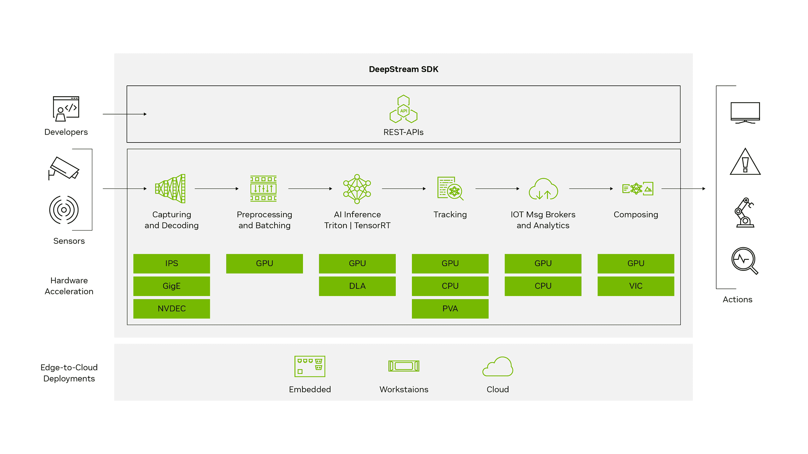
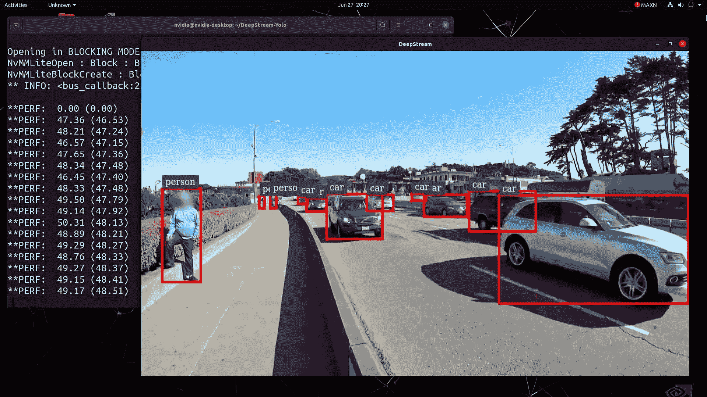
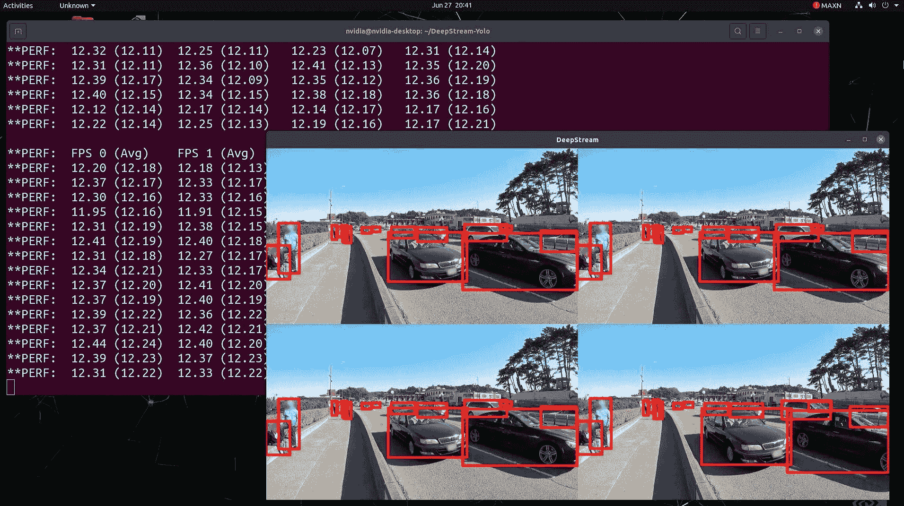

# 使用 DeepStream SDK 和 TensorRT 在 NVIDIA Jetson 上的 Ultralytics YOLOv8

> 原文：[`docs.ultralytics.com/guides/deepstream-nvidia-jetson/`](https://docs.ultralytics.com/guides/deepstream-nvidia-jetson/)

这份详尽的指南提供了在[NVIDIA Jetson](https://www.nvidia.com/en-us/autonomous-machines/embedded-systems/)设备上使用 DeepStream SDK 和 TensorRT 部署 Ultralytics YOLOv8 的详细步骤。在这里，我们使用 TensorRT 来最大化 Jetson 平台上的推理性能。



注意

本指南已在基于 NVIDIA Jetson Orin NX 16GB 运行 JetPack 版本[JP5.1.3](https://developer.nvidia.com/embedded/jetpack-sdk-513)的[Seeed Studio reComputer J4012](https://www.seeedstudio.com/reComputer-J4012-p-5586.html)和基于 NVIDIA Jetson Nano 4GB 运行 JetPack 版本[JP4.6.4](https://developer.nvidia.com/jetpack-sdk-464)的[Seeed Studio reComputer J1020 v2](https://www.seeedstudio.com/reComputer-J1020-v2-p-5498.html)上进行了测试。它预计可以在包括最新和传统的所有 NVIDIA Jetson 硬件中使用。

## 什么是 NVIDIA DeepStream？

[NVIDIA 的 DeepStream SDK](https://developer.nvidia.com/deepstream-sdk)是基于 GStreamer 的完整流分析工具包，用于基于 AI 的多传感器处理、视频、音频和图像理解。它非常适合视觉 AI 开发人员、软件合作伙伴、初创公司和 OEM 构建 IVA（智能视频分析）应用和服务。您现在可以创建包含神经网络和其他复杂处理任务（如跟踪、视频编码/解码和视频渲染）的流处理管道。这些管道实现了对视频、图像和传感器数据的实时分析。DeepStream 的多平台支持为您在本地、边缘和云端开发视觉 AI 应用和服务提供了更快、更简单的方法。

## 先决条件

在开始遵循本指南之前：

+   访问我们的文档，快速入门指南：NVIDIA Jetson 与 Ultralytics YOLOv8，为您的 NVIDIA Jetson 设备设置 Ultralytics YOLOv8

+   根据 JetPack 版本安装[DeepStream SDK](https://developer.nvidia.com/deepstream-getting-started)

    +   对于 JetPack 4.6.4，请安装[DeepStream 6.0.1](https://docs.nvidia.com/metropolis/deepstream/6.0.1/dev-guide/text/DS_Quickstart.html)

    +   对于 JetPack 5.1.3，请安装[DeepStream 6.3](https://docs.nvidia.com/metropolis/deepstream/6.3/dev-guide/text/DS_Quickstart.html)

提示

在本指南中，我们使用了将 DeepStream SDK 安装到 Jetson 设备的 Debian 软件包方法。您也可以访问[Jetson 上的 DeepStream SDK（存档）](https://developer.nvidia.com/embedded/deepstream-on-jetson-downloads-archived)来获取 DeepStream 的旧版本。

## YOLOv8 在 DeepStream 上的配置

我们使用的是[marcoslucianops/DeepStream-Yolo](https://github.com/marcoslucianops/DeepStream-Yolo) GitHub 存储库，该存储库包含 NVIDIA DeepStream SDK 对 YOLO 模型的支持。我们感谢 marcoslucianops 为其贡献所做的努力！

1.  安装依赖项

    ```py
    `pip  install  cmake pip  install  onnxsim` 
    ```

1.  克隆以下存储库

    ```py
    `git  clone  https://github.com/marcoslucianops/DeepStream-Yolo cd  DeepStream-Yolo` 
    ```

1.  从[YOLOv8 releases](https://github.com/ultralytics/assets/releases)下载您选择的 Ultralytics YOLOv8 检测模型（.pt）。这里我们使用[yolov8s.pt](https://github.com/ultralytics/assets/releases/download/v8.2.0/yolov8s.pt)。

    ```py
    `wget  https://github.com/ultralytics/assets/releases/download/v8.2.0/yolov8s.pt` 
    ```

    注意

    您还可以使用[自定义训练的 YOLOv8 模型](https://docs.ultralytics.com/modes/train/)。

1.  将模型转换为 ONNX

    ```py
    `python3  utils/export_yoloV8.py  -w  yolov8s.pt` 
    ```

    将以下参数传递给上述命令

    对于 DeepStream 6.0.1，请使用 opset 12 或更低版本。默认 opset 为 16。

    ```py
    `--opset  12` 
    ```

    更改推理尺寸（默认值：640）

    ```py
    `-s  SIZE --size  SIZE -s  HEIGHT  WIDTH --size  HEIGHT  WIDTH` 
    ```

    例如 1280 的示例：

    ```py
    `-s  1280 or -s  1280  1280` 
    ```

    要简化 ONNX 模型（DeepStream >= 6.0）

    ```py
    `--simplify` 
    ```

    要使用动态批量大小（DeepStream >= 6.1）

    ```py
    `--dynamic` 
    ```

    若要使用静态批量大小（例如批量大小为 4）

    ```py
    `--batch  4` 
    ```

1.  根据安装的 JetPack 版本设置 CUDA 版本

    对于 JetPack 4.6.4：

    ```py
    `export  CUDA_VER=10.2` 
    ```

    对于 JetPack 5.1.3：

    ```py
    `export  CUDA_VER=11.4` 
    ```

1.  编译库

    ```py
    `make  -C  nvdsinfer_custom_impl_Yolo  clean  &&  make  -C  nvdsinfer_custom_impl_Yolo` 
    ```

1.  根据您的模型编辑`config_infer_primary_yoloV8.txt`文件（适用于具有 80 个类别的 YOLOv8s）

    ```py
    `[property] ... onnx-file=yolov8s.onnx ... num-detected-classes=80 ...` 
    ```

1.  编辑`deepstream_app_config`文件

    ```py
    `... [primary-gie] ... config-file=config_infer_primary_yoloV8.txt` 
    ```

1.  您还可以在`deepstream_app_config`文件中更改视频源。这里加载了一个默认视频文件

    ```py
    `... [source0] ... uri=file:///opt/nvidia/deepstream/deepstream/samples/streams/sample_1080p_h264.mp4` 
    ```

### 运行推理

```py
`deepstream-app  -c  deepstream_app_config.txt` 
```

注意

在开始推理之前生成 TensorRT 引擎文件可能需要很长时间，请耐心等待。



提示

如果要将模型转换为 FP16 精度，只需在`config_infer_primary_yoloV8.txt`内设置`model-engine-file=model_b1_gpu0_fp16.engine`和`network-mode=2`。

## INT8 校准

如果要进行推理的 INT8 精度，您需要按照以下步骤操作

1.  设置`OPENCV`环境变量

    ```py
    `export  OPENCV=1` 
    ```

1.  编译库

    ```py
    `make  -C  nvdsinfer_custom_impl_Yolo  clean  &&  make  -C  nvdsinfer_custom_impl_Yolo` 
    ```

1.  对于 COCO 数据集，请下载[val2017](http://images.cocodataset.org/zips/val2017.zip)，解压并移动到`DeepStream-Yolo`文件夹

1.  创建一个用于校准图像的新目录

    ```py
    `mkdir  calibration` 
    ```

1.  运行以下命令从 COCO 数据集中选择 1000 张随机图像以进行校准

    ```py
    `for  jpg  in  $(ls  -1  val2017/*.jpg  |  sort  -R  |  head  -1000);  do  \   cp  ${jpg}  calibration/;  \ done` 
    ```

    注意

    NVIDIA 建议至少使用 500 张图像以获得良好的准确性。在此示例中，选择 1000 张图像以获得更高的准确性（更多图像=更高的准确性）。您可以设置为**head -1000**。例如，对于 2000 张图像，设置为**head -2000**。此过程可能需要很长时间。

1.  创建包含所有选定图像的`calibration.txt`文件

    ```py
    `realpath  calibration/*jpg  >  calibration.txt` 
    ```

1.  设置环境变量

    ```py
    `export  INT8_CALIB_IMG_PATH=calibration.txt export  INT8_CALIB_BATCH_SIZE=1` 
    ```

    注意

    较高的 INT8_CALIB_BATCH_SIZE 值将导致更高的准确性和更快的校准速度。根据您的 GPU 内存设置它。

1.  更新`config_infer_primary_yoloV8.txt`文件

    来自

    ```py
    `... model-engine-file=model_b1_gpu0_fp32.engine #int8-calib-file=calib.table ... network-mode=0 ...` 
    ```

    为了

    ```py
    `... model-engine-file=model_b1_gpu0_int8.engine int8-calib-file=calib.table ... network-mode=1 ...` 
    ```

### 运行推理

```py
`deepstream-app  -c  deepstream_app_config.txt` 
```

## 多流设置

要在单个 DeepStream 应用程序下设置多个流，您可以对`deepstream_app_config.txt`文件进行以下更改

1.  根据所需的流数量更改行和列以构建网格显示。例如，对于 4 个流，我们可以添加 2 行和 2 列。

    ```py
    `[tiled-display] rows=2 columns=2` 
    ```

1.  设置 `num-sources=4` 并添加所有 4 个流的 `uri`

    ```py
    `[source0] enable=1 type=3 uri=<path_to_video> uri=<path_to_video> uri=<path_to_video> uri=<path_to_video> num-sources=4` 
    ```

### 运行推理

```py
`deepstream-app  -c  deepstream_app_config.txt` 
```



## 基准结果

以下表格总结了在 NVIDIA Jetson Orin NX 16GB 上，YOLOv8s 模型在不同 TensorRT 精度级别（输入尺寸为 640x640）下的性能表现。

| 模型名称 | 精度 | 推理时间 (ms/im) | FPS |
| --- | --- | --- | --- |
| YOLOv8s | FP32 | 15.63 | 64 |
|  | FP16 | 7.94 | 126 |
|  | INT8 | 5.53 | 181 |

### 致谢

此指南最初由我们的朋友 Seeed Studio 的 Lakshantha 和 Elaine 创建。

## 常见问题解答

### 如何在 NVIDIA Jetson 设备上设置 Ultralytics YOLOv8？

要在 [NVIDIA Jetson](https://www.nvidia.com/en-us/autonomous-machines/embedded-systems/) 设备上设置 Ultralytics YOLOv8，首先需要安装与你的 JetPack 版本兼容的 [DeepStream SDK](https://developer.nvidia.com/deepstream-getting-started)。按照我们的快速入门指南逐步配置你的 NVIDIA Jetson，以便部署 YOLOv8。

### 在 NVIDIA Jetson 上使用 TensorRT 与 YOLOv8 的好处是什么？

使用 TensorRT 优化 YOLOv8 模型，显著降低 NVIDIA Jetson 设备上的延迟，并提高吞吐量。TensorRT 通过层融合、精度校准和内核自动调整提供高性能、低延迟的深度学习推理。这导致更快更高效的执行，特别适用于视频分析和自动化机器等实时应用。

### 能否在不同的 NVIDIA Jetson 硬件上运行 Ultralytics YOLOv8 与 DeepStream SDK？

是的，部署 Ultralytics YOLOv8 与 DeepStream SDK 和 TensorRT 的指南适用于整个 NVIDIA Jetson 系列。这包括 Jetson Orin NX 16GB（使用 [JetPack 5.1.3](https://developer.nvidia.com/embedded/jetpack-sdk-513)）和 Jetson Nano 4GB（使用 [JetPack 4.6.4](https://developer.nvidia.com/jetpack-sdk-464)）。详细步骤请参阅 YOLOv8 的 DeepStream 配置部分。

### 如何将 YOLOv8 模型转换为 DeepStream 的 ONNX 格式？

要将 YOLOv8 模型转换为 ONNX 格式以在 DeepStream 中部署，请使用来自 [DeepStream-Yolo](https://github.com/marcoslucianops/DeepStream-Yolo) 仓库的 `utils/export_yoloV8.py` 脚本。

这是一个示例命令：

```py
`python3  utils/export_yoloV8.py  -w  yolov8s.pt  --opset  12  --simplify` 
```

要了解更多有关模型转换的详细信息，请查看我们的模型导出部分。

### NVIDIA Jetson Orin NX 上 YOLOv8 的性能基准是多少？

NVIDIA Jetson Orin NX 16GB 上 YOLOv8 模型的性能因 TensorRT 精度级别而异。例如，YOLOv8s 模型达到：

+   **FP32 精度**: 15.63 ms/im, 64 FPS

+   **FP16 精度**: 7.94 ms/im, 126 FPS

+   **INT8 精度**: 5.53 ms/im, 181 FPS

这些基准测试突显了在 NVIDIA Jetson 硬件上使用 TensorRT 优化的 YOLOv8 模型的效率和能力。详细信息请参见我们的基准测试结果部分。
