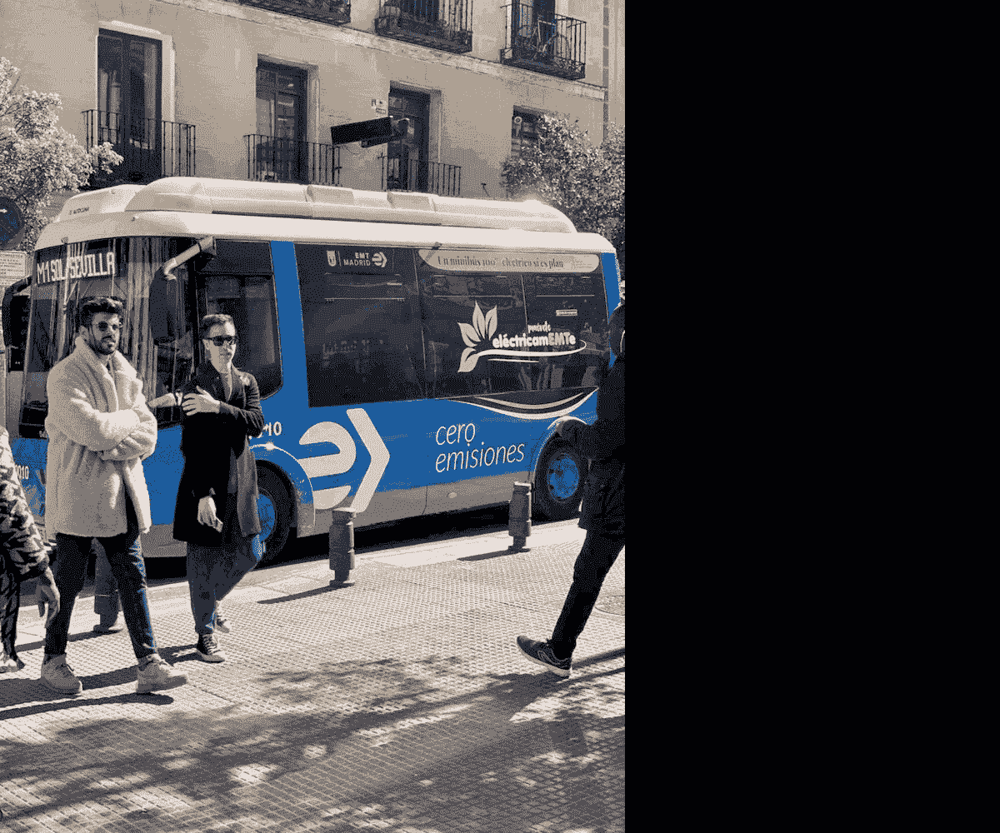
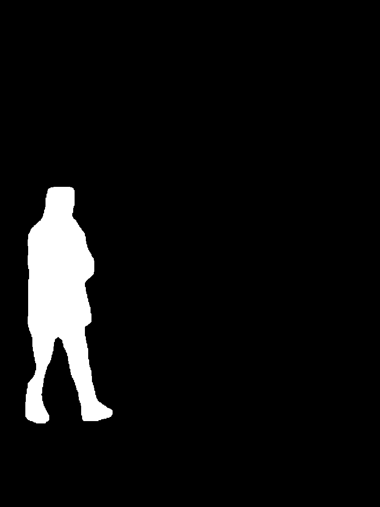
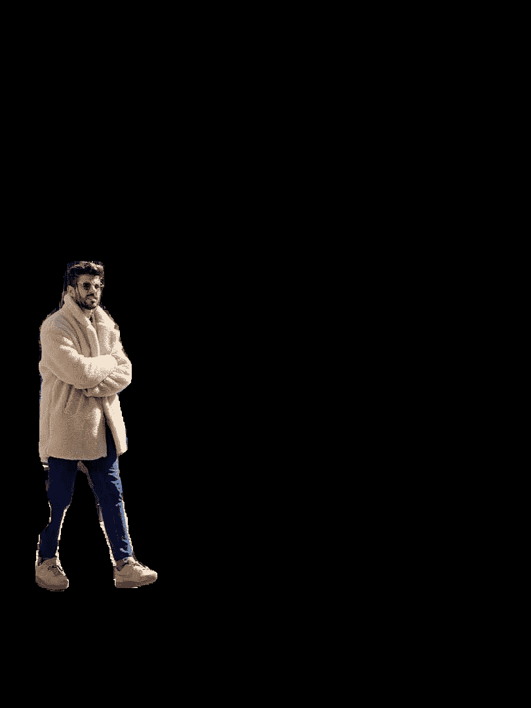
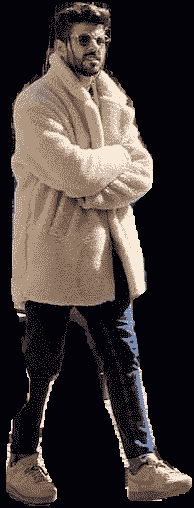
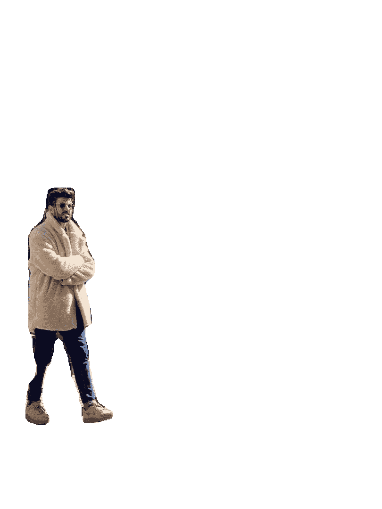
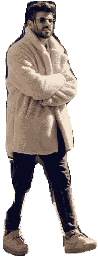

# 隔离分割对象

> 原文：[`docs.ultralytics.com/guides/isolating-segmentation-objects/`](https://docs.ultralytics.com/guides/isolating-segmentation-objects/)

执行分割任务后，有时希望从推断结果中提取出隔离的对象。本指南提供了使用 Ultralytics 预测模式完成此操作的通用方法。



## 步骤详解

1.  请查看 Ultralytics 快速入门安装部分，了解所需库的快速设置步骤。

    * * *

1.  加载模型并在源上运行 `predict()` 方法。

    ```py
    from ultralytics import YOLO

    # Load a model
    model = YOLO("yolov8n-seg.pt")

    # Run inference
    results = model.predict() 
    ```

    没有预测参数？

    如果没有指定来源，将使用库中的示例图像：

    ```py
    'ultralytics/assets/bus.jpg'
    'ultralytics/assets/zidane.jpg' 
    ```

    这对于使用 `predict()` 方法进行快速测试非常有帮助。

    如需了解有关分割模型的更多信息，请访问分割任务页面。要了解更多关于 `predict()` 方法的信息，请参阅文档中的预测模式部分。

    * * *

1.  现在迭代结果和轮廓。对于希望将图像保存到文件的工作流程，会提取源图像 `base-name` 和检测到的 `class-label` 以供后续使用（可选）。

    ```py
    from pathlib import Path

    import numpy as np

    # (2) Iterate detection results (helpful for multiple images)
    for r in res:
        img = np.copy(r.orig_img)
        img_name = Path(r.path).stem  # source image base-name

        # Iterate each object contour (multiple detections)
        for ci, c in enumerate(r):
            # (1) Get detection class name
            label = c.names[c.boxes.cls.tolist().pop()] 
    ```

    1.  要了解更多关于处理检测结果的信息，请参阅预测模式中的框部分。

    1.  要了解更多关于 `predict()` 结果的信息，请参阅预测模式下的结果处理部分<details class="info"><summary>For-Loop</summary>

    单个图像只会在第一个循环中迭代一次。仅包含单个检测的单个图像将在每个循环中仅迭代一次。</details>

    * * *

1.  首先从源图像生成二进制掩码，然后在掩码上绘制填充轮廓。这将使对象从图像的其他部分中被隔离出来。右侧显示了一个来自 `bus.jpg` 的示例，用于一个检测到的 `person` 类对象。

    

    ```py
    import cv2

    # Create binary mask
    b_mask = np.zeros(img.shape[:2], np.uint8)

    # (1) Extract contour result
    contour = c.masks.xy.pop()
    # (2) Changing the type
    contour = contour.astype(np.int32)
    # (3) Reshaping
    contour = contour.reshape(-1, 1, 2)

    # Draw contour onto mask
    _ = cv2.drawContours(b_mask, [contour], -1, (255, 255, 255), cv2.FILLED) 
    ```

    1.  要了解有关 `c.masks.xy` 的更多信息，请参阅预测模式中的掩码部分。

    1.  这里将值转换为 `np.int32`，以便与 OpenCV 的 `drawContours()` 函数兼容。

    1.  OpenCV 的 `drawContours()` 函数期望轮廓具有 `[N, 1, 2]` 的形状，请展开下面的部分以了解更多细节。

        <details><summary>展开以了解定义 `contour` 变量时发生的情况。</summary>

    +   `c.masks.xy` :: 提供掩码轮廓点的坐标，格式为 `(x, y)`。更多细节，请参阅预测模式中的掩码部分。

    +   `.pop()` :: 由于 `masks.xy` 是一个包含单个元素的列表，因此使用 `pop()` 方法提取此元素。

    +   `.astype(np.int32)` :: 使用 `masks.xy` 将返回 `float32` 数据类型，但这与 OpenCV 的 `drawContours()` 函数不兼容，因此这将数据类型更改为 `int32` 以确保兼容性。

    +   `.reshape(-1, 1, 2)` :: 将数据重新格式化为所需的 `[N, 1, 2]` 形状，其中 `N` 是轮廓点的数量，每个点由单个条目 `1` 表示，该条目由 `2` 个值组成。`-1` 表示此维度上的值数量是灵活的。</details> <details><summary>展开以查看 `drawContours()` 配置的解释。</summary>

    +   将 `contour` 变量封装在方括号 `[contour]` 内，在测试中有效生成所需的轮廓掩模。

    +   对于 `drawContours()` 参数，指定的值 `-1` 指示函数绘制图像中存在的所有轮廓。

    +   `tuple` `(255, 255, 255)` 表示颜色白色，这是在此二进制掩模中绘制轮廓所需的颜色。

    +   添加 `cv2.FILLED` 将使得所有由轮廓边界包围的像素颜色相同，本例中，所有被包围的像素将会是白色。

    +   有关更多信息，请参阅 [OpenCV `drawContours()` 文档](https://docs.opencv.org/4.8.0/d6/d6e/group__imgproc__draw.html#ga746c0625f1781f1ffc9056259103edbc)。</details>

    * * *

1.  接下来有两种选项可以继续处理此图像，每种选项后面都有一个后续选项。

    ### 对象隔离选项

    ```py
    # Create 3-channel mask
    mask3ch = cv2.cvtColor(b_mask, cv2.COLOR_GRAY2BGR)

    # Isolate object with binary mask
    isolated = cv2.bitwise_and(mask3ch, img) 
    ```

    <details class="question"><summary>这是如何工作的？</summary>

    +   首先，将二进制掩模从单通道图像转换为三通道图像。这种转换对后续步骤至关重要，其中掩模和原始图像结合。两幅图像必须具有相同的通道数，以兼容混合操作。

    +   使用 OpenCV 函数 `bitwise_and()` 合并原始图像和三通道二进制掩模。此操作仅保留两幅图像中大于零的像素值。由于掩模像素仅在轮廓区域内大于零，因此从原始图像中保留的像素是与轮廓重叠的像素。</details>

    ### 使用黑色像素进行隔离：子选项

    <details class="info"><summary>全尺寸图像</summary>

    如果保留全尺寸图像，则无需任何额外步骤。

    

    示例全尺寸输出</details> <details class="info"><summary>裁剪的对象图像</summary>

    需要进一步裁剪图像以仅包括对象区域。

    

    ```py
    # (1) Bounding box coordinates
    x1, y1, x2, y2 = c.boxes.xyxy.cpu().numpy().squeeze().astype(np.int32)
    # Crop image to object region
    iso_crop = isolated[y1:y2, x1:x2] 
    ```

    1.  有关边界框结果的更多信息，请参见预测模式中的框部分。

    <details class="question"><summary>此代码的作用是什么？</summary>

    +   `c.boxes.xyxy.cpu().numpy()` 调用以 `xyxy` 格式作为 NumPy 数组检索边界框，其中 `xmin`、`ymin`、`xmax` 和 `ymax` 表示边界框矩形的坐标。有关更多详细信息，请参见预测模式中的框部分。

    +   `squeeze()`操作从 NumPy 数组中移除任何不必要的维度，确保其具有预期的形状。

    +   使用`.astype(np.int32)`转换坐标值会将框坐标数据类型从`float32`更改为`int32`，使其适用于使用索引切片进行图像裁剪。

    +   最后，使用索引切片从图像中裁剪边界框区域。边界由检测边界框的`[ymin:ymax, xmin:xmax]`坐标定义。</details></details>

    ```py
    # Isolate object with transparent background (when saved as PNG)
    isolated = np.dstack([img, b_mask]) 
    ```

    <details class="question"><summary>这是如何工作的？</summary>

    +   使用 NumPy `dstack()`函数（沿深度轴堆叠数组）与生成的二进制掩码一起，将创建一个具有四个通道的图像。在保存为`PNG`文件时，这允许对象轮廓外的所有像素都是透明的。</details>

    ### 使用透明像素隔离：子选项

    <details class="info"><summary>全尺寸图像</summary>

    如果保留完整大小的图像，则不需要任何额外步骤。

    

    示例全尺寸输出 + 透明背景</details> <details class="info"><summary>裁剪对象图像</summary>

    需要额外步骤来裁剪图像，仅包括对象区域。

    

    ```py
    # (1) Bounding box coordinates
    x1, y1, x2, y2 = c.boxes.xyxy.cpu().numpy().squeeze().astype(np.int32)
    # Crop image to object region
    iso_crop = isolated[y1:y2, x1:x2] 
    ```

    1.  若要了解边界框结果的更多信息，请参见预测模式下的框部分

    <details class="question"><summary>这段代码做什么？</summary>

    +   当使用`c.boxes.xyxy.cpu().numpy()`时，边界框将作为 NumPy 数组返回，使用`xyxy`框坐标格式，这对应于边界框（矩形）的`xmin, ymin, xmax, ymax`点，请参见预测模式的框部分获取更多信息。

    +   添加`squeeze()`确保从 NumPy 数组中移除任何多余的维度。

    +   使用`.astype(np.int32)`转换坐标值会将框坐标数据类型从`float32`更改为`int32`，在使用索引切片裁剪图像时会兼容。

    +   最后，使用索引切片裁剪边界框的图像区域，其中边界由检测边界框的`[ymin:ymax, xmin:xmax]`坐标设置。</details></details> <details class="question"><summary>如果我想要包括背景在内的裁剪对象，该怎么办？</summary>

    这是 Ultralytics 库的内置功能。有关详细信息，请参阅预测模式推理参数中的`save_crop`参数。</details>

    * * *

1.  接下来的操作完全取决于您作为开发人员的选择。一个可能的下一步基本示例（将图像保存为文件以备将来使用）已显示。

    +   **注意：** 如果对您的具体用例不需要，则可以选择跳过此步骤。<details class="example"><summary>最终示例步骤</summary>

    ```py
    # Save isolated object to file
    _ = cv2.imwrite(f"{img_name}_{label}-{ci}.png", iso_crop) 
    ```

    +   在这个示例中，`img_name` 是源图像文件的基本名称，`label` 是检测到的类名，`ci` 是对象检测的索引（如果有多个具有相同类名的实例）。</details>

## 完整示例代码

在这里，将前一节的所有步骤合并为一个代码块。对于重复使用，最好定义一个函数来执行`for`循环中的某些或所有命令，但这是留给读者的练习。

```py
from pathlib import Path

import cv2
import numpy as np

from ultralytics import YOLO

m = YOLO("yolov8n-seg.pt")  # (4)!
res = m.predict()  # (3)!

# Iterate detection results (5)
for r in res:
    img = np.copy(r.orig_img)
    img_name = Path(r.path).stem

    # Iterate each object contour (6)
    for ci, c in enumerate(r):
        label = c.names[c.boxes.cls.tolist().pop()]

        b_mask = np.zeros(img.shape[:2], np.uint8)

        # Create contour mask (1)
        contour = c.masks.xy.pop().astype(np.int32).reshape(-1, 1, 2)
        _ = cv2.drawContours(b_mask, [contour], -1, (255, 255, 255), cv2.FILLED)

        # Choose one:

        # OPTION-1: Isolate object with black background
        mask3ch = cv2.cvtColor(b_mask, cv2.COLOR_GRAY2BGR)
        isolated = cv2.bitwise_and(mask3ch, img)

        # OPTION-2: Isolate object with transparent background (when saved as PNG)
        isolated = np.dstack([img, b_mask])

        # OPTIONAL: detection crop (from either OPT1 or OPT2)
        x1, y1, x2, y2 = c.boxes.xyxy.cpu().numpy().squeeze().astype(np.int32)
        iso_crop = isolated[y1:y2, x1:x2]

        # TODO your actions go here (2) 
```

1.  在此处将填充 `contour` 的行合并为单行，而不是像上面那样拆分为多行。

1.  这里的内容由您决定！

1.  有关附加信息，请参阅 Predict Mode。

1.  参见 Segment Task 获取更多信息。

1.  详细了解与结果一起工作

1.  详细了解分割掩模结果

## 常见问题解答

### 如何使用 Ultralytics YOLOv8 对象分割任务中孤立对象？

要使用 Ultralytics YOLOv8 对象分割任务中的孤立对象，请按照以下步骤进行：

1.  **加载模型并运行推理：**

    ```py
    from ultralytics import YOLO

    model = YOLO("yolov8n-seg.pt")
    results = model.predict(source="path/to/your/image.jpg") 
    ```

1.  **生成二进制掩模并绘制轮廓：**

    ```py
    import cv2
    import numpy as np

    img = np.copy(results[0].orig_img)
    b_mask = np.zeros(img.shape[:2], np.uint8)
    contour = results[0].masks.xy[0].astype(np.int32).reshape(-1, 1, 2)
    cv2.drawContours(b_mask, [contour], -1, (255, 255, 255), cv2.FILLED) 
    ```

1.  **使用二进制掩模孤立对象：**

    ```py
    mask3ch = cv2.cvtColor(b_mask, cv2.COLOR_GRAY2BGR)
    isolated = cv2.bitwise_and(mask3ch, img) 
    ```

参考 Predict Mode 和 Segment Task 的指南获取更多信息。

### 分割任务中提供的保存孤立对象的选项有哪些？

Ultralytics YOLOv8 提供了两个主要选项来保存孤立对象：

1.  **具有黑色背景：**

    ```py
    mask3ch = cv2.cvtColor(b_mask, cv2.COLOR_GRAY2BGR)
    isolated = cv2.bitwise_and(mask3ch, img) 
    ```

1.  **具有透明背景：**

    ```py
    isolated = np.dstack([img, b_mask]) 
    ```

欲了解详细信息，请访问 Predict Mode 部分。

### 如何使用 Ultralytics YOLOv8 对象分割任务中的边界框裁剪孤立对象？

要裁剪孤立对象至其边界框：

1.  **检索边界框坐标：**

    ```py
    x1, y1, x2, y2 = results[0].boxes.xyxy[0].cpu().numpy().astype(np.int32) 
    ```

1.  **裁剪孤立图像：**

    ```py
    iso_crop = isolated[y1:y2, x1:x2] 
    ```

详细了解 Predict Mode 文档中的边界框结果。

### 为什么应该在对象分割任务中使用 Ultralytics YOLOv8 进行对象孤立？

Ultralytics YOLOv8 提供：

+   **高速** 实时对象检测和分割。

+   **准确的边界框和掩模生成**，用于精确的对象孤立。

+   **全面的文档** 和易于使用的 API，用于高效开发。

探索在 Segment Task 文档中使用 YOLO 的好处。

### 我可以使用 Ultralytics YOLOv8 保存包括背景在内的孤立对象吗？

是的，这是 Ultralytics YOLOv8 中的内置功能。在 `predict()` 方法中使用 `save_crop` 参数。例如：

```py
results = model.predict(source="path/to/your/image.jpg", save_crop=True) 
```

阅读 Predict Mode 推理参数部分中关于 `save_crop` 参数的更多信息。
