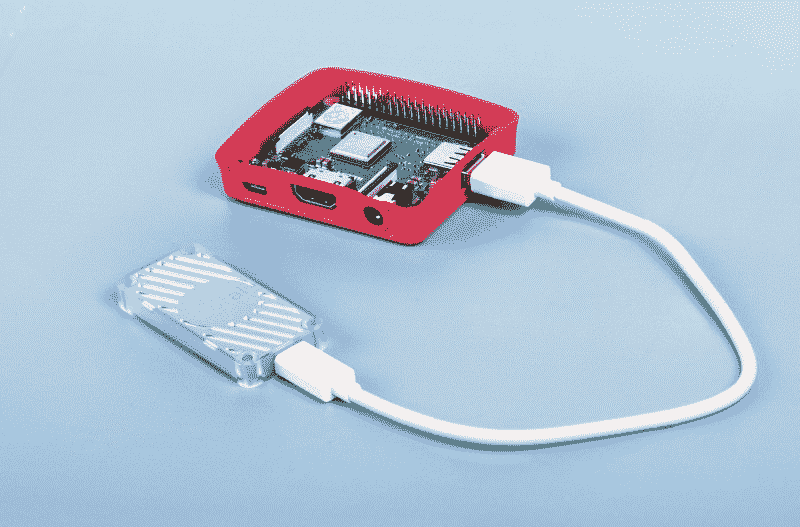

# Coral Edge TPU 在树莓派上与 Ultralytics YOLOv8 🚀

> 原文：[`docs.ultralytics.com/guides/coral-edge-tpu-on-raspberry-pi/`](https://docs.ultralytics.com/guides/coral-edge-tpu-on-raspberry-pi/)



## 什么是 Coral Edge TPU？

Coral Edge TPU 是一款紧凑的设备，为系统添加了 Edge TPU 协处理器。它使得 TensorFlow Lite 模型能够进行低功耗、高性能的 ML 推断。更多信息请查看[Coral Edge TPU 主页](https://coral.ai/products/accelerator)。

## 使用 Coral Edge TPU 提升树莓派模型性能

许多人希望在嵌入式设备或像树莓派这样的移动设备上运行他们的模型，因为它们非常节能且可以应用于许多不同的场景。然而，即使使用像 ONNX 或 OpenVINO 这样的格式，这些设备上的推断性能通常也很差。Coral Edge TPU 是解决这个问题的一个很好的方案，因为它可以与树莓派一起使用，并显著加速推断性能。

## 使用 TensorFlow Lite 在树莓派上安装 Edge TPU（新）⭐

Coral 关于如何在树莓派上使用 Edge TPU 的[现有指南](https://coral.ai/docs/accelerator/get-started/)已经过时，当前的 Coral Edge TPU 运行时版本与当前 TensorFlow Lite 运行时版本不再兼容。此外，谷歌似乎已完全放弃了 Coral 项目，在 2021 年至 2024 年期间没有任何更新。本指南将向您展示如何在树莓派单板计算机（SBC）上使用最新版本的 TensorFlow Lite 运行时和更新的 Coral Edge TPU 运行时让 Edge TPU 正常工作。

## 先决条件

+   [树莓派 4B](https://www.raspberrypi.com/products/raspberry-pi-4-model-b/)（建议使用 2GB 或更多内存）或 [树莓派 5](https://www.raspberrypi.com/products/raspberry-pi-5/)（推荐）

+   [树莓派操作系统](https://www.raspberrypi.com/software/) Bullseye/Bookworm（64 位）带有桌面（推荐）

+   [Coral USB 加速器](https://coral.ai/products/accelerator/)

+   用于导出 Ultralytics PyTorch 模型的非 ARM 平台

## 安装步骤

本指南假设您已经安装了工作正常的树莓派操作系统，并且已经安装了`ultralytics`和所有依赖项。要安装`ultralytics`，请访问快速入门指南进行设置。

### 安装 Edge TPU 运行时

首先，我们需要安装 Edge TPU 运行时。有许多不同的版本可用，因此您需要为您的操作系统选择正确的版本。

| Raspberry Pi OS | 高频模式 | 下载版本 |
| --- | --- | --- |
| Bullseye 32bit | 否 | `libedgetpu1-std_ ... .bullseye_armhf.deb` |
| Bullseye 64bit | 否 | `libedgetpu1-std_ ... .bullseye_arm64.deb` |
| Bullseye 32bit | 是 | `libedgetpu1-max_ ... .bullseye_armhf.deb` |
| Bullseye 64bit | 是 | `libedgetpu1-max_ ... .bullseye_arm64.deb` |
| Bookworm 32 位 | 否 | `libedgetpu1-std_ ... .bookworm_armhf.deb` |
| Bookworm 64 位 | 否 | `libedgetpu1-std_ ... .bookworm_arm64.deb` |
| Bookworm 32 位 | 是 | `libedgetpu1-max_ ... .bookworm_armhf.deb` |
| Bookworm 64 位 | 是 | `libedgetpu1-max_ ... .bookworm_arm64.deb` |

[从这里下载最新版本](https://github.com/feranick/libedgetpu/releases)。

下载文件后，您可以使用以下命令进行安装：

```py
`sudo  dpkg  -i  path/to/package.deb` 
```

安装完运行时后，您需要将 Coral Edge TPU 插入到树莓派的 USB 3.0 端口中。这是因为根据官方指南，安装后需要让新的`udev`规则生效。

<details class="warning" open="open"><summary>重要提示</summary>

如果您已经安装了 Coral Edge TPU 运行时，请使用以下命令卸载它。

```py
`# If you installed the standard version sudo  apt  remove  libedgetpu1-std  # If you installed the high frequency version sudo  apt  remove  libedgetpu1-max` 
```</details>

## 将您的模型导出为 Edge TPU 兼容模型

要使用 Edge TPU，您需要将模型转换为兼容格式。建议您在 Google Colab、x86_64 Linux 机器上运行导出操作，使用官方 Ultralytics Docker 容器或者使用 Ultralytics HUB，因为 Edge TPU 编译器在 ARM 上不可用。查看导出模式以获取可用参数。

导出

```py
`from ultralytics import YOLO  # Load a model model = YOLO("path/to/model.pt")  # Load an official model or custom model  # Export the model model.export(format="edgetpu")` 
```

```py
`yolo  export  model=path/to/model.pt  format=edgetpu  # Export an official model or custom model` 
```

导出的模型将保存在`<model_name>_saved_model/`文件夹中，命名为`<model_name>_full_integer_quant_edgetpu.tflite`。

## 运行模型

导出模型后，您可以使用以下代码进行推理：

运行中

```py
`from ultralytics import YOLO  # Load a model model = YOLO("path/to/edgetpu_model.tflite")  # Load an official model or custom model  # Run Prediction model.predict("path/to/source.png")` 
```

```py
`yolo  predict  model=path/to/edgetpu_model.tflite  source=path/to/source.png  # Load an official model or custom model` 
```

在预测页面上查找关于完整预测模式详细信息的综合信息。

<details class="warning" open="open"><summary>重要提示</summary>

您应该使用`tflite-runtime`而不是`tensorflow`来运行模型。如果安装了`tensorflow`，请使用以下命令卸载 tensorflow：

```py
`pip  uninstall  tensorflow  tensorflow-aarch64` 
```

然后安装/更新`tflite-runtime`：

```py
`pip install -U tflite-runtime` 
```

如果您需要`tensorflow` 2.15.0 的`tflite-runtime` wheel，请从[这里](https://github.com/feranick/TFlite-builds/releases)下载，并使用`pip`或您选择的软件包管理器进行安装。</details>

## FAQ

### Coral Edge TPU 是什么，如何通过 Ultralytics YOLOv8 提升树莓派的性能？

Coral Edge TPU 是一个紧凑设备，旨在为您的系统添加 Edge TPU 协处理器。该协处理器能够进行低功耗、高性能的机器学习推断，特别优化了 TensorFlow Lite 模型。在使用树莓派时，Edge TPU 可以加速 ML 模型推断，显著提升性能，特别是对于 Ultralytics YOLOv8 模型。您可以在他们的[主页](https://coral.ai/products/accelerator)上详细了解 Coral Edge TPU。

### 如何在树莓派上安装 Coral Edge TPU 运行时？

要在您的树莓派上安装 Coral Edge TPU 运行时，请从[此链接](https://github.com/feranick/libedgetpu/releases)下载适合您的树莓派 OS 版本的`.deb`包。下载后，请使用以下命令进行安装：

```py
`sudo  dpkg  -i  path/to/package.deb` 
```

确保按照安装步骤中概述的步骤卸载任何先前的 Coral Edge TPU 运行时版本。

### 我可以将我的 Ultralytics YOLOv8 模型导出为与 Coral Edge TPU 兼容的格式吗？

是的，您可以将您的 Ultralytics YOLOv8 模型导出为与 Coral Edge TPU 兼容的格式。建议在 Google Colab、x86_64 Linux 机器上或使用 Ultralytics Docker 容器进行导出。您还可以使用 Ultralytics HUB 进行导出。以下是如何使用 Python 和 CLI 导出模型的方法：

导出中

```py
`from ultralytics import YOLO  # Load a model model = YOLO("path/to/model.pt")  # Load an official model or custom model  # Export the model model.export(format="edgetpu")` 
```

```py
`yolo  export  model=path/to/model.pt  format=edgetpu  # Export an official model or custom model` 
```

关于导出模式的详细信息，请参阅导出模式文档。

### 如果 TensorFlow 已经安装在我的树莓派上，但我想使用 tflite-runtime，我该怎么办？

如果您的树莓派上安装了 TensorFlow，并且需要切换到`tflite-runtime`，您首先需要卸载 TensorFlow，命令如下：

```py
`pip  uninstall  tensorflow  tensorflow-aarch64` 
```

然后，使用以下命令安装或更新`tflite-runtime`：

```py
`pip  install  -U  tflite-runtime` 
```

对于特定的 wheel，例如 TensorFlow 2.15.0 `tflite-runtime`，您可以从[此链接](https://github.com/feranick/TFlite-builds/releases)下载并使用`pip`安装。详细的操作指南可以在运行模型的部分找到。

### 如何在树莓派上使用 Coral Edge TPU 运行推断已导出的 YOLOv8 模型？

将您的 YOLOv8 模型导出到 Edge TPU 兼容格式后，您可以使用以下代码片段进行推断：

运行中

```py
`from ultralytics import YOLO  # Load a model model = YOLO("path/to/edgetpu_model.tflite")  # Load an official model or custom model  # Run Prediction model.predict("path/to/source.png")` 
```

```py
`yolo  predict  model=path/to/edgetpu_model.tflite  source=path/to/source.png  # Load an official model or custom model` 
```

关于完整预测模式功能的详细信息可在预测页面上找到。
