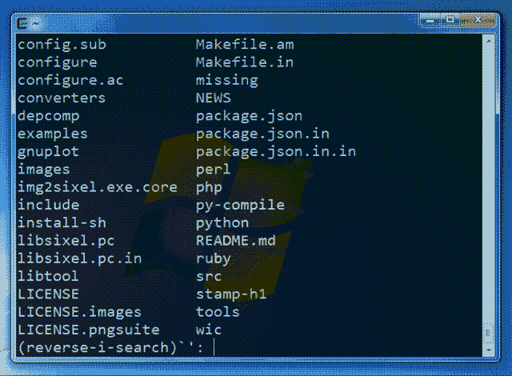
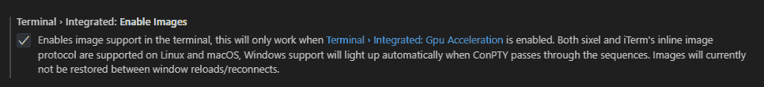
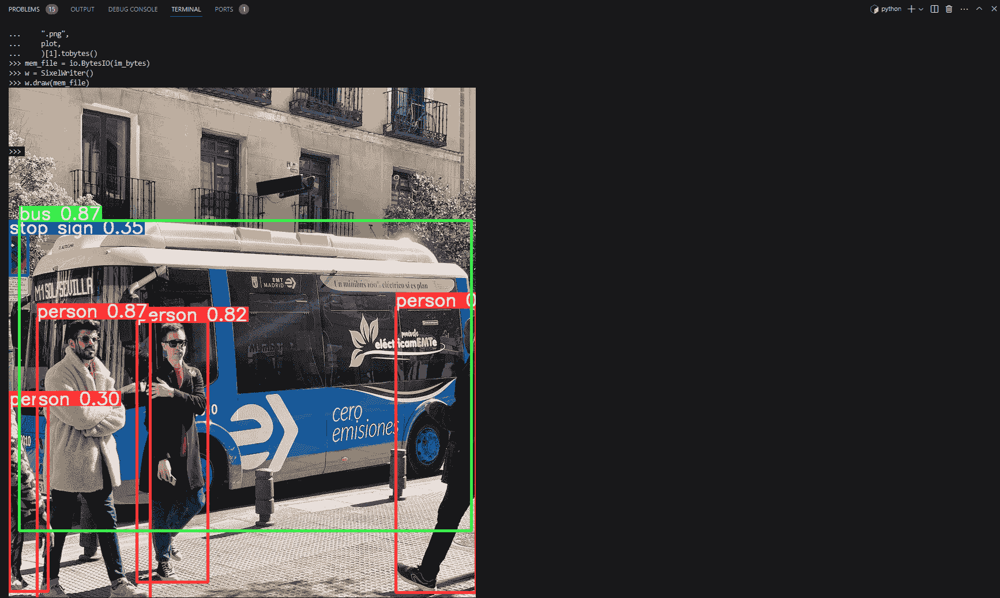

# 在终端查看推断结果

> 原文：[`docs.ultralytics.com/guides/view-results-in-terminal/`](https://docs.ultralytics.com/guides/view-results-in-terminal/)



图像来自[libsixel](https://saitoha.github.io/libsixel/)网站。

## 动机

当连接到远程计算机时，通常不可能或需要将数据移动到带有 GUI 的本地设备才能可视化图像结果。VSCode 集成终端允许直接渲染图像。这是如何与`ultralytics`结合使用预测结果的简短演示。

警告

仅兼容 Linux 和 MacOS。请查看[VSCode 存储库](https://github.com/microsoft/vscode)，检查[问题状态](https://github.com/microsoft/vscode/issues/198622)，或查看[文档](https://code.visualstudio.com/docs)以获取有关在终端中使用`sixel`查看图像的 Windows 支持更新。

使用集成终端查看图像的 VSCode 兼容协议是[`sixel`](https://en.wikipedia.org/wiki/Sixel)和[`iTerm`](https://iterm2.com/documentation-images.html)。本指南将演示如何使用`sixel`协议。

## 过程

1.  首先，您必须在 VSCode 中启用设置`terminal.integrated.enableImages`和`terminal.integrated.gpuAcceleration`。

    ```py
    "terminal.integrated.gpuAcceleration":  "auto"  # "auto" is default, can also use "on"
    "terminal.integrated.enableImages":  false 
    ```

    

1.  在您的虚拟环境中安装`python-sixel`库。这是已不再维护的`PySixel`库的[分支](https://github.com/lubosz/python-sixel?tab=readme-ov-file)。

    ```py
    pip  install  sixel 
    ```

1.  加载模型并执行推断，然后绘制结果并存储在变量中。有关推断参数和处理结果的更多信息，请参阅预测模式页面。

    ```py
    from ultralytics import YOLO

    # Load a model
    model = YOLO("yolov8n.pt")

    # Run inference on an image
    results = model.predict(source="ultralytics/assets/bus.jpg")

    # Plot inference results
    plot = results[0].plot()  # (1)! 
    ```

    1.  查看绘图方法参数以了解可能的参数用法。

1.  现在，使用 OpenCV 将`numpy.ndarray`转换为`bytes`数据。然后使用`io.BytesIO`创建“类文件”对象。

    ```py
    import io

    import cv2

    # Results image as bytes
    im_bytes = cv2.imencode(
        ".png",  # (1)!
        plot,
    )[1].tobytes()  # (2)!

    # Image bytes as a file-like object
    mem_file = io.BytesIO(im_bytes) 
    ```

    1.  也可以使用其他图像扩展名。

    1.  仅需要返回的索引`1`处的对象。

1.  创建一个`SixelWriter`实例，然后使用`.draw()`方法在终端中绘制图像。

    ```py
    from sixel import SixelWriter

    # Create sixel writer object
    w = SixelWriter()

    # Draw the sixel image in the terminal
    w.draw(mem_file) 
    ```

## 示例推断结果



危险

尚未测试此示例是否适用于视频或动画 GIF 帧。请自行决定风险。

## 完整代码示例

```py
import io

import cv2
from sixel import SixelWriter

from ultralytics import YOLO

# Load a model
model = YOLO("yolov8n.pt")

# Run inference on an image
results = model.predict(source="ultralytics/assets/bus.jpg")

# Plot inference results
plot = results[0].plot()  # (3)!

# Results image as bytes
im_bytes = cv2.imencode(
    ".png",  # (1)!
    plot,
)[1].tobytes()  # (2)!

mem_file = io.BytesIO(im_bytes)
w = SixelWriter()
w.draw(mem_file) 
```

1.  也可以使用其他图像扩展名。

1.  仅需要返回的索引`1`处的对象。

1.  查看绘图方法参数以了解可能的参数用法。

* * *

小贴士

您可能需要使用`clear`命令来“清除”终端中的图像视图。

## 常见问题解答

### 如何在 macOS 或 Linux 的 VSCode 终端上查看 YOLO 推断结果？

若要在 macOS 或 Linux 的 VSCode 终端上查看 YOLO 推断结果，请按以下步骤操作：

1.  启用必要的 VSCode 设置：

    ```py
    "terminal.integrated.enableImages":  true
    "terminal.integrated.gpuAcceleration":  "auto" 
    ```

1.  安装 sixel 库：

    ```py
    pip  install  sixel 
    ```

1.  加载您的 YOLO 模型并运行推断：

    ```py
    from ultralytics import YOLO

    model = YOLO("yolov8n.pt")
    results = model.predict(source="path_to_image")
    plot = results[0].plot() 
    ```

1.  将推理结果图像转换为字节并在终端中显示：

    ```py
    import io

    import cv2
    from sixel import SixelWriter

    im_bytes = cv2.imencode(".png", plot)[1].tobytes()
    mem_file = io.BytesIO(im_bytes)
    SixelWriter().draw(mem_file) 
    ```

获取更多细节，请访问预测模式页面。

### 为什么 sixel 协议只在 Linux 和 macOS 上有效？

目前，sixel 协议仅在 Linux 和 macOS 平台上受支持，因为这些平台具有与 sixel 图形兼容的本地终端功能。Windows 上使用 sixel 进行终端图形的支持仍在开发中。有关 Windows 兼容性的更新，请查看 [VSCode 问题状态](https://github.com/microsoft/vscode/issues/198622) 和 [文档](https://code.visualstudio.com/docs)。

### 如果在 VSCode 终端中显示图像遇到问题怎么办？

如果在 VSCode 终端中使用 sixel 显示图像遇到问题：

1.  确保在 VSCode 中启用必要的设置：

    ```py
    "terminal.integrated.enableImages":  true
    "terminal.integrated.gpuAcceleration":  "auto" 
    ```

1.  验证 sixel 库的安装：

    ```py
    pip  install  sixel 
    ```

1.  检查你的图像数据转换和绘图代码是否存在错误。例如：

    ```py
    import io

    import cv2
    from sixel import SixelWriter

    im_bytes = cv2.imencode(".png", plot)[1].tobytes()
    mem_file = io.BytesIO(im_bytes)
    SixelWriter().draw(mem_file) 
    ```

如果问题持续存在，请参考 [VSCode 仓库](https://github.com/microsoft/vscode)，并访问绘图方法参数部分以获取额外的指导。

### YOLO 能否使用 sixel 在终端中显示视频推理结果？

目前，尚未测试在终端中使用 sixel 显示视频推理结果或动画 GIF 帧，可能不受支持。建议从静态图像开始验证兼容性，并自行承担尝试视频结果的风险，同时注意性能限制。有关绘制推理结果的更多信息，请访问预测模式页面。

### 如何解决 `python-sixel` 库的问题？

要解决 `python-sixel` 库的问题：

1.  确保库在你的虚拟环境中正确安装：

    ```py
    pip  install  sixel 
    ```

1.  验证你是否拥有必要的 Python 和系统依赖项。

1.  参考 [python-sixel GitHub 仓库](https://github.com/lubosz/python-sixel) 获取额外的文档和社区支持。

1.  双重检查代码是否存在潜在错误，特别是 `SixelWriter` 的使用和图像数据转换步骤。

关于 YOLO 模型和 sixel 集成的进一步帮助，请参阅导出和预测模式文档页面。
