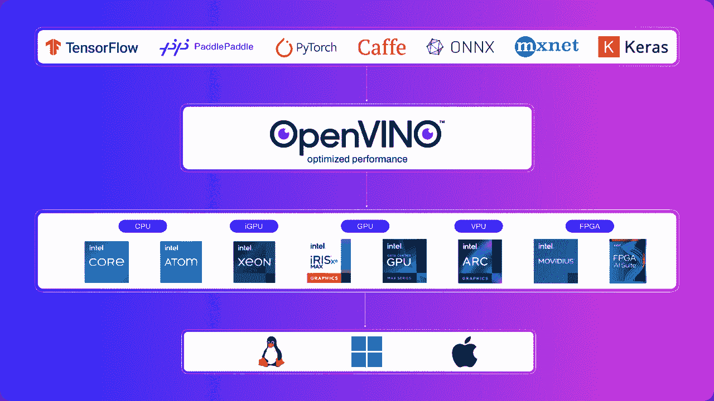

# 优化 Ultralytics YOLO 模型的 OpenVINO 推理：全面指南

> 原文：[`docs.ultralytics.com/guides/optimizing-openvino-latency-vs-throughput-modes/`](https://docs.ultralytics.com/guides/optimizing-openvino-latency-vs-throughput-modes/)



## 介绍

在部署深度学习模型时，特别是那些用于目标检测的模型（例如 Ultralytics YOLO 模型），实现最佳性能至关重要。本指南深入探讨了如何利用英特尔的 OpenVINO 工具包优化推理过程，专注于延迟和吞吐量。无论您是在消费级应用还是大规模部署中工作，了解并应用这些优化策略将确保您的模型在各种设备上高效运行。

## 优化延迟

对于需要从单个输入获得单个模型立即响应的应用程序，如消费者场景中典型的情况，延迟优化至关重要。目标是尽量减少输入和推理结果之间的延迟。然而，要实现低延迟需要仔细考虑，特别是在同时运行推理或管理多个模型时。

### 降低延迟优化关键策略：

+   **单设备单推理：** 实现低延迟的最简单方法是限制每次设备仅进行一个推理。增加并发通常会导致延迟增加。

+   **利用子设备：** 类似多套接 CPU 或多片 GPU 的设备可以利用其内部子设备，在增加最小延迟的情况下执行多个请求。

+   **OpenVINO 性能提示：** 在模型编译过程中，使用 OpenVINO 的 `ov::hint::PerformanceMode::LATENCY` 设置 `ov::hint::performance_mode` 属性可以简化性能调优，提供一种设备无关且未来可靠的方法。

### 管理首次推理延迟：

+   **模型缓存：** 为了减少影响延迟的模型加载和编译时间，尽可能使用模型缓存。对于无法使用缓存的情况，CPU 通常提供最快的模型加载时间。

+   **模型映射 vs. 读取：** 为了减少加载时间，OpenVINO 使用模型映射替换了模型读取。然而，如果模型位于可移动或网络驱动器上，考虑使用 `ov::enable_mmap(false)` 切换回读取模式。

+   **AUTO 设备选择：** 此模式在 CPU 上开始推理，在加速器准备就绪后自动切换，无缝地降低首次推理延迟。

## 优化吞吐量

在同时处理大量推理请求的场景中，优化吞吐量至关重要，旨在最大化资源利用率，同时不显著牺牲单个请求的性能。

### 吞吐量优化方法：

1.  **OpenVINO 性能提示：** 使用性能提示可以跨设备高效提升吞吐量的高级、未来可靠的方法。

    ```py
    import openvino.properties.hint as hints

    config = {hints.performance_mode: hints.PerformanceMode.THROUGHPUT}
    compiled_model = core.compile_model(model, "GPU", config) 
    ```

1.  **显式批处理和流：** 更精细的方法包括显式批处理和使用流进行高级性能调优。

### 设计面向吞吐量的应用程序：

为了最大化吞吐量，应用程序应该：

+   并行处理输入，充分利用设备的能力。

+   将数据流分解为并发推理请求，安排并行执行。

+   利用异步 API 和回调来保持效率并避免设备饥饿。

### 多设备执行：

OpenVINO 的多设备模式通过自动平衡设备之间的推理请求而无需应用程序级别的设备管理，从而简化了吞吐量的扩展。

## 结论

使用 OpenVINO 优化 Ultralytics YOLO 模型以提高延迟和吞吐量可以显著增强应用程序的性能。通过仔细应用本指南中提出的策略，开发人员可以确保其模型高效运行，满足各种部署场景的需求。请记住，优化延迟或吞吐量的选择取决于您的具体应用需求和部署环境的特性。

欲获取更详细的技术信息和最新更新，请参阅[OpenVINO 文档](https://docs.openvino.ai/latest/index.html)和[Ultralytics YOLO 存储库](https://github.com/ultralytics/ultralytics)。这些资源提供深入的指南、教程和社区支持，帮助您充分利用您的深度学习模型。

* * *

确保您的模型实现最佳性能不仅仅是调整配置，还需要理解应用程序的需求并做出明智的决策。无论您是为实时响应进行优化还是为大规模处理最大化吞吐量，Ultralytics YOLO 模型与 OpenVINO 的结合为开发人员提供了强大的工具包，用于部署高性能人工智能解决方案。

## 常见问题

### 如何使用 OpenVINO 优化 Ultralytics YOLO 模型以实现低延迟？

使用 OpenVINO 优化 Ultralytics YOLO 模型以实现低延迟涉及几个关键策略：

1.  **单设备单推理：** 限制每次设备推理一个以减少延迟。

1.  **利用子设备：** 利用像多插槽 CPU 或多片 GPU 这样的设备，可以处理多个请求而增加的延迟最小。

1.  **OpenVINO 性能提示：** 在模型编译期间使用 OpenVINO 的`ov::hint::PerformanceMode::LATENCY`来简化设备无关的调优。

欲了解更多有关优化延迟的实用技巧，请查看我们指南中的延迟优化部分。

### 为何应使用 OpenVINO 优化 Ultralytics YOLO 吞吐量？

OpenVINO 通过最大化设备资源利用而不损失性能来增强 Ultralytics YOLO 模型的吞吐量。其主要优势包括：

+   **性能提示：** 简单高效的跨设备性能调优。

+   **显式批处理和流处理：** 为高级性能进行微调。

+   **多设备执行：** 自动推理负载平衡，简化应用级管理。

示例配置：

```py
import openvino.properties.hint as hints

config = {hints.performance_mode: hints.PerformanceMode.THROUGHPUT}
compiled_model = core.compile_model(model, "GPU", config) 
```

在我们详细指南的吞吐量优化部分了解更多。

### 在 OpenVINO 中减少首次推断延迟的最佳实践是什么？

要减少首次推断延迟，考虑以下实践：

1.  **模型缓存:** 使用模型缓存来减少加载和编译时间。

1.  **模型映射 vs. 读取:** 默认使用映射（`ov::enable_mmap(true)`），但如果模型位于可移动或网络驱动器上，则切换到读取（`ov::enable_mmap(false)`）。

1.  **AUTO 设备选择:** 使用 AUTO 模式从 CPU 推断开始，并无缝转换到加速器。

关于管理首次推断延迟的详细策略，请参考管理首次推断延迟部分。

### 如何在 Ultralytics YOLO 和 OpenVINO 之间平衡优化延迟和吞吐量？

平衡延迟和吞吐量优化需要理解您的应用程序需求：

+   **延迟优化:** 适用于需要即时响应的实时应用程序（例如消费级应用程序）。

+   **吞吐量优化:** 适用于有许多并发推断的场景，最大化资源使用（例如大规模部署）。

使用 OpenVINO 的高级性能提示和多设备模式可以帮助找到适当的平衡。根据您的具体需求选择适当的[OpenVINO 性能提示](https://docs.ultralytics.com/integrations/openvino#openvino-performance-hints)。

### 我可以将 Ultralytics YOLO 模型与除 OpenVINO 外的其他 AI 框架一起使用吗？

是的，Ultralytics YOLO 模型非常灵活，可以与多种 AI 框架集成。选项包括：

+   **TensorRT:** 用于 NVIDIA GPU 优化，请参考[TensorRT 集成指南](https://docs.ultralytics.com/integrations/tensorrt)。

+   **CoreML:** 对于苹果设备，请参考我们的[CoreML 导出说明](https://docs.ultralytics.com/integrations/coreml)。

+   **TensorFlow.js:** 用于 Web 和 Node.js 应用程序，请查看[TF.js 转换指南](https://docs.ultralytics.com/integrations/tfjs)。

在[Ultralytics 集成页面](https://docs.ultralytics.com/integrations)上探索更多集成。
