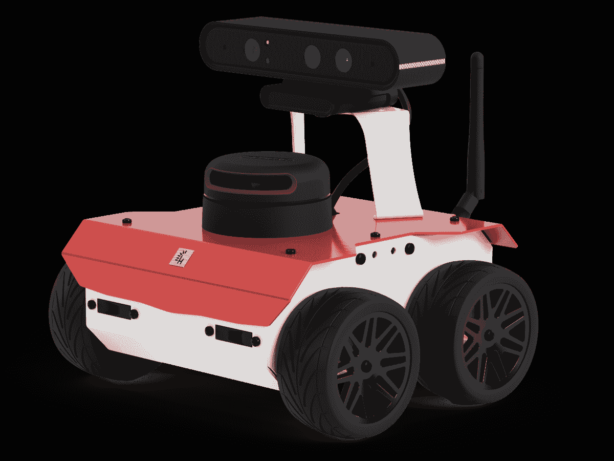
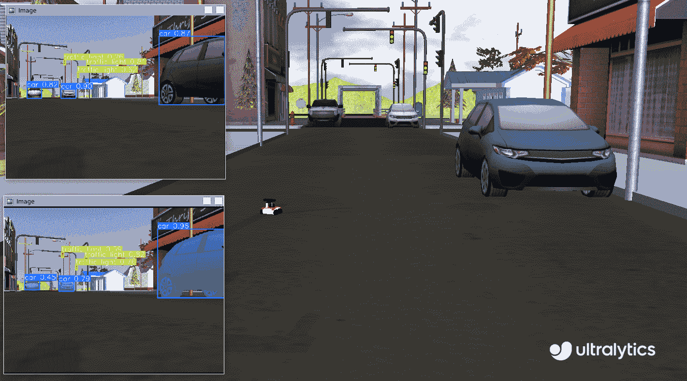
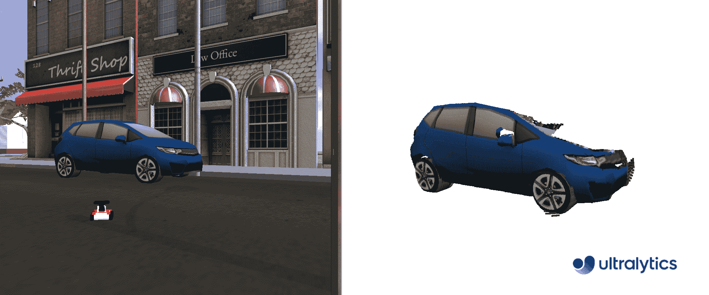
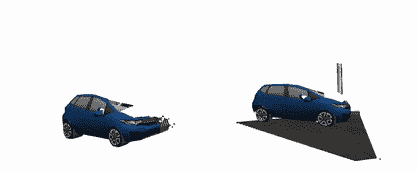

# ROS（机器人操作系统）快速入门指南

> 原文：[`docs.ultralytics.com/guides/ros-quickstart/`](https://docs.ultralytics.com/guides/ros-quickstart/)

[`player.vimeo.com/video/639236696?h=740f412ce5`](https://player.vimeo.com/video/639236696?h=740f412ce5)

[ROS 简介（字幕）](https://vimeo.com/639236696) 来自 [Open Robotics](https://vimeo.com/osrfoundation) 在 [Vimeo](https://vimeo.com) 上。

## 什么是 ROS？

[机器人操作系统（ROS）](https://www.ros.org/)是一个广泛用于机器人研究和工业的开源框架。ROS 提供了一系列[库和工具](https://www.ros.org/blog/ecosystem/)，帮助开发者创建机器人应用程序。ROS 设计用于与各种[机器人平台](https://robots.ros.org/)兼容，使其成为机器人学家的一种灵活而强大的工具。

### ROS 的关键特性

1.  **模块化架构**：ROS 采用模块化架构，允许开发者通过组合称为[节点](https://wiki.ros.org/ROS/Tutorials/UnderstandingNodes)的较小、可重复使用的组件构建复杂系统。每个节点通常执行特定的功能，并且节点之间通过[主题](https://wiki.ros.org/ROS/Tutorials/UnderstandingTopics)或[服务](https://wiki.ros.org/ROS/Tutorials/UnderstandingServicesParams)上的消息进行通信。

1.  **通信中间件**：ROS 提供了强大的通信基础设施，支持进程间通信和分布式计算。通过数据流（主题）的发布-订阅模型和服务调用的请求-响应模型实现。

1.  **硬件抽象**：ROS 在硬件上提供了一层抽象，使开发者能够编写与设备无关的代码。这使得相同的代码可以在不同的硬件设置上使用，从而更容易进行集成和实验。

1.  **工具和实用程序**：ROS 自带丰富的可视化、调试和仿真工具集。例如，RViz 用于可视化传感器数据和机器人状态信息，而 Gazebo 则提供了一个强大的仿真环境，用于测试算法和机器人设计。

1.  **广泛的生态系统**：ROS 生态系统庞大且不断增长，为不同的机器人应用提供了大量的包，包括导航、操作、感知等。社区积极参与这些包的开发和维护。

<details class="note" open="open"><summary>ROS 版本的演变</summary>

自 2007 年开发以来，ROS 已经通过[多个版本](https://wiki.ros.org/Distributions)进行了演进，每个版本都引入了新功能和改进，以满足机器人社区不断增长的需求。ROS 的开发可以分为两个主要系列：ROS 1 和 ROS 2。本指南侧重于 ROS 1 的长期支持（LTS）版本，称为 ROS Noetic Ninjemys，该代码也应该适用于早期版本。

### ROS 1 与 ROS 2

虽然 ROS 1 为机器人开发提供了坚实的基础，但 ROS 2 通过提供以下功能解决了其缺点：

+   **实时性能**：改进了对实时系统和确定性行为的支持。

+   **安全性**：增强的安全功能，确保在各种环境下的安全可靠运行。

+   **可扩展性**：更好地支持多机器人系统和大规模部署。

+   **跨平台支持**：扩展了对 Linux 以外的各种操作系统的兼容性，包括 Windows 和 macOS。

+   **灵活通信**：使用 DDS 实现更灵活和高效的进程间通信。</details>

### ROS 消息和话题

在 ROS 中，节点之间的通信通过[消息](https://wiki.ros.org/Messages)和[话题](https://wiki.ros.org/Topics)来进行。消息是定义节点之间交换信息的数据结构，而话题是命名通道，用于发送和接收消息。节点可以向话题发布消息或者从话题订阅消息，从而使它们能够相互通信。这种发布-订阅模型支持异步通信，并解耦了节点之间的关系。在机器人系统中，每个传感器或执行器通常会向话题发布数据，然后其他节点可以消费这些数据进行处理或控制。在本指南中，我们将重点关注图像（Image）、深度（Depth）和点云（PointCloud）消息以及摄像头话题。

## 使用 Ultralytics YOLO 配置 ROS

本指南已在 [此 ROS 环境](https://github.com/ambitious-octopus/rosbot_ros/tree/noetic) 中进行了测试，该环境是 [ROSbot ROS 仓库](https://github.com/husarion/rosbot_ros) 的分支。该环境包括 Ultralytics YOLO 包、用于简便设置的 Docker 容器、全面的 ROS 包以及用于快速测试的 Gazebo 世界。它专为与 [Husarion ROSbot 2 PRO](https://husarion.com/manuals/rosbot/) 兼容设计。提供的代码示例将在任何 ROS Noetic/Melodic 环境中运行，包括仿真和真实世界中。



### 依赖安装

除了 ROS 环境外，您还需要安装以下依赖项：

+   **[ROS Numpy 包](https://github.com/eric-wieser/ros_numpy)**：用于快速转换 ROS Image 消息和 numpy 数组。

    ```py
    pip  install  ros_numpy 
    ```

+   **Ultralytics 包**：

    ```py
    pip  install  ultralytics 
    ```

## 使用 Ultralytics 与 ROS `sensor_msgs/Image`

`sensor_msgs/Image` [消息类型](https://docs.ros.org/en/api/sensor_msgs/html/msg/Image.html) 在 ROS 中常用于表示图像数据。它包含编码、高度、宽度和像素数据字段，适合用于传输摄像机或其他传感器捕获的图像。图像消息在机器人应用中广泛用于视觉感知、物体检测和导航等任务。



### 图像逐步使用

以下代码片段演示了如何在 ROS 中使用 Ultralytics YOLO 包。在此示例中，我们订阅一个相机主题，使用 YOLO 处理传入的图像，并将检测到的对象发布到新的检测和分割主题。

首先，导入必要的库并实例化两个模型：一个用于分割，一个用于检测。初始化一个 ROS 节点（名称为`ultralytics`），以便与 ROS 主节点进行通信。为确保稳定连接，在此我们包含一个简短的暂停，以确保节点有足够的时间建立连接后再继续。

```py
import time

import rospy

from ultralytics import YOLO

detection_model = YOLO("yolov8m.pt")
segmentation_model = YOLO("yolov8m-seg.pt")
rospy.init_node("ultralytics")
time.sleep(1) 
```

初始化两个 ROS 主题：一个用于检测，一个用于分割。这些主题将用于发布带注释的图像，使它们可以进一步处理。节点之间的通信使用`sensor_msgs/Image`消息进行。

```py
from sensor_msgs.msg import Image

det_image_pub = rospy.Publisher("/ultralytics/detection/image", Image, queue_size=5)
seg_image_pub = rospy.Publisher("/ultralytics/segmentation/image", Image, queue_size=5) 
```

最后，创建一个订阅器，监听`/camera/color/image_raw`主题上的消息，并为每个新消息调用回调函数。此回调函数接收类型为`sensor_msgs/Image`的消息，使用`ros_numpy`将其转换为 numpy 数组，使用之前实例化的 YOLO 模型处理图像，标注图像，然后将其分别发布回`/ultralytics/detection/image`（用于检测）和`/ultralytics/segmentation/image`（用于分割）的主题。

```py
import ros_numpy

def callback(data):
  """Callback function to process image and publish annotated images."""
    array = ros_numpy.numpify(data)
    if det_image_pub.get_num_connections():
        det_result = detection_model(array)
        det_annotated = det_result[0].plot(show=False)
        det_image_pub.publish(ros_numpy.msgify(Image, det_annotated, encoding="rgb8"))

    if seg_image_pub.get_num_connections():
        seg_result = segmentation_model(array)
        seg_annotated = seg_result[0].plot(show=False)
        seg_image_pub.publish(ros_numpy.msgify(Image, seg_annotated, encoding="rgb8"))

rospy.Subscriber("/camera/color/image_raw", Image, callback)

while True:
    rospy.spin() 
```

<details class="example"><summary>完整代码</summary>

```py
import time

import ros_numpy
import rospy
from sensor_msgs.msg import Image

from ultralytics import YOLO

detection_model = YOLO("yolov8m.pt")
segmentation_model = YOLO("yolov8m-seg.pt")
rospy.init_node("ultralytics")
time.sleep(1)

det_image_pub = rospy.Publisher("/ultralytics/detection/image", Image, queue_size=5)
seg_image_pub = rospy.Publisher("/ultralytics/segmentation/image", Image, queue_size=5)

def callback(data):
  """Callback function to process image and publish annotated images."""
    array = ros_numpy.numpify(data)
    if det_image_pub.get_num_connections():
        det_result = detection_model(array)
        det_annotated = det_result[0].plot(show=False)
        det_image_pub.publish(ros_numpy.msgify(Image, det_annotated, encoding="rgb8"))

    if seg_image_pub.get_num_connections():
        seg_result = segmentation_model(array)
        seg_annotated = seg_result[0].plot(show=False)
        seg_image_pub.publish(ros_numpy.msgify(Image, seg_annotated, encoding="rgb8"))

rospy.Subscriber("/camera/color/image_raw", Image, callback)

while True:
    rospy.spin() 
```</details> <details class="tip" open="open"><summary>调试</summary>

ROS（机器人操作系统）的调试由于系统的分布性质可能具有挑战性。有几个工具可以协助此过程：

1.  `rostopic echo <TOPIC-NAME>`：此命令允许您查看发布在特定主题上的消息，帮助您检查数据流动态。

1.  `rostopic list`：使用此命令列出 ROS 系统中所有可用的主题，为您提供活动数据流的概述。

1.  `rqt_graph`：这个可视化工具显示节点之间的通信图，提供节点如何互连及相互作用的洞察。

1.  对于更复杂的可视化，如三维表示，可以使用[RViz](https://wiki.ros.org/rviz)。RViz（ROS 可视化）是一个强大的 ROS 三维可视化工具，允许您实时查看机器人及其环境的状态。通过 RViz，您可以查看传感器数据（例如`sensors_msgs/Image`），机器人模型状态以及各种其他类型的信息，这有助于调试和理解您的机器人系统行为。</details>

### 用`std_msgs/String`发布检测到的类别

标准的 ROS 消息也包括 `std_msgs/String` 消息。在许多应用中，不必重新发布整个带有注释的图像；相反，只需要机器人视野中存在的类。以下示例演示了如何使用 `std_msgs/String` [消息](https://docs.ros.org/en/noetic/api/std_msgs/html/msg/String.html) 将检测到的类别重新发布到 `/ultralytics/detection/classes` 话题。这些消息更轻量级且提供了关键信息，对各种应用非常有价值。

#### 示例用例

考虑一个配备有相机和物体检测模型的仓库机器人。机器人可以通过发布 `std_msgs/String` 消息列表而不是通过网络发送大型带有注释的图像。例如，当机器人检测到像 "box"、"pallet" 和 "forklift" 这样的对象时，它将这些类别发布到 `/ultralytics/detection/classes` 话题。然后，中央监控系统可以使用这些信息实时跟踪库存，优化机器人的路径规划以避开障碍物，或触发特定动作，如拾取检测到的箱子。这种方法减少了通信所需的带宽，并侧重于传输关键数据。

### 逐步使用字符串

本示例演示了如何在 ROS 中使用 Ultralytics YOLO 软件包。在这个例子中，我们订阅相机话题，使用 YOLO 处理传入的图像，并通过 `std_msgs/String` 消息将检测到的对象发布到新的话题 `/ultralytics/detection/classes`。使用 `ros_numpy` 软件包将 ROS Image 消息转换为 numpy 数组，以便与 YOLO 进行处理。

```py
import time

import ros_numpy
import rospy
from sensor_msgs.msg import Image
from std_msgs.msg import String

from ultralytics import YOLO

detection_model = YOLO("yolov8m.pt")
rospy.init_node("ultralytics")
time.sleep(1)
classes_pub = rospy.Publisher("/ultralytics/detection/classes", String, queue_size=5)

def callback(data):
  """Callback function to process image and publish detected classes."""
    array = ros_numpy.numpify(data)
    if classes_pub.get_num_connections():
        det_result = detection_model(array)
        classes = det_result[0].boxes.cls.cpu().numpy().astype(int)
        names = [det_result[0].names[i] for i in classes]
        classes_pub.publish(String(data=str(names)))

rospy.Subscriber("/camera/color/image_raw", Image, callback)
while True:
    rospy.spin() 
```

## 使用 Ultralytics 和 ROS 深度图像

除了 RGB 图像外，ROS 还支持 [深度图像](https://en.wikipedia.org/wiki/Depth_map)，这些图像提供了有关物体与相机之间距离的信息。深度图像对于机器人应用（如避障、3D 映射和定位）至关重要。

深度图像是一种图像，其中每个像素表示从相机到对象的距离。与捕捉颜色的 RGB 图像不同，深度图像捕捉空间信息，使机器人能够感知其环境的三维结构。

获取深度图像

可以使用各种传感器获取深度图像：

1.  [立体相机](https://en.wikipedia.org/wiki/Stereo_camera)：使用两个相机根据图像视差计算深度。

1.  [飞行时间（ToF）相机](https://en.wikipedia.org/wiki/Time-of-flight_camera)：测量光返回对象所需的时间。

1.  [结构光传感器](https://en.wikipedia.org/wiki/Structured-light_3D_scanner)：投射模式并测量其在表面上的变形。

### 使用深度图像的 YOLO

在 ROS 中，深度图像由`sensor_msgs/Image`消息类型表示，其中包括编码、高度、宽度和像素数据字段。深度图像的编码字段通常使用像"16UC1"这样的格式，表示每个像素的 16 位无符号整数，其中每个值表示到物体的距离。深度图像通常与 RGB 图像一起使用，以提供环境的更全面视图。

使用 YOLO 可以从 RGB 和深度图像中提取并结合信息。例如，YOLO 可以检测 RGB 图像中的对象，这一检测可以用于在深度图像中确定相应的区域。这样可以提取检测到对象的精确深度信息，增强机器人在三维环境中理解其环境的能力。

RGB-D 相机

在处理深度图像时，确保 RGB 和深度图像正确对齐非常重要。RGB-D 相机（如[Intel RealSense](https://www.intelrealsense.com/)系列）提供了同步的 RGB 和深度图像，使得从两个来源结合信息更加容易。如果使用单独的 RGB 和深度相机，重要的是对它们进行校准，以确保准确的对齐。

#### 深度逐步使用

在本例中，我们使用 YOLO 对图像进行分割，并将提取的掩码应用于深度图像中的对象分割。这样可以确定感兴趣对象的每个像素距离相机的焦点中心的距离。通过获取这些距离信息，我们可以计算场景中相机与特定对象之间的距离。首先导入必要的库，创建一个 ROS 节点，并实例化分割模型和 ROS 主题。

```py
import time

import rospy
from std_msgs.msg import String

from ultralytics import YOLO

rospy.init_node("ultralytics")
time.sleep(1)

segmentation_model = YOLO("yolov8m-seg.pt")

classes_pub = rospy.Publisher("/ultralytics/detection/distance", String, queue_size=5) 
```

接下来，定义一个回调函数来处理传入的深度图像消息。该函数等待深度图像和 RGB 图像消息，将它们转换为 numpy 数组，并将分割模型应用于 RGB 图像。然后提取每个检测到对象的分割掩码，并使用深度图像计算对象距相机的平均距离。大多数传感器具有最大距离，称为剪裁距离，超出此距离的值被表示为 inf（`np.inf`）。在处理之前，过滤这些空值并将它们赋值为`0`是非常重要的。最后，将检测到的对象及其平均距离发布到`/ultralytics/detection/distance`主题上。

```py
import numpy as np
import ros_numpy
from sensor_msgs.msg import Image

def callback(data):
  """Callback function to process depth image and RGB image."""
    image = rospy.wait_for_message("/camera/color/image_raw", Image)
    image = ros_numpy.numpify(image)
    depth = ros_numpy.numpify(data)
    result = segmentation_model(image)

    for index, cls in enumerate(result[0].boxes.cls):
        class_index = int(cls.cpu().numpy())
        name = result[0].names[class_index]
        mask = result[0].masks.data.cpu().numpy()[index, :, :].astype(int)
        obj = depth[mask == 1]
        obj = obj[~np.isnan(obj)]
        avg_distance = np.mean(obj) if len(obj) else np.inf

    classes_pub.publish(String(data=str(all_objects)))

rospy.Subscriber("/camera/depth/image_raw", Image, callback)

while True:
    rospy.spin() 
```

<details class="example"><summary>完整代码</summary>

```py
import time

import numpy as np
import ros_numpy
import rospy
from sensor_msgs.msg import Image
from std_msgs.msg import String

from ultralytics import YOLO

rospy.init_node("ultralytics")
time.sleep(1)

segmentation_model = YOLO("yolov8m-seg.pt")

classes_pub = rospy.Publisher("/ultralytics/detection/distance", String, queue_size=5)

def callback(data):
  """Callback function to process depth image and RGB image."""
    image = rospy.wait_for_message("/camera/color/image_raw", Image)
    image = ros_numpy.numpify(image)
    depth = ros_numpy.numpify(data)
    result = segmentation_model(image)

    for index, cls in enumerate(result[0].boxes.cls):
        class_index = int(cls.cpu().numpy())
        name = result[0].names[class_index]
        mask = result[0].masks.data.cpu().numpy()[index, :, :].astype(int)
        obj = depth[mask == 1]
        obj = obj[~np.isnan(obj)]
        avg_distance = np.mean(obj) if len(obj) else np.inf

    classes_pub.publish(String(data=str(all_objects)))

rospy.Subscriber("/camera/depth/image_raw", Image, callback)

while True:
    rospy.spin() 
```</details>

## 使用 ROS 的 Ultralytics `sensor_msgs/PointCloud2`



`sensor_msgs/PointCloud2` [消息类型](https://docs.ros.org/en/api/sensor_msgs/html/msg/PointCloud2.html) 是 ROS 中用于表示 3D 点云数据的数据结构。该消息类型对机器人应用至关重要，可以执行 3D 映射、对象识别和定位等任务。

点云是在三维坐标系内定义的数据点集合。这些数据点代表通过 3D 扫描技术捕获的对象或场景的外部表面。云中的每个点都有`X`、`Y`和`Z`坐标，对应其空间位置，可能还包括颜色和强度等附加信息。

参考框架

在处理`sensor_msgs/PointCloud2`时，必须考虑从中获取点云数据的传感器参考框架。点云最初是在传感器的参考框架中捕获的。您可以通过监听`/tf_static`话题来确定这个参考框架。然而，根据您的具体应用需求，您可能需要将点云转换为另一个参考框架。这可以通过使用`tf2_ros`包来实现，该包提供了管理坐标框架和在它们之间转换数据的工具。

获取点云

可以使用各种传感器获取点云：

1.  **激光雷达（Light Detection and Ranging，LIDAR）**：使用激光脉冲测量物体的距离并创建高精度的 3D 地图。

1.  **深度摄像头**：捕获每个像素的深度信息，允许对场景进行 3D 重建。

1.  **立体相机**：利用两个或更多摄像头通过三角测量获取深度信息。

1.  **结构光扫描仪**：在表面投射已知模式，并测量变形以计算深度。

### 使用 YOLO 处理点云

要将 YOLO 与`sensor_msgs/PointCloud2`类型的消息集成，可以采用类似于深度图的方法。通过利用点云中嵌入的颜色信息，我们可以提取一个 2D 图像，使用 YOLO 对该图像进行分割，然后将结果掩码应用于三维点，以隔离感兴趣的 3D 对象。

处理点云推荐使用 Open3D（`pip install open3d`），这是一个用户友好的 Python 库。Open3D 提供了强大的工具来管理点云数据结构、可视化它们，并无缝执行复杂操作。这个库可以显著简化处理过程，增强我们在与基于 YOLO 的分割结合时操作和分析点云的能力。

#### 点云逐步使用

导入必要的库并实例化 YOLO 模型用于分割。

```py
import time

import rospy

from ultralytics import YOLO

rospy.init_node("ultralytics")
time.sleep(1)
segmentation_model = YOLO("yolov8m-seg.pt") 
```

创建一个名为`pointcloud2_to_array`的函数，将`sensor_msgs/PointCloud2`消息转换为两个 numpy 数组。`sensor_msgs/PointCloud2`消息基于获取图像的`width`和`height`包含`n`个点。例如，一个`480 x 640`的图像将有`307,200`个点。每个点包括三个空间坐标(`xyz`)和对应的`RGB`格式颜色。这些可以被视为两个独立的信息通道。

函数以原始相机分辨率(`width x height`)返回`xyz`坐标和`RGB`值。大多数传感器具有最大距离，称为剪裁距离，超出该距离的值表示为 inf(`np.inf`)。在处理之前，过滤这些空值并将它们分配一个`0`值是很重要的。

```py
import numpy as np
import ros_numpy

def pointcloud2_to_array(pointcloud2: PointCloud2) -> tuple:
  """
 Convert a ROS PointCloud2 message to a numpy array.

 Args:
 pointcloud2 (PointCloud2): the PointCloud2 message

 Returns:
 (tuple): tuple containing (xyz, rgb)
 """
    pc_array = ros_numpy.point_cloud2.pointcloud2_to_array(pointcloud2)
    split = ros_numpy.point_cloud2.split_rgb_field(pc_array)
    rgb = np.stack([split["b"], split["g"], split["r"]], axis=2)
    xyz = ros_numpy.point_cloud2.get_xyz_points(pc_array, remove_nans=False)
    xyz = np.array(xyz).reshape((pointcloud2.height, pointcloud2.width, 3))
    nan_rows = np.isnan(xyz).all(axis=2)
    xyz[nan_rows] = [0, 0, 0]
    rgb[nan_rows] = [0, 0, 0]
    return xyz, rgb 
```

接下来，订阅`/camera/depth/points`话题以接收点云消息，并使用`pointcloud2_to_array`函数将`sensor_msgs/PointCloud2`消息转换为包含 XYZ 坐标和 RGB 值的 numpy 数组。使用 YOLO 模型处理 RGB 图像以提取分割的物体。对于每个检测到的物体，提取分割掩码并将其应用于 RGB 图像和 XYZ 坐标，以在 3D 空间中隔离物体。

处理掩码很简单，因为它由二进制值组成，其中`1`表示物体的存在，`0`表示物体的不存在。要应用掩码，只需将原始通道乘以掩码。这个操作有效地将兴趣对象从图像中隔离出来。最后，创建一个 Open3D 点云对象，并使用相关颜色在 3D 空间中可视化分割的对象。

```py
import sys

import open3d as o3d

ros_cloud = rospy.wait_for_message("/camera/depth/points", PointCloud2)
xyz, rgb = pointcloud2_to_array(ros_cloud)
result = segmentation_model(rgb)

if not len(result[0].boxes.cls):
    print("No objects detected")
    sys.exit()

classes = result[0].boxes.cls.cpu().numpy().astype(int)
for index, class_id in enumerate(classes):
    mask = result[0].masks.data.cpu().numpy()[index, :, :].astype(int)
    mask_expanded = np.stack([mask, mask, mask], axis=2)

    obj_rgb = rgb * mask_expanded
    obj_xyz = xyz * mask_expanded

    pcd = o3d.geometry.PointCloud()
    pcd.points = o3d.utility.Vector3dVector(obj_xyz.reshape((ros_cloud.height * ros_cloud.width, 3)))
    pcd.colors = o3d.utility.Vector3dVector(obj_rgb.reshape((ros_cloud.height * ros_cloud.width, 3)) / 255)
    o3d.visualization.draw_geometries([pcd]) 
```

<details class="example"><summary>完整代码</summary>

```py
import sys
import time

import numpy as np
import open3d as o3d
import ros_numpy
import rospy

from ultralytics import YOLO

rospy.init_node("ultralytics")
time.sleep(1)
segmentation_model = YOLO("yolov8m-seg.pt")

def pointcloud2_to_array(pointcloud2: PointCloud2) -> tuple:
  """
 Convert a ROS PointCloud2 message to a numpy array.

 Args:
 pointcloud2 (PointCloud2): the PointCloud2 message

 Returns:
 (tuple): tuple containing (xyz, rgb)
 """
    pc_array = ros_numpy.point_cloud2.pointcloud2_to_array(pointcloud2)
    split = ros_numpy.point_cloud2.split_rgb_field(pc_array)
    rgb = np.stack([split["b"], split["g"], split["r"]], axis=2)
    xyz = ros_numpy.point_cloud2.get_xyz_points(pc_array, remove_nans=False)
    xyz = np.array(xyz).reshape((pointcloud2.height, pointcloud2.width, 3))
    nan_rows = np.isnan(xyz).all(axis=2)
    xyz[nan_rows] = [0, 0, 0]
    rgb[nan_rows] = [0, 0, 0]
    return xyz, rgb

ros_cloud = rospy.wait_for_message("/camera/depth/points", PointCloud2)
xyz, rgb = pointcloud2_to_array(ros_cloud)
result = segmentation_model(rgb)

if not len(result[0].boxes.cls):
    print("No objects detected")
    sys.exit()

classes = result[0].boxes.cls.cpu().numpy().astype(int)
for index, class_id in enumerate(classes):
    mask = result[0].masks.data.cpu().numpy()[index, :, :].astype(int)
    mask_expanded = np.stack([mask, mask, mask], axis=2)

    obj_rgb = rgb * mask_expanded
    obj_xyz = xyz * mask_expanded

    pcd = o3d.geometry.PointCloud()
    pcd.points = o3d.utility.Vector3dVector(obj_xyz.reshape((ros_cloud.height * ros_cloud.width, 3)))
    pcd.colors = o3d.utility.Vector3dVector(obj_rgb.reshape((ros_cloud.height * ros_cloud.width, 3)) / 255)
    o3d.visualization.draw_geometries([pcd]) 
```</details>



## 常见问题解答（FAQ）

### 什么是机器人操作系统（ROS）？

[机器人操作系统（ROS）](https://www.ros.org/)是一个开源框架，广泛用于机器人领域，帮助开发者创建健壮的机器人应用程序。它提供了一系列[库和工具](https://www.ros.org/blog/ecosystem/)用于构建和与机器人系统交互，使复杂应用程序的开发更加轻松。ROS 支持节点间通过[话题](https://wiki.ros.org/ROS/Tutorials/UnderstandingTopics)或[服务](https://wiki.ros.org/ROS/Tutorials/UnderstandingServicesParams)传递消息进行通信。

### 如何将 Ultralytics YOLO 与 ROS 集成以进行实时目标检测？

将 Ultralytics YOLO 与 ROS 集成涉及设置 ROS 环境并使用 YOLO 处理传感器数据。首先安装必要的依赖项，如`ros_numpy`和 Ultralytics YOLO：

```py
pip  install  ros_numpy  ultralytics 
```

接下来，创建一个 ROS 节点并订阅图像话题以处理传入数据。以下是一个简单的示例：

```py
import ros_numpy
import rospy
from sensor_msgs.msg import Image

from ultralytics import YOLO

detection_model = YOLO("yolov8m.pt")
rospy.init_node("ultralytics")
det_image_pub = rospy.Publisher("/ultralytics/detection/image", Image, queue_size=5)

def callback(data):
    array = ros_numpy.numpify(data)
    det_result = detection_model(array)
    det_annotated = det_result[0].plot(show=False)
    det_image_pub.publish(ros_numpy.msgify(Image, det_annotated, encoding="rgb8"))

rospy.Subscriber("/camera/color/image_raw", Image, callback)
rospy.spin() 
```

### ROS 话题是什么以及它们在 Ultralytics YOLO 中如何使用？

ROS 主题通过发布-订阅模型在 ROS 网络中的节点之间进行通信。主题是节点用来异步发送和接收消息的命名通道。在 Ultralytics YOLO 的背景下，您可以使一个节点订阅图像主题，使用 YOLO 处理图像进行检测或分割等任务，并将结果发布到新的主题上。

例如，订阅相机主题并处理传入图像进行检测：

```py
rospy.Subscriber("/camera/color/image_raw", Image, callback) 
```

### 在 ROS 中为什么要使用 Ultralytics YOLO 的深度图像？

ROS 中的深度图像，由`sensor_msgs/Image`表示，提供了物体距相机的距离，对于障碍物避免、3D 地图和定位等任务至关重要。通过[使用深度信息](https://en.wikipedia.org/wiki/Depth_map)和 RGB 图像，机器人可以更好地理解其 3D 环境。

使用 YOLO，可以从 RGB 图像中提取分割掩模，并将这些掩模应用到深度图像上，以获取精确的 3D 物体信息，从而提升机器人在环境中导航和交互的能力。

### 如何使用 YOLO 在 ROS 中可视化 3D 点云？

使用 YOLO 在 ROS 中可视化 3D 点云：

1.  将`sensor_msgs/PointCloud2`消息转换为 numpy 数组。

1.  使用 YOLO 来分割 RGB 图像。

1.  将分割掩模应用于点云。

这里有一个使用 Open3D 进行可视化的例子：

```py
import sys

import open3d as o3d
import ros_numpy
import rospy
from sensor_msgs.msg import PointCloud2

from ultralytics import YOLO

rospy.init_node("ultralytics")
segmentation_model = YOLO("yolov8m-seg.pt")

def pointcloud2_to_array(pointcloud2):
    pc_array = ros_numpy.point_cloud2.pointcloud2_to_array(pointcloud2)
    split = ros_numpy.point_cloud2.split_rgb_field(pc_array)
    rgb = np.stack([split["b"], split["g"], split["r"]], axis=2)
    xyz = ros_numpy.point_cloud2.get_xyz_points(pc_array, remove_nans=False)
    xyz = np.array(xyz).reshape((pointcloud2.height, pointcloud2.width, 3))
    return xyz, rgb

ros_cloud = rospy.wait_for_message("/camera/depth/points", PointCloud2)
xyz, rgb = pointcloud2_to_array(ros_cloud)
result = segmentation_model(rgb)

if not len(result[0].boxes.cls):
    print("No objects detected")
    sys.exit()

classes = result[0].boxes.cls.cpu().numpy().astype(int)
for index, class_id in enumerate(classes):
    mask = result[0].masks.data.cpu().numpy()[index, :, :].astype(int)
    mask_expanded = np.stack([mask, mask, mask], axis=2)

    obj_rgb = rgb * mask_expanded
    obj_xyz = xyz * mask_expanded

    pcd = o3d.geometry.PointCloud()
    pcd.points = o3d.utility.Vector3dVector(obj_xyz.reshape((-1, 3)))
    pcd.colors = o3d.utility.Vector3dVector(obj_rgb.reshape((-1, 3)) / 255)
    o3d.visualization.draw_geometries([pcd]) 
```

这种方法提供了分割对象的 3D 可视化，对于导航和操作等任务非常有用。
