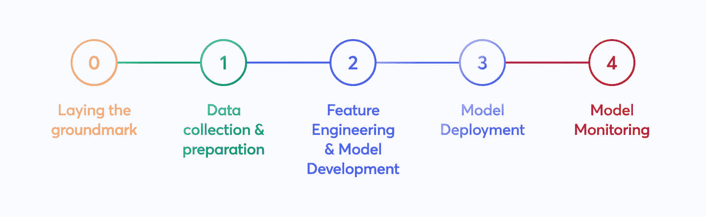
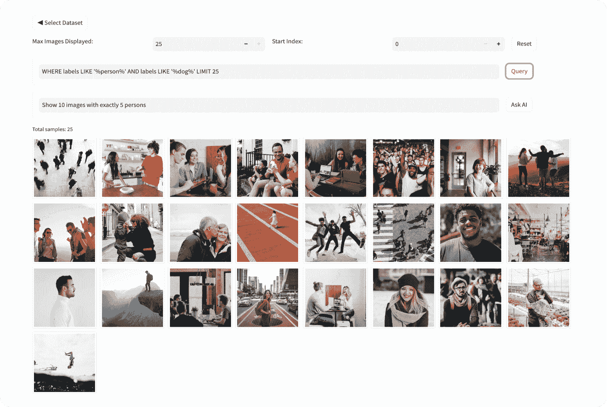

# 理解计算机视觉项目中的关键步骤

> 原文：[docs.ultralytics.com/guides/steps-of-a-cv-project/](https://docs.ultralytics.com/guides/steps-of-a-cv-project/)

## 介绍

计算机视觉是人工智能（AI）的一个子领域，帮助计算机像人类一样看见和理解世界。它处理和分析图像或视频，以提取信息、识别模式，并基于这些数据做出决策。

[www.youtube.com/embed/CfbHwPG01cE](https://www.youtube.com/embed/CfbHwPG01cE)

**观看：** 如何进行计算机视觉项目 | 一步一步的指南

计算机视觉技术，如目标检测、图像分类和实例分割，可以应用于各个行业，从[自动驾驶](https://www.ultralytics.com/solutions/ai-in-self-driving)到[医学成像](https://www.ultralytics.com/solutions/ai-in-healthcare)，以获得有价值的见解。

在自己的计算机视觉项目上工作是理解和学习计算机视觉的好方法。然而，一个计算机视觉项目可能包含许多步骤，起初可能会让人感到困惑。在本指南结束时，你将熟悉计算机视觉项目中涉及的步骤。我们将从项目的开始到结束逐步讲解，解释每个部分的重要性。让我们开始吧，让你的计算机视觉项目取得成功！

## 计算机视觉项目概述

在讨论计算机视觉项目中每个步骤的细节之前，让我们看看整体过程。如果你今天开始一个计算机视觉项目，你将采取以下步骤：

+   你的首要任务是理解项目的要求。

+   然后，你会收集并准确标记将帮助训练模型的图像。

+   接下来，你会清理数据并应用增强技术，以准备模型训练。

+   在模型训练后，你会彻底测试和评估模型，以确保它在不同条件下表现一致。

+   最后，你会将模型部署到现实世界中，并根据新的见解和反馈进行更新。

现在我们知道了预期的内容，让我们直接进入步骤，推动你的项目向前发展。

## 第一步：定义项目目标

任何计算机视觉项目的第一步是清晰地定义你要解决的问题。了解最终目标有助于你开始构建解决方案。尤其在计算机视觉领域，这一点尤为重要，因为项目的目标将直接影响你需要关注的计算机视觉任务。

这里有一些项目目标的示例以及可以用来实现这些目标的计算机视觉任务：

+   **目标：** 开发一个系统，可以监控和管理高速公路上不同车辆类型的流动，以改善交通管理和安全性。

    +   **计算机视觉任务：** 对象检测非常适合交通监控，因为它能够有效地定位和识别多个车辆。相比于图像分割，它的计算需求更低，为实时分析提供了更快的速度，而后者则提供了此任务不需要的过多细节。

+   **目标：** 开发一个工具，通过提供精确的像素级肿瘤轮廓，来辅助放射科医生在医学影像扫描中。

    +   **计算机视觉任务：** 图像分割适用于医学影像，因为它提供了关键的肿瘤准确和详细的边界，这对评估大小、形状和治疗计划至关重要。

+   **目标：** 创建一个数字系统，分类各种文档（如发票、收据、法律文件），以提高组织效率和文档检索。

    +   **计算机视觉任务：** 在这里，图像分类非常理想，因为它一次处理一个文档，无需考虑文档在图像中的位置。这种方法简化并加速了排序过程。

### 步骤 1.5：选择合适的模型和训练方法

在理解项目目标和合适的计算机视觉任务之后，定义项目目标的重要部分是选择合适的模型和训练方法。

根据目标的不同，您可以选择先选择模型，还是在第 2 步收集数据后再选择模型。例如，如果您的项目高度依赖于特定类型数据的可用性，那么先收集和分析数据可能更实际。另一方面，如果您清楚模型要求，可以先选择模型，然后收集符合这些规格的数据。

在选择从零开始训练还是使用迁移学习时，会影响您如何准备数据。从零开始训练需要一个多样化的数据集，从头开始建立模型的理解。另一方面，迁移学习允许您使用预训练模型，并用较小、更具体的数据集进行调整。此外，选择特定的训练模型还将决定您如何准备数据，例如根据模型的特定要求调整图像大小或添加注释。

注意：在选择模型时，考虑其部署以确保兼容性和性能。例如，轻量级模型非常适合边缘计算，因为它们在资源受限设备上效率高。要了解更多关于定义项目目标和选择合适模型的关键点，请阅读我们的指南。

在进行计算机视觉项目的实际操作之前，了解这些细节非常重要。在进入第二步之前，请确保您已考虑以下内容：

+   清晰定义您试图解决的问题。

+   确定项目的最终目标。

+   确定所需的具体计算机视觉任务（例如目标检测、图像分类、图像分割）。

+   决定是从头开始训练模型还是使用迁移学习。

+   选择适合您任务和部署需求的合适模型。

## 第二步：数据收集和数据标注

您的计算机视觉模型的质量取决于数据集的质量。您可以从互联网上收集图像、拍摄自己的照片，或使用预先存在的数据集。以下是一些下载高质量数据集的好资源：[Google 数据集搜索引擎](https://datasetsearch.research.google.com/)，[UC Irvine 机器学习库](https://archive.ics.uci.edu/)，以及[Kaggle 数据集](https://www.kaggle.com/datasets)。

一些库，如 Ultralytics，提供对各种数据集的内置支持，使您能够更轻松地开始使用高质量数据。这些库通常包括使用流行数据集的实用程序，可以在项目的初始阶段节省大量时间和精力。

但是，如果您选择收集图像或拍摄自己的照片，您将需要对数据进行标注。数据标注是将标签分配给数据以向模型传授知识的过程。您将处理的数据标注类型取决于您的具体计算机视觉技术。以下是一些示例：

+   **图像分类：** 您将整个图像标记为一个单一类别。

+   **目标检测：** 您将在图像中的每个对象周围绘制边界框并标记每个框。

+   **图像分割：** 您将根据其所属对象标记图像中的每个像素，创建详细的对象边界。

数据收集和标注可能是一项耗时的手动工作。标注工具可以帮助简化这一过程。以下是一些有用的开源标注工具：[LabeI Studio](https://github.com/HumanSignal/label-studio)，[CVAT](https://github.com/cvat-ai/cvat)，以及[Labelme](https://github.com/labelmeai/labelme)。

## 第三步：数据增强和数据集分割

在收集和标注图像数据之后，在执行数据增强之前，将数据集分割为训练、验证和测试集是非常重要的。在增强数据之前对数据集进行分割对于在原始、未改变的数据上测试和验证您的模型非常关键。这有助于准确评估模型在新的、未见过的数据上的泛化能力。

这是如何拆分您的数据：

+   **训练集：** 它是您数据的最大部分，通常占总量的 70-80%，用于训练您的模型。

+   **验证集：** 通常约占您数据的 10-15%；此集用于在训练过程中调整超参数和验证模型，有助于防止过拟合。

+   **测试集：** 剩余的 10-15% 数据作为测试集保留。在训练完成后，它用于评估模型在未见数据上的表现。

在分割数据后，您可以通过应用旋转、缩放和翻转图像等转换来进行数据增强，从而人为地增加数据集的大小。数据增强使您的模型对变化更为鲁棒，并提高其在未见图像上的性能。

类似 OpenCV、Albumentations 和 TensorFlow 提供灵活的增强功能。此外，一些库如 Ultralytics 在其模型训练功能中直接内置了增强设置，简化了该过程。

要更好地理解数据，您可以使用诸如 [Matplotlib](https://matplotlib.org/) 或 [Seaborn](https://seaborn.pydata.org/) 的工具可视化图像并分析其分布和特征。可视化数据有助于识别模式、异常情况以及增强技术的有效性。您还可以使用 Ultralytics Explorer，这是一个探索计算机视觉数据集的工具，支持语义搜索、SQL 查询和向量相似性搜索。

通过正确理解、分割和增强数据，您可以开发出在实际应用中表现良好的经过良好训练、验证和测试的模型。

## 第四步：模型训练

一旦您的数据集准备好进行训练，您可以专注于设置必要的环境、管理数据集和训练模型。

首先，您需要确保环境配置正确。通常包括以下内容：

+   安装 TensorFlow、PyTorch 或 Ultralytics 等必要的库和框架。

+   如果您使用 GPU，安装 CUDA 和 cuDNN 等库将有助于启用 GPU 加速并加快训练过程。

然后，您可以将训练和验证数据集加载到您的环境中。通过调整大小、格式转换或增强，对数据进行归一化和预处理。选择您的模型后，配置层并指定超参数。通过设置损失函数、优化器和性能指标来编译模型。

类似 Ultralytics 这样的库简化了训练过程。您可以通过少量代码将数据馈送到模型中开始训练。这些库自动处理权重调整、反向传播和验证。它们还提供工具来轻松监控进展并调整超参数。训练完成后，只需几个命令即可保存模型及其权重。

需要牢记的是，高效的训练需要良好的数据集管理。使用数据集的版本控制来跟踪更改并确保可重现性。像 DVC（数据版本控制）这样的工具可以帮助管理大型数据集。

## 第 5 步：模型评估和模型微调

评估您的模型性能使用各种指标非常重要，并对其进行改进以提高准确性。评估有助于识别模型表现优异和需要改进的领域。微调确保模型优化以获得最佳性能。

+   **性能指标：** 使用准确率、精确率、召回率和 F1 分数等指标评估您的模型性能。这些指标提供了关于您的模型做出预测效果的见解。

+   **超参数调整：** 调整超参数以优化模型性能。像网格搜索或随机搜索这样的技术可以帮助找到最佳的超参数值。

+   微调：对模型架构或训练过程进行小幅调整以增强性能。这可能涉及调整学习率、批次大小或其他模型参数。

## 第 6 步：模型测试

在此步骤中，您可以确保您的模型在完全未见数据上表现良好，确认其准备部署。模型测试和模型评估的不同之处在于它侧重于验证最终模型的性能，而不是迭代地改进它。

彻底测试和调试可能出现的任何常见问题是非常重要的。在未用于训练或验证的独立测试数据集上测试您的模型。该数据集应该代表真实场景，以确保模型的性能一致和可靠。

同时，解决常见问题，如过拟合、欠拟合和数据泄漏。使用交叉验证和异常检测等技术来识别和修复这些问题。

## 第 7 步：模型部署

一旦您的模型经过彻底测试，就该是部署它的时候了。部署涉及使您的模型在生产环境中可用。以下是部署计算机视觉模型的步骤：

+   设置环境：为您选择的部署选项配置必要的基础设施，无论是基于云的（AWS、Google Cloud、Azure）还是基于边缘的（本地设备、物联网）。

+   **导出模型：** 将您的模型导出为适当的格式（例如 ONNX、TensorRT、YOLOv8 的 CoreML），以确保与您的部署平台兼容。

+   **模型部署：** 通过设置 API 或端点部署模型，并将其与您的应用程序集成。

+   **确保可伸缩性：** 实施负载均衡器、自动扩展组和监控工具，以管理资源并处理不断增加的数据和用户请求。

## 第 8 步：监控、维护和文档化

一旦您的模型部署完毕，持续监控其性能、进行维护以处理任何问题，并对整个过程进行文档化，以便将来参考和改进。

监控工具可以帮助您跟踪关键性能指标（KPI）并检测精度的异常或下降。通过监控模型，您可以了解模型漂移，即由于输入数据变化导致模型性能随时间下降的情况。定期使用更新的数据对模型进行重新训练，以保持精度和相关性。

除了监控和维护外，文档也是关键。彻底记录整个过程，包括模型架构、训练流程、超参数、数据预处理步骤以及部署和维护过程中的任何更改。良好的文档确保可复制性，并使将来的更新或故障排除更加容易。通过有效地监控、维护和记录您的模型，可以确保其在整个生命周期内保持准确、可靠且易于管理。

## 与社区互动

与计算机视觉爱好者社区互动可以帮助您在自信地处理计算机视觉项目时解决任何问题。以下是学习、故障排除和有效建立网络的一些方法。

### 社区资源

+   **GitHub Issues：** 查看[YOLOv8 GitHub 代码库](https://github.com/ultralytics/ultralytics/issues)，使用 Issues 标签提出问题、报告错误和建议新功能。活跃的社区和维护者将帮助解决具体问题。

+   **Ultralytics Discord 服务器：** 加入[Ultralytics Discord 服务器](https://ultralytics.com/discord/)，与其他用户和开发者互动，获取支持并分享见解。

### 官方文档

+   **Ultralytics YOLOv8 文档：** 探索官方 YOLOv8 文档，详细指南提供了有关不同计算机视觉任务和项目的实用技巧。

使用这些资源将帮助您克服挑战，并跟上计算机视觉社区的最新趋势和最佳实践。

## 今天开始您的计算机视觉项目！

承担计算机视觉项目可能会令人兴奋且收获满满。通过遵循本指南中的步骤，您可以为成功建立坚实的基础。每个步骤对于开发符合您目标并在实际场景中表现良好的解决方案至关重要。随着经验的增长，您将发现改进项目的高级技术和工具。保持好奇心，继续学习，并探索新的方法和创新！

## 常见问题

### 如何为我的项目选择适合的计算机视觉任务？

选择正确的计算机视觉任务取决于项目的最终目标。例如，如果您想监控交通情况，**目标检测**是合适的，因为它可以实时定位和识别多种车辆类型。对于医学图像，**图像分割**非常适合提供肿瘤详细边界，有助于诊断和治疗规划。了解更多关于目标检测、图像分类和实例分割等具体任务的信息。

### 为什么在计算机视觉项目中数据标注至关重要？

数据标注对于教会模型识别模式至关重要。标注的类型随任务而异：

+   **图像分类**：整个图像标记为单个类别。

+   **目标检测**：在对象周围绘制边界框。

+   **图像分割**：根据所属对象将每个像素标记。

工具如 [Label Studio](https://github.com/HumanSignal/label-studio)、[CVAT](https://github.com/cvat-ai/cvat) 和 [Labelme](https://github.com/labelmeai/labelme) 可以辅助此过程。更多详情，请参阅我们的数据收集和标注指南。

### 如何有效地增强和分割我的数据集？

在增强之前分割数据集有助于验证模型在原始、未改变的数据上的性能。请遵循以下步骤：

+   **训练集**：您数据的 70-80%。

+   **验证集**：用于超参数调整的 10-15%。

+   **测试集**：剩余的 10-15% 用于最终评估。

在分割后，应用旋转、缩放和翻转等数据增强技术，以增加数据集的多样性。诸如 Albumentations 和 OpenCV 的库可以提供帮助。Ultralytics 还提供了内置的增强设置以便使用。

### 如何导出我训练好的计算机视觉模型以进行部署？

导出您的模型可以确保与不同的部署平台兼容。Ultralytics 提供多种格式，包括 ONNX、TensorRT 和 CoreML。要导出您的 YOLOv8 模型，请按照本指南操作：

+   使用 `export` 函数并带上所需的格式参数。

+   确保导出的模型符合部署环境的规格（例如边缘设备、云）。

欲了解更多信息，请查阅模型导出指南。

### 监控和维护部署的计算机视觉模型的最佳实践是什么？

持续监控和维护对于模型的长期成功至关重要。实施跟踪关键绩效指标（KPIs）和检测异常的工具。定期使用更新的数据重新训练模型以抵消模型漂移。记录整个过程，包括模型架构、超参数和变更，以确保可重现性和未来更新的便利性。详见我们的监控和维护指南。
