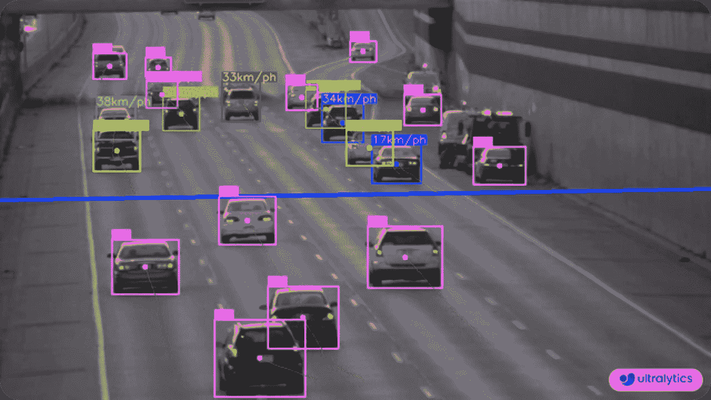
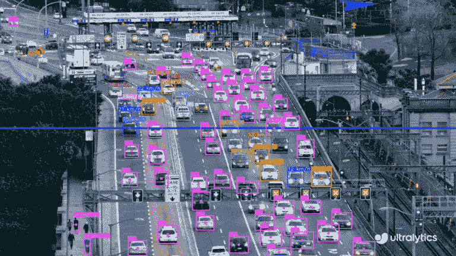
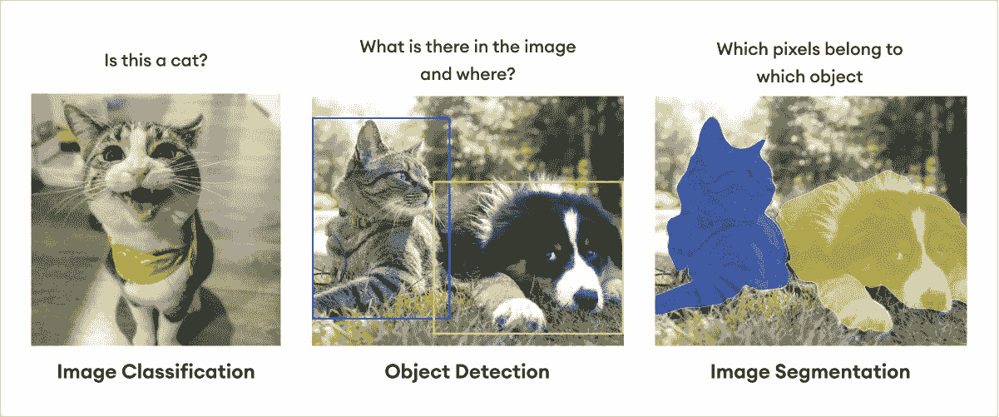
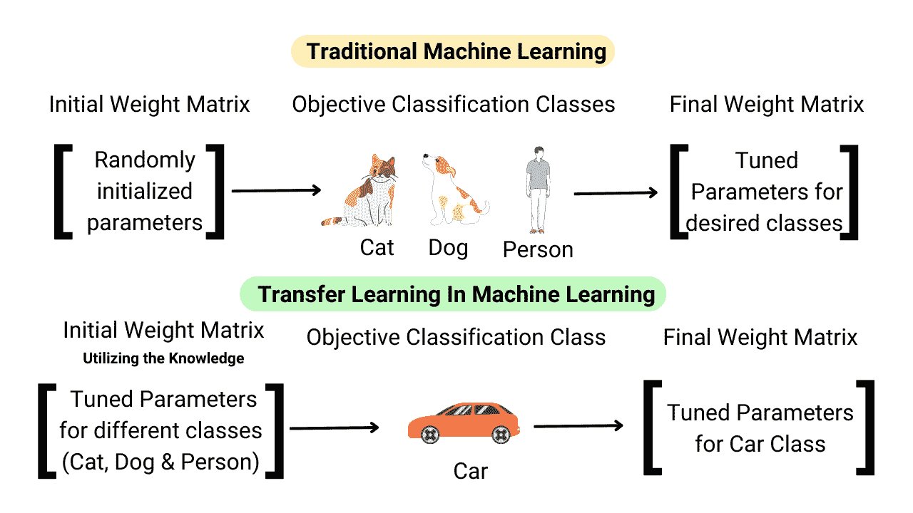

# 定义您的计算机视觉项目的实用指南

> 原文：[`docs.ultralytics.com/guides/defining-project-goals/`](https://docs.ultralytics.com/guides/defining-project-goals/)

## 简介

任何计算机视觉项目的第一步都是定义您希望实现的目标。从数据收集到模型部署，从一开始就有清晰的路线图是至关重要的。

如果您需要快速回顾计算机视觉项目基础知识，请花点时间阅读我们关于计算机视觉项目关键步骤的指南。它将为您提供整个过程的扎实概述。一旦您了解完毕，请回到这里深入探讨如何确切地定义和优化您项目的目标。

现在，让我们深入探讨为您的项目定义清晰问题陈述的核心，并探索您沿途需要做出的关键决策。

## 定义一个清晰的问题陈述

为您的项目设定明确的目标和目的是朝着找到最有效的解决方案迈出的第一大步。让我们了解如何清晰定义您项目的问题陈述：

+   **确定核心问题：** 确定您的计算机视觉项目旨在解决的具体挑战。

+   **确定范围：** 确定问题的边界。

+   **考虑最终用户和利益相关者：** 确定谁将受到解决方案影响。

+   **分析项目需求和约束条件：** 评估可用资源（时间、预算、人员）并识别任何技术或法规约束。

### 企业问题陈述的示例

让我们通过一个示例来详细介绍。

考虑一个计算机视觉项目，您希望估算高速公路上车辆的速度。核心问题在于当前的速度监测方法由于过时的雷达系统和手动处理而效率低下且容易出错。该项目旨在开发一个实时计算机视觉系统，可以替代传统的[速度估算](https://www.ultralytics.com/blog/ultralytics-yolov8-for-speed-estimation-in-computer-vision-projects)系统。

主要用户包括交通管理部门和执法机构，次要利益相关者是高速公路规划者和希望获得更安全道路的公众。关键要求包括评估预算、时间和人员，并解决高分辨率摄像头和实时数据处理等技术需求。此外，还必须考虑隐私和数据安全的法规限制。

### 设定可衡量的目标

设定可衡量的目标是计算机视觉项目成功的关键。这些目标应该清晰、可实现并具有时间限制。

例如，如果您正在开发一个系统来估算高速公路上的车辆速度。您可以考虑以下可衡量的目标：

+   在六个月内实现至少 95%的速度检测准确率，使用包含 1 万辆车辆图像的数据集。

+   系统应能以每秒 30 帧的速度处理实时视频流，并且延迟最小化。

通过设定具体和可量化的目标，您可以有效地跟踪进展，识别改进的领域，并确保项目按计划进行。

## 问题陈述与计算机视觉任务之间的连接

您的问题陈述帮助您理解哪种计算机视觉任务可以解决您的问题。

例如，如果您的问题是监测高速公路上的车辆速度，相关的计算机视觉任务是对象追踪。对象追踪是合适的，因为它允许系统在视频流中持续跟踪每辆车，这对准确计算它们的速度至关重要。

其他任务，如对象检测，不适合，因为它们不提供连续的位置或运动信息。一旦确定了合适的计算机视觉任务，它将指导项目中的几个关键方面，如模型选择、数据集准备和模型训练方法。

## 模型选择、数据集准备或模型训练方法，哪个先来？

模型选择、数据集准备和训练方法的顺序取决于您项目的具体情况。以下是一些帮助您决定的小贴士：

+   **清晰的问题理解**：如果您的问题和目标已经明确定义，请从模型选择开始。然后，根据模型的要求准备数据集，并选择适当的训练方法。

    +   **示例**：首先选择一个用于估算车辆速度的交通监控系统模型。选择一个对象追踪模型，收集和标注高速公路视频，然后使用实时视频处理技术训练模型。

+   **唯一或有限的数据**：如果您的项目受唯一或有限数据的限制，请从数据集准备开始。例如，如果您拥有稀有的医学图像数据集，请首先进行标注和数据准备。然后，选择一个在这类数据上表现良好的模型，然后选择适合的训练方法。

    +   **示例**：首先为一个小数据集的人脸识别系统准备数据。进行标注，然后选择适合有限数据的模型，例如用于迁移学习的预训练模型。最后，根据需要进行数据增强，选择一个训练方法来扩展数据集。

+   **需要实验**：在实验至关重要的项目中，从训练方法开始。这在研究项目中很常见，您可能会最初测试不同的训练技术。在找到有希望的方法后，调整您的模型选择，并根据您的发现准备数据集。

    +   **示例**：在探索新方法检测制造缺陷的项目中，先从小数据子集进行实验。一旦找到有希望的技术，选择一个适合这些发现的模型，并准备一个全面的数据集。

## 社区中的常见讨论点

接下来，让我们来看看关于计算机视觉任务和项目规划的一些常见讨论点。

### 不同的计算机视觉任务是什么？

最受欢迎的计算机视觉任务包括图像分类、物体检测和图像分割。

关于各种任务的详细解释，请参阅 YOLOv8 任务的 Ultralytics 文档页面。

### 预训练模型能记住自定义训练前已知的类别吗？

不，预训练模型不会像传统意义上的“记住”类别。它们从大规模数据集中学习模式，并在自定义训练（微调）期间调整这些模式以适应你的特定任务。模型的容量是有限的，专注于新信息可能会覆盖一些先前的学习。

如果你想使用模型在预训练时已经了解的类别，一个实际的方法是使用两个模型：一个保留原始性能，另一个为你的特定任务进行微调。这样，你可以结合两个模型的输出。还有其他选择，如冻结层、将预训练模型用作特征提取器和任务特定的分支，但这些是更复杂的解决方案，需要更多的专业知识。

### 部署选项如何影响我的计算机视觉项目？

模型部署选项对你的计算机视觉项目的性能有重大影响。例如，部署环境必须处理模型的计算负载。以下是一些实际示例：

+   **边缘设备**：在智能手机或物联网设备等边缘设备上部署需要轻量级模型，因为它们的计算资源有限。例如，优化了这些环境的 TensorFlow Lite 和 ONNX Runtime 技术。

+   **云服务器**：云部署可以处理更复杂的具有较大计算需求的模型。AWS、Google Cloud 和 Azure 等云平台提供了根据项目需求扩展的强大硬件选项。

+   **本地服务器**：对于需要高数据隐私和安全性的场景，可能需要在本地部署。这需要进行显著的硬件投资，但可以完全控制数据和基础设施。

+   **混合解决方案**：某些项目可能会从混合方法中受益，其中一些处理在边缘进行，而更复杂的分析则由云端处理。这可以平衡性能需求与成本和延迟考虑。

每种部署选项都提供不同的优势和挑战，选择取决于特定的项目需求，如性能、成本和安全性。

## 与社区联系

通过与其他计算机视觉爱好者建立联系，可以为您的项目提供支持、解决方案和新想法非常有帮助。以下是一些学习、解决问题和建立网络的好方法：

### 社区支持渠道

+   **GitHub 问题：** 前往 YOLOv8 GitHub 仓库。您可以使用[Issues 选项卡](https://github.com/ultralytics/ultralytics/issues)提出问题、报告错误和建议功能。社区和维护者可以帮助您解决遇到的具体问题。

+   **Ultralytics Discord 服务器：** 加入[Ultralytics Discord 服务器](https://ultralytics.com/discord/)，与其他用户和开发者建立联系，寻求支持，交流知识，讨论想法。

### 全面的指南和文档

+   **Ultralytics YOLOv8 文档：** 探索官方 YOLOv8 文档，了解深入的指南和有价值的各种计算机视觉任务和项目的技巧。

## 结论

定义明确的问题和设定可衡量的目标是成功的计算机视觉项目的关键。我们强调从一开始就保持清晰和专注的重要性。设定具体的目标有助于避免疏忽。此外，通过 GitHub 或 Discord 等社区平台与他人保持联系对于学习和保持最新信息至关重要。简言之，良好的规划和参与社区对于成功的计算机视觉项目至关重要。

## 常见问题解答

### 如何为我的 Ultralytics 计算机视觉项目定义清晰的问题陈述？

要为您的 Ultralytics 计算机视觉项目定义明确的问题陈述，请按照以下步骤操作：

1.  **确定核心问题：** 确定您的项目旨在解决的具体挑战。

1.  **确定范围：** 清楚地勾画出您问题的边界。

1.  **考虑最终用户和利益相关者：** 确定谁会受到您解决方案的影响。

1.  **分析项目需求和约束条件：** 评估可用资源以及任何技术或法规限制。

提供明确的问题陈述确保项目保持专注并与您的目标保持一致。有关详细指南，请参考我们的实用指南。

### 为什么我应该在我的计算机视觉项目中使用 Ultralytics YOLOv8 进行速度估计？

Ultralytics YOLOv8 由于其实时物体追踪能力、高准确性以及在检测和监控车辆速度方面的强大性能，非常适合速度估计。通过利用前沿的计算机视觉技术，它克服了传统雷达系统的低效率和不准确性。查看我们关于使用 YOLOv8 进行速度估计的[博客](https://www.ultralytics.com/blog/ultralytics-yolov8-for-speed-estimation-in-computer-vision-projects)以获取更多见解和实际示例。

### 如何为我的计算机视觉项目使用 Ultralytics YOLOv8 设定有效的可衡量目标？

使用 SMART 标准设定有效且可衡量的目标：

+   **具体：** 定义清晰和详细的目标。

+   **可衡量性：** 确保目标是可量化的。

+   **可实现性：** 在你的能力范围内设定实际可达的目标。

+   **相关性：** 将目标与你的整体项目目标对齐。

+   **有时间限制：** 为每个目标设定截止日期。

例如，“使用一万辆车辆图像数据集在六个月内实现 95%的速度检测准确率。”这种方法有助于跟踪进展并识别改进的领域。阅读更多关于设定可衡量目标的内容。

### 部署选项如何影响我的 Ultralytics YOLO 模型的性能？

部署选项对你的 Ultralytics YOLO 模型的性能产生重要影响。以下是关键选项：

+   **边缘设备：** 使用像 TensorFlow Lite 或 ONNX Runtime 这样的轻量级模型，在资源有限的设备上部署。

+   **云服务器：** 利用强大的云平台，如 AWS、Google Cloud 或 Azure 来处理复杂的模型。

+   **本地服务器：** 高数据隐私和安全需求可能需要本地部署。

+   **混合解决方案：** 结合边缘和云计算方法，以实现平衡的性能和成本效益。

欲了解更多信息，请参考我们关于模型部署选项的详细指南。

### 计算机视觉项目中定义问题的最常见挑战是什么？

常见挑战包括：

+   问题陈述模糊或过于广泛。

+   不切实际的目标。

+   缺乏利益相关者的一致性。

+   技术约束的理解不足。

+   低估数据需求。

通过深入的初步研究、与利益相关者的清晰沟通以及问题陈述和目标的迭代精化来应对这些挑战。在我们的计算机视觉项目指南中了解更多有关这些挑战的信息。
