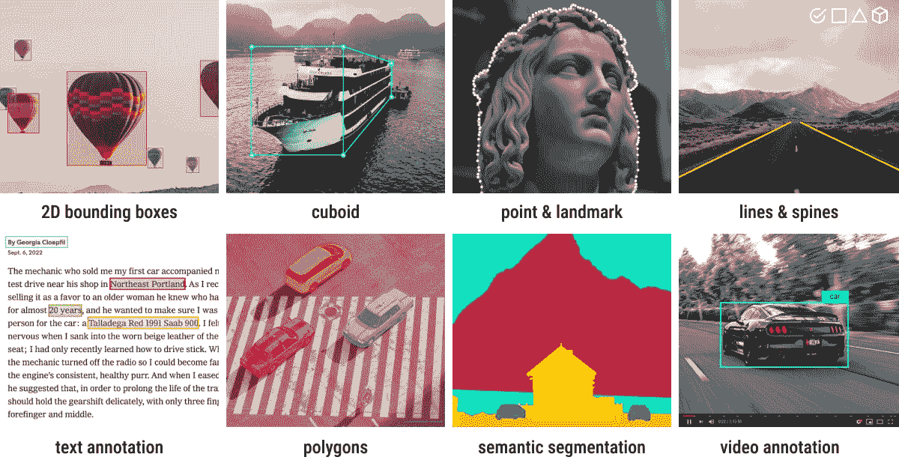
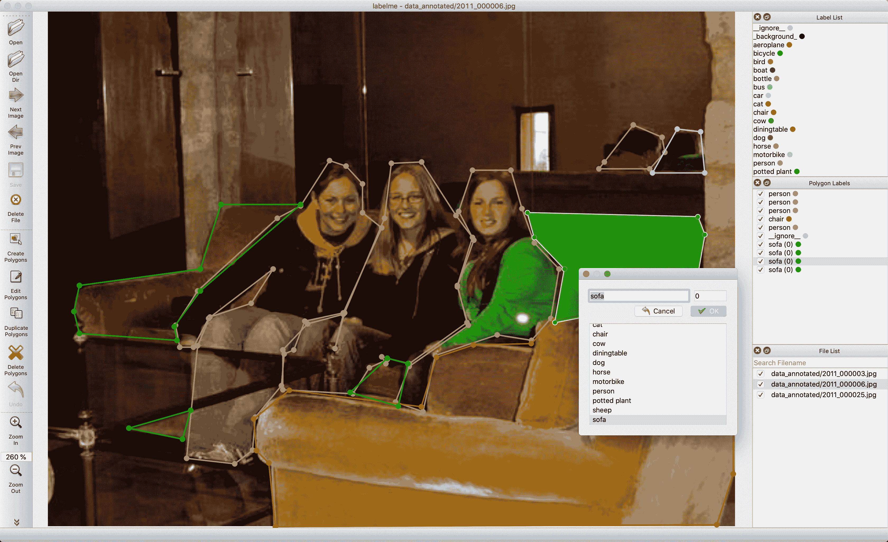
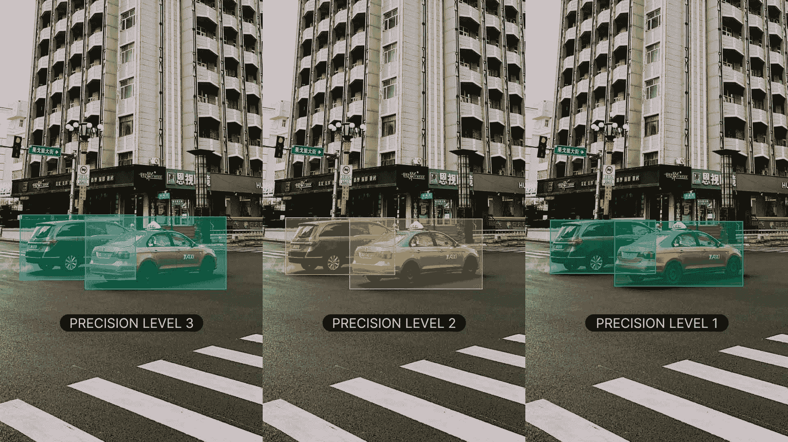

# 计算机视觉的数据收集和注释策略

> 原文：[`docs.ultralytics.com/guides/data-collection-and-annotation/`](https://docs.ultralytics.com/guides/data-collection-and-annotation/)

## 引言

在任何计算机视觉项目中取得成功的关键在于有效的数据收集和注释策略。数据的质量直接影响模型的性能，因此理解与数据收集和数据注释相关的最佳实践非常重要。

所有关于数据的考虑都应与项目的目标紧密对齐。您的注释策略的变化可能会改变项目的重点或有效性，反之亦然。在此基础上，让我们更详细地探讨数据收集和注释的最佳方法。

## 设置类别和数据收集

为计算机视觉项目收集图像和视频涉及定义类别数量、收集数据以及考虑道德问题。在开始收集数据之前，您需要明确以下内容：

### 为您的项目选择正确的类别

在开始计算机视觉项目时的第一个问题之一是包括多少类别。您需要确定类别成员资格，这涉及您希望模型识别和区分的不同类别或标签。类别的数量应由项目的具体目标决定。

例如，如果您想监控交通情况，您的类别可能包括“汽车”、“卡车”、“公共汽车”、“摩托车”和“自行车”。另一方面，如果要跟踪商店中的物品，则您的类别可以是“水果”、“蔬菜”、“饮料”和“零食”。根据项目目标定义类别有助于保持数据集的相关性和专注。

在定义类别时，另一个重要的区分是选择粗略或精细的分类计数。'计数'指的是您感兴趣的不同类别的数量。此决定影响您数据的粒度和模型的复杂性。以下是每种方法的考虑因素：

+   **粗略分类计数**：这些是更广泛、更包容的类别，如“车辆”和“非车辆”。它们简化了注释过程，需要较少的计算资源，但提供的信息较少，可能会限制模型在复杂场景中的有效性。

+   **精细分类计数**：包含更多精细区分的类别，如“轿车”、“SUV”、“皮卡车”和“摩托车”。它们捕捉了更详细的信息，提高了模型的准确性和性能。然而，它们需要更多的时间和人力来进行注释，并且需要更多的计算资源。

需要注意的是，在复杂项目中，从更具体的类别开始可能非常有帮助。更具体的类别让您能收集到更详细的数据，并获得更深入的见解和更清晰的分类。这不仅可以提高模型的准确性，还可以在需要时更容易调整模型，节省时间和资源。

### 数据来源

您可以使用公共数据集或收集自己的定制数据。像[Kaggle](https://www.kaggle.com/datasets)和[Google Dataset Search Engine](https://datasetsearch.research.google.com/)上的公共数据集提供了经过良好标注和标准化的数据，这使它们成为训练和验证模型的良好起点。

另一方面，定制数据收集使您能够根据特定需求定制数据集。您可以使用摄像机或无人机捕获图像和视频，从网上抓取图像，或使用组织内现有的内部数据。定制数据使您能更好地控制其质量和相关性。结合公共和定制数据源有助于创建多样化和全面的数据集。

### 在数据收集中避免偏见

当您的数据集中某些群体或情景被低估或高估时，就会出现偏见。这会导致模型在某些数据上表现良好，而在其他数据上表现不佳。避免偏见至关重要，以确保您的计算机视觉模型在各种场景中都能表现良好。

下面是在收集数据时如何避免偏见的方法：

+   **多样化来源**：从多个来源收集数据，以捕捉不同的视角和场景。

+   **平衡的代表性**：包括来自所有相关群体的平衡代表性。例如，考虑不同的年龄、性别和种族。

+   **持续监控**：定期审查和更新您的数据集，以识别和解决任何新出现的偏见。

+   **偏见缓解技术**：使用过采样少数类别、数据增强和关注公平性的算法等方法。

遵循这些实践有助于创建更健壮和公平的模型，可以在真实世界的应用中进行良好的泛化。

## 什么是数据标注？

数据标注是将数据进行标记以使其可用于训练机器学习模型的过程。在计算机视觉中，这意味着为图像或视频打上模型需要学习的信息标签。没有正确标注的数据，模型就无法准确地学习输入与输出之间的关系。

### 数据标注类型

根据计算机视觉任务的具体要求，有不同类型的数据标注。以下是一些例子：

+   **边界框**：绘制在图像中物体周围的矩形框，主要用于目标检测任务。这些框由它们的左上角和右下角坐标定义。

+   **多边形**：对象的详细轮廓，比边界框标注更精确。多边形在实例分割等任务中使用，对象的形状非常重要。

+   **掩模**：二进制掩模，每个像素要么是对象的一部分，要么是背景。掩模在语义分割任务中使用，提供像素级的细节。

+   **关键点**：图像内标记的特定点，用于识别感兴趣的位置。关键点在姿势估计和面部标记检测等任务中使用。

### 常见标注格式

在选择标注类型后，选择适当的格式来存储和共享标注是非常重要的。

常用的格式包括 COCO，支持对象检测、关键点检测、材质分割、全景分割和图像字幕等各种标注类型，存储在 JSON 中。Pascal VOC 使用 XML 文件，主要用于对象检测任务。另一方面，YOLO 每张图像创建一个 .txt 文件，包含对象类别、坐标、高度和宽度的标注，非常适合对象检测任务。

### 标注技术

现在，假设您已选择了标注类型和格式，现在是时候建立清晰和客观的标签规则了。这些规则就像一张标注过程中的一致性和准确性的路线图。这些规则的关键方面包括：

+   **清晰和细节**：确保您的说明清晰明了。使用示例和插图来理解预期的标注内容。

+   **一致性**：保持标注的一致性。设定不同数据类型的标注标准，确保所有标注都遵循相同的规则。

+   **减少偏见**：保持中立。训练自己客观，尽量减少个人偏见，确保公平的标注。

+   **效率**：工作更智能，而不是更辛苦。使用能够自动化重复任务的工具和工作流程，使标注过程更快速、更高效。

定期审查和更新您的标签规则将有助于保持标注的准确性、一致性，并与项目目标保持一致。

### 热门标注工具

现在假设您已准备好进行标注。有几种开源工具可帮助简化数据标注过程。以下是一些有用的开放式标注工具：

+   **[Label Studio](https://github.com/HumanSignal/label-studio)**：一个灵活的工具，支持各种标注任务，并包括项目管理和质量控制功能。

+   **[CVAT](https://github.com/cvat-ai/cvat)**：一个强大的工具，支持各种标注格式和可定制的工作流程，非常适合复杂项目。

+   **[Labelme](https://github.com/labelmeai/labelme)**：一个简单易用的工具，可以快速用多边形对图像进行标注，非常适合简单的任务。

这些开源工具价格友好，并提供各种功能，以满足不同的标注需求。

### 在标注数据之前需要考虑的更多事项

在开始标注数据之前，还有一些事项需要牢记。您应了解准确性、精确度、离群值和质量控制，以避免以逆向方式标记数据。

#### 理解准确性和精确度

了解准确性和精确度之间的差异及其与标注的关系非常重要。准确性指标度量标注数据与真实值之间的接近程度。它帮助我们衡量标签如何反映现实场景。精确度指标评估标注的一致性。它检查您是否在整个数据集中给同一对象或特征分配相同的标签。高准确性和精确度通过减少噪音和改善模型从训练数据中泛化的能力，从而带来更好的训练模型。

#### 识别离群值

离群值是与数据集中其他观察结果相差较大的数据点。在标注方面，离群值可能是错误标记的图像或与数据集其余部分不匹配的标注。离群值令人关注，因为它们可能扭曲模型的学习过程，导致预测不准确和泛化能力差。

可以使用各种方法检测和纠正离群值：

+   **统计技术**：用于检测数值特征如像素值、边界框坐标或物体尺寸中的离群值，可以使用诸如箱线图、直方图或 z 分数等方法。

+   **视觉技术**：用于发现类别特征如物体类别、颜色或形状中的异常值，使用绘制图像、标签或热图等视觉方法。

+   **算法方法**：使用聚类工具（例如 K 均值聚类、DBSCAN）和异常检测算法，基于数据分布模式识别离群值。

#### 标注数据的质量控制

就像其他技术项目一样，标注数据的质量控制是必不可少的。定期检查标注以确保准确性和一致性是一个好习惯。可以通过几种不同的方式来实现这一点：

+   审查标注数据样本

+   使用自动化工具检测常见错误

+   另一人检查标注是否正确

如果你与多人合作，不同标注者之间的一致性非常重要。良好的标注者间协议意味着指导方针清晰，每个人都以相同的方式遵循它们。这样可以保持所有人在同一页面上，并使标注保持一致。

在审查过程中，如果发现错误，请及时更正并更新指南，以避免未来的错误。向标注者提供反馈，并定期进行培训以帮助减少错误。建立处理错误的强大流程有助于保持数据集的准确性和可靠性。

## 与社区分享您的想法

与其他计算机视觉爱好者交流想法和疑问可以帮助加速您的项目。以下是一些学习、故障排除和建立网络的好方法：

### 如何寻求帮助和支持

+   **GitHub 问题：** 访问 YOLOv8 GitHub 仓库，使用 [Issues 选项卡](https://github.com/ultralytics/ultralytics/issues) 提出问题、报告错误和建议功能。社区和维护者将帮助您解决面临的任何问题。

+   **Ultralytics Discord 服务器：** 加入 [Ultralytics Discord 服务器](https://ultralytics.com/discord/)，与其他用户和开发者连接，获取支持，分享知识，并集思广益。

### 官方文档

+   **Ultralytics YOLOv8 文档：** 参考官方 YOLOv8 文档，获取关于多种计算机视觉任务和项目的详尽指南和宝贵见解。

## 结论

通过遵循数据收集和注释的最佳实践、避免偏见以及使用正确的工具和技术，您可以显著提升模型的性能。参与社区并利用可用资源将使您保持信息更新，并帮助您有效地解决问题。请记住，优质数据是成功项目的基础，正确的策略将帮助您构建强大和可靠的模型。

## 常见问题解答

### 如何避免计算机视觉项目中数据收集中的偏见？

避免在数据收集中存在偏见，可以确保您的计算机视觉模型在各种场景下表现良好。为了减少偏见，考虑从多样化的来源收集数据，以捕捉不同的观点和场景。确保在所有相关群体中实现平衡的代表性，例如不同年龄、性别和种族。定期审查和更新数据集，以识别和解决任何新出现的偏见。过采样少数群体、数据增强和关注公平的算法等技术也可以帮助减少偏见。通过采用这些策略，您可以维护一个强大和公平的数据集，增强模型的泛化能力。

### 如何确保数据标注的高一致性和准确性？

确保数据标注的高一致性和准确性包括建立清晰和客观的标注指南。您的说明应该详细，包括示例和插图，以澄清期望。通过设定标准的标注各种数据类型的标准化标准来实现一致性，确保所有标注都遵循相同的规则。为了减少个人偏见，训练标注者保持中立和客观。定期审查和更新标注规则有助于保持准确性和与项目目标的一致性。使用自动化工具检查一致性，并从其他标注者那里获得反馈也有助于维持高质量的标注。

### 我需要多少张图像来训练 Ultralytics YOLO 模型？

对于使用 Ultralytics YOLO 模型进行有效的迁移学习和目标检测，每个类别至少需要几百个注释对象起步。如果只训练一个类别，至少从 100 张注释图像开始，然后训练大约 100 个周期。更复杂的任务可能需要每类数千张图像以实现高可靠性和性能。质量的注释至关重要，因此确保您的数据收集和注释过程严格符合项目的具体目标。在 YOLOv8 训练指南中探索详细的训练策略。

### 哪些数据标注工具比较流行？

几个流行的开源工具可以简化数据标注过程：

+   **[Label Studio](https://github.com/HumanSignal/label-studio)**：一款灵活的工具，支持各种注释任务、项目管理和质量控制功能。

+   **[CVAT](https://www.cvat.ai/)**：提供多种注释格式和可定制的工作流程，适用于复杂项目。

+   **[Labelme](https://github.com/labelmeai/labelme)**：适合快速且简单的多边形图像注释。

这些工具可以帮助增强您的注释工作流程的效率和准确性。有关详细的功能列表和指南，请参阅我们的数据标注工具文档。

### 计算机视觉中常用的数据标注类型有哪些？

不同类型的数据标注适用于各种计算机视觉任务：

+   **边界框**：主要用于对象检测，这些是围绕图像中对象的矩形框。

+   **多边形**：提供更精确的对象轮廓，适合实例分割任务。

+   **掩模**：提供像素级的详细信息，在语义分割中用于区分对象和背景。

+   **关键点**：识别图像中特定的兴趣点，适用于姿态估计和面部特征点检测等任务。

选择合适的注释类型取决于您项目的需求。在我们的数据标注指南中了解更多如何实施这些注释及其格式。
