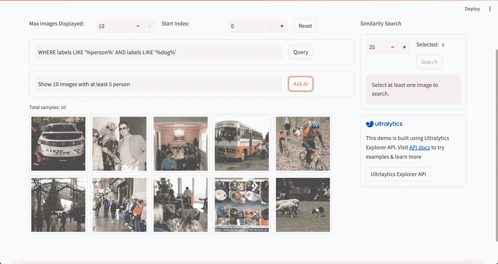

# 用于标注计算机视觉数据的数据预处理技术

> 原文：[`docs.ultralytics.com/guides/preprocessing_annotated_data/`](https://docs.ultralytics.com/guides/preprocessing_annotated_data/)

## 简介

在定义了计算机视觉项目的目标并收集和标注数据之后，下一步是预处理标注数据并为模型训练做准备。干净一致的数据对于创建性能良好的模型至关重要。

数据预处理是计算机视觉项目工作流程中的一步，包括调整图像大小、归一化像素值、增强数据集以及将数据拆分为训练、验证和测试集。让我们探索清理数据的基本技术和最佳实践！

## 数据预处理的重要性

我们已经在考虑多方面仔细收集和标注我们的数据。那么，是什么让数据预处理在计算机视觉项目中如此重要呢？数据预处理关乎将数据格式化为适合训练的格式，从而减少计算负载并提高模型性能。以下是预处理解决的一些原始数据常见问题：

+   **噪声**：数据中不相关或随机的变化。

+   **不一致性**：图像尺寸、格式和质量的变化。

+   **不平衡**：数据集中类别或类的分布不均。

## 数据预处理技术

数据预处理中的首要步骤之一是调整大小。有些模型设计用于处理可变输入大小，但许多模型要求一致的输入大小。调整图像大小使它们统一，并减少计算复杂性。

### 调整图像大小

你可以使用以下方法调整你的图片大小：

+   **双线性插值**：通过四个最近像素值的加权平均来平滑像素值。

+   **最近邻插值**：不进行平均，直接赋予最近的像素值，导致图像块状但计算速度更快。

为了简化调整大小的任务，你可以使用以下工具：

+   **OpenCV**：一个流行的计算机视觉库，具有丰富的图像处理功能。

+   **PIL（Pillow）**：用于打开、操作和保存图像文件的 Python 图像处理库。

关于 YOLOv8，在模型训练期间的 'imgsz' 参数允许灵活的输入尺寸。设置为特定尺寸（如 640），模型将调整输入图像大小，使其最大尺寸为 640 像素，同时保持原始纵横比。

通过评估模型和数据集的具体需求，可以确定调整大小是否是必要的预处理步骤，或者你的模型是否可以有效处理各种大小的图像。

### 归一化像素值

另一种预处理技术是归一化。归一化将像素值缩放到标准范围，有助于在训练过程中更快地收敛并提高模型性能。以下是一些常见的归一化技术：

+   **最小-最大缩放**：将像素值缩放到 0 到 1 的范围内。

+   **Z-Score 标准化**：根据像素值的均值和标准差进行像素值缩放。

关于 YOLOv8，归一化是在模型训练过程中作为其预处理流水线的一部分无缝处理的。YOLOv8 自动执行多个预处理步骤，包括转换为 RGB、将像素值缩放到范围[0, 1]以及使用预定义的均值和标准差进行标准化。

### 拆分数据集

清理完数据之后，您可以开始拆分数据集。将数据分为训练集、验证集和测试集是为了确保可以评估模型在未见过的数据上的泛化性能。常见的划分是 70%用于训练、20%用于验证、10%用于测试。您可以使用诸如 scikit-learn 或 TensorFlow 等工具和库来拆分数据。

在拆分数据集时请考虑以下内容：

+   **保持数据分布**：确保在训练、验证和测试集之间保持类别的数据分布。

+   **避免数据泄露**：通常，在数据集拆分后进行数据增强。数据增强和任何其他预处理应仅应用于训练集，以防止验证集或测试集的信息影响模型训练。- **平衡类别**：对于不平衡的数据集，考虑使用过抽样少数类或欠抽样多数类的技术来平衡训练集。

### 什么是数据增强？

最常讨论的数据预处理步骤之一是数据增强。数据增强通过创建图像的修改版本来人工增加数据集的大小。通过增强您的数据，您可以减少过拟合并改善模型的泛化能力。

这里还有一些数据增强的其他好处：

+   **创建更强大的数据集**：数据增强可以使模型对输入数据中的变化和扭曲更加稳健。这包括光照、方向和尺度的变化。

+   **成本效益**：数据增强是一种成本效益高的方法，可以增加训练数据的量，而无需收集和标记新数据。

+   **更好地利用数据**：通过创建新的变化，充分利用每一个可用的数据点。

#### 数据增强方法

常见的增强技术包括翻转、旋转、缩放和颜色调整。多个库如 Albumentations、Imgaug 和 TensorFlow 的 ImageDataGenerator 都可以生成这些增强。

关于 YOLOv8，您可以通过修改数据集配置文件（.yaml 文件）对自定义数据集进行增强。在这个文件中，您可以添加一个增强部分，其中包含指定如何增强数据的参数。

[Ultralytics YOLOv8 代码库](https://github.com/ultralytics/ultralytics/tree/main) 支持多种数据增强。您可以应用各种转换，例如：

+   随机裁剪

+   翻转：图像可以水平或垂直翻转。

+   旋转：图像可以按特定角度旋转。

+   扭曲

此外，您可以通过特定参数调整这些增强技术的强度，以生成更多的数据变化。

## 预处理案例研究

假设有一个项目旨在开发模型以检测和分类交通图像中不同类型的车辆，使用 YOLOv8。我们收集了交通图像并用边界框和标签进行了注释。

对于这个项目，预处理的每个步骤如下：

+   调整图像大小：由于 YOLOv8 处理灵活的输入尺寸并在训练期间自动调整图像大小，因此不需要手动调整大小。模型将根据指定的“imgsz”参数调整图像大小。

+   标准化像素值：YOLOv8 在预处理期间会自动将像素值归一化为 0 到 1 的范围，因此不需要额外处理。

+   分割数据集：使用像 scikit-learn 这样的工具将数据集分割为训练（70%）、验证（20%）和测试（10%）集。

+   数据增强：修改数据集配置文件（.yaml），包括随机裁剪、水平翻转和亮度调整等数据增强技术。

这些步骤确保数据集在没有潜在问题的情况下准备就绪，可以用于探索性数据分析（EDA）。

## 探索性数据分析技术

在预处理和增强数据集之后，下一步是通过探索性数据分析获得洞见。EDA 利用统计技术和可视化工具来理解数据的模式和分布。您可以识别类别不平衡或异常值等问题，并基于这些发现做出进一步的数据预处理或模型训练调整的决策。

### 统计 EDA 技术

统计技术通常从计算基本指标如均值、中位数、标准差和范围开始。这些指标快速概述了您的图像数据集的特性，如像素强度分布。理解这些基本统计有助于把握数据的整体质量和特征，早期发现任何异常情况。

### 视觉 EDA 技术

可视化在图像数据集的探索性数据分析（EDA）中至关重要。例如，类别不平衡分析是 EDA 的另一个关键方面。它有助于确定数据集中某些类别是否代表不足，使用条形图可视化不同图像类别或分类的分布能够快速显示任何不平衡情况。同样，使用箱线图等可视化工具可以识别异常值，突出显示像素强度或特征分布中的异常。异常值检测可防止异常数据点对结果产生偏斜影响。

常用的可视化工具包括：

+   直方图和箱线图：有助于理解像素值的分布并识别异常值。

+   散点图：有助于探索图像特征或标注之间的关系。

+   热图：用于可视化图像中像素强度的分布或标注特征的空间分布的有效工具。

### 使用 Ultralytics Explorer 进行探索性数据分析

若要进行更高级的探索性数据分析，你可以使用 Ultralytics Explorer 工具。它提供了强大的功能，用于探索计算机视觉数据集。通过支持语义搜索、SQL 查询和向量相似性搜索，该工具使得分析和理解数据变得轻而易举。使用 Ultralytics Explorer，你可以为数据集创建嵌入以查找相似图像，运行 SQL 查询以进行详细分析，并执行语义搜索，所有这些都通过用户友好的图形界面完成。

## 建立联系并连接

与其他计算机视觉爱好者讨论项目可以从不同角度获得新想法。以下是学习、解决问题和建立联系的一些好方法：

### 与社区联系的渠道

+   **GitHub 问题：** 访问 YOLOv8 GitHub 仓库并使用 [Issues 选项卡](https://github.com/ultralytics/ultralytics/issues) 提出问题、报告错误并建议功能。社区和维护者会在那里帮助解决你面临的任何问题。

+   **Ultralytics Discord 服务器：** 加入 [Ultralytics Discord 服务器](https://ultralytics.com/discord/) 与其他用户和开发者连接，获取支持，分享知识，并进行头脑风暴。

### 官方文档

+   **Ultralytics YOLOv8 文档：** 请参阅官方 YOLOv8 文档，获取关于多个计算机视觉任务和项目的详尽指南和宝贵见解。

## 你的数据集已准备就绪！

经过适当调整大小、归一化和增强的数据通过减少噪声和提升泛化能力来改善模型性能。通过遵循本指南中概述的预处理技术和最佳实践，你可以创建一个坚实的数据集。准备好预处理的数据集后，你可以自信地进入项目的下一步。

## 常见问题解答

### 数据预处理在计算机视觉项目中的重要性是什么？

数据预处理在计算机视觉项目中至关重要，因为它确保数据清洁、一致，并且以最佳格式进行模型训练。通过解决原始数据中的噪声、不一致性和不平衡等问题，预处理步骤如调整大小、归一化、增强和数据集分割有助于减少计算负荷并提高模型性能。欲了解更多详细信息，请访问计算机视觉项目的步骤。

### 我如何使用 Ultralytics YOLO 进行数据增强？

对于使用 Ultralytics YOLOv8 进行数据增强，您需要修改数据集配置文件（.yaml）。在这个文件中，您可以指定各种增强技术，如随机裁剪、水平翻转和亮度调整。这些可以通过这里解释的训练配置有效地完成。数据增强有助于创建更强大的数据集，减少过拟合，并提高模型的泛化能力。

### 计算机视觉数据的最佳数据归一化技术是什么？

归一化将像素值缩放到标准范围，以便在训练期间实现更快的收敛速度和改善的性能。常见的技术包括：

+   **最小-最大缩放**：将像素值缩放到 0 到 1 的范围内。

+   **Z-Score 标准化**：根据均值和标准差来缩放像素值。

对于 YOLOv8，归一化是自动处理的，包括转换为 RGB 并进行像素值缩放。在模型训练部分了解更多信息。

### 我应该如何将我的带注释数据集拆分用于训练？

将数据集拆分的常见做法是将其分为 70% 用于训练，20% 用于验证，以及 10% 用于测试。重要的是在这些拆分中保持类别的数据分布，并通过仅在训练集上执行增强来避免数据泄漏。使用像 scikit-learn 或 TensorFlow 这样的工具可以高效地拆分数据集。详细的数据集准备指南请参考。

### 在 YOLOv8 中可以处理不同大小的图像吗，而不需要手动调整大小？

是的，Ultralytics YOLOv8 可以通过模型训练中的 'imgsz' 参数处理不同大小的图像。该参数确保图像被调整大小，使其最大尺寸与指定尺寸（例如 640 像素）匹配，同时保持长宽比。要了解更灵活的输入处理和自动调整，请查看模型训练部分。
