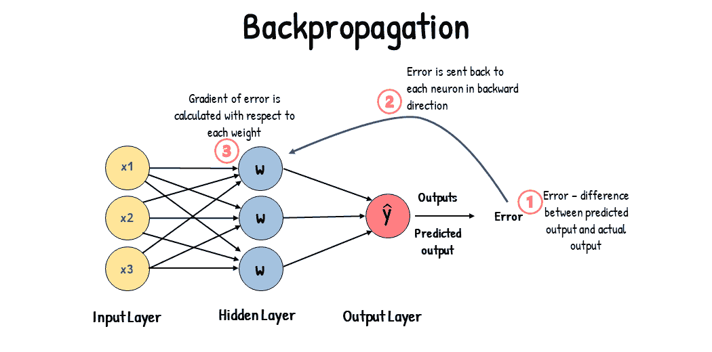

# 机器学习最佳实践和模型训练技巧

> 原文：[`docs.ultralytics.com/guides/model-training-tips/`](https://docs.ultralytics.com/guides/model-training-tips/)

## 引言

在进行计算机视觉项目的模型训练时，最重要的一步之一是模型训练。在达到这一步之前，您需要明确您的目标，并收集和注释您的数据。在预处理数据以确保其干净一致后，您可以开始训练模型。

那么，什么是模型训练？模型训练是教授您的模型识别视觉模式并基于数据进行预测的过程。它直接影响您的应用程序的性能和准确性。在本指南中，我们将介绍有效训练计算机视觉模型的最佳实践、优化技术和故障排除技巧。

## 如何训练机器学习模型

计算机视觉模型通过调整其内部参数来最小化误差进行训练。最初，模型被提供一组大量带标签的图像。它对这些图像进行预测，预测结果与实际标签或内容进行比较，以计算误差。这些误差显示了模型预测与真实值之间的偏差有多大。

在训练过程中，模型通过一种称为反向传播的过程，迭代地进行预测、计算误差，并更新其参数。在这个过程中，模型调整其内部参数（权重和偏差），以减少误差。通过多次重复这一周期，模型逐渐提高其准确性。随着时间的推移，它学会识别复杂的模式，如形状、颜色和纹理。

这一学习过程使得计算机视觉模型能够执行各种任务，包括目标检测、实例分割和图像分类。最终目标是创建一个能够将学习泛化到新的、未见过的图像的模型，从而能够准确理解现实世界应用中的视觉数据。

现在我们知道了在训练模型时发生了什么，让我们来看看在训练模型时需要考虑的要点。

## 在大型数据集上进行训练

在计划使用大型数据集训练模型时，有几个不同的方面需要考虑。例如，可以调整批处理大小，控制 GPU 利用率，选择使用多尺度训练等。让我们详细介绍每个选项。

### 批处理大小和 GPU 利用率

在大型数据集上训练模型时，有效利用 GPU 至关重要。批量大小是一个重要因素。它是机器学习模型在单次训练迭代中处理的数据样本数量。利用 GPU 支持的最大批量大小，您可以充分发挥其性能，并减少模型训练所需的时间。然而，您要避免出现 GPU 内存不足的情况。如果遇到内存错误，可以逐步减少批量大小，直到模型能够平稳训练。

关于 YOLOv8，您可以在训练配置中设置`batch_size`参数以匹配您的 GPU 容量。此外，在训练脚本中设置`batch=-1`将自动确定能够高效处理的批量大小，基于您设备的能力。通过微调批量大小，您可以充分利用 GPU 资源，并改进整体训练过程。

### Subset Training

Subset training 是一种聪明的策略，它涉及在代表更大数据集的较小数据集上训练模型。这可以节省时间和资源，尤其是在初始模型开发和测试期间。如果时间紧张或者正在尝试不同的模型配置，子集训练是一个很好的选择。

在 YOLOv8 中，您可以通过使用`fraction`参数轻松实现子集训练。此参数允许您指定用于训练的数据集的分数。例如，设置`fraction=0.1`将在数据的 10%上训练您的模型。您可以在进行完整数据集训练之前，使用这种技术进行快速迭代和调优模型。子集训练帮助您快速取得进展，并及早发现潜在问题。

### Multi-scale Training

Multi-scale training 是一种通过训练具有不同尺寸图像的模型来改进其泛化能力的技术。您的模型可以学习检测不同尺度和距离的对象，并变得更加健壮。

例如，在训练 YOLOv8 时，可以通过设置`scale`参数来启用多尺度训练。该参数通过指定因子调整训练图像的大小，模拟不同距离的对象。例如，设置`scale=0.5`将减小图像尺寸一半，而`scale=2.0`将使其加倍。配置此参数允许您的模型体验各种图像尺度，并改进其在不同对象大小和场景中的检测能力。

### 缓存

缓存是提高训练机器学习模型效率的重要技术。通过将预处理的图像存储在内存中，缓存减少了 GPU 等待从磁盘加载数据的时间。模型可以持续接收数据，而不会受到由磁盘 I/O 操作引起的延迟影响。

缓存可以通过使用`cache`参数在训练 YOLOv8 时进行控制：

+   *`cache=True`*：将数据集图像存储在 RAM 中，提供最快的访问速度，但以增加内存使用为代价。

+   *`cache='disk'`*：将图像存储在磁盘上，比 RAM 慢但比每次加载新数据更快。

+   *`cache=False`*：禁用缓存，完全依赖磁盘 I/O，这是最慢的选项。

### 混合精度训练

混合精度训练同时使用 16 位（FP16）和 32 位（FP32）浮点类型。利用 FP16 进行更快的计算和 FP32 在需要时保持精度的优势。大多数神经网络操作都是在 FP16 中进行，以从更快的计算和较低的内存使用中获益。然而，模型权重的主副本保持在 FP32 中，以确保在权重更新步骤中的准确性。您可以在相同的硬件限制内处理更大的模型或更大的批量大小。

要实现混合精度训练，您需要修改您的训练脚本，并确保您的硬件（如 GPU）支持它。许多现代深度学习框架，如 Tensorflow，提供了混合精度的内置支持。

当使用 YOLOv8 时，混合精度训练非常简单。您可以在训练配置中使用`amp`标志。设置`amp=True`启用自动混合精度（AMP）训练。混合精度训练是优化模型训练过程的一种简单而有效的方式。

### 预训练权重

使用预训练权重是加快模型训练过程的聪明方式。预训练权重来自已经在大型数据集上训练过的模型，为您的模型提供了一个良好的起点。迁移学习适应预训练模型到新的相关任务。微调预训练模型涉及使用这些权重开始训练，然后在您特定的数据集上继续训练。这种训练方法能够实现更快的训练时间，通常也能获得更好的性能，因为模型从基本特征开始具有坚实的理解。

`pretrained`参数使得在 YOLOv8 中进行迁移学习变得容易。设置`pretrained=True`将使用默认的预训练权重，或者您可以指定自定义预训练模型的路径。有效地利用预训练权重和迁移学习可以显著提升模型的能力并降低训练成本。

### 在处理大型数据集时考虑的其他技术

在处理大型数据集时，还有一些其他技术值得考虑：

+   **学习率调度器**：实现学习率调度器可以在训练过程中动态调整学习率。良好调节的学习率可以防止模型过度逼近极小值，并提高稳定性。在训练 YOLOv8 时，`lrf`参数通过将最终学习率设置为初始速率的一部分，有助于管理学习率调度。

+   **分布式训练**：对于处理大数据集，分布式训练可以改变游戏规则。你可以通过将训练工作负载分布到多个 GPU 或机器上来减少训练时间。

## 训练的迭代次数选择

在训练模型时，一个迭代周期指的是完整地通过整个训练数据集一次。在一个迭代周期内，模型处理训练集中的每个示例，并根据学习算法更新其参数。通常需要多个迭代周期来使模型随着时间的推移学习和优化其参数。

一个常见的问题是如何确定模型训练的迭代次数。一个好的起点是 300 个迭代周期。如果模型早期出现过拟合，可以减少迭代次数。如果在 300 个迭代周期后没有出现过拟合，可以将训练延长至 600、1200 或更多个迭代周期。

然而，理想的迭代次数可以根据你的数据集大小和项目目标而变化。较大的数据集可能需要更多的迭代次数才能有效学习模型，而较小的数据集可能需要较少的迭代次数以避免过拟合。关于 YOLOv8，你可以在训练脚本中设置`epochs`参数。

## 早停

早停技术是优化模型训练的一种有价值的技术。通过监控验证性能，可以在模型停止改进时停止训练。这样可以节省计算资源并防止过拟合。

这一过程涉及设置一个耐心参数，用于确定在停止训练之前等待验证指标改善的迭代周期数。如果模型在这些周期内的表现没有改善，就会停止训练，以避免浪费时间和资源。

对于 YOLOv8，你可以通过在训练配置中设置耐心参数来启用早停技术。例如，`patience=5`表示如果连续 5 个迭代周期内验证指标没有改善，训练将会停止。使用这种方法可以确保训练过程保持高效，并在不过度计算的情况下实现最佳性能。

## 在云端和本地训练之间进行选择

有两种选项可以用来训练你的模型：云端训练和本地训练。

云端训练提供了可扩展性和强大的硬件，非常适合处理大数据集和复杂模型。像谷歌云、AWS 和 Azure 这样的平台提供按需访问高性能 GPU 和 TPU，加快了训练时间，并能够进行更大模型的实验。然而，云端训练可能成本高昂，特别是在长时间内，并且数据传输可能会增加成本和延迟。

本地训练提供了更大的控制和定制性，让您可以根据特定需求定制环境，并避免持续的云成本。对于长期项目来说，可能更经济，而且由于数据留存在本地，更安全。然而，本地硬件可能存在资源限制并需要维护，这可能会导致大型模型训练时间较长。

## 选择优化器

优化器是一种调整神经网络权重以最小化损失函数的算法，损失函数衡量模型的性能。简单来说，优化器通过调整参数来减少错误来帮助模型学习。选择正确的优化器直接影响模型学习的速度和准确性。

您还可以微调优化器参数以提高模型性能。调整学习率设置参数更新步骤的大小。为了稳定性，您可以从适度的学习率开始，并随着时间逐渐减小以改进长期学习。此外，设置动量确定过去更新对当前更新的影响程度。动量的常见值约为 0.9，通常提供良好的平衡。

### 常见优化器

不同的优化器具有各自的优势和劣势。让我们简要看一下几种常见的优化器。

+   **随机梯度下降法（SGD - Stochastic Gradient Descent）**：

    +   使用损失函数梯度更新模型参数。

    +   简单高效但可能收敛速度较慢，并可能陷入局部最小值。

+   **Adam（自适应矩估计法 - Adaptive Moment Estimation）**：

    +   结合了随机梯度下降法（**SGD**）和动量法以及均方根传播（**RMSProp**）的优点。

    +   根据梯度的一阶和二阶矩估计调整每个参数的学习率。

    +   适用于嘈杂数据和稀疏梯度。

    +   高效且通常需要较少的调整，使其成为**YOLOv8**推荐的优化器。

+   **均方根传播（RMSProp - Root Mean Square Propagation）**：

    +   通过损失函数梯度除以最近梯度幅值的运行平均值调整每个参数的学习率。

    +   有助于处理梯度消失问题，对递归神经网络有效。

对于**YOLOv8**，`optimizer`参数允许您从多种优化器中选择，包括 SGD、Adam、AdamW、NAdam、RAdam 和 RMSProp，或者根据模型配置设置为`auto`以进行自动选择。

## 与社区连接

成为计算机视觉爱好者社区的一部分可以帮助您解决问题并更快地学习。以下是一些连接、获取帮助和分享想法的方法。

### 社区资源

+   **GitHub Issues：** 访问[YOLOv8 GitHub 仓库](https://github.com/ultralytics/ultralytics/issues)，并使用 Issues 标签提问、报告错误以及建议新功能。社区和维护者非常活跃并愿意提供帮助。

+   **Ultralytics Discord 服务器：**加入[Ultralytics Discord 服务器](https://ultralytics.com/discord/)，与其他用户和开发者交流，获取支持并分享您的经验。

### 官方文档

+   **Ultralytics YOLOv8 文档：**查看官方 YOLOv8 文档，获取关于各种计算机视觉项目的详细指南和实用技巧。

利用这些资源将帮助您解决挑战，并保持与计算机视觉社区最新趋势和实践的同步。

## 要点摘要

训练计算机视觉模型涉及遵循良好实践、优化策略以及解决问题。调整批次大小、混合精度训练和使用预训练权重等技术可以使模型工作更加高效和快速。子集训练和提前停止等方法有助于节省时间和资源。与社区保持联系并跟踪新趋势将有助于改进您的模型训练技能。

## 常见问题解答

### 在使用 Ultralytics YOLO 训练大型数据集时，如何提高 GPU 利用率？

为了提高 GPU 利用率，请将训练配置中的`batch_size`参数设置为 GPU 支持的最大尺寸。这确保充分利用 GPU 的能力，缩短训练时间。如果遇到内存错误，请逐步减小批次大小，直到训练顺利进行。对于 YOLOv8，将`batch=-1`设置在训练脚本中将自动确定高效处理的最佳批次大小。有关详细信息，请参阅训练配置。

### 什么是混合精度训练，如何在 YOLOv8 中启用它？

混合精度训练利用 16 位（FP16）和 32 位（FP32）浮点类型平衡计算速度和精度。这种方法加快了训练速度，减少了内存使用，而不损失模型准确性。要在 YOLOv8 中启用混合精度训练，请在训练配置中将`amp`参数设置为`True`。这将激活自动混合精度（AMP）训练。有关此优化技术的更多详细信息，请参阅训练配置。

### 多尺度训练如何增强 YOLOv8 模型性能？

多尺度训练通过训练不同尺寸的图像来增强模型性能，使其能够更好地泛化不同的尺度和距离。在 YOLOv8 中，您可以通过在训练配置中设置`scale`参数来启用多尺度训练。例如，`scale=0.5`将图像尺寸减小一半，而`scale=2.0`则将其放大一倍。这种技术模拟不同距离处的对象，使模型在各种场景中更加健壮。有关设置和更多详细信息，请查阅训练配置。

### 如何使用预训练权重加速 YOLOv8 的训练？

使用预训练权重可以显著减少训练时间，并通过从已经理解基本特征的模型开始来提高模型性能。在 YOLOv8 中，您可以将`pretrained`参数设置为`True`，或在训练配置中指定自定义预训练权重的路径。这种称为迁移学习的方法利用大型数据集的知识来适应您的特定任务。在这里了解更多关于预训练权重及其优势的信息。

### 训练模型的推荐周期数是多少，我如何在 YOLOv8 中设置它？

周期数指的是模型训练过程中完全通过训练数据集的次数。一个典型的起始点是 300 个周期。如果您的模型早期出现过拟合，可以减少周期数。或者，如果没有观察到过拟合，可以将训练延长至 600、1200 或更多个周期。要在 YOLOv8 中设置这一参数，使用您的训练脚本中的`epochs`参数。有关确定理想周期数的额外建议，请参考关于周期数的这一部分。
