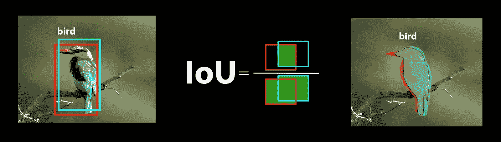
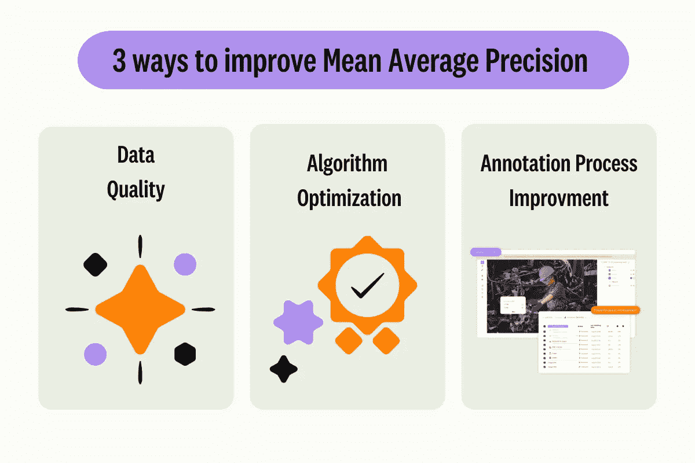

# 模型评估与微调见解

> [模型评估见解](https://docs.ultralytics.com/guides/model-evaluation-insights/)

## 引言

一旦您训练了计算机视觉模型，评估和优化其性能至关重要。仅仅训练模型是不够的。您需要确保模型准确、高效，并实现计算机视觉项目的目标。通过评估和微调您的模型，您可以识别弱点，提高其准确性，并增强整体性能。

在本指南中，我们将分享关于模型评估和微调的见解，这将使计算机视觉项目的这一步骤更易于理解。我们将讨论如何理解评估指标和实施微调技术，为您提供提升模型能力的知识。

## 使用指标评估模型性能

评估模型性能有助于我们理解其工作效果。各种指标用于衡量性能。这些性能指标提供清晰的数值见解，可指导改进，确保模型达到预期目标。让我们更详细地看看几个关键指标。

### 置信度分数

置信度分数表示模型确定检测到的对象属于特定类的确信程度。它的范围从 0 到 1，较高的分数表示更大的置信度。置信度分数有助于筛选预测结果；只有置信度分数高于指定阈值的检测结果才被认为有效。

*快速提示：* 在运行推理时，如果没有看到任何预测结果，并且您已经检查了所有其他问题，请尝试降低置信度分数。有时，阈值设置过高会导致模型忽略有效的预测。降低分数可以让模型考虑更多可能性。这可能不符合您的项目目标，但这是了解模型能力并决定如何微调的一个好方法。

### IoU（Intersection over Union）

IoU（Intersection over Union）是物体检测中的一个指标，用于衡量预测边界框与地面真实边界框的重叠程度。IoU 值的范围是从 0 到 1，其中 1 表示完美匹配。IoU 非常重要，因为它衡量了预测边界与实际物体边界的匹配程度。



### 平均精度均值

平均精度均值（mAP）是衡量物体检测模型性能的一种方法。它考虑了检测每个对象类的精度，将这些分数求平均，并给出一个总体数字，显示模型能够多么准确地识别和分类对象。

让我们专注于两个具体的 mAP 指标：

+   *mAP@.5:* 测量单个 IoU（交并比）阈值为 0.5 时的平均精度。此指标检查模型是否能在较宽松的准确性要求下正确找到对象。它关注对象是否大致处于正确位置，而不需要完美放置，有助于判断模型是否总体上能够有效地检测对象。

+   *mAP@.5:.95:* 对多个 IoU 阈值（从 0.5 到 0.95，每次增加 0.05）计算的 mAP 值进行平均。该指标更详细且严格，全面展示了模型在不同严格程度下发现对象的准确性，特别适用于需要精确目标检测的应用。

其他 mAP 指标包括 mAP@0.75，使用更严格的 IoU 阈值为 0.75，并且 mAP@small、medium 和 large，评估不同大小对象的精度。



## 评估 YOLOv8 模型性能

关于 YOLOv8，您可以使用验证模式评估模型。此外，请务必查看我们深入解析 YOLOv8 性能指标及其解释的指南。

### 常见社区问题

在评估您的 YOLOv8 模型时，可能会遇到一些小问题。根据常见社区问题，以下是一些提示，帮助您充分利用您的 YOLOv8 模型：

#### 处理可变图像尺寸

使用不同尺寸的图像评估您的 YOLOv8 模型，有助于了解其在多样数据集上的性能。使用 `rect=true` 验证参数，YOLOv8 根据图像大小调整每批的网络步幅，使模型能够处理矩形图像而不强制将其调整为单一尺寸。

`imgsz` 验证参数设置图像调整的最大尺寸，默认为 640。您可以根据数据集的最大尺寸和可用的 GPU 内存进行调整。即使设置了 `imgsz`，`rect=true` 也能够通过动态调整步幅有效地处理不同大小的图像。

#### 访问 YOLOv8 指标

如果您希望深入了解您的 YOLOv8 模型性能，可以用几行 Python 代码轻松访问特定评估指标。下面的代码片段将让您加载模型、运行评估，并打印出显示模型表现的各种指标。

使用方法

```py
`from ultralytics import YOLO  # Load the model model = YOLO("yolov8n.pt")  # Run the evaluation results = model.val(data="coco8.yaml")  # Print specific metrics print("Class indices with average precision:", results.ap_class_index) print("Average precision for all classes:", results.box.all_ap) print("Average precision:", results.box.ap) print("Average precision at IoU=0.50:", results.box.ap50) print("Class indices for average precision:", results.box.ap_class_index) print("Class-specific results:", results.box.class_result) print("F1 score:", results.box.f1) print("F1 score curve:", results.box.f1_curve) print("Overall fitness score:", results.box.fitness) print("Mean average precision:", results.box.map) print("Mean average precision at IoU=0.50:", results.box.map50) print("Mean average precision at IoU=0.75:", results.box.map75) print("Mean average precision for different IoU thresholds:", results.box.maps) print("Mean results for different metrics:", results.box.mean_results) print("Mean precision:", results.box.mp) print("Mean recall:", results.box.mr) print("Precision:", results.box.p) print("Precision curve:", results.box.p_curve) print("Precision values:", results.box.prec_values) print("Specific precision metrics:", results.box.px) print("Recall:", results.box.r) print("Recall curve:", results.box.r_curve)` 
```

结果对象还包括预处理时间、推理时间、损失和后处理时间等速度指标。通过分析这些指标，您可以微调和优化 YOLOv8 模型，提升其在特定用例中的效果。

## 如何进行微调工作？

微调涉及采用预训练模型并调整其参数，以提高特定任务或数据集上的性能。这个过程也被称为模型重新训练，允许模型更好地理解和预测在实际应用中可能遇到的特定数据结果。根据模型评估重新训练您的模型，以实现最佳结果。

## 模型微调技巧

对模型进行微调意味着要特别关注几个关键参数和技术，以实现最佳性能。以下是一些重要提示，帮助您完成这一过程。

### 以较高的学习率开始

通常，在初始训练时期，学习率会从低开始逐渐增加，以稳定训练过程。然而，由于您的模型已经从先前的数据集中学习了一些特征，因此立即使用较高的学习率可能更为有利。

在评估您的 YOLOv8 模型时，您可以将 `warmup_epochs` 验证参数设置为 `warmup_epochs=0`，以防止学习率过高。通过这一过程，训练将继续从提供的权重开始，并调整到新数据的细微差别。

### 小物体的图像分割

图像分割可以提高小物体的检测精度。通过将较大的图像分成更小的片段，例如将 1280x1280 的图像分成多个 640x640 的片段，您可以保持原始分辨率，模型可以从高分辨率片段中学习。在使用 YOLOv8 时，请确保正确调整这些新片段的标签。

## 参与社区交流

与其他计算机视觉爱好者分享您的想法和问题，可以激发项目中遇到的障碍的创造性解决方案。以下是一些学习、解决问题和交流的绝佳方式。

### 获取帮助和支持

+   **GitHub Issues:** 探索 YOLOv8 GitHub 仓库并使用 [Issues 标签](https://github.com/ultralytics/ultralytics/issues) 提出问题、报告 bug 和建议功能。社区和维护者将为您解决遇到的任何问题。

+   **Ultralytics Discord 服务器:** 加入 [Ultralytics Discord 服务器](https://ultralytics.com/discord/)，与其他用户和开发者建立联系，获取支持，分享知识和构思想法。

### 官方文档

+   **Ultralytics YOLOv8 文档:** 查看官方 YOLOv8 文档，获取有关各种计算机视觉任务和项目的全面指南和宝贵见解。

## 最终思考

评估和微调您的计算机视觉模型是成功模型部署的重要步骤。这些步骤确保您的模型准确、高效，并适合您的整体应用。训练最佳模型的关键在于持续的实验和学习。不要犹豫调整参数，尝试新技术，探索不同的数据集。继续实验，推动可能性的边界！

## 常见问题解答

### 评估 YOLOv8 模型性能的关键指标是什么？

要评估 YOLOv8 模型的性能，重要的指标包括置信度分数、交并比（IoU）和平均精度（mAP）。置信度分数衡量模型对每个检测到的对象类的确定性。IoU 评估预测边界框与地面实况的重叠程度。平均精度（mAP）汇总了跨类别的精度分数，常见的有 mAP@.5 和 mAP@.5:.95，分别对应不同的 IoU 阈值。了解更多关于这些指标的信息，请参阅我们的 YOLOv8 性能指标指南。

### 如何为我的特定数据集微调预训练的 YOLOv8 模型？

对预训练的 YOLOv8 模型进行微调涉及调整其参数以改善特定任务或数据集上的性能。首先使用指标评估您的模型，然后通过将 `warmup_epochs` 参数调整为 0 来设置更高的初始学习率以实现即时稳定性。使用像 `rect=true` 这样的参数有效处理不同大小的图像。有关更详细的指导，请参考我们关于微调 YOLOv8 模型的部分。

### 如何在评估我的 YOLOv8 模型时处理可变大小的图像？

在评估期间处理可变大小的图像，使用 YOLOv8 中的 `rect=true` 参数，它根据图像大小调整每批次的网络步长。`imgsz` 参数设置图像调整大小的最大尺寸，默认为 640。调整 `imgsz` 以适应您的数据集和 GPU 内存。有关更多详细信息，请访问我们关于处理可变图像大小的部分。

### 我如何采取实际步骤来提高我的 YOLOv8 模型的平均精度？

提高 YOLOv8 模型的平均精度 (mAP) 涉及几个步骤：

1.  **调整超参数**：尝试不同的学习率、批量大小和图像增强方法。

1.  **数据增强**：使用 Mosaic 和 MixUp 等技术创建多样化的训练样本。

1.  **图像平铺**：将较大的图像拆分为较小的瓦片，以提高小物体检测精度。有关具体策略，请参考我们详细的模型微调指南。

### 如何在 Python 中访问 YOLOv8 模型评估指标？

您可以按照以下步骤使用 Python 访问 YOLOv8 模型评估指标：

使用方法

```py
`from ultralytics import YOLO  # Load the model model = YOLO("yolov8n.pt")  # Run the evaluation results = model.val(data="coco8.yaml")  # Print specific metrics print("Class indices with average precision:", results.ap_class_index) print("Average precision for all classes:", results.box.all_ap) print("Mean average precision at IoU=0.50:", results.box.map50) print("Mean recall:", results.box.mr)` 
```

分析这些指标有助于微调和优化您的 YOLOv8 模型。深入了解，请查看我们关于 YOLOv8 指标的指南。
