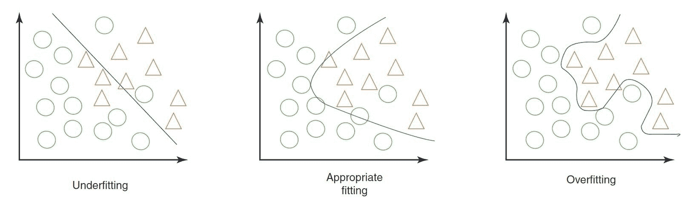

# 模型测试指南

> 原文：[`docs.ultralytics.com/guides/model-testing/`](https://docs.ultralytics.com/guides/model-testing/)

## 引言

在训练和评估您的模型之后，现在是时候进行测试了。模型测试涉及评估它在真实场景中的表现如何。测试考虑因素包括准确性、可靠性、公正性以及理解模型决策的难易程度。目标是确保模型按预期运行，提供期望的结果，并符合应用程序或项目的整体目标。

模型测试与模型评估非常相似，但它们是计算机视觉项目中的两个独立步骤。模型评估涉及指标和图表以评估模型的准确性。另一方面，模型测试检查模型的学习行为是否与预期一致。在本指南中，我们将探讨测试计算机视觉模型的策略。

## 模型测试与模型评估的比较

首先，让我们通过一个例子了解模型评估和测试之间的区别。

假设您已经训练了一个计算机视觉模型来识别猫和狗，并且您希望将这个模型部署在宠物店以监控动物。在模型评估阶段，您使用带标签的数据集来计算诸如准确度、精确率、召回率和 F1 分数等指标。例如，该模型在一个特定数据集中在区分猫和狗方面可能达到了 98% 的准确度。

在评估之后，您使用来自宠物店的图像来测试模型，以查看它在更加多样化和现实条件下如何识别猫和狗。您检查它在动态、不同光照条件或部分被玩具或家具遮挡的情况下是否能够正确标记猫和狗。模型测试确保模型在受控评估环境之外的情况下表现符合预期。

## 准备模型测试

计算机视觉模型通过检测模式、进行预测和评估其性能来学习数据集。这些数据集通常分为训练集和测试集，以模拟真实世界的条件。训练数据教导模型，而测试数据验证其准确性。

在测试模型之前，请记住以下两点：

+   **真实的代表性：** 先前未见的测试数据应该与模型在部署时需要处理的数据类似。这有助于真实地理解模型的能力。

+   **足够的数据集大小：** 测试数据集的大小需要足够大，以便可靠地了解模型的表现如何。

## 测试您的计算机视觉模型

以下是测试计算机视觉模型并了解其性能的关键步骤。

+   **运行预测：** 使用模型对测试数据集进行预测。

+   **比较预测结果：** 检查模型的预测结果与实际标签（地面真相）的匹配程度。

+   **计算性能指标：** 计算准确率、精确率、召回率和 F1 分数等指标，以了解模型的优势和劣势。测试侧重于这些指标如何反映实际应用的性能。

+   **可视化结果：** 创建诸如混淆矩阵和 ROC 曲线之类的视觉辅助工具。这些工具帮助您发现模型在实际应用中可能表现不佳的具体领域。

接下来，可以分析测试结果：

+   **错误分类的图像：** 识别和审查模型误分类的图像，以了解其错误出现的位置。

+   **错误分析：** 进行彻底的错误分析，以了解错误类型（例如假阳性与假阴性）及其潜在原因。

+   **偏见和公平性：** 检查模型预测中是否存在任何偏见。确保模型在数据的不同子集上表现一致，特别是涉及种族、性别或年龄等敏感属性的情况。

## 测试您的 YOLOv8 模型

要测试您的 YOLOv8 模型，可以使用验证模式。这是了解模型优势和需要改进的领域的直接方式。此外，您需要正确格式化您的测试数据集以供 YOLOv8 使用。有关如何使用验证模式的详细信息，请查看模型验证文档页面。

## 使用 YOLOv8 对多个测试图像进行预测

如果您想要在存储在文件夹中的多个图像上测试已训练的 YOLOv8 模型，您可以轻松地一次性完成。与通常用于在验证集上评估模型性能并提供详细指标的验证模式不同，您可能只想看到在测试集中所有图像上的预测结果。为此，您可以使用预测模式。

### 验证模式与预测模式的区别

+   **验证模式：** 用于通过将预测与已知标签（地面真相）进行比较来评估模型的性能。它提供详细的指标，如准确率、精确率、召回率和 F1 分数。

+   **预测模式：** 用于在新的未见数据上运行模型以生成预测。它不提供详细的性能指标，但允许您查看模型在实际图像上的表现。

## 在没有自定义训练的情况下运行 YOLOv8 预测

如果您有兴趣测试基本的 YOLOv8 模型，以了解它是否可以在没有自定义训练的情况下用于您的应用程序，您可以使用预测模式。虽然模型在像 COCO 这样的数据集上进行了预训练，但在您自己的数据集上运行预测可以让您快速了解它在特定环境中的性能。

## 机器学习中的过拟合和欠拟合

在测试机器学习模型时，特别是在计算机视觉中，需要注意过拟合和欠拟合。这些问题可能会显著影响模型在新数据上的表现。

### 过拟合

当您的模型过于精确地学习了训练数据，包括噪声和不一般化的细节时，就会发生过拟合。在计算机视觉中，这意味着您的模型可能在训练图像上表现出色，但在新图像上可能会遇到困难。

#### 过拟合的迹象

+   **高训练准确率，低验证准确率：** 如果模型在训练数据上表现非常好，但在验证或测试数据上表现不佳，可能是过拟合的迹象。

+   **视觉检查：** 有时，如果您的模型对图像中的微小变化或不相关细节过于敏感，您可能会看到过拟合。

### 欠拟合

当你的模型无法捕捉数据中的潜在模式时，就会发生欠拟合。在计算机视觉中，一个欠拟合的模型可能甚至无法正确识别训练图像中的物体。

#### 欠拟合的迹象

+   **低训练准确率：** 如果模型在训练集上无法达到高准确率，可能是欠拟合的表现。

+   **视觉误分类：** 持续未能识别明显特征或物体表明欠拟合。

### 平衡过拟合和欠拟合

关键是在过拟合和欠拟合之间找到平衡。理想情况下，模型应在训练和验证数据集上都表现良好。通过指标和视觉检查定期监控模型的性能，以及应用正确的策略，可以帮助您获得最佳结果。

## 计算机视觉中的数据泄漏及其避免方法

在测试模型时，需要牢记的重要事项是数据泄漏。数据泄漏发生在意外使用训练集外部信息来训练模型时。当数据泄漏发生时，模型在训练过程中可能看起来非常准确，但在新的、未见过的数据上表现不佳。

### 数据泄漏的原因

数据泄漏可能很难发现，并且常常来自训练数据中的隐藏偏差。以下是计算机视觉中可能发生数据泄漏的一些常见方式：

+   **相机偏差：** 不同角度、光照、阴影和相机运动可能引入不必要的模式。

+   **覆盖偏差：** 图像中的标志、时间戳或其他覆盖物可能会误导模型。

+   **字体和物体偏差：** 特定字体或频繁出现在某些类别中的物体可能会扭曲模型的学习。

+   **空间偏差：** 前景-背景、边界框分布以及物体位置的不平衡可能影响训练。

+   **标签和域偏差：** 错误的标签或数据类型的转移可能导致信息泄漏。

### 检测数据泄漏

要找出数据泄漏，您可以：

+   **检查性能：** 如果模型的结果出奇的好，可能存在信息泄漏。

+   **查看特征重要性：** 如果某个特征比其他特征重要得多，可能会提示信息泄露。

+   **视觉检查：** 双重检查模型的决策是否在直觉上合理。

+   **验证数据分离：** 在任何处理之前确保数据被正确分割。

### 避免数据泄漏

为了防止数据泄露，请使用来自不同摄像头和环境的多样化数据集。仔细审查数据，确保没有隐藏的偏差，例如所有正样本都在特定时间拍摄。避免数据泄露将有助于使您的计算机视觉模型在实际情况中更加可靠和有效。

## 模型测试后的下一步

在测试模型后，下一步取决于结果。如果您的模型表现良好，可以将其部署到实际环境中。如果结果不理想，您需要进行改进。这可能涉及分析错误，收集更多数据，提高数据质量，调整超参数和重新训练模型。

## 加入 AI 对话

成为计算机视觉爱好者社区的一部分可以帮助解决问题并更高效地学习。以下是一些联系、寻求帮助和分享想法的方法。

### 社区资源

+   **GitHub Issues:** 探索[YOLOv8 GitHub 代码库](https://github.com/ultralytics/ultralytics/issues)，使用 Issues 标签提问、报告错误和建议新功能。社区和维护者非常活跃并愿意提供帮助。

+   **Ultralytics Discord 服务器:** 加入[Ultralytics Discord 服务器](https://ultralytics.com/discord/)，与其他用户和开发者交流，获取支持，并分享您的经验。

### 官方文档

+   **Ultralytics YOLOv8 文档:** 查看官方 YOLOv8 文档，获取各种计算机视觉项目的详细指南和实用提示。

这些资源将帮助您应对挑战，并了解计算机视觉社区内的最新趋势和实践。

## 总结

建立可信赖的计算机视觉模型依赖于严格的模型测试。通过使用以前未见过的数据来测试模型，我们可以分析并发现过拟合和数据泄露等问题。在部署之前解决这些问题有助于模型在实际应用中表现良好。重要的是要记住，模型测试与模型评估一样关键，可以确保模型的长期成功和有效性。

## 常见问题解答

### 计算机视觉中模型评估和模型测试之间的主要区别是什么？

在计算机视觉项目中，模型评估和模型测试是不同的步骤。模型评估使用标记数据集计算准确率、精度、召回率和 F1 分数等指标，为模型在控制数据集上的表现提供洞察。另一方面，模型测试通过将模型应用于新的未见数据，在实际场景中评估模型的表现，确保模型的学习行为符合评估环境外的预期。有关详细指南，请参考计算机视觉项目的步骤。

### 如何在多个图像上测试我的 Ultralytics YOLOv8 模型？

若要在多个图像上测试您的 Ultralytics YOLOv8 模型，可以使用预测模式。此模式允许您在新的、未见过的数据上运行模型，生成预测，而无需提供详细的度量标准。这对于在文件夹中存储的大型图像集上进行实际性能测试非常理想。如需评估性能指标，请改用验证模式。

### 如果我的计算机视觉模型出现过拟合或欠拟合迹象，应该怎么办？

解决**过拟合**问题：

+   正则化技术如 dropout。

+   增加训练数据集的大小。

+   简化模型架构。

解决**欠拟合**问题：

+   使用更复杂的模型。

+   提供更相关的特征。

+   增加训练迭代次数或轮数。

审查误分类的图像，进行彻底的错误分析，并定期跟踪性能指标以维持平衡。有关这些概念的更多信息，请查看我们关于过拟合和欠拟合的部分。

### 如何检测并避免计算机视觉中的数据泄露？

检测数据泄露：

+   确保测试性能不异常高。

+   检查特征重要性以获取意外的见解。

+   直观地审查模型决策。

+   在处理之前确保正确的数据划分。

避免数据泄露：

+   使用不同环境的多样化数据集。

+   仔细审查数据中的潜在偏见。

+   确保训练集和测试集之间没有重叠信息。

有关如何防止数据泄露的详细策略，请参阅我们关于计算机视觉中数据泄露的部分。

### 在测试完计算机视觉模型后应采取哪些步骤？

测试后，如果模型表现符合项目目标，可以继续部署。如果结果不理想，考虑：

+   错误分析。

+   收集更多多样化和高质量的数据。

+   超参数调优。

+   重新训练模型。

从模型测试与模型评估部分获取见解，以优化和增强模型在实际应用中的有效性。

### 如何在没有定制训练的情况下运行 YOLOv8 预测？

您可以在您的数据集上使用预训练的 YOLOv8 模型进行预测，以查看它是否适合您的应用需求。利用预测模式快速了解性能结果，无需进行定制训练。
