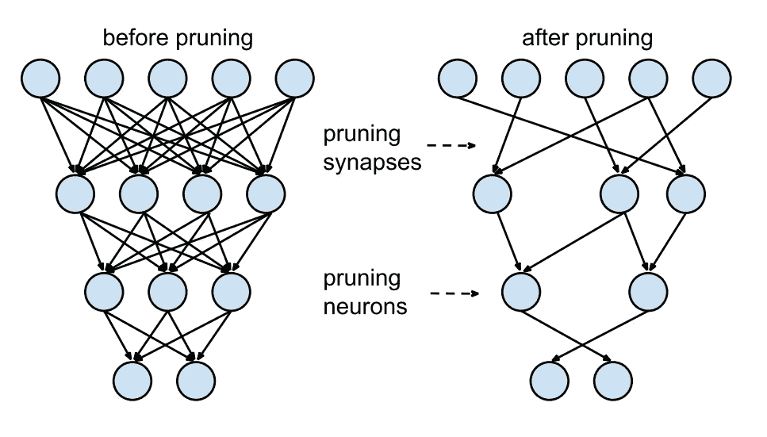
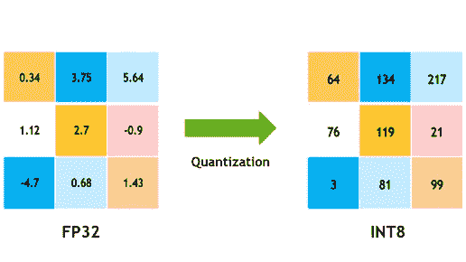
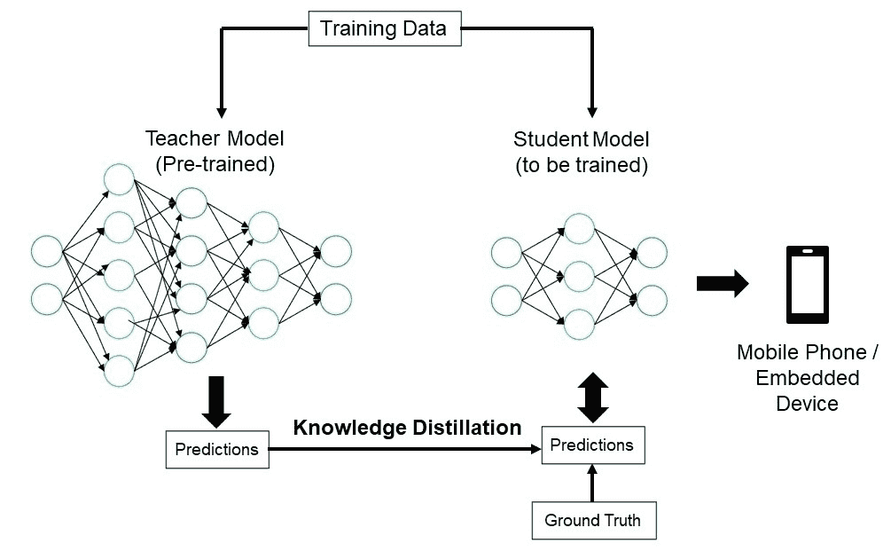

# 模型部署的最佳实践

> 原文：[`docs.ultralytics.com/guides/model-deployment-practices/`](https://docs.ultralytics.com/guides/model-deployment-practices/)

## 介绍

模型部署是计算机视觉项目中将模型从开发阶段引入实际应用的步骤。有多种模型部署选项：云端部署提供可伸缩性和易用性，边缘部署通过将模型靠近数据源来减少延迟，本地部署确保隐私和控制。选择合适的策略取决于您的应用需求，平衡速度、安全性和可伸缩性。

部署模型时遵循最佳实践同样很重要，因为部署可以显著影响模型性能的效果和可靠性。在本指南中，我们将重点介绍如何确保您的模型部署平稳、高效和安全。

## 模型部署选项

往往，一旦模型训练、评估和测试完成，就需要将其转换为特定格式，以便在云端、边缘或本地设备中有效部署。

关于 YOLOv8，您可以将您的模型导出为不同的格式。例如，当您需要在不同的框架之间传输您的模型时，ONNX 是一个很好的工具，将 YOLOv8 导出到 ONNX 是很容易的。您可以在这里查看更多有关将您的模型集成到不同环境中的平稳有效选项。

### 选择部署环境

选择在哪里部署您的计算机视觉模型取决于多个因素。不同的环境具有独特的优势和挑战，因此选择最适合您需求的环境至关重要。

#### 云端部署

云端部署非常适合需要快速扩展和处理大量数据的应用。像 AWS、Google Cloud 和 Azure 这样的平台使您能够轻松管理从训练到部署的模型。它们提供像 AWS SageMaker、Google AI Platform 和 Azure Machine Learning 这样的服务，帮助您贯穿整个过程。

然而，使用云端可能会很昂贵，特别是在数据使用量大的情况下，如果用户远离数据中心，可能会面临延迟问题。为了管理成本和性能，优化资源使用并确保遵守数据隐私规定至关重要。

#### 边缘部署

边缘部署非常适合需要实时响应和低延迟的应用，特别是在没有或有限互联网访问的地方。在智能手机或物联网设备等边缘设备上部署模型能够保证快速处理并保持数据本地化，从而增强隐私性。在边缘部署还能通过减少发送到云端的数据来节省带宽。

然而，边缘设备通常具有有限的处理能力，因此您需要优化您的模型。像 TensorFlow Lite 和 NVIDIA Jetson 这样的工具可以帮助。尽管有这些好处，维护和更新多个设备可能是具有挑战性的。

#### 本地部署

当数据隐私至关重要或没有可靠的互联网访问时，本地部署是最佳选择。在本地服务器或台式机上运行模型可以完全控制并保持数据安全。如果服务器靠近用户，还可以减少延迟。

然而，在本地扩展可能会很困难，而且维护可能会耗时。使用像 Docker 进行容器化和 Kubernetes 进行管理的工具可以帮助使本地部署更加高效。定期更新和维护是保持一切运行顺畅所必需的。

## 模型优化技术

优化您的计算机视觉模型有助于其在部署在资源有限的环境中（如边缘设备）运行高效。以下是一些优化模型的关键技术。

### 模型修剪

修剪通过删除对最终输出贡献不大的权重来减小模型的大小。它使模型更小更快，而不会显著影响准确性。修剪涉及识别和消除不必要的参数，从而产生一个更轻的模型，需要更少的计算能力。它对于在资源有限的设备上部署模型特别有用。

### 模型量化

量化将模型的权重和激活从高精度（如 32 位浮点数）转换为低精度（如 8 位整数）。通过减小模型大小，加快推断速度。量化感知训练（QAT）是一种在训练过程中考虑量化的方法，比后期量化更好地保留准确性。通过在训练阶段处理量化，模型学会适应更低的精度，保持性能同时减少计算需求。

### 知识蒸馏

知识蒸馏涉及训练一个更小、更简单的模型（学生模型），以模仿一个更大、更复杂的模型（教师模型）的输出。学生模型学会近似教师模型的预测结果，从而产生一个保留教师准确性的紧凑模型。这种技术有助于创建适合在资源受限的边缘设备上部署的高效模型。

## 故障排除部署问题

在部署计算机视觉模型时，您可能会面临一些挑战，但了解常见问题和解决方案可以使过程更加顺利。以下是一些常见故障排除技巧和最佳实践，帮助您应对部署问题。

### 模型部署后的准确性下降

在部署后模型准确性下降可能令人沮丧。这个问题可能源于各种因素。以下是一些帮助您识别和解决问题的步骤：

+   **检查数据一致性：** 确保模型在部署后处理的数据与训练时使用的数据一致。数据分布、质量或格式的差异可能会显著影响性能。

+   **验证预处理步骤：** 验证训练期间应用的所有预处理步骤在部署期间也得到了一致应用。这包括调整图像大小、像素值归一化和其他数据转换。

+   **评估模型的环境：** 确保在部署期间使用的硬件和软件配置与训练期间使用的配置相匹配。库、版本和硬件能力的差异可能会引入差异。

+   **监控模型推理：** 在推理流水线的各个阶段记录输入和输出，以检测任何异常情况。这可以帮助识别数据损坏或模型输出处理不当等问题。

+   **审查模型导出和转换：** 重新导出模型，并确保转换过程保持模型权重和架构的完整性。

+   **使用受控数据集进行测试：** 在测试环境中部署模型，并使用您控制的数据集比较训练阶段的结果。您可以确定问题是部署环境还是数据本身导致的。

在部署 YOLOv8 时，几个因素可能影响模型准确性。将模型转换为 TensorRT 等格式涉及优化，如权重量化和层融合，可能会导致轻微的精度损失。使用 FP16（半精度）而不是 FP32（全精度）可以加快推理速度，但可能会引入数值精度错误。此外，硬件限制，如 Jetson Nano 上较低的 CUDA 核心数和减少的内存带宽，可能会影响性能。

### 推理时间超出预期

在部署机器学习模型时，确保它们能够高效运行至关重要。如果推理时间超出预期，可能会影响用户体验和应用程序的效果。以下是一些帮助您识别和解决问题的步骤：

+   **实施预热运行：** 初始运行通常包括设置开销，这可能会使延迟测量不准确。在测量延迟之前进行几次预热推理。排除这些初始运行可以提供模型性能更准确的测量结果。

+   **优化推理引擎：** 再次确认推理引擎是否完全针对您特定的 GPU 架构进行了优化。使用适合您硬件的最新驱动程序和软件版本，以确保最大的性能和兼容性。

+   **使用异步处理：** 异步处理可以帮助更高效地管理工作负载。使用异步处理技术同时处理多个推理，有助于分发负载并减少等待时间。

+   **分析推断流水线：**识别推断流水线中的瓶颈可以帮助确定延迟的来源。使用性能分析工具分析推断过程的每个步骤，识别并解决导致显著延迟的阶段，例如效率低下的层或数据传输问题。

+   **使用适当的精度：**使用比必要更高的精度可能会减慢推断时间。尝试使用较低精度，例如 FP16（半精度），而不是 FP32（全精度）。虽然 FP16 可以减少推断时间，但也要记住它可能会影响模型的准确性。

如果在部署 YOLOv8 时遇到此问题，请考虑 YOLOv8 提供了多种模型大小，例如适用于内存容量较低设备的 YOLOv8n（纳米）和适用于更强大 GPU 的 YOLOv8x（额外大）。选择适合您硬件的正确模型变体可以帮助平衡内存使用和处理时间。

还要记住，输入图像的大小直接影响内存使用和处理时间。较低分辨率可以减少内存使用并加快推断速度，而较高分辨率可以提高准确性，但需要更多内存和处理能力。

## 模型部署中的安全考虑

部署的另一个重要方面是安全性。部署模型的安全性对于保护敏感数据和知识产权至关重要。以下是关于安全模型部署的一些最佳实践。

### 安全数据传输

确保客户端和服务器之间传输的数据是安全的非常重要，以防止被未经授权的人截取或访问。您可以使用像 TLS（传输层安全）这样的加密协议，在数据传输过程中对数据进行加密。即使有人截取了数据，他们也无法读取它。您还可以使用端到端加密来保护数据从源头到目的地的整个传输过程中，以防中间任何人访问。

### 访问控制

控制谁可以访问您的模型及其数据以防止未经授权的使用非常重要。使用强身份验证方法验证试图访问模型的用户或系统的身份，并考虑使用多因素认证（MFA）增加额外的安全性。设置基于角色的访问控制（RBAC）以根据用户角色分配权限，确保人员只能访问所需内容。保持详细的审计日志以跟踪对模型及其数据的所有访问和更改，并定期审核这些日志以发现任何可疑活动。

### 模型混淆

保护您的模型免受反向工程或误用可以通过模型混淆来实现。这涉及对模型参数进行加密，例如神经网络中的权重和偏差，以使未经授权的个人难以理解或更改模型。您还可以通过重命名层和参数或添加虚拟层来混淆模型的架构，使攻击者更难进行反向工程。您还可以在安全环境中提供模型服务，例如安全隔离区或使用受信任的执行环境（TEE），这在推断过程中提供了额外的保护层。

## 与同行分享想法

成为计算机视觉爱好者社区的一部分可以帮助您更快地解决问题和学习。以下是一些连接、获取帮助和分享想法的方法。

### 社区资源

+   **GitHub Issues：**探索[YOLOv8 GitHub 仓库](https://github.com/ultralytics/ultralytics/issues)，使用 Issues 标签提出问题、报告错误和建议新功能。社区和维护者非常活跃并且随时为您提供帮助。

+   **Ultralytics Discord 服务器：**加入[Ultralytics Discord 服务器](https://ultralytics.com/discord/)与其他用户和开发者聊天，获取支持，并分享您的经验。

### 官方文档

+   **Ultralytics YOLOv8 文档：**访问官方 YOLOv8 文档，获取有关各种计算机视觉项目的详细指南和实用提示。

使用这些资源将帮助您解决挑战，并与计算机视觉社区的最新趋势和实践保持同步。

## 结论和下一步

我们讨论了部署计算机视觉模型时的一些最佳实践。通过保护数据、控制访问和混淆模型细节，您可以在保护敏感信息的同时保持模型运行的流畅性。我们还讨论了如何解决常见问题，例如准确率降低和推断速度慢，采用热身运行、优化引擎、异步处理、性能分析流程和选择合适的精度策略。

在部署模型后，下一步将是监控、维护和记录您的应用程序。定期监控有助于快速捕获和修复问题，维护保持您的模型更新和功能，良好的文档跟踪所有变更和更新。这些步骤将帮助您实现计算机视觉项目的目标。

## 常见问题解答

### 使用 Ultralytics YOLOv8 部署机器学习模型的最佳实践是什么？

部署机器学习模型，特别是使用 Ultralytics YOLOv8，涉及几个最佳实践以确保效率和可靠性。首先，选择适合您需求的部署环境——云端、边缘或本地。通过修剪、量化和知识蒸馏等技术优化您的模型，以在资源受限环境中高效部署。最后，确保数据一致性和预处理步骤与训练阶段保持一致，以维持性能。您也可以参考模型部署选项获取更详细的指南。

### 如何解决 Ultralytics YOLOv8 模型的常见部署问题？

故障排除部署问题可以分解为几个关键步骤。如果您的模型在部署后准确性下降，请检查数据一致性，验证预处理步骤，并确保硬件/软件环境与训练时使用的一致。对于推断时间过慢的情况，进行预热运行，优化推断引擎，使用异步处理，并对推断流水线进行分析。详细指南，请参阅故障排除部署问题中的最佳实践。

### Ultralytics YOLOv8 如何优化在边缘设备上的模型性能？

优化 Ultralytics YOLOv8 模型以适配边缘设备，涉及使用修剪来减小模型大小，量化将权重转换为低精度，以及知识蒸馏训练较小的模型以模仿较大模型的技术。这些技术确保模型在计算能力有限的设备上高效运行。像 TensorFlow Lite 和 NVIDIA Jetson 这样的工具尤为适用于这些优化。在我们关于模型优化的部分中进一步了解这些技术。

### 部署使用 Ultralytics YOLOv8 的机器学习模型的安全注意事项是什么？

在部署机器学习模型时，安全性至关重要。使用诸如 TLS 之类的加密协议确保安全数据传输。实施强大的访问控制，包括强身份验证和基于角色的访问控制（RBAC）。模型混淆技术，如加密模型参数并在受信任的执行环境（如 TEE）中提供模型，提供额外保护。详细实践，请参阅安全注意事项。

### 如何选择适合我的 Ultralytics YOLOv8 模型的正确部署环境？

选择最佳部署环境以适配您的 Ultralytics YOLOv8 模型，依赖于应用程序的特定需求。云端部署提供可伸缩性和便捷性，非常适合处理大数据量的应用。边缘部署则最适合需要实时响应的低延迟应用，可以使用像 TensorFlow Lite 这样的工具。本地部署则适用于需要严格数据隐私和控制的场景。要全面了解每种环境的概述，请参阅我们关于选择部署环境的部分。
