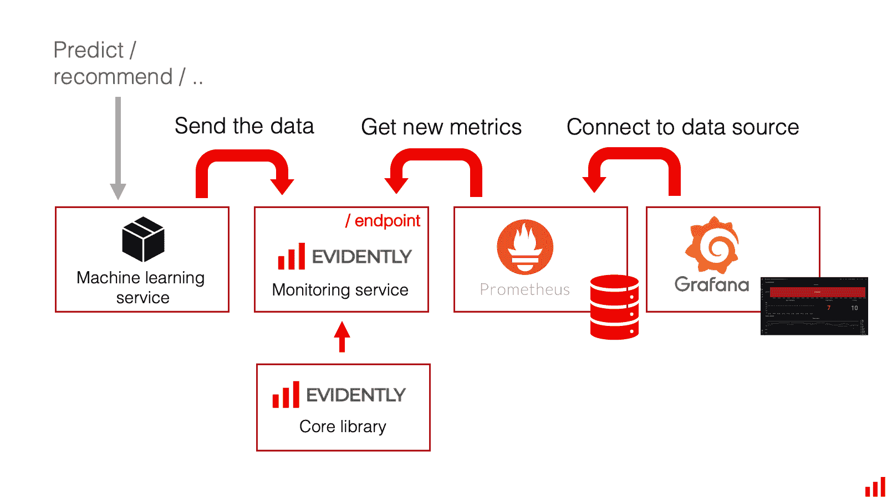
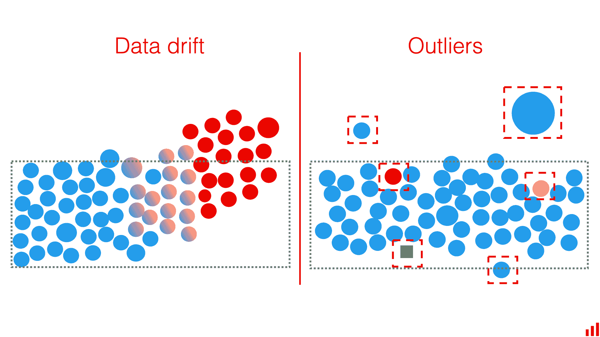
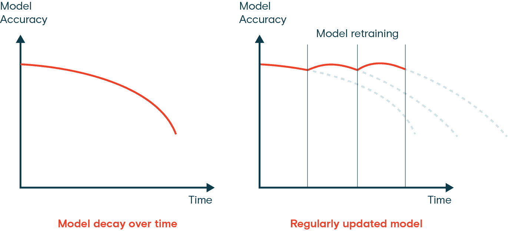
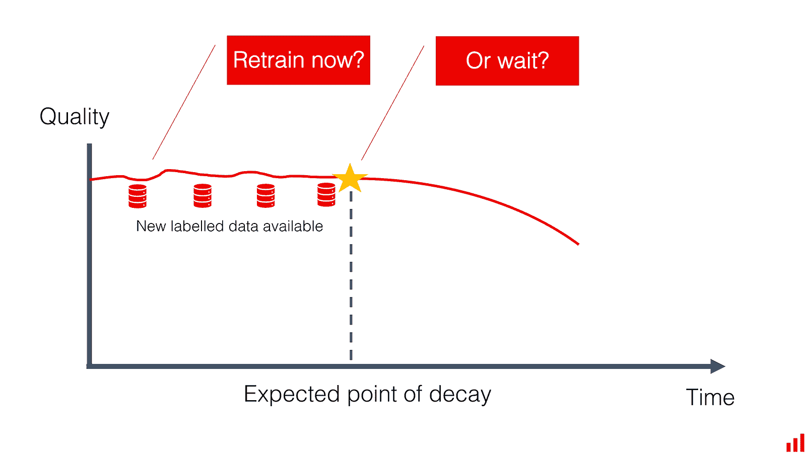

# 部署后的计算机视觉模型维护

> 原文：[`docs.ultralytics.com/guides/model-monitoring-and-maintenance/`](https://docs.ultralytics.com/guides/model-monitoring-and-maintenance/)

## 介绍

如果您在此，我们可以假设您在计算机视觉项目中完成了许多步骤：从收集需求、标注数据和训练模型到最终部署。您的应用程序现在正在生产环境中运行，但您的项目并未结束。计算机视觉项目最重要的部分是确保您的模型在时间上继续满足项目的目标，这正是监控、维护和文档化您的计算机视觉模型进入画面的地方。

在本指南中，我们将更详细地介绍如何在部署后维护您的计算机视觉模型。我们将探讨模型监控如何帮助您早期发现问题，如何保持模型的准确性和最新状态，以及为何文档对故障排除至关重要。

## 模型监控至关重要

仔细监视部署的计算机视觉模型至关重要。如果没有适当的监控，模型可能会失去准确性。常见问题包括数据分布偏移或数据漂移，即模型遇到的数据与训练时不同。当模型需要对其不认识的数据进行预测时，可能会导致误解和性能下降。异常值或不寻常的数据点也可能影响模型的准确性。

定期模型监控帮助开发人员追踪模型的性能，发现异常，并快速解决数据漂移等问题。它还通过指示何时需要更新来管理资源，避免昂贵的全面改革，并保持模型的相关性。

### 模型监控的最佳实践

在生产环境中监控计算机视觉模型时，请记住以下一些最佳实践：

+   **定期跟踪性能**：持续监控模型的性能，以便及时检测变化。

+   **仔细检查数据质量**：检查数据中的缺失值或异常。

+   **使用多样化数据源**：监控来自各种来源的数据，以全面了解模型的性能。

+   **结合监控技术**：使用漂移检测算法和基于规则的方法结合，以识别各种问题。

+   **监控输入和输出**：注意模型处理的数据和其生成的结果，确保一切正常运行。

+   **设置警报**：实施异常行为的警报，例如性能下降，以便能够迅速采取纠正措施。

### AI 模型监控工具

您可以使用自动化监控工具来更轻松地监视部署后的模型。许多工具提供实时洞察和警报功能。以下是一些可以协同工作的开源模型监控工具的示例：

+   **[Prometheus](https://prometheus.io/)**：Prometheus 是一个开源的监控工具，用于收集和存储详细的性能指标。它与 Kubernetes 和 Docker 集成良好，在设定的时间间隔内收集数据并将其存储在时间序列数据库中。Prometheus 还可以抓取 HTTP 端点以收集实时指标。可以使用 PromQL 查询收集的数据。

+   **[Grafana](https://grafana.com/)**：Grafana 是一个开源的数据可视化和监控工具，允许您查询、可视化、设置警报并理解存储在任何地方的指标。它与 Prometheus 配合良好，并提供高级数据可视化功能。您可以创建自定义仪表板来显示计算机视觉模型的重要指标，如推断延迟、错误率和资源使用情况。Grafana 将收集的数据转化为易于阅读的仪表板，包括折线图、热力图和直方图。它还支持通过诸如 Slack 等渠道发送警报，以便快速通知团队任何问题。

+   **[Evidently AI](https://www.evidentlyai.com/)**：Evidently AI 是一个专为监控和调试生产环境中的机器学习模型而设计的开源工具。它从 pandas 数据框架生成交互式报告，帮助分析机器学习模型。Evidently AI 可以检测数据漂移、模型性能下降以及其他可能影响已部署模型的问题。

上述介绍的三个工具，Evidently AI、Prometheus 和 Grafana，可以作为一个完全开源的 ML 监控解决方案无缝配合，可用于生产环境。Evidently AI 用于收集和计算指标，Prometheus 存储这些指标，而 Grafana 则用于展示并设置警报。尽管有许多其他工具可供选择，但这套配置是一个令人振奋的开源选择，提供强大的监控和维护模型的能力。

### 异常检测和警报系统

异常是任何偏离预期的数据点或模式。在计算机视觉模型中，异常可以是与模型训练数据差异很大的图像。这些意外的图像可能是数据分布变化、异常值或可能降低模型性能的行为的迹象。建立警报系统以检测这些异常是模型监控的重要部分。

通过设置关键指标的标准性能水平和限制，可以及早发现问题。当性能超出这些限制时，将触发警报，促使快速修复。定期使用新数据更新和重新训练模型可以使其随着数据变化保持相关和准确。

#### 在配置阈值和警报时需要牢记的事项

在设置警报系统时，请牢记以下最佳实践：

+   **标准化警报**：使用一致的工具和格式发送所有警报，如电子邮件或消息应用程序如 Slack。标准化使您能够快速理解和响应警报。

+   **包含预期行为**：警报消息应清楚说明出了什么问题，期望是什么，以及评估的时间范围。这有助于您评估警报的紧急性和背景。

+   **可配置警报**：使警报易于配置以适应变化的条件。允许自己编辑阈值，延迟，禁用或确认警报。

### 数据漂移检测

数据漂移检测是一个概念，帮助识别输入数据的统计属性随时间变化，可能会降低模型性能。在决定重新训练或调整模型之前，这种技术帮助发现存在问题。数据漂移处理随时间变化的整体数据格局变化，而异常检测侧重于识别可能需要立即关注的稀有或意外数据点。

下面是几种检测数据漂移的方法：

**持续监控**：定期监控模型的输入数据和输出，以便发现漂移迹象。跟踪关键指标并与历史数据进行比较，以识别显著变化。

**统计技术**：使用 Kolmogorov-Smirnov 检验或人口稳定性指数（PSI）等方法检测数据分布的变化。这些测试将新数据的分布与训练数据进行比较，以识别显著差异。

**特征漂移**：监控单个特征的漂移。有时候，整体数据分布可能保持稳定，但个别特征可能会漂移。确定哪些特征正在漂移有助于微调重新训练过程。

## 模型维护

模型维护对于保持计算机视觉模型的准确性和相关性至关重要。模型维护包括定期更新和重新训练模型，处理数据漂移，并确保模型在数据和环境变化时保持相关性。也许你会想知道模型维护与模型监控有何不同。监控是指实时观察模型的性能，以便及早发现问题。而维护则是关于修复这些问题。

### 定期更新和重新训练

一旦模型部署后，在监控过程中，您可能会注意到数据模式或性能发生变化，表明模型漂移。定期更新和重新训练成为模型维护的重要部分，以确保模型能够处理新的模式和场景。根据数据变化情况，您可以使用几种技术。

例如，如果数据随时间逐渐变化，增量学习是一个不错的选择。增量学习涉及使用新数据更新模型，而不是完全从头开始重新训练，从而节省计算资源和时间。然而，如果数据发生了显著变化，定期进行完整的重新训练可能是更好的选择，以确保模型不会在新数据上过拟合，同时不会忽略旧模式。

无论采用何种方法，在更新后都必须进行验证和测试。重要的是在单独的测试数据集上验证模型，以检查性能的改进或退化。

### 决定何时重新训练您的模型

重新训练计算机视觉模型的频率取决于数据变化和模型性能。当您观察到显著的性能下降或检测到数据漂移时，请重新训练您的模型。定期评估可以通过测试模型与新数据来确定正确的重新训练时间表。监控性能指标和数据模式可以帮助您决定是否需要更频繁地更新模型以保持准确性。

## 文档

记录计算机视觉项目使其更容易理解、复现和协作。良好的文档涵盖模型架构、超参数、数据集、评估指标等内容。它提供透明性，帮助团队成员和利益相关者理解已经完成的工作及其原因。文档还通过提供对过去决策和方法的清晰参考，有助于故障排除、维护和未来增强。

### 需要记录的关键元素

这些是项目文档中应包含的一些关键元素：

+   **项目概述**：提供项目的高层摘要，包括问题陈述、解决方案方法、预期结果和项目范围。解释计算机视觉在解决问题中的作用，并概述阶段和可交付成果。

+   **模型架构**：详细说明模型的结构和设计，包括其组件、层次和连接。解释选择的超参数及其选择背后的理由。

+   **数据准备**：描述数据来源、类型、格式、大小和预处理步骤。讨论数据质量、可靠性以及在训练模型之前应用的任何转换。

+   **训练过程**：记录训练过程，包括使用的数据集、训练参数和损失函数。解释模型是如何训练的，以及训练过程中遇到的任何挑战。

+   **评估指标**：指定用于评估模型性能的指标，如准确率、精确率、召回率和 F1 分数。包括性能结果和对这些指标的分析。

+   **部署步骤**：概述部署模型的步骤，包括使用的工具和平台、部署配置以及任何特定的挑战或考虑因素。

+   **监控和维护程序**：提供监控模型在部署后性能的详细计划。包括检测和解决数据和模型漂移的方法，并描述定期更新和重新训练的过程。

### 文档工具

在记录 AI 项目时，有许多选择，特别受欢迎的是开源工具。其中两种是 Jupyter Notebooks 和 MkDocs。Jupyter Notebooks 允许您创建交互式文档，内嵌代码、可视化和文本，非常适合分享实验和分析。MkDocs 是一个静态站点生成器，易于设置和部署，非常适合在线创建和托管项目文档。

## 与社区联系

加入计算机视觉爱好者社区可以帮助您快速解决问题并学习更多。以下是一些连接、获取支持和分享想法的方法。

### 社区资源

+   **GitHub Issues**：查看 [YOLOv8 GitHub 仓库](https://github.com/ultralytics/ultralytics/issues) 并使用 Issues 标签提问，报告 bug，建议新功能。社区和维护者非常活跃和支持。

+   **Ultralytics Discord 服务器**：加入 [Ultralytics Discord 服务器](https://ultralytics.com/discord/) 与其他用户和开发者聊天，获取支持，并分享您的经验。

### 官方文档

+   **Ultralytics YOLOv8 文档**：访问官方 YOLOv8 文档，获取有关各种计算机视觉项目的详细指南和有用提示。

使用这些资源将帮助您解决挑战，并跟上计算机视觉社区的最新趋势和实践。

## 关键要点

我们讨论了监控、维护和记录计算机视觉模型的关键提示。定期更新和重新训练有助于模型适应新数据模式。检测和修复数据漂移有助于保持模型的准确性。持续监控能够及早发现问题，良好的文档使协作和未来更新更加容易。遵循这些步骤将有助于使您的计算机视觉项目长期成功和有效。

## 常见问题解答

### 我如何监控我部署的计算机视觉模型的性能？

监控部署的计算机视觉模型的性能非常重要，以确保其长期的准确性和可靠性。您可以使用工具如 [Prometheus](https://prometheus.io/)、[Grafana](https://grafana.com/) 和 [Evidently AI](https://www.evidentlyai.com/) 来跟踪关键指标，检测异常，识别数据漂移。定期监控输入和输出，设置异常行为警报，并使用多样化的数据源来全面了解模型的性能。有关更多详情，请参阅我们关于模型监控的部分。

### 如何在部署后维护计算机视觉模型的最佳实践是什么？

维护计算机视觉模型涉及定期更新、重新训练和监控，以确保持续的准确性和相关性。最佳实践包括：

+   **持续监控**：定期跟踪性能指标和数据质量。

+   **数据漂移检测**：使用统计技术识别数据分布的变化。

+   **定期更新和重新训练**：根据数据变化实施增量学习或定期完整重新训练。

+   **文档化**：维护模型架构、训练过程和评估指标的详细文档。获取更多见解，请访问我们的模型维护部分。

### 为什么数据漂移检测对 AI 模型至关重要？

数据漂移检测至关重要，因为它有助于识别输入数据的统计特性随时间变化，这可能会降低模型性能。持续监控、统计检验（例如 Kolmogorov-Smirnov 检验）和特征漂移分析等技术可以帮助及早发现问题。解决数据漂移问题确保您的模型在不断变化的环境中保持准确和相关性。在我们的数据漂移检测部分了解更多。

### 如何在计算机视觉模型中使用异常检测工具？

对于计算机视觉模型的异常检测，诸如[Prometheus](https://prometheus.io/)、[Grafana](https://grafana.com/)和[Evidently AI](https://www.evidentlyai.com/)等工具非常有效。这些工具可以帮助您建立警报系统，检测异常数据点或与预期行为偏离的模式。可配置的警报和标准化的消息可以帮助您快速响应潜在问题。详细了解我们的异常检测和警报系统部分。

### 如何有效地记录我的计算机视觉项目？

有效的计算机视觉项目文档应包括：

+   **项目概述**：高层次摘要、问题陈述和解决方案方法。

+   **模型架构**：模型结构、组件和超参数的详细信息。

+   **数据准备**：关于数据来源、预处理步骤和转换的信息。

+   **训练过程**：训练过程的描述、使用的数据集和遇到的挑战。

+   **评估指标**：用于性能评估和分析的指标。

+   **部署步骤**：模型部署所采取的步骤及任何特定挑战。

+   **监控和维护程序**：规划持续监控和维护。获取更全面的指导，请参考我们的文档部分。
