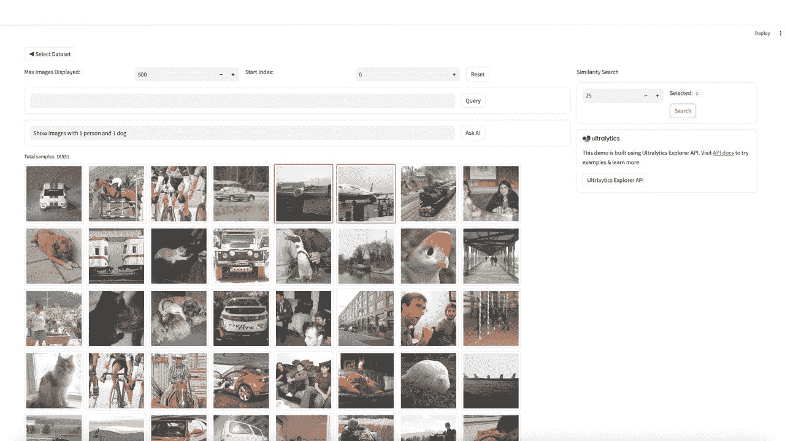
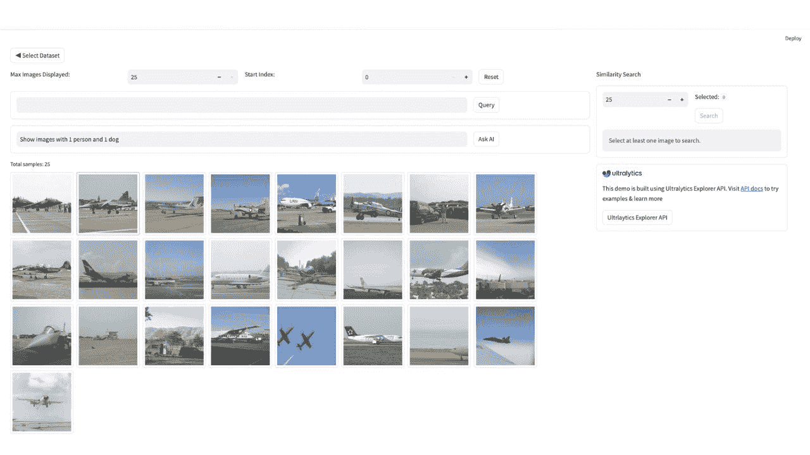
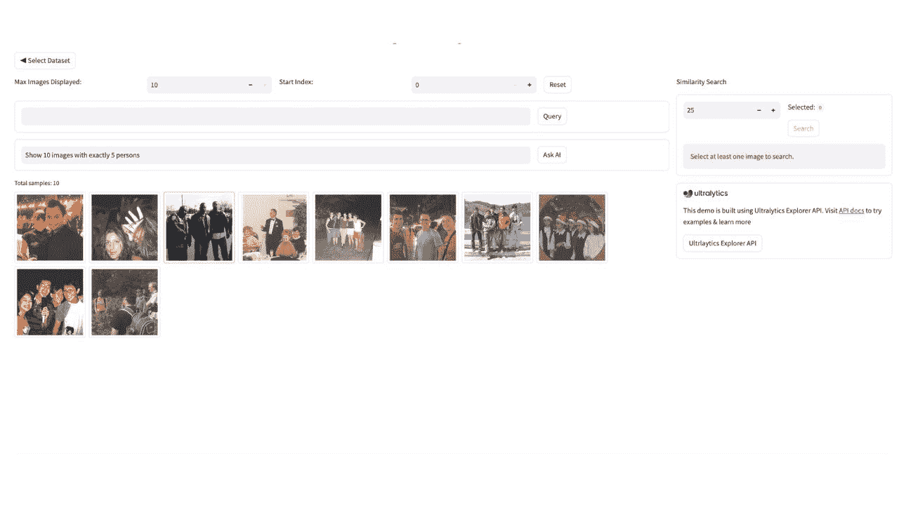
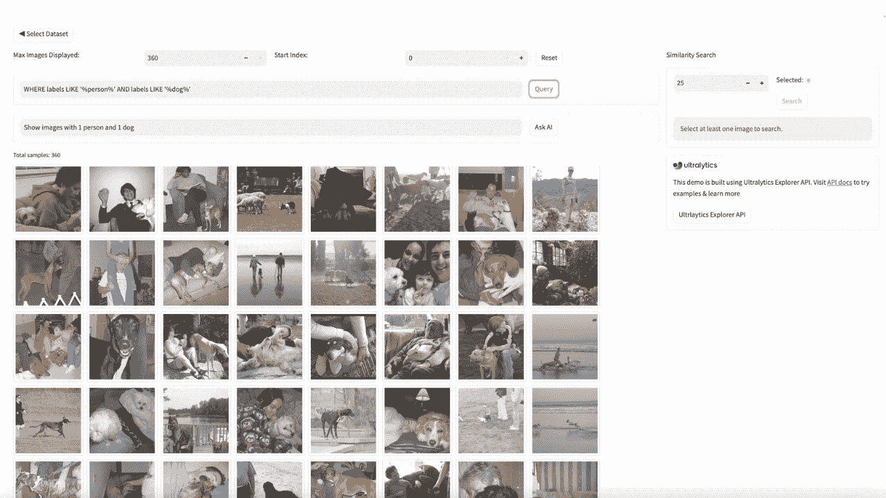

# Explorer GUI

> 原文：[`docs.ultralytics.com/datasets/explorer/dashboard/`](https://docs.ultralytics.com/datasets/explorer/dashboard/)

Explorer GUI 类似于使用 Ultralytics Explorer API 构建的游乐场。它允许你运行语义/向量相似度搜索、SQL 查询，甚至使用我们由 LLMs 提供支持的自然语言查询功能。


[`www.youtube.com/embed/3VryynorQeo?start=306`](https://www.youtube.com/embed/3VryynorQeo?start=306)

**观看：** Ultralytics Explorer 仪表板概述

### 安装

```py
pip  install  ultralytics[explorer] 
```

注意

问 AI 功能使用 OpenAI 运行，因此在首次运行 GUI 时会提示你设置 OpenAI 的 API 密钥。你可以像这样设置它 - `yolo settings openai_api_key="..."`

## 向量语义相似度搜索

语义搜索是一种寻找与给定图像相似图像的技术。其基于相似图像具有类似嵌入的思想。在用户界面中，你可以选择一个或多个图像，并搜索与它们相似的图像。当你想要找到与给定图像类似的图像或一组表现不佳的图像时，这将非常有用。

例如：在这个 VOC 探索仪表板中，用户像这样选择了几张飞机图像：



在执行相似性搜索时，你应该看到类似的结果：



## 问 AI

这使你可以使用自然语言编写筛选数据集的方式，无需精通编写 SQL 查询。我们的 AI 动力查询生成器将在幕后自动生成查询。例如 - 你可以说 - "显示具有一人和两只狗的 100 张图像。也可以有其他物体"，它会内部生成查询并显示这些结果。例如，要求“显示 10 张仅有 5 人的图像”时，你将看到如下结果：



注意：这是在幕后使用 LLMs 运行的，因此结果是概率性的，有时可能会出错。

## 在 CV 数据集上运行 SQL 查询

你可以在数据集上运行 SQL 查询来进行筛选。即使只提供 WHERE 子句也是有效的。例如，以下 SQL 查询仅显示至少有一个人和一只狗的图像：

```py
WHERE  labels  LIKE  '%person%'  AND  labels  LIKE  '%dog%' 
```



这是使用 Explorer API 构建的演示版。你可以使用 API 构建你自己的探索性笔记本或脚本，以深入了解你的数据集。在这里了解更多关于 Explorer API 的信息。

## 常见问题

### 什么是 Ultralytics Explorer GUI 以及如何安装它？

Ultralytics Explorer GUI 是一个强大的界面，使用 Ultralytics Explorer API 解锁高级数据探索功能。它允许您通过大型语言模型（LLMs）驱动的 Ask AI 功能运行语义/向量相似性搜索、SQL 查询和自然语言查询。

要安装 Explorer GUI，可以使用 pip：

```py
pip  install  ultralytics[explorer] 
```

注意：要使用 Ask AI 功能，您需要设置 OpenAI API 密钥：`yolo settings openai_api_key="..."`。

### Ultralytics Explorer GUI 中的语义搜索功能如何工作？

Ultralytics Explorer GUI 中的语义搜索功能允许您根据其嵌入找到与给定图像类似的图像。这种技术对于识别和探索共享视觉相似性的图像非常有用。要使用此功能，请在 UI 中选择一个或多个图像，并执行搜索相似图像的操作。结果将显示与所选图像密切相似的图像，便于高效的数据集探索和异常检测。

通过访问功能概述部分，了解更多关于语义搜索和其他功能的信息。

### 我可以在 Ultralytics Explorer GUI 中使用自然语言来过滤数据集吗？

是的，借助由大型语言模型（LLMs）驱动的 Ask AI 功能，您可以使用自然语言查询来过滤您的数据集。您无需精通 SQL。例如，您可以询问“显示具有恰好一个人和 2 只狗的 100 张图像。还可以有其他对象”，AI 将在幕后生成适当的查询以提供所需的结果。

在这里查看自然语言查询的示例。

### 如何在 Ultralytics Explorer GUI 上使用 SQL 查询数据集？

Ultralytics Explorer GUI 允许您直接在数据集上运行 SQL 查询以高效过滤和管理数据。要运行查询，请在 GUI 中导航到 SQL 查询部分并编写您的查询。例如，要显示至少有一个人和一只狗的图像，您可以使用：

```py
WHERE  labels  LIKE  '%person%'  AND  labels  LIKE  '%dog%' 
```

您还可以仅提供 WHERE 子句，使查询过程更灵活。

欲了解更多详细信息，请参阅 SQL 查询部分。

### 使用 Ultralytics Explorer GUI 进行数据探索的好处是什么？

Ultralytics Explorer GUI 通过语义搜索、SQL 查询和通过 Ask AI 功能进行的自然语言交互增强了数据探索。这些功能使用户能够：- 高效地查找视觉相似的图像。- 使用复杂的 SQL 查询过滤数据集。- 利用 AI 执行自然语言搜索，无需深入的 SQL 专业知识。

这些功能使其成为开发人员、研究人员和数据科学家寻求深入了解其数据集的多功能工具。

在 Explorer GUI 文档中进一步探索这些功能。
