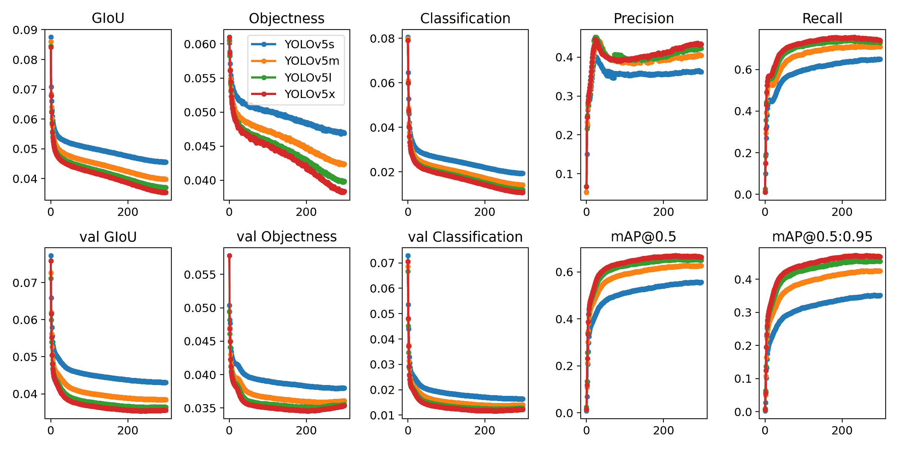

# YOLOv5 快速入门 🚀

> 原文：[`docs.ultralytics.com/yolov5/quickstart_tutorial/`](https://docs.ultralytics.com/yolov5/quickstart_tutorial/)

踏上你的实时目标检测领域之旅，探索 YOLOv5 的动态世界！这篇指南旨在成为 AI 爱好者和专业人士掌握 YOLOv5 的全面起点。从初始设置到高级训练技巧，我们为你全程护航。通过本指南，你将掌握自信地将 YOLOv5 应用到项目中的知识。让我们点燃引擎，一起飞向 YOLOv5 的世界！

## 安装

准备启动，克隆存储库并建立环境。这确保安装了所有必要的 [要求](https://github.com/ultralytics/yolov5/blob/master/requirements.txt)。确保你准备好起飞，拥有 [**Python>=3.8.0**](https://www.python.org/) 和 [**PyTorch>=1.8**](https://pytorch.org/get-started/locally/)。

```py
`git  clone  https://github.com/ultralytics/yolov5  # clone repository cd  yolov5 pip  install  -r  requirements.txt  # install dependencies` 
```

## 使用 PyTorch Hub 进行推断

体验 YOLOv5 PyTorch Hub 推断的简便性，其中 [模型](https://github.com/ultralytics/yolov5/tree/master/models) 无缝地从最新的 YOLOv5 [发布](https://github.com/ultralytics/yolov5/releases) 下载。

```py
`import torch  # Model loading model = torch.hub.load("ultralytics/yolov5", "yolov5s")  # Can be 'yolov5n' - 'yolov5x6', or 'custom'  # Inference on images img = "https://ultralytics.com/images/zidane.jpg"  # Can be a file, Path, PIL, OpenCV, numpy, or list of images  # Run inference results = model(img)  # Display results results.print()  # Other options: .show(), .save(), .crop(), .pandas(), etc.` 
```

## 使用 detect.py 进行推断

利用 `detect.py` 在各种来源上进行多功能推断。它会自动从最新的 YOLOv5 [发布](https://github.com/ultralytics/yolov5/releases) 中获取 [模型](https://github.com/ultralytics/yolov5/tree/master/models)，并轻松保存结果。

```py
`python  detect.py  --weights  yolov5s.pt  --source  0  # webcam   img.jpg  # image   vid.mp4  # video   screen  # screenshot   path/  # directory   list.txt  # list of images   list.streams  # list of streams   'path/*.jpg'  # glob   'https://youtu.be/LNwODJXcvt4'  # YouTube   'rtsp://example.com/media.mp4'  # RTSP, RTMP, HTTP stream` 
```

## 训练

使用以下指南复制 YOLOv5 的 [COCO](https://github.com/ultralytics/yolov5/blob/master/data/scripts/get_coco.sh) 基准测试。必要的 [模型](https://github.com/ultralytics/yolov5/tree/master/models) 和 [数据集](https://github.com/ultralytics/yolov5/tree/master/data) 直接从最新的 YOLOv5 [发布](https://github.com/ultralytics/yolov5/releases) 中提取。在 V100 GPU 上训练 YOLOv5n/s/m/l/x 通常需要 1/2/4/6/8 天（请注意，多 GPU 设置速度更快）。通过使用最大可能的 `--batch-size` 或使用 YOLOv5 [AutoBatch](https://github.com/ultralytics/yolov5/pull/5092) 功能的 `--batch-size -1` 来最大化性能。以下批处理大小适用于 V100-16GB GPU。

```py
`python  train.py  --data  coco.yaml  --epochs  300  --weights  ''  --cfg  yolov5n.yaml  --batch-size  128   yolov5s  64   yolov5m  40   yolov5l  24   yolov5x  16` 
```



总之，YOLOv5 不仅是一款用于目标检测的最先进工具，也证明了机器学习在通过视觉理解改变我们与世界互动方式中的力量。当您在本指南中深入了解并开始将 YOLOv5 应用到您的项目中时，请记住您是技术革命的前沿，能够取得非凡的成就。如果您需要来自同行先驱的进一步见解或支持，欢迎访问我们的 [GitHub 代码库](https://github.com/ultralytics/yolov5)，这里是开发者和研究人员繁荣的社区所在。继续探索，不断创新，并享受 YOLOv5 的奇迹。愉快检测！ 🌠🔍
