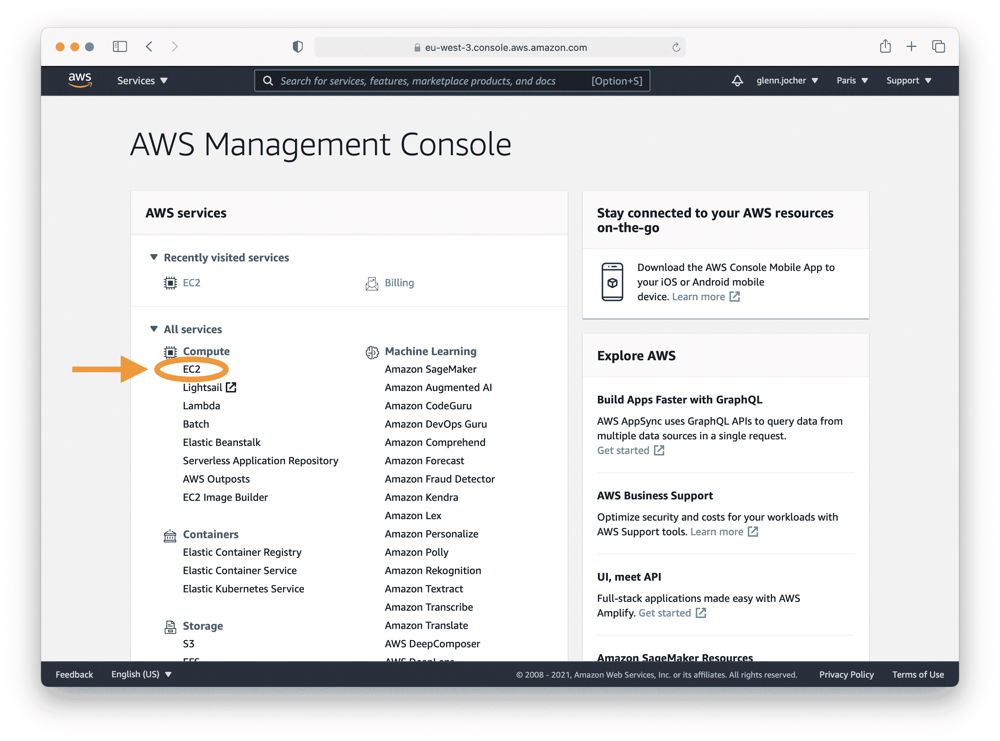
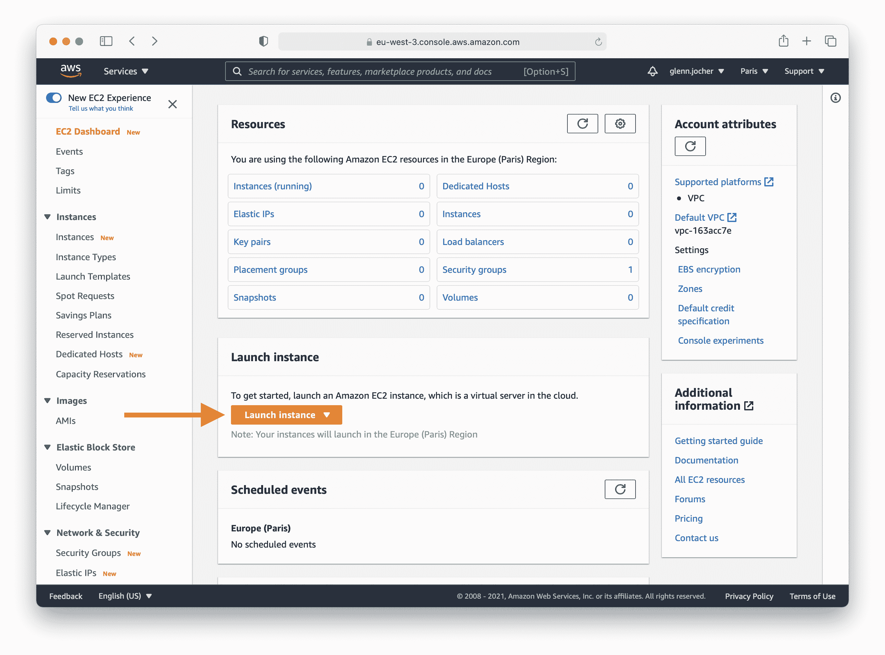
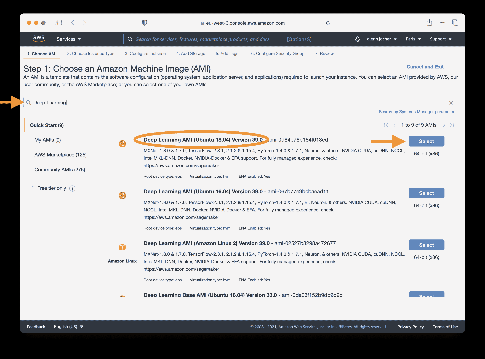
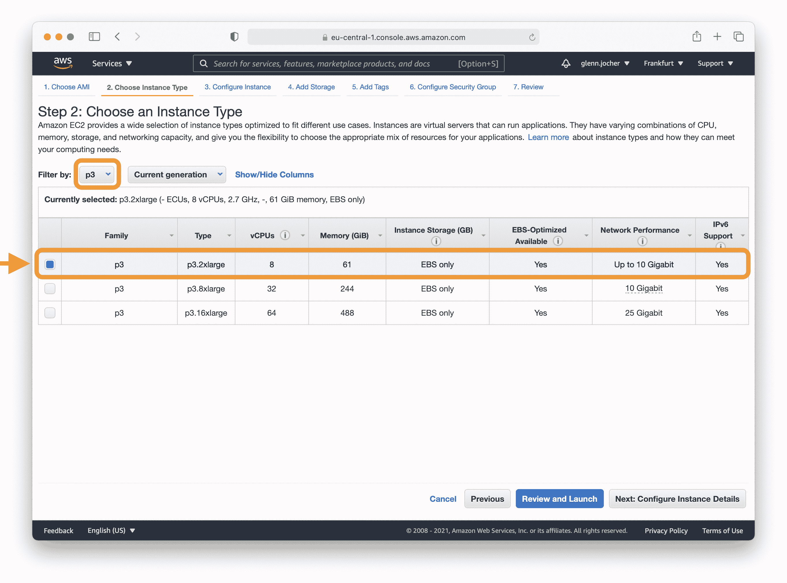
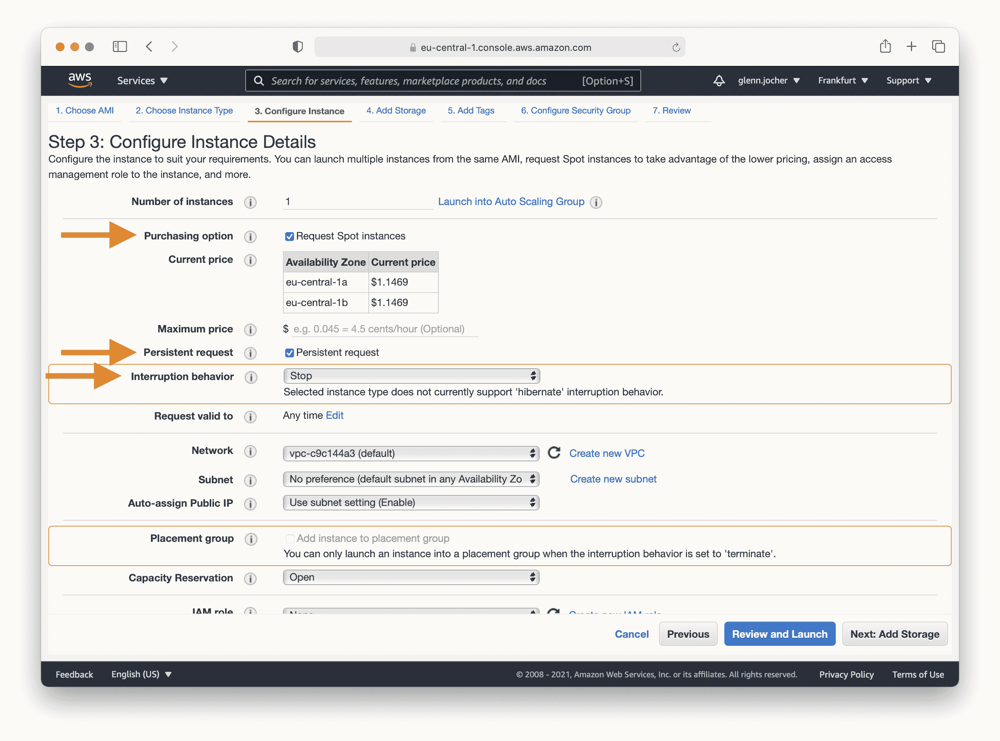
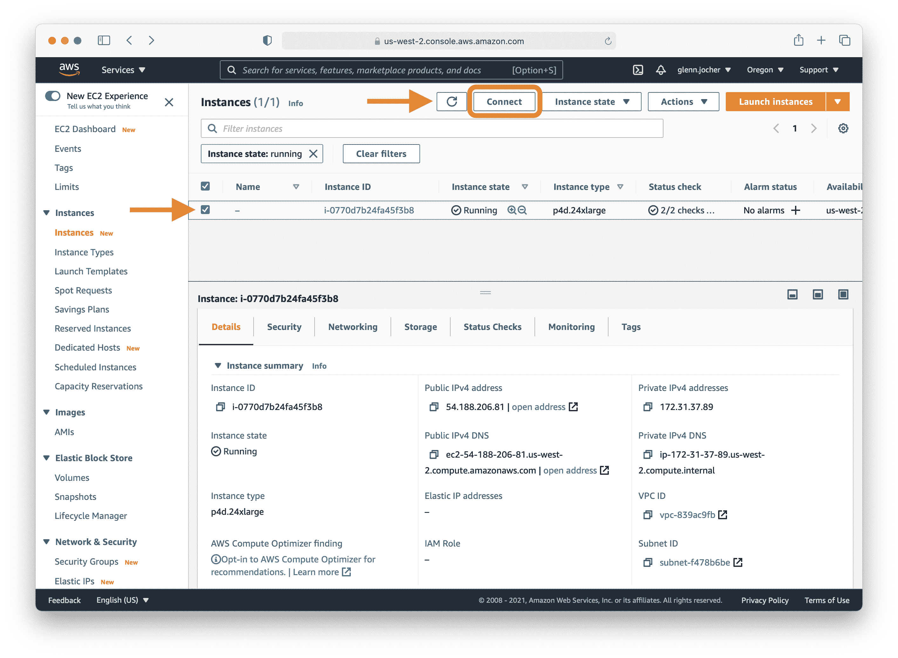

# YOLOv5 🚀 在 AWS 深度学习实例上的完整指南

> 原文：[`docs.ultralytics.com/yolov5/environments/aws_quickstart_tutorial/`](https://docs.ultralytics.com/yolov5/environments/aws_quickstart_tutorial/)

为新手设置高性能深度学习环境可能有些令人望而生畏，但不用担心！ 🛠️ 通过本指南，我们将为您介绍如何在 AWS 深度学习实例上快速启动和运行 YOLOv5。利用亚马逊网络服务（AWS）的强大功能，即使是对机器学习一无所知的人也能快速且经济有效地入门。AWS 平台的可伸缩性非常适合实验和生产部署。

YOLOv5 的其他快速开始选项包括我们的 [Colab Notebook](https://colab.research.google.com/github/ultralytics/yolov5/blob/master/tutorial.ipynb)  ，GCP 深度学习 VM 和我们在 [Docker Hub](https://hub.docker.com/r/ultralytics/yolov5) 的 Docker 镜像 。

## 第 1 步：AWS 控制台登录

首先创建一个帐户或登录到 AWS 控制台，网址是[`aws.amazon.com/console/`](https://aws.amazon.com/console/)。登录后，选择**EC2**服务以管理和设置您的实例。



## 第 2 步：启动您的实例

在 EC2 控制台中，您将找到**启动实例**按钮，这是创建新虚拟服务器的入口。



### 选择正确的 Amazon Machine Image (AMI)

在这里，您可以选择操作系统和软件堆栈来配置您的实例。在搜索字段中键入“深度学习”，然后选择最新的基于 Ubuntu 的深度学习 AMI，除非您的需求另有规定。亚马逊的深度学习 AMI 预先安装了流行框架和 GPU 驱动程序，以简化设置过程。



### 选择实例类型

对于深度学习任务，通常建议选择 GPU 实例类型，因为它可以极大加速模型训练。在考虑实例大小时，请记住模型的内存需求不应超过实例提供的限制。

**注意：** 您的模型大小应该是选择实例的一个因素。如果您的模型超过实例可用的 RAM，请选择具有足够内存的不同实例类型。

有关可用 GPU 实例类型的列表，请访问[EC2 实例类型](https://aws.amazon.com/ec2/instance-types/)，特别是在加速计算下。



欲了解更多关于 GPU 监控和优化的信息，请参阅 [GPU 监控和优化](https://docs.aws.amazon.com/dlami/latest/devguide/tutorial-gpu.html)。有关定价信息，请参阅 [按需定价](https://aws.amazon.com/ec2/pricing/on-demand/) 和 [竞价定价](https://aws.amazon.com/ec2/spot/pricing/)。

### 配置你的实例

Amazon EC2 竞价实例为运行应用程序提供了一种成本效益的方式，因为它们允许你以低于标准成本的价格出价未使用的容量。如果希望在竞价实例停止时保留数据，选择持久请求。



在启动之前，请记得在步骤 4-7 中根据需要调整你实例的其余设置和安全配置。

## 步骤 3：连接到你的实例

一旦你的实例运行起来，选择其复选框并点击连接以访问 SSH 信息。使用显示的 SSH 命令在你喜欢的终端中建立连接到你的实例。



## 步骤 4：运行 YOLOv5

登录到你的实例后，现在可以在 Python 3.8 或更高版本的环境中克隆 YOLOv5 仓库并安装依赖项。YOLOv5 的模型和数据集将自动从最新的 [发布](https://github.com/ultralytics/yolov5/releases) 下载。

```py
`git  clone  https://github.com/ultralytics/yolov5  # clone repository cd  yolov5 pip  install  -r  requirements.txt  # install dependencies` 
```

环境设置完成后，你可以开始训练、验证、执行推理并导出你的 YOLOv5 模型：

```py
`# Train a model on your data python  train.py  # Validate the trained model for Precision, Recall, and mAP python  val.py  --weights  yolov5s.pt  # Run inference using the trained model on your images or videos python  detect.py  --weights  yolov5s.pt  --source  path/to/images  # Export the trained model to other formats for deployment python  export.py  --weights  yolov5s.pt  --include  onnx  coreml  tflite` 
```

## 可选附加项

要增加更多交换内存，对于大型数据集来说可能是个救星，请运行：

```py
`sudo  fallocate  -l  64G  /swapfile  # allocate 64GB swap file sudo  chmod  600  /swapfile  # modify permissions sudo  mkswap  /swapfile  # set up a Linux swap area sudo  swapon  /swapfile  # activate swap file free  -h  # verify swap memory` 
```

至此！ 🎉 你已成功创建了一个 AWS 深度学习实例并运行了 YOLOv5\. 无论你是刚开始进行目标检测，还是为生产环境扩展，这个设置都能帮助你实现机器学习的目标。祝你训练、验证和部署愉快！如果在过程中遇到任何问题，强大的 AWS 文档和活跃的 Ultralytics 社区都会为你提供支持。
