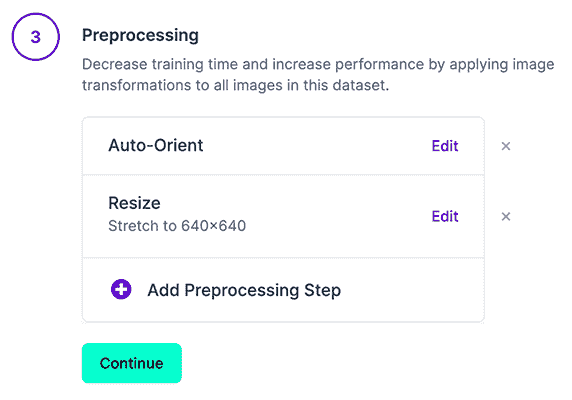
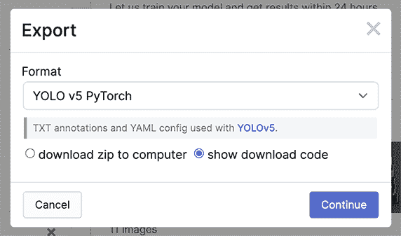
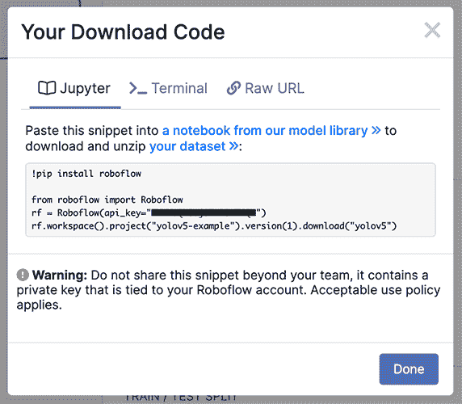
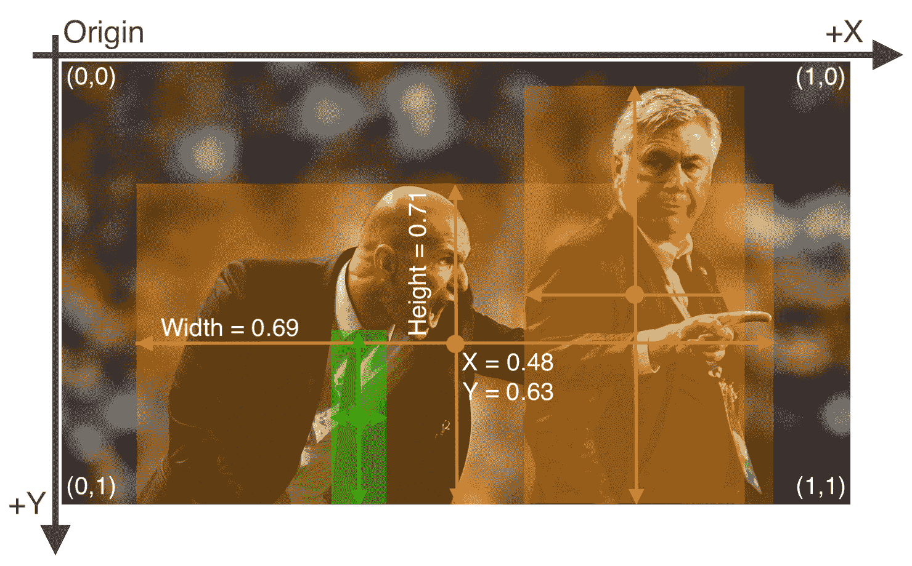
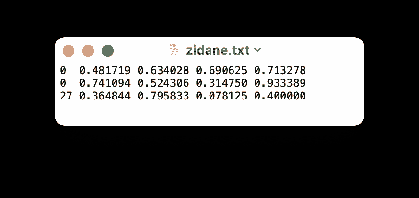
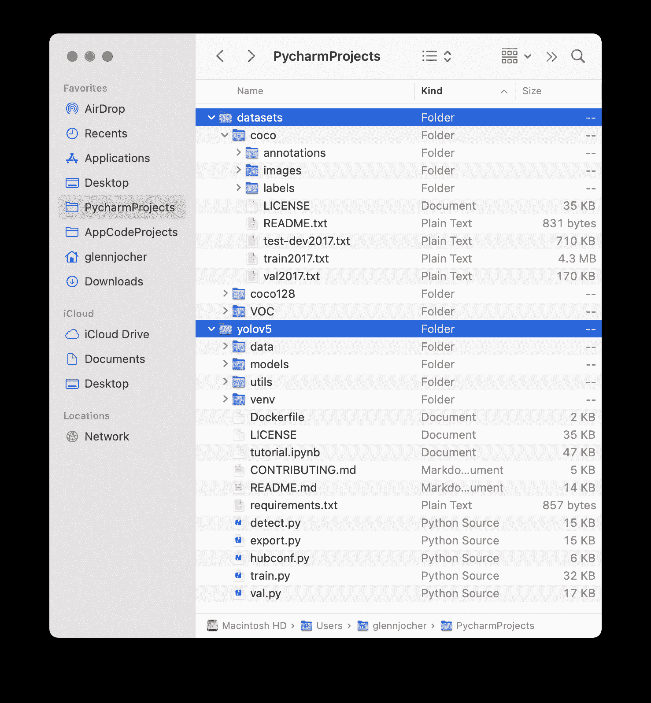
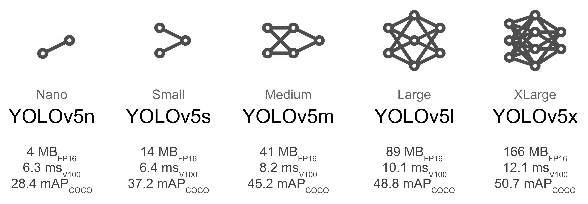
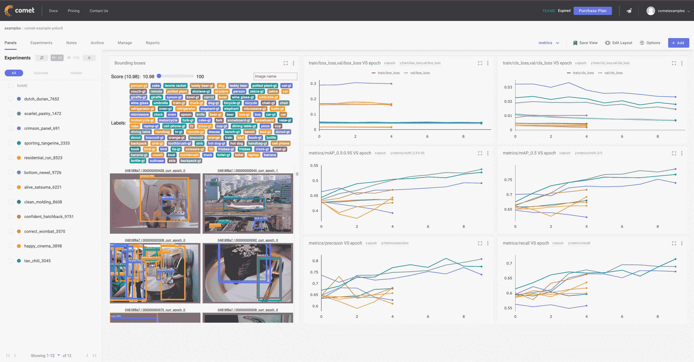
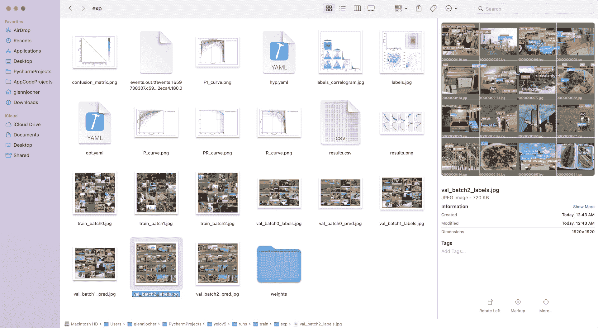
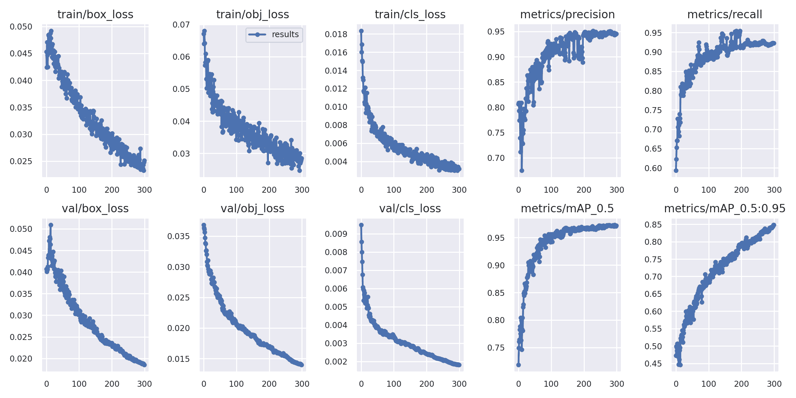

# 训练自定义数据

> 原文：[`docs.ultralytics.com/yolov5/tutorials/train_custom_data/`](https://docs.ultralytics.com/yolov5/tutorials/train_custom_data/)

📚 本指南解释了如何使用[YOLOv5](https://github.com/ultralytics/yolov5)训练您自己的**自定义数据集** 🚀。

## 在开始之前

克隆存储库并在[**Python>=3.8.0**](https://www.python.org/)环境中安装[requirements.txt](https://github.com/ultralytics/yolov5/blob/master/requirements.txt)，包括[**PyTorch>=1.8**](https://pytorch.org/get-started/locally/)。从最新的 YOLOv5 [版本](https://github.com/ultralytics/yolov5/releases)自动下载[模型](https://github.com/ultralytics/yolov5/tree/master/models)和[数据集](https://github.com/ultralytics/yolov5/tree/master/data)。

```py
git  clone  https://github.com/ultralytics/yolov5  # clone
cd  yolov5
pip  install  -r  requirements.txt  # install 
```

## 自定义数据训练


创建一个自定义模型来检测您的对象是一个迭代过程，包括收集和组织图像，标记您感兴趣的对象，训练模型，部署到实际环境进行预测，然后使用部署模型收集边界情况示例，以重复和改进。

许可协议

Ultralytics 提供两种许可选项：

+   [AGPL-3.0 许可证](https://github.com/ultralytics/ultralytics/blob/main/LICENSE)，这是一个[OSI 批准的](https://opensource.org/licenses/)开源许可证，非常适合学生和爱好者。

+   企业许可证为寻求将我们的 AI 模型整合到其产品和服务中的企业提供支持，详见[企业许可证](https://ultralytics.com/license)。

欲了解更多详情，请参阅[Ultralytics 许可协议](https://ultralytics.com/license)。

YOLOv5 模型必须在标记数据上进行训练，以学习该数据中的对象类别。在开始训练之前，有两种创建数据集的选项：

## 选项 1：创建一个[Roboflow 数据集](https://roboflow.com/?ref=ultralytics)

### 1.1 收集图像

您的模型将通过示例学习。在野外场景训练模型的图像非常重要。理想情况下，您将收集一系列与最终部署项目相同配置的图像（相机、角度、光线等）。

如果这不可行，您可以从[公共数据集](https://universe.roboflow.com/?ref=ultralytics)开始训练初始模型，然后在推断期间从实际场景中[采样图像](https://blog.roboflow.com/computer-vision-active-learning-tips/?ref=ultralytics)来迭代改进您的数据集和模型。

### 1.2 创建标签

一旦收集了图像，您需要注释感兴趣的对象，以创建模型的真实性数据。


[Roboflow 标注](https://roboflow.com/annotate?ref=ultralytics)是一个简单的基于 Web 的工具，用于管理和标记您的图像及与您的团队合作，并以[YOLOv5 的标注格式](https://roboflow.com/formats/yolov5-pytorch-txt?ref=ultralytics)导出它们。

### 1.3 为 YOLOv5 准备数据集

无论您是否使用[Roboflow 标注您的图像](https://roboflow.com/annotate?ref=ultralytics)，您都可以使用它将您的数据集转换为 YOLO 格式，创建一个 YOLOv5 YAML 配置文件，并将其托管以供导入到您的训练脚本中。

[创建一个免费的 Roboflow 账户](https://app.roboflow.com/?model=yolov5&ref=ultralytics)并将您的数据集上传到`Public`工作区，在未标注的图像上标注，然后生成并导出一个 YOLOv5 Pytorch 格式的数据集版本。

注意：YOLOv5 在训练期间进行在线增强，因此我们不建议在 Roboflow 中应用任何增强步骤用于 YOLOv5 的训练。但我们建议应用以下预处理步骤：



+   **自动方向** - 从图像中去除 EXIF 方向信息。

+   **调整大小（拉伸）** - 到您模型的方形输入大小（640x640 是 YOLOv5 的默认设置）。

生成一个版本将为您的数据集提供一个快照，这样您就可以随时回顾并比较将来模型训练运行的结果，即使您添加了更多图像或稍后更改了其配置。



以`YOLOv5 Pytorch`格式导出，然后将片段复制到您的训练脚本或笔记本中以下载您的数据集。



## 选项 2：创建一个手动数据集

### 2.1 创建`dataset.yaml`

[COCO128](https://www.kaggle.com/ultralytics/coco128)是一个小型教程数据集的示例，由[COCO](https://cocodataset.org/) train2017 的前 128 张图像组成。这些相同的 128 张图像用于训练和验证，以验证我们的训练流水线能够过拟合。下面显示的[data/coco128.yaml](https://github.com/ultralytics/yolov5/blob/master/data/coco128.yaml)是数据集配置文件，定义了 1）数据集根目录`path`和`train`/`val`/`test`图像目录（或带图像路径的`*.txt`文件）的相对路径，以及 2）类别`names`字典：

```py
# Train/val/test sets as 1) dir: path/to/imgs, 2) file: path/to/imgs.txt, or 3) list: [path/to/imgs1, path/to/imgs2, ..]
path:  ../datasets/coco128  # dataset root dir
train:  images/train2017  # train images (relative to 'path') 128 images
val:  images/train2017  # val images (relative to 'path') 128 images
test:  # test images (optional)

# Classes (80 COCO classes)
names:
  0:  person
  1:  bicycle
  2:  car
  # ...
  77:  teddy bear
  78:  hair drier
  79:  toothbrush 
```

### 2.2 创建标签

使用标注工具为您的图像添加标签后，将标签导出为**YOLO 格式**，每张图像生成一个`*.txt`文件（如果图像中没有对象，则不需要`*.txt`文件）。`*.txt`文件的规范如下：

+   每个对象一行

+   每行是`class x_center y_center width height`格式。

+   盒子坐标必须以**归一化的 xywh 格式**表示（从 0 到 1）。如果您的框是以像素为单位的，请将`x_center`和`width`除以图像宽度，将`y_center`和`height`除以图像高度。

+   类别编号是从零开始的。



与上述图像对应的标签文件包含 2 个人（类`0`）和一条领带（类`27`）：



### 2.3 组织目录

根据以下示例组织您的训练和验证图像及标签。YOLOv5 假定`/coco128`目录在与`/yolov5`目录**相邻**的`/datasets`目录内。**YOLOv5 会自动定位每个图像路径中`/images/`的最后一个实例，以获取相应的标签**。例如：

```py
../datasets/coco128/images/im0.jpg  # image
../datasets/coco128/labels/im0.txt  # label 
```



## 3\. 选择模型

选择一个预训练模型开始训练。这里我们选择了[YOLOv5s](https://github.com/ultralytics/yolov5/blob/master/models/yolov5s.yaml)，这是可用的第二小和最快的模型。请查看我们的 README [表格](https://github.com/ultralytics/yolov5#pretrained-checkpoints)以获取所有模型的详细比较。



## 4\. 训练

通过指定数据集、批大小、图像大小以及预训练模型`--weights yolov5s.pt`（推荐）或随机初始化模型`--weights '' --cfg yolov5s.yaml`（不推荐），在 COCO128 数据集上训练 YOLOv5s 模型。预训练权重会自动从[最新的 YOLOv5 发布](https://github.com/ultralytics/yolov5/releases)中下载。

```py
python  train.py  --img  640  --epochs  3  --data  coco128.yaml  --weights  yolov5s.pt 
```

提示

💡 添加`--cache ram`或`--cache disk`以加快训练速度（需要大量 RAM/磁盘资源）。

提示

💡 始终从本地数据集进行训练。像 Google Drive 这样的挂载或网络驱动器会非常慢。

所有训练结果都保存在`runs/train/`目录下，每个运行生成一个递增的运行目录，例如`runs/train/exp2`，`runs/train/exp3`等。更多细节请查看我们教程笔记本的训练部分。 

## 5\. 可视化

### Comet 日志记录和可视化 🌟 NEW

[Comet](https://bit.ly/yolov5-readme-comet)现在已完全集成到 YOLOv5 中。实时跟踪和可视化模型指标，保存超参数、数据集和模型检查点，并使用[Comet 自定义面板](https://bit.ly/yolov5-colab-comet-panels)可视化模型预测！Comet 确保您始终掌握工作进展，并轻松分享结果，促进各种规模团队的协作！

开始很简单：

```py
pip  install  comet_ml  # 1\. install
export  COMET_API_KEY=<Your  API  Key>  # 2\. paste API key
python  train.py  --img  640  --epochs  3  --data  coco128.yaml  --weights  yolov5s.pt  # 3\. train 
```

要了解有关此集成支持的所有 Comet 功能的更多信息，请查看 Comet 教程。如果您想了解更多关于 Comet 的信息，请访问我们的[文档](https://bit.ly/yolov5-colab-comet-docs)。通过尝试 Comet Colab 笔记本来开始吧：



### ClearML 日志记录和自动化 🌟 NEW

[ClearML](https://clear.ml/) 完全集成到 YOLOv5 中，用于跟踪您的实验、管理数据集版本，甚至远程执行训练运行。要启用 ClearML：

+   `pip install clearml`

+   运行`clearml-init`以连接到 ClearML 服务器

您将获得实验管理器的所有预期功能：实时更新、模型上传、实验比较等等。但是 ClearML 还会跟踪未提交的更改和安装的软件包等。由于这一点，ClearML 任务（我们称之为实验）在不同的机器上也是可重现的！只需额外的 1 行代码，我们就可以在队列上安排一个 YOLOv5 训练任务，并由任意数量的 ClearML 代理（工作节点）执行。

您可以使用 ClearML Data 版本化您的数据集，然后通过其唯一 ID 简单地传递给 YOLOv5。这将帮助您在不增加额外麻烦的情况下跟踪您的数据。查看 ClearML 教程以获取详细信息！


### 本地日志记录

训练结果会自动使用[Tensorboard](https://www.tensorflow.org/tensorboard)和[CSV](https://github.com/ultralytics/yolov5/pull/4148)记录器记录到`runs/train`，每次新的训练都会创建一个新的实验目录，如`runs/train/exp2`，`runs/train/exp3`等。

此目录包含训练和验证统计数据、马赛克、标签、预测和增强马赛克，以及包括精确率-召回率 (PR) 曲线和混淆矩阵在内的指标和图表。



训练完成后，结果文件`results.csv`会在每个时期后更新，并在训练完成后绘制为`results.png`（下图）。您也可以手动绘制任何`results.csv`文件：

```py
from utils.plots import plot_results

plot_results("path/to/results.csv")  # plot 'results.csv' as 'results.png' 
```



## 下一步

一旦您的模型训练完成，您可以使用最佳检查点`best.pt`：

+   在新图像和视频上运行[CLI](https://github.com/ultralytics/yolov5#quick-start-examples)或 Python 推理

+   在训练、验证和测试数据集上[验证](https://github.com/ultralytics/yolov5/blob/master/val.py)精度

+   导出到 TensorFlow、Keras、ONNX、TFlite、TF.js、CoreML 和 TensorRT 格式

+   调整超参数以提高性能

+   [改进](https://docs.roboflow.com/adding-data/upload-api?ref=ultralytics)您的模型，通过采样真实世界图像并将其添加到数据集中

## 支持的环境

Ultralytics 提供一系列预安装了关键依赖项如[CUDA](https://developer.nvidia.com/cuda)、[CUDNN](https://developer.nvidia.com/cudnn)、[Python](https://www.python.org/)和[PyTorch](https://pytorch.org/)的即用环境，为您的项目启动提供帮助。

+   **免费 GPU 笔记本**:   

+   **Google Cloud**: GCP 快速入门指南

+   **Amazon**：AWS 快速入门指南

+   **Azure**：AzureML 快速入门指南

+   **Docker**：Docker 快速入门指南 

## 项目状态


此徽章表示所有 [YOLOv5 GitHub Actions](https://github.com/ultralytics/yolov5/actions) 持续集成（CI）测试都已成功通过。这些 CI 测试严格检查 YOLOv5 在各个关键方面的功能和性能：[训练](https://github.com/ultralytics/yolov5/blob/master/train.py)，[验证](https://github.com/ultralytics/yolov5/blob/master/val.py)，[推断](https://github.com/ultralytics/yolov5/blob/master/detect.py)，[导出](https://github.com/ultralytics/yolov5/blob/master/export.py) 和 [基准测试](https://github.com/ultralytics/yolov5/blob/master/benchmarks.py)。它们确保在 macOS、Windows 和 Ubuntu 上的一致和可靠操作，每 24 小时和每次新提交后都进行测试。

## 常见问题解答

### 我如何在自定义数据集上训练 YOLOv5？

训练自定义数据集的 YOLOv5 涉及以下几个步骤：

1.  **准备数据集**：收集和标记图像。使用像 [Roboflow](https://roboflow.com/?ref=ultralytics) 这样的工具来组织数据并以 [YOLOv5 格式](https://roboflow.com/formats/yolov5-pytorch-txt?ref=ultralytics) 导出。

1.  **设置环境**：克隆 YOLOv5 仓库并安装依赖项：

    ```py
    git  clone  https://github.com/ultralytics/yolov5
    cd  yolov5
    pip  install  -r  requirements.txt 
    ```

1.  **创建数据集配置**：编写 `dataset.yaml` 文件定义训练/验证路径和类名。

1.  **训练模型**：

    ```py
    python  train.py  --img  640  --epochs  3  --data  dataset.yaml  --weights  yolov5s.pt 
    ```

### 我可以使用什么工具来注释我的 YOLOv5 数据集？

您可以使用 [Roboflow Annotate](https://roboflow.com/annotate?ref=ultralytics)，这是一个直观的基于 Web 的图像标注工具。支持团队协作，并支持 YOLOv5 格式的导出。收集图像后，使用 Roboflow 可以高效地创建和管理注释。其他选项包括像 LabelImg 和 CVAT 这样的本地标注工具。

### 为什么应该使用 Ultralytics HUB 训练我的 YOLO 模型？

Ultralytics HUB 提供了一个端到端平台，用于训练、部署和管理 YOLO 模型，无需深入的编码技能。使用 Ultralytics HUB 的好处包括：

+   **简易模型训练**：通过预配置环境简化训练过程。

+   **数据管理**：轻松管理数据集和版本控制。

+   **实时监控**：集成像 [Comet](https://bit.ly/yolov5-readme-comet) 这样的工具进行实时度量跟踪和可视化。

+   **协作**：非常适合共享资源和轻松管理的团队项目。

### 如何将我的标注数据转换为 YOLOv5 格式？

使用 Roboflow 将标注数据转换为 YOLOv5 格式的步骤：

1.  **上传您的数据集**（Upload Your Dataset）至 Roboflow 工作空间。

1.  **标记图像**（Label Images）如果尚未标记。

1.  生成并导出以 `YOLOv5 Pytorch` 格式的数据集。确保应用像自动定向和调整大小（拉伸）到方形输入尺寸（例如 640x640）的预处理步骤。

1.  **下载数据集** 并将其集成到您的 YOLOv5 训练脚本中。

### 在商业应用中使用 YOLOv5 的许可选项是什么？

Ultralytics 提供两种许可选项：

+   **AGPL-3.0 许可证**：适用于非商业用途的开源许可，非常适合学生和爱好者。

+   **企业许可证**：专为希望将 YOLOv5 集成到商业产品和服务中的企业量身定制。有关详细信息，请访问我们的 [许可页面](https://ultralytics.com/license)。

查阅我们的指南 [Ultralytics 许可](https://ultralytics.com/license) 获取更多详细信息。
